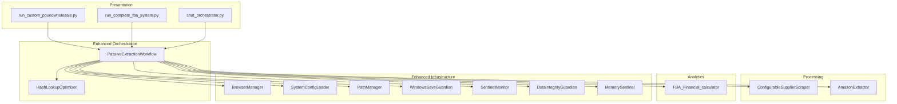
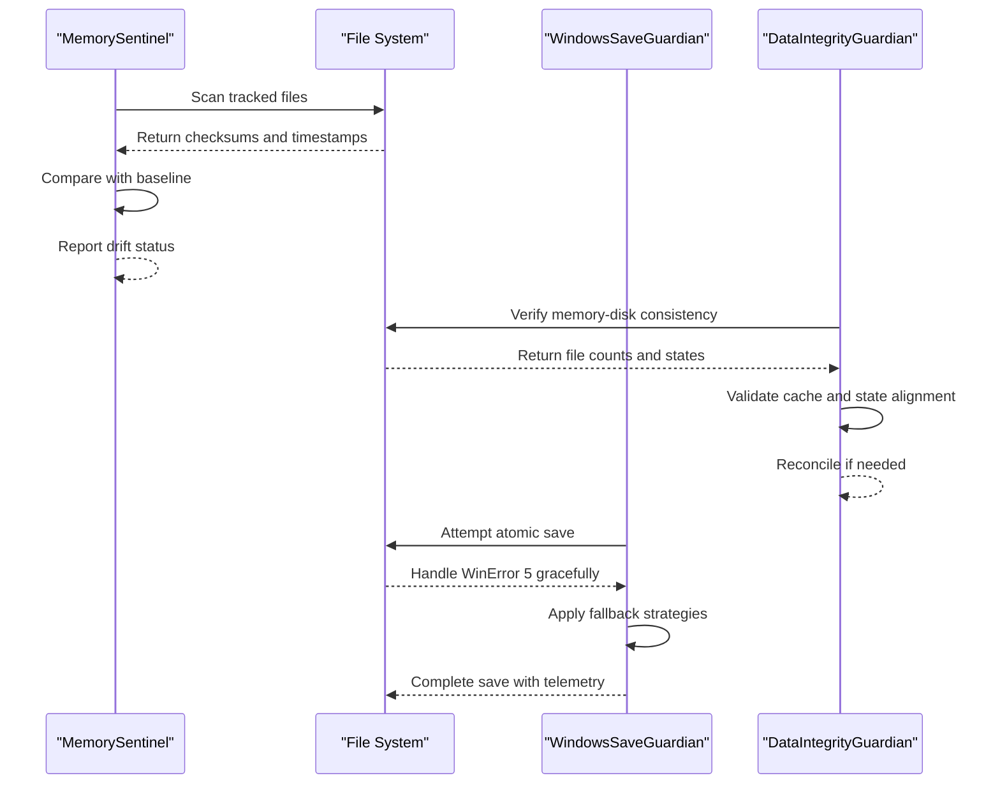
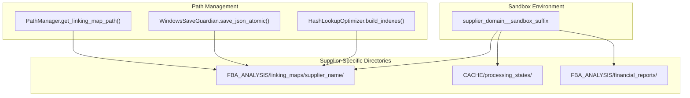
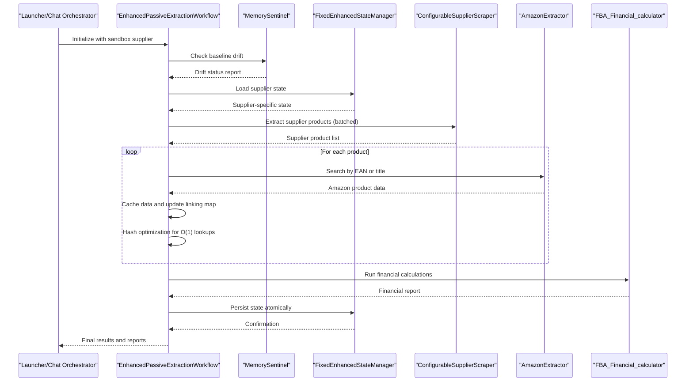
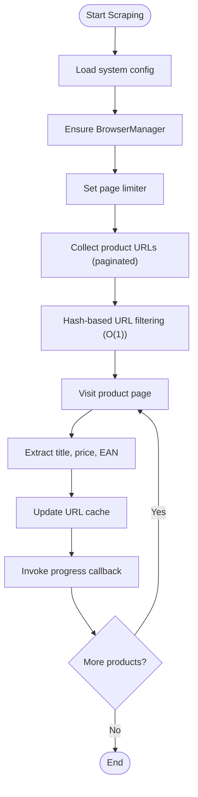
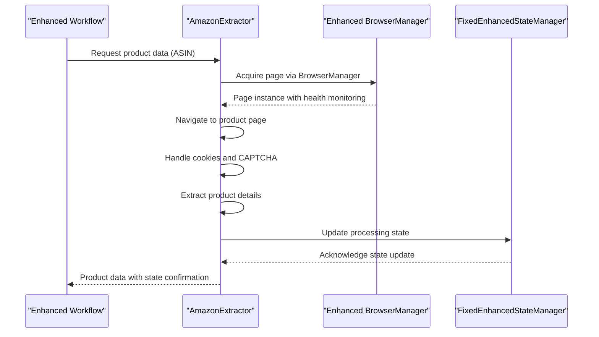
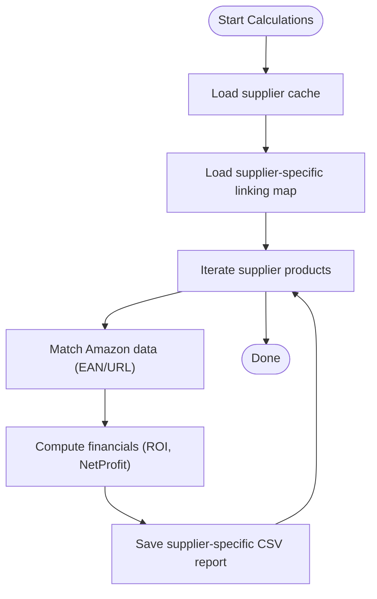
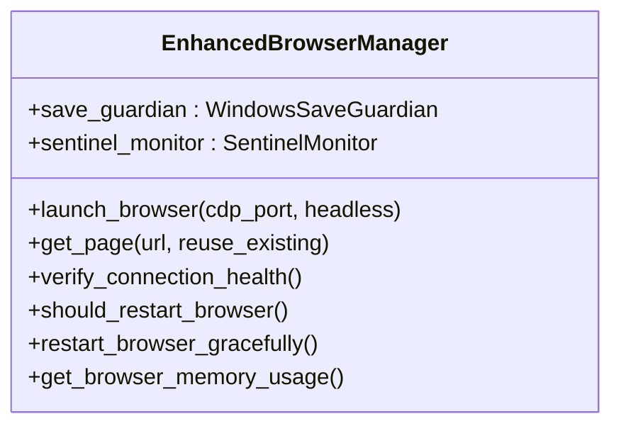
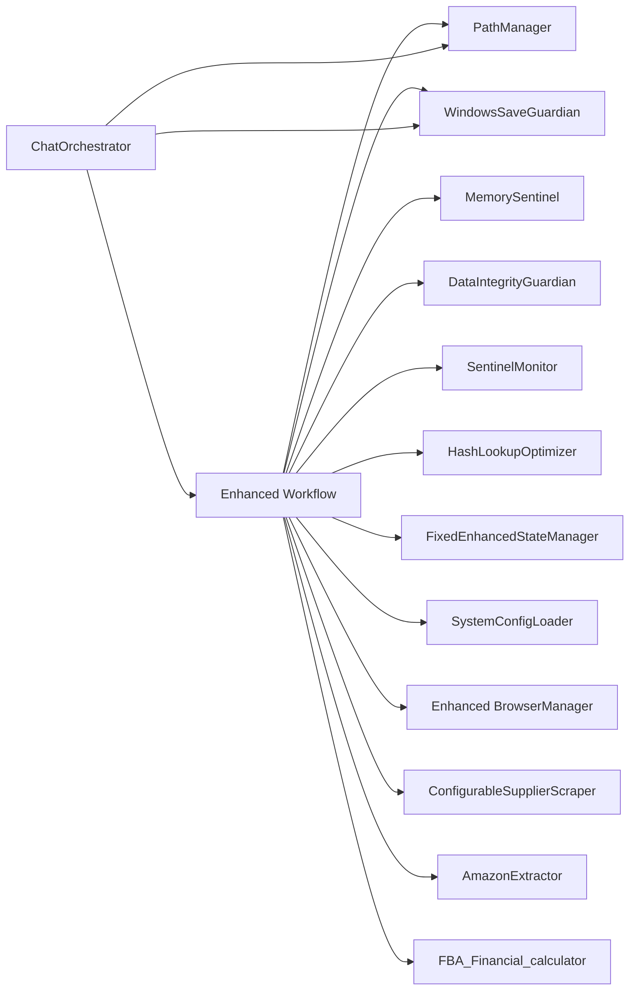

# System Architecture

<cite>
**Referenced Files in This Document**
- [README.md](file://README.md)
- [passive_extraction_workflow_latest.py](file://tools/passive_extraction_workflow_latest.py)
- [configurable_supplier_scraper.py](file://tools/configurable_supplier_scraper.py)
- [amazon_playwright_extractor.py](file://tools/amazon_playwright_extractor.py)
- [FBA_Financial_calculator.py](file://tools/FBA_Financial_calculator.py)
- [browser_manager.py](file://utils/browser_manager.py)
- [system_config.json](file://config/system_config.json)
- [run.py](file://src/fba_agent/run.py)
- [memory_sentinel.py](file://utils/memory_sentinel.py)
- [data_integrity_guardian.py](file://utils/data_integrity_guardian.py)
- [fixed_enhanced_state_manager.py](file://utils/fixed_enhanced_state_manager.py)
- [windows_save_guardian.py](file://utils/windows_save_guardian.py)
- [path_manager.py](file://utils/path_manager.py)
- [sentinel_monitor.py](file://utils/sentinel_monitor.py)
- [hash_lookup_optimizer.py](file://utils/hash_lookup_optimizer.py)
- [chat_orchestrator.py](file://control_plane/chat_orchestrator.py)
</cite>

## Update Summary
**Changes Made**
- Enhanced memory management with baseline tracking and drift detection
- Expanded linking map functionality with supplier-specific sandbox directories
- Integrated comprehensive financial analysis with multi-supplier operations
- Implemented isolated processing states with enhanced caching mechanisms
- Added sentinel monitoring and data integrity guardians for reliability

## Table of Contents
1. [Introduction](#introduction)
2. [Project Structure](#project-structure)
3. [Core Components](#core-components)
4. [Architecture Overview](#architecture-overview)
5. [Enhanced Memory Management](#enhanced-memory-management)
6. [Supplier-Specific Sandbox Architecture](#supplier-specific-sandbox-architecture)
7. [Detailed Component Analysis](#detailed-component-analysis)
8. [Dependency Analysis](#dependency-analysis)
9. [Performance Considerations](#performance-considerations)
10. [Troubleshooting Guide](#troubleshooting-guide)
11. [Conclusion](#conclusion)

## Introduction
This document describes the Amazon FBA Agent System architecture, focusing on its modular, layered design that separates concerns across workflow orchestration, supplier scraping, Amazon data extraction, and financial analysis. The system emphasizes:
- Resumable, stateful processing with file-based progress tracking
- Smart memory management with baseline tracking and drift detection
- Centralized browser management for stability and health
- Configurable financial reporting integrated into the workflow
- Multi-supplier operations with isolated processing states
- Enhanced caching mechanisms with supplier-specific sandbox directories

## Project Structure
The system is organized around a core workflow engine with clearly separated responsibilities:
- Workflow engine orchestrates end-to-end processing with enhanced memory management
- Supplier scraping extracts product data from supplier websites using Playwright
- Amazon extraction retrieves product details from Amazon with robust navigation
- Financial calculator computes profitability metrics with comprehensive analysis
- Utilities manage browser health, state persistence, configuration, and monitoring
- Control plane handles multi-supplier sandbox operations and isolated processing

```mermaid
graph TB
subgraph "Entry Points"
RUN_CUSTOM["run_custom_poundwholesale.py"]
RUN_COMPLETE["run_complete_fba_system.py"]
CHAT_ORCHESTRATOR["chat_orchestrator.py"]
end
subgraph "Enhanced Workflow Engine"
PASSIVE["PassiveExtractionWorkflow<br/>tools/passive_extraction_workflow_latest.py"]
HASH_OPT["HashLookupOptimizer<br/>utils/hash_lookup_optimizer.py"]
end
subgraph "Processing Tools"
SCRAPER["ConfigurableSupplierScraper<br/>tools/configurable_supplier_scraper.py"]
AMAZON["AmazonExtractor<br/>tools/amazon_playwright_extractor.py"]
CALC["FBA_Financial_calculator<br/>tools/FBA_Financial_calculator.py"]
end
subgraph "Enhanced Infrastructure"
BM["BrowserManager<br/>utils/browser_manager.py"]
CFG["SystemConfigLoader<br/>config/system_config_loader.py"]
PATHM["PathManager<br/>utils/path_manager.py"]
SAVEGUARD["WindowsSaveGuardian<br/>utils/windows_save_guardian.py"]
SENTINEL["SentinelMonitor<br/>utils/sentinel_monitor.py"]
DINT["DataIntegrityGuardian<br/>utils/data_integrity_guardian.py"]
MEMSEN["MemorySentinel<br/>utils/memory_sentinel.py"]
end
subgraph "Control Plane"
CHAT["ChatOrchestrator<br/>control_plane/chat_orchestrator.py"]
end
RUN_CUSTOM --> PASSIVE
RUN_COMPLETE --> PASSIVE
CHAT --> PASSIVE
PASSIVE --> SCRAPER
PASSIVE --> AMAZON
PASSIVE --> CALC
PASSIVE --> HASH_OPT
PASSIVE --> BM
PASSIVE --> CFG
PASSIVE --> PATHM
PASSIVE --> SAVEGUARD
PASSIVE --> SENTINEL
PASSIVE --> DINT
PASSIVE --> MEMSEN
CHAT --> PATHM
CHAT --> SAVEGUARD
```

**Diagram sources**
- [passive_extraction_workflow_latest.py](file://tools/passive_extraction_workflow_latest.py#L1-L12469)
- [configurable_supplier_scraper.py](file://tools/configurable_supplier_scraper.py#L1-L4220)
- [amazon_playwright_extractor.py](file://tools/amazon_playwright_extractor.py#L1-L2512)
- [FBA_Financial_calculator.py](file://tools/FBA_Financial_calculator.py#L1-L712)
- [browser_manager.py](file://utils/browser_manager.py#L1-L1153)
- [path_manager.py](file://utils/path_manager.py#L1-L200)
- [windows_save_guardian.py](file://utils/windows_save_guardian.py#L1-L200)
- [sentinel_monitor.py](file://utils/sentinel_monitor.py#L1-L200)
- [data_integrity_guardian.py](file://utils/data_integrity_guardian.py#L1-L6)
- [memory_sentinel.py](file://utils/memory_sentinel.py#L1-L122)
- [chat_orchestrator.py](file://control_plane/chat_orchestrator.py#L815-L877)

**Section sources**
- [README.md](file://README.md#L123-L163)

## Core Components
- **Enhanced Workflow Engine**: Orchestrates supplier scraping, Amazon matching, caching, and financial reporting with hash optimization and memory management. It loads configuration, manages state, coordinates processing loops, and implements gap detection.
- **Supplier Scraper**: Extracts product data from supplier websites using Playwright, with URL pre-filtering, memory management, and hash-based optimization.
- **Amazon Extractor**: Retrieves product details from Amazon using Playwright, with robust navigation, cookie handling, and extension data extraction.
- **Financial Calculator**: Computes profitability metrics using supplier and Amazon data, with configurable thresholds, VAT handling, and supplier-specific reporting.
- **Enhanced Browser Manager**: Centralizes Chrome/Chromium management with health checks, circuit breaking, memory monitoring, and Windows-specific atomic save operations.
- **Configuration Loader**: Loads system-wide configuration from JSON for all components.
- **Memory Sentinel**: Detects code drift and maintains baseline tracking for system integrity.
- **Data Integrity Guardian**: Ensures consistency between memory and disk states before resume operations.
- **Path Manager**: Provides standardized path resolution following CLAUDE_STANDARDS.md file organization standards.
- **Windows Save Guardian**: Resolves WinError 5 (Access denied) issues during file saves with multiple fallback strategies.
- **Sentinel Monitor**: Runtime monitor that surfaces suspicious state transitions and tracks system anomalies.
- **Hash Lookup Optimizer**: Implements O(1) hash-based lookups for improved performance on large datasets.

**Section sources**
- [README.md](file://README.md#L167-L217)
- [system_config.json](file://config/system_config.json#L1-L384)
- [memory_sentinel.py](file://utils/memory_sentinel.py#L1-L122)
- [data_integrity_guardian.py](file://utils/data_integrity_guardian.py#L1-L6)
- [path_manager.py](file://utils/path_manager.py#L1-L200)
- [windows_save_guardian.py](file://utils/windows_save_guardian.py#L1-L200)
- [sentinel_monitor.py](file://utils/sentinel_monitor.py#L1-L200)
- [hash_lookup_optimizer.py](file://utils/hash_lookup_optimizer.py)

## Architecture Overview
The system follows an enhanced layered architecture with multi-supplier support:
- **Presentation/Entry Layer**: Launcher scripts and chat orchestrator trigger the workflow with sandbox support
- **Orchestration Layer**: Enhanced workflow engine controls execution flow with memory management and gap detection
- **Processing Layer**: Supplier scraping and Amazon extraction with hash optimization
- **Analytics Layer**: Financial calculations and reporting with supplier-specific isolation
- **Infrastructure Layer**: Browser management, state persistence, configuration, monitoring, and path management

**Diagram sources**
- [passive_extraction_workflow_latest.py](file://tools/passive_extraction_workflow_latest.py#L1-L12469)
- [configurable_supplier_scraper.py](file://tools/configurable_supplier_scraper.py#L1-L4220)
- [amazon_playwright_extractor.py](file://tools/amazon_playwright_extractor.py#L1-L2512)
- [FBA_Financial_calculator.py](file://tools/FBA_Financial_calculator.py#L1-L712)
- [browser_manager.py](file://utils/browser_manager.py#L1-L1153)
- [path_manager.py](file://utils/path_manager.py#L1-L200)
- [windows_save_guardian.py](file://utils/windows_save_guardian.py#L1-L200)
- [sentinel_monitor.py](file://utils/sentinel_monitor.py#L1-L200)
- [data_integrity_guardian.py](file://utils/data_integrity_guardian.py#L1-L6)
- [memory_sentinel.py](file://utils/memory_sentinel.py#L1-L122)
- [chat_orchestrator.py](file://control_plane/chat_orchestrator.py#L815-L877)

## Enhanced Memory Management
The system implements comprehensive memory management with baseline tracking and drift detection:

### Memory Sentinel System
- **Baseline Tracking**: Maintains SHA-256 checksums of tracked files to detect code drift
- **Automated Verification**: Scans specified patterns (config/*.json, tools/*.py, control_plane/*.py, utils/*.py)
- **Drift Detection**: Compares current file states against baseline to identify changes
- **Update Mechanism**: Creates or refreshes baseline with timestamp tracking

### Data Integrity Guardian
- **Startup Reconciliation**: Ensures consistency between memory and disk states before resume operations
- **Validation Checks**: Reconciles discrepancies using file-based counting instead of memory counters
- **State Verification**: Validates cache counts match state counts and critical operations persistence

### Windows Save Guardian
- **Atomic Persistence**: Multiple fallback strategies to resolve WinError 5 (Access denied) issues
- **Anti-Truncation Guard**: Merges data to prevent file truncation during saves
- **Telemetry Logging**: Comprehensive logging for save operation monitoring and debugging

**Diagram sources**
- [memory_sentinel.py](file://utils/memory_sentinel.py#L44-L117)
- [data_integrity_guardian.py](file://utils/data_integrity_guardian.py#L1-L6)
- [windows_save_guardian.py](file://utils/windows_save_guardian.py#L86-L182)

**Section sources**
- [memory_sentinel.py](file://utils/memory_sentinel.py#L1-L122)
- [data_integrity_guardian.py](file://utils/data_integrity_guardian.py#L1-L6)
- [windows_save_guardian.py](file://utils/windows_save_guardian.py#L1-L200)

## Supplier-Specific Sandbox Architecture
The system implements multi-supplier operations with isolated processing states:

### Sandbox Directory Structure
- **Supplier Isolation**: Each supplier operates in separate sandbox directories
- **Canonical Naming**: Uses `supplier_domain__sandbox_suffix` for unique identification
- **Credential Management**: Base credentials are copied to sandbox-specific overrides
- **Category Isolation**: Separate category configurations per sandbox environment

### Path Management System
- **Standardized Paths**: Centralized path resolution following CLAUDE_STANDARDS.md
- **Supplier-Specific Directories**: Organizes linking maps, caches, and reports by supplier
- **Run-Based Organization**: Timestamped run directories for comprehensive tracking
- **Cross-Platform Compatibility**: Handles Windows-specific file operations safely

### Enhanced Linking Map Management
- **Supplier-Specific Storage**: Linking maps stored in supplier-named subdirectories
- **Atomic File Operations**: Windows-safe atomic persistence with multiple fallback strategies
- **Hash Optimization**: O(1) lookup performance for large linking map datasets
- **Format Migration**: Automatic conversion between old dict format and new array format

**Diagram sources**
- [chat_orchestrator.py](file://control_plane/chat_orchestrator.py#L836-L874)
- [path_manager.py](file://utils/path_manager.py#L150-L200)
- [windows_save_guardian.py](file://utils/windows_save_guardian.py#L86-L182)
- [passive_extraction_workflow_latest.py](file://tools/passive_extraction_workflow_latest.py#L3521-L3599)

**Section sources**
- [chat_orchestrator.py](file://control_plane/chat_orchestrator.py#L815-L877)
- [path_manager.py](file://utils/path_manager.py#L1-L200)
- [windows_save_guardian.py](file://utils/windows_save_guardian.py#L1-L200)
- [passive_extraction_workflow_latest.py](file://tools/passive_extraction_workflow_latest.py#L3459-L3599)

## Detailed Component Analysis

### Enhanced Workflow Engine
The workflow engine is the central coordinator that implements advanced memory management and supplier isolation:
- **Memory Management**: Integrates MemorySentinel for baseline tracking and drift detection
- **Gap Detection**: Uses hash-based optimization for efficient gap processing
- **Supplier Isolation**: Implements supplier-specific linking map management
- **State Persistence**: Utilizes enhanced state manager with atomic operations
- **Monitoring**: Employs SentinelMonitor for runtime anomaly detection

**Diagram sources**
- [passive_extraction_workflow_latest.py](file://tools/passive_extraction_workflow_latest.py#L1-L12469)
- [memory_sentinel.py](file://utils/memory_sentinel.py#L44-L117)
- [fixed_enhanced_state_manager.py](file://utils/fixed_enhanced_state_manager.py#L1-L200)
- [configurable_supplier_scraper.py](file://tools/configurable_supplier_scraper.py#L1-L4220)
- [amazon_playwright_extractor.py](file://tools/amazon_playwright_extractor.py#L1-L2512)
- [FBA_Financial_calculator.py](file://tools/FBA_Financial_calculator.py#L1-L712)

**Section sources**
- [passive_extraction_workflow_latest.py](file://tools/passive_extraction_workflow_latest.py#L1-L12469)

### Supplier Scraper
The supplier scraper implements enhanced memory management and hash optimization:
- **Playwright Integration**: Robust, JS-enabled scraping with centralized browser management
- **Memory Optimization**: Hash-based URL filtering for O(1) lookup performance
- **Progress Tracking**: Real-time callbacks with supplier-specific state management
- **Error Recovery**: Graceful handling of network issues and page load failures

**Diagram sources**
- [configurable_supplier_scraper.py](file://tools/configurable_supplier_scraper.py#L1-L4220)

**Section sources**
- [configurable_supplier_scraper.py](file://tools/configurable_supplier_scraper.py#L1-L4220)

### Amazon Extractor
The Amazon extractor maintains enhanced browser management and state persistence:
- **Chrome Integration**: Connects to existing Chrome instance via enhanced BrowserManager
- **Robust Navigation**: Handles cookie consent, CAPTCHA scenarios, and dynamic content
- **State Preservation**: Integrates with FixedEnhancedStateManager for reliable progress tracking
- **Health Monitoring**: Implements circuit breaker protection and memory usage monitoring

**Diagram sources**
- [amazon_playwright_extractor.py](file://tools/amazon_playwright_extractor.py#L1-L2512)
- [browser_manager.py](file://utils/browser_manager.py#L1-L1153)
- [fixed_enhanced_state_manager.py](file://utils/fixed_enhanced_state_manager.py#L1-L200)

**Section sources**
- [amazon_playwright_extractor.py](file://tools/amazon_playwright_extractor.py#L1-L2512)

### Financial Calculator
The financial calculator implements comprehensive supplier-specific analysis:
- **Supplier Isolation**: Uses get_supplier_specific_paths() for proper data segregation
- **Multi-Supplier Support**: Processes multiple suppliers with isolated financial reports
- **Enhanced Reporting**: Generates detailed CSV reports with supplier-specific metrics
- **Cache Integration**: Leverages supplier cache and linking map for accurate analysis

**Diagram sources**
- [FBA_Financial_calculator.py](file://tools/FBA_Financial_calculator.py#L1-L712)

**Section sources**
- [FBA_Financial_calculator.py](file://tools/FBA_Financial_calculator.py#L1-L712)

### Enhanced Browser Management
The browser manager implements comprehensive health monitoring and Windows-specific optimizations:
- **Centralized Instance Management**: Single shared Chrome instance with LRU page caching
- **Health Monitoring**: Circuit breaker protection and periodic restart capabilities
- **Memory Management**: Windows-safe atomic save operations for state persistence
- **Cross-Platform Compatibility**: Robust handling of Windows-specific file operations

**Diagram sources**
- [browser_manager.py](file://utils/browser_manager.py#L1-L1153)
- [windows_save_guardian.py](file://utils/windows_save_guardian.py#L1-L200)
- [sentinel_monitor.py](file://utils/sentinel_monitor.py#L1-L200)

**Section sources**
- [browser_manager.py](file://utils/browser_manager.py#L1-L1153)

## Dependency Analysis
The system exhibits enhanced low coupling and high cohesion with new monitoring and isolation dependencies:
- **Enhanced Workflow**: Depends on MemorySentinel, DataIntegrityGuardian, WindowsSaveGuardian, and SentinelMonitor
- **Supplier Isolation**: PathManager coordinates supplier-specific directory structures
- **Hash Optimization**: HashLookupOptimizer provides O(1) performance improvements
- **Control Plane**: ChatOrchestrator manages multi-supplier sandbox operations

**Diagram sources**
- [passive_extraction_workflow_latest.py](file://tools/passive_extraction_workflow_latest.py#L1-L12469)
- [memory_sentinel.py](file://utils/memory_sentinel.py#L1-L122)
- [data_integrity_guardian.py](file://utils/data_integrity_guardian.py#L1-L6)
- [windows_save_guardian.py](file://utils/windows_save_guardian.py#L1-L200)
- [sentinel_monitor.py](file://utils/sentinel_monitor.py#L1-L200)
- [hash_lookup_optimizer.py](file://utils/hash_lookup_optimizer.py)
- [path_manager.py](file://utils/path_manager.py#L1-L200)
- [fixed_enhanced_state_manager.py](file://utils/fixed_enhanced_state_manager.py#L1-L200)
- [chat_orchestrator.py](file://control_plane/chat_orchestrator.py#L815-L877)

**Section sources**
- [README.md](file://README.md#L395-L420)

## Performance Considerations
- **Enhanced Memory Management**: Baseline tracking reduces clearing frequency and preserves processing continuity
- **Hash Optimization**: O(1) lookup performance for large datasets with minimal memory overhead
- **Supplier Isolation**: Multi-supplier operations with isolated processing states prevent cross-contamination
- **Atomic File Operations**: Windows-safe atomic persistence prevents corruption during long-running sessions
- **Drift Detection**: MemorySentinel ensures system integrity by detecting code changes
- **Gap Processing**: Efficient gap detection and processing with hash-based optimization
- **Path Standardization**: Centralized path management reduces I/O overhead and prevents path conflicts

## Troubleshooting Guide
Enhanced troubleshooting capabilities:
- **Memory Drift Detection**: Use MemorySentinel to identify code changes affecting system behavior
- **State Corruption Prevention**: DataIntegrityGuardian ensures consistent memory-disk state before resume operations
- **Windows File Issues**: WindowsSaveGuardian resolves WinError 5 (Access denied) through multiple fallback strategies
- **Supplier Isolation**: ChatOrchestrator provides sandbox support for multi-supplier operations
- **Performance Monitoring**: SentinelMonitor tracks system anomalies and suspicious state transitions
- **Path Variants**: PathManager ensures consistent file path resolution across different operating systems

**Section sources**
- [README.md](file://README.md#L492-L522)
- [memory_sentinel.py](file://utils/memory_sentinel.py#L1-L122)
- [data_integrity_guardian.py](file://utils/data_integrity_guardian.py#L1-L6)
- [windows_save_guardian.py](file://utils/windows_save_guardian.py#L1-L200)
- [chat_orchestrator.py](file://control_plane/chat_orchestrator.py#L815-L877)
- [sentinel_monitor.py](file://utils/sentinel_monitor.py#L1-L200)
- [path_manager.py](file://utils/path_manager.py#L1-L200)

## Conclusion
The Amazon FBA Agent System demonstrates a significantly enhanced, modular design that separates concerns across workflow orchestration, supplier scraping, Amazon extraction, and financial analytics. The recent enhancements include comprehensive memory management with baseline tracking, supplier-specific sandbox directories for multi-supplier operations, hash optimization for improved performance, and robust monitoring systems. These improvements enable reliable, long-running operations with strong observability, configurability, and cross-platform compatibility while maintaining strict supplier isolation and data integrity.