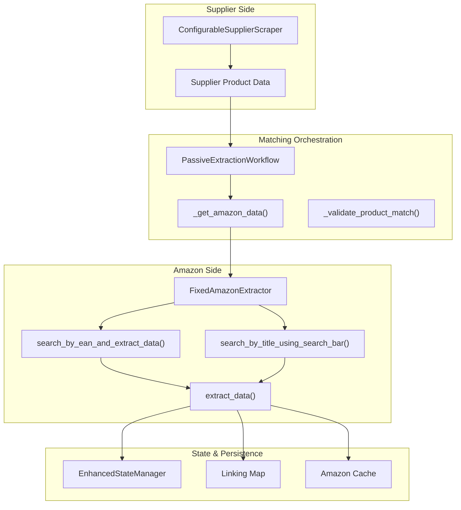
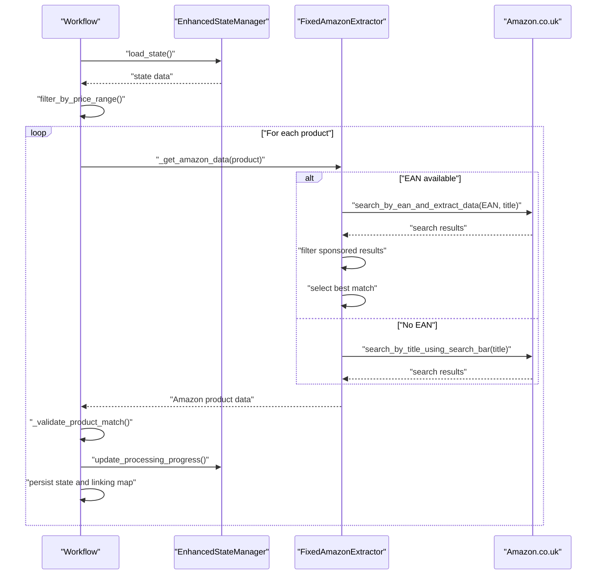
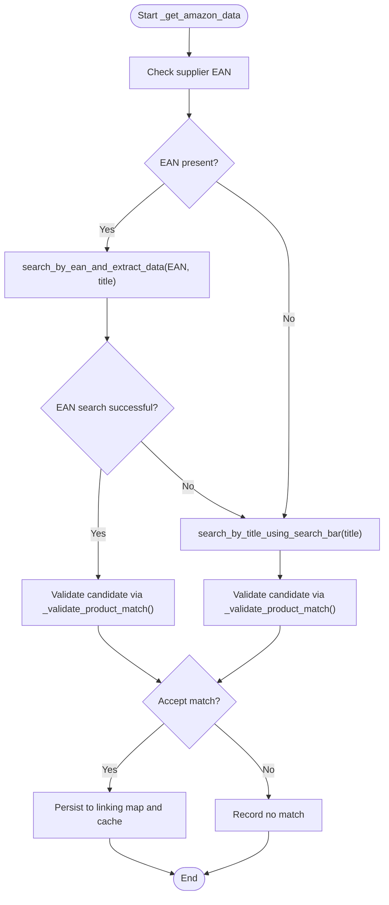
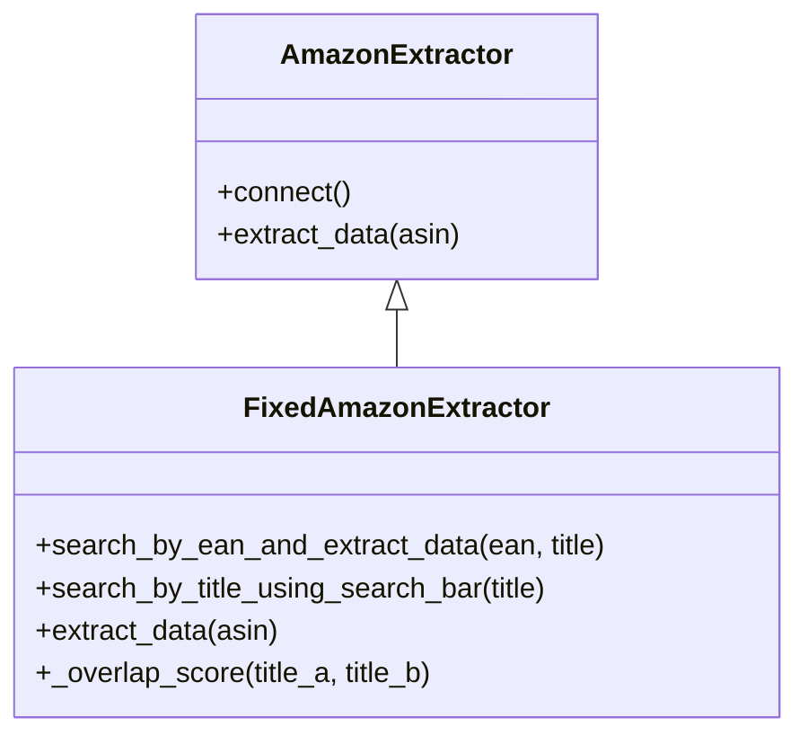
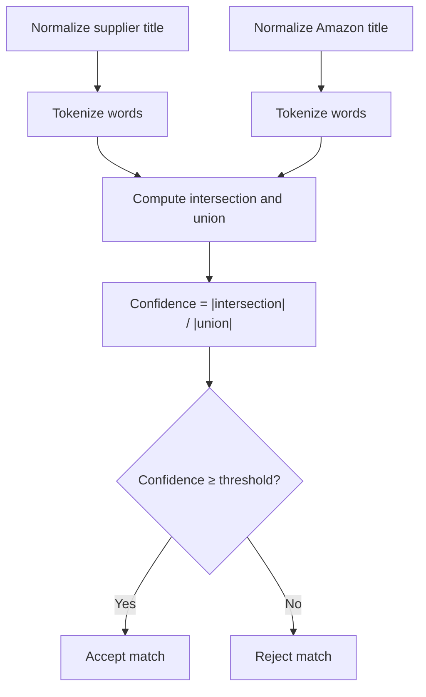
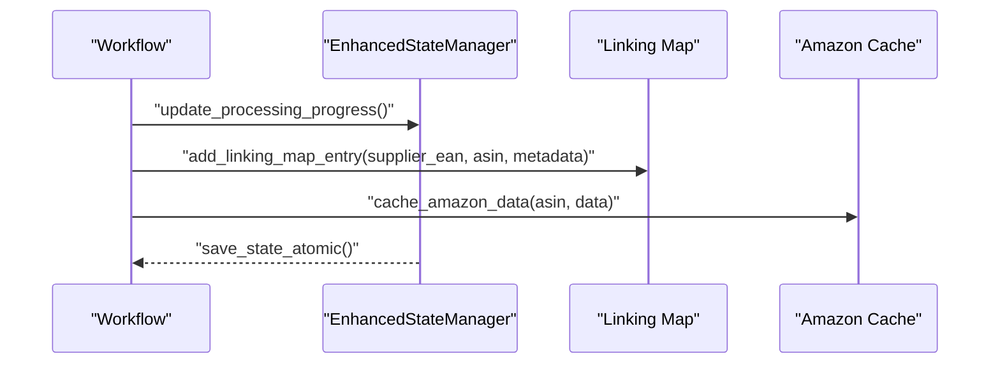
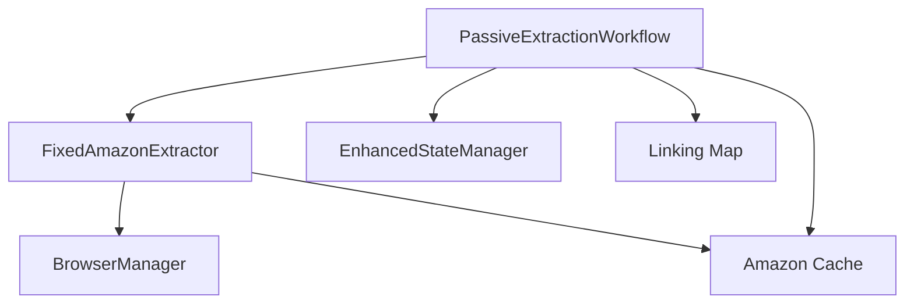

# Amazon Data Matching

<cite>
**Referenced Files in This Document**
- [passive_extraction_workflow_latest.py](file://tools/passive_extraction_workflow_latest.py)
- [amazon_playwright_extractor.py](file://tools/amazon_playwright_extractor.py)
- [fixed_enhanced_state_manager.py](file://utils/fixed_enhanced_state_manager.py)
- [Architectural_Summary_passive_extraction_workflow_latest-enhanced.txt](file://Architectural_Summary_passive_extraction_workflow_latest-enhanced.txt)
- [rag_index.json](file://OUTPUTS/CONTROL_PLANE/index/rag_index.json)
</cite>

## Table of Contents
1. [Introduction](#introduction)
2. [Project Structure](#project-structure)
3. [Core Components](#core-components)
4. [Architecture Overview](#architecture-overview)
5. [Detailed Component Analysis](#detailed-component-analysis)
6. [Dependency Analysis](#dependency-analysis)
7. [Performance Considerations](#performance-considerations)
8. [Troubleshooting Guide](#troubleshooting-guide)
9. [Conclusion](#conclusion)

## Introduction
This document explains the Amazon data matching subsystem that links supplier products to Amazon listings using an EAN-first, title-fallback strategy. It covers the `_get_amazon_data` method, the FixedAmazonExtractor integration, sponsored ad filtering, title similarity validation using difflib scoring, confidence scoring mechanisms, fallback strategies when EAN matching fails, and integration with EnhancedStateManager for progress tracking and linking map creation. It also addresses common issues like Amazon's anti-bot measures, search result filtering, and performance optimization for large product catalogs.

## Project Structure
The Amazon data matching subsystem spans three primary areas:
- Supplier-to-Amazon matching orchestration in the workflow
- Specialized Amazon search and extraction logic in the extractor
- State management and linking map persistence

**Diagram sources**
- [passive_extraction_workflow_latest.py](file://tools/passive_extraction_workflow_latest.py#L6145-L6573)
- [amazon_playwright_extractor.py](file://tools/amazon_playwright_extractor.py#L435-L850)
- [fixed_enhanced_state_manager.py](file://utils/fixed_enhanced_state_manager.py#L1-L800)

**Section sources**
- [Architectural_Summary_passive_extraction_workflow_latest-enhanced.txt](file://Architectural_Summary_passive_extraction_workflow_latest-enhanced.txt#L11-L47)
- [rag_index.json](file://OUTPUTS/CONTROL_PLANE/index/rag_index.json#L953-L1003)

## Core Components
- PassiveExtractionWorkflow: Orchestrates supplier product extraction, Amazon matching, validation, and persistence.
- FixedAmazonExtractor: Specialized Amazon searcher extending the base extractor, implementing EAN-first search and title fallback.
- EnhancedStateManager: Tracks progress, resumes from checkpoints, and persists state for linking map and cache.
- Linking Map: Persistent association between supplier EANs and Amazon ASINs.
- Amazon Cache: Stores extracted product data to avoid redundant scraping.

Key responsibilities:
- EAN-first matching via search_by_ean_and_extract_data
- Sponsored ad filtering during search
- Title similarity validation using difflib scoring
- Confidence scoring and fallback to title search
- Progress tracking and linking map updates

**Section sources**
- [passive_extraction_workflow_latest.py](file://tools/passive_extraction_workflow_latest.py#L6145-L6573)
- [amazon_playwright_extractor.py](file://tools/amazon_playwright_extractor.py#L435-L850)
- [fixed_enhanced_state_manager.py](file://utils/fixed_enhanced_state_manager.py#L1-L800)

## Architecture Overview
The matching pipeline follows a deterministic, stateful workflow:
1. Supplier product data is extracted and filtered.
2. For each product, _get_amazon_data decides between EAN-first and title-fallback matching.
3. FixedAmazonExtractor executes the chosen search strategy.
4. Results are validated using title similarity scoring.
5. Successful matches update the linking map and Amazon cache.
6. EnhancedStateManager tracks progress and persists state.

**Diagram sources**
- [passive_extraction_workflow_latest.py](file://tools/passive_extraction_workflow_latest.py#L6145-L6573)
- [amazon_playwright_extractor.py](file://tools/amazon_playwright_extractor.py#L435-L850)
- [fixed_enhanced_state_manager.py](file://utils/fixed_enhanced_state_manager.py#L1-L800)

## Detailed Component Analysis

### _get_amazon_data Method Implementation
The `_get_amazon_data` method orchestrates the dual-pronged matching strategy:
- EAN-first search using FixedAmazonExtractor.search_by_ean_and_extract_data
- Title-fallback using FixedAmazonExtractor.search_by_title_using_search_bar
- Title similarity validation via _validate_product_match
- Confidence scoring and match acceptance thresholds

Processing logic:
- If supplier product has a valid EAN, attempt EAN search first.
- If EAN search yields no valid organic results, fall back to title search.
- Validate candidate using difflib-based similarity scoring.
- Record the search method used and persist results.

**Diagram sources**
- [passive_extraction_workflow_latest.py](file://tools/passive_extraction_workflow_latest.py#L6145-L6573)

**Section sources**
- [passive_extraction_workflow_latest.py](file://tools/passive_extraction_workflow_latest.py#L6145-L6573)
- [Architectural_Summary_passive_extraction_workflow_latest-enhanced.txt](file://Architectural_Summary_passive_extraction_workflow_latest-enhanced.txt#L27-L47)

### FixedAmazonExtractor Integration
FixedAmazonExtractor extends the base AmazonExtractor and implements:
- search_by_ean_and_extract_data: EAN-first search with sponsored result filtering and robust ASIN extraction.
- search_by_title_using_search_bar: Title-based search using the search bar.
- extract_data: Full extraction for the selected ASIN.

Key features:
- Sponsored ad filtering by visibility detection (DOM-based).
- Four-fallback ASIN extraction methods (data-asin, /dp/ pattern, data-uuid, regex).
- Reuse of browser pages to maintain extension state.

**Diagram sources**
- [amazon_playwright_extractor.py](file://tools/amazon_playwright_extractor.py#L435-L850)

**Section sources**
- [amazon_playwright_extractor.py](file://tools/amazon_playwright_extractor.py#L435-L850)
- [Architectural_Summary_passive_extraction_workflow_latest-enhanced.txt](file://Architectural_Summary_passive_extraction_workflow_latest-enhanced.txt#L36-L47)

### Sponsored Ad Filtering
During EAN search, the system filters out sponsored results:
- Visibility-based detection: sponsored results are often hidden by AdBlocker and thus invisible in the DOM.
- Organic-first selection: the first visible organic result is chosen, trusting Amazon’s ranking.

This simplifies matching and reduces false positives from paid placements.

**Section sources**
- [amazon_playwright_extractor.py](file://tools/amazon_playwright_extractor.py#L435-L850)

### Title Similarity Validation Using difflib Scoring
The `_validate_product_match` function computes a confidence score using word overlap:
- Normalizes titles (remove punctuation, lowercase).
- Computes Jaccard similarity between word sets.
- Accepts matches meeting configured thresholds.

**Diagram sources**
- [passive_extraction_workflow_latest.py](file://tools/passive_extraction_workflow_latest.py#L6145-L6573)

**Section sources**
- [passive_extraction_workflow_latest.py](file://tools/passive_extraction_workflow_latest.py#L6145-L6573)

### Confidence Scoring Mechanisms and Fallback Strategies
Confidence scoring:
- EAN-first matches are treated as authoritative; validation focuses on title similarity to confirm identity.
- Title-fallback uses difflib scoring with configurable thresholds.

Fallback strategies:
- If EAN search fails or returns no valid organic results, the system falls back to title search.
- If title search also fails, the product is recorded as unmatched.

**Section sources**
- [passive_extraction_workflow_latest.py](file://tools/passive_extraction_workflow_latest.py#L6145-L6573)
- [Architectural_Summary_passive_extraction_workflow_latest-enhanced.txt](file://Architectural_Summary_passive_extraction_workflow_latest-enhanced.txt#L27-L47)

### Integration with EnhancedStateManager and Linking Map Creation
EnhancedStateManager tracks:
- Resumption pointers and progress across supplier and Amazon phases.
- Category denominators and completed counts.
- Metrics and validation for resume correctness.

Linking Map creation:
- On successful match, the system creates an entry associating supplier EAN/url with Amazon ASIN.
- Entries include titles, prices, match method, confidence, and timestamps.

**Diagram sources**
- [fixed_enhanced_state_manager.py](file://utils/fixed_enhanced_state_manager.py#L1-L800)
- [passive_extraction_workflow_latest.py](file://tools/passive_extraction_workflow_latest.py#L6145-L6573)

**Section sources**
- [fixed_enhanced_state_manager.py](file://utils/fixed_enhanced_state_manager.py#L1-L800)
- [rag_index.json](file://OUTPUTS/CONTROL_PLANE/index/rag_index.json#L3578-L3643)

## Dependency Analysis
The matching subsystem exhibits clear separation of concerns:
- Workflow depends on Extractor for Amazon interactions.
- Extractor depends on BrowserManager for browser lifecycle.
- State Manager persists progress and linking map.
- Linking Map and Cache provide persistence for matches and extracted data.

**Diagram sources**
- [passive_extraction_workflow_latest.py](file://tools/passive_extraction_workflow_latest.py#L6145-L6573)
- [amazon_playwright_extractor.py](file://tools/amazon_playwright_extractor.py#L435-L850)
- [fixed_enhanced_state_manager.py](file://utils/fixed_enhanced_state_manager.py#L1-L800)

**Section sources**
- [rag_index.json](file://OUTPUTS/CONTROL_PLANE/index/rag_index.json#L953-L1003)

## Performance Considerations
- EAN-first search minimizes title parsing overhead and reduces false positives.
- Sponsored ad filtering avoids expensive validations on paid placements.
- Hash-based linking map and cache reduce repeated scraping.
- Batched state saves and atomic writes prevent partial writes and corruption.
- Memory monitoring and garbage collection help sustain long runs.

[No sources needed since this section provides general guidance]

## Troubleshooting Guide
Common issues and remedies:
- Anti-bot measures: The system uses realistic navigation and visibility-based sponsored filtering to avoid detection.
- Missing EANs: Fall back to title search; ensure supplier scraping extracts EANs reliably.
- False matches: Increase similarity thresholds; validate with additional metadata.
- Performance bottlenecks: Enable caching, batch saves, and monitor memory usage.
- Resume inconsistencies: EnhancedStateManager enforces monotonicity and validates resume pointers.

**Section sources**
- [amazon_playwright_extractor.py](file://tools/amazon_playwright_extractor.py#L435-L850)
- [fixed_enhanced_state_manager.py](file://utils/fixed_enhanced_state_manager.py#L1-L800)
- [passive_extraction_workflow_latest.py](file://tools/passive_extraction_workflow_latest.py#L6145-L6573)

## Conclusion
The Amazon data matching subsystem combines deterministic EAN-first matching with robust title-fallback validation, sponsored ad filtering, and strong state management. The FixedAmazonExtractor encapsulates Amazon-specific logic, while EnhancedStateManager and the linking map ensure reliable progress tracking and persistence. Together, these components deliver scalable, auditable, and high-confidence supplier-to-Amazon linkage suitable for large catalogs.