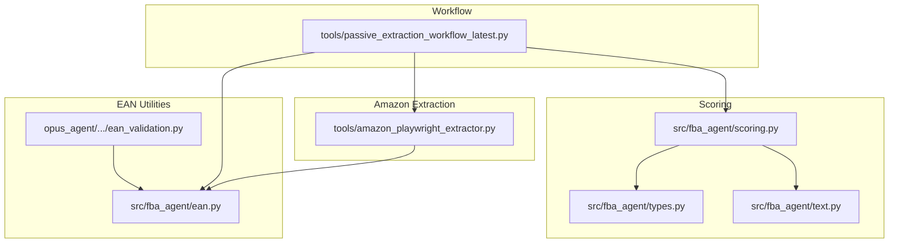
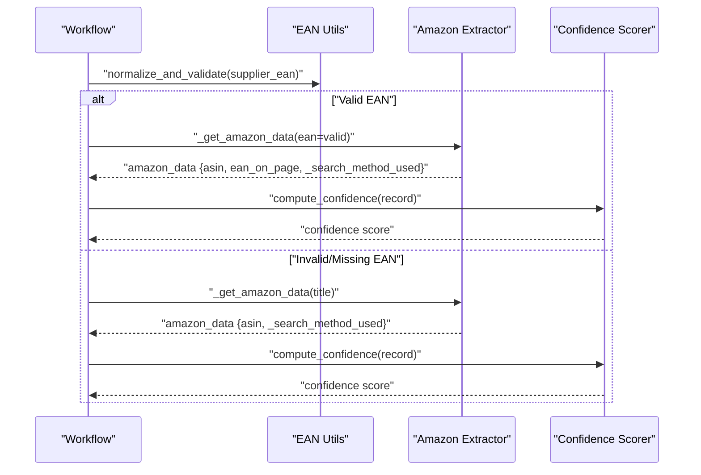
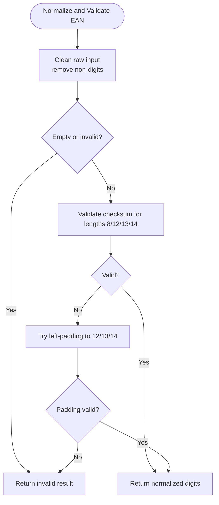
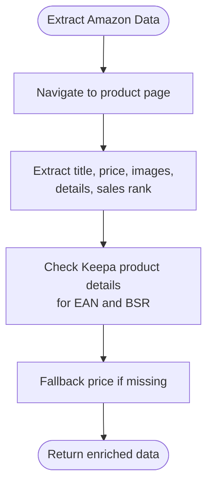
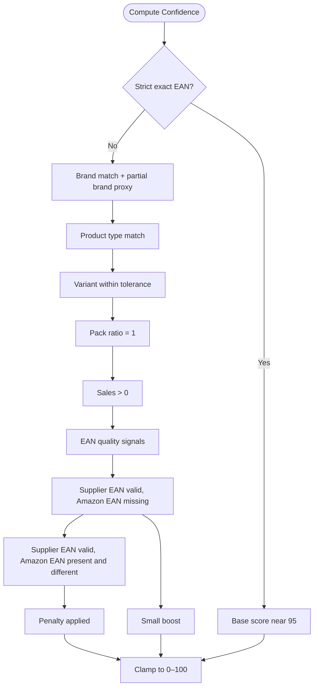
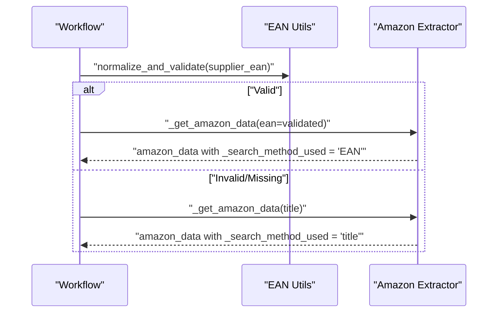
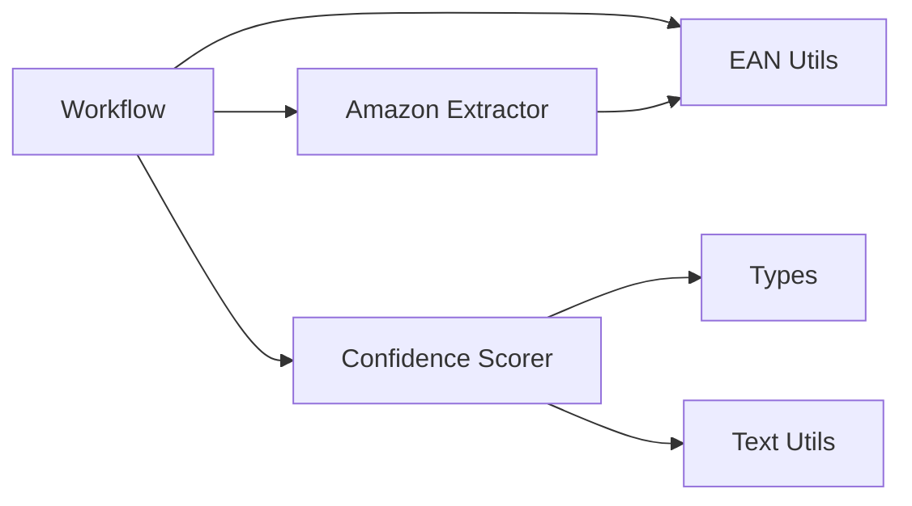

# EAN Matching Strategy

<cite>
**Referenced Files in This Document**
- [ean.py](file://src/fba_agent/ean.py)
- [scoring.py](file://src/fba_agent/scoring.py)
- [types.py](file://src/fba_agent/types.py)
- [text.py](file://src/fba_agent/text.py)
- [amazon_playwright_extractor.py](file://tools/amazon_playwright_extractor.py)
- [ean_validation.py](file://opus_agent/src/fba_agent/tools/ean_validation.py)
- [passive_extraction_workflow_latest.py](file://tools/passive_extraction_workflow_latest.py)
</cite>

## Table of Contents
1. [Introduction](#introduction)
2. [Project Structure](#project-structure)
3. [Core Components](#core-components)
4. [Architecture Overview](#architecture-overview)
5. [Detailed Component Analysis](#detailed-component-analysis)
6. [Dependency Analysis](#dependency-analysis)
7. [Performance Considerations](#performance-considerations)
8. [Troubleshooting Guide](#troubleshooting-guide)
9. [Conclusion](#conclusion)

## Introduction
This document explains the EAN-first matching strategy implemented in the Amazon FBA Agent system. It focuses on how the system prioritizes EAN-based product matching over title-based fallback, detailing the EAN extraction and validation pipeline, the confidence scoring mechanism, and practical examples of malformed or missing EAN handling. It also covers the performance benefits of EAN matching and its impact on overall system efficiency.

## Project Structure
The EAN-first strategy spans several modules:
- EAN normalization and validation utilities
- Amazon extraction with EAN fallbacks
- Confidence scoring that incorporates EAN evidence
- Workflow orchestration that selects the best matching method

**Diagram sources**
- [ean.py](file://src/fba_agent/ean.py#L1-L77)
- [ean_validation.py](file://opus_agent/src/fba_agent/tools/ean_validation.py#L1-L198)
- [amazon_playwright_extractor.py](file://tools/amazon_playwright_extractor.py#L1-L800)
- [scoring.py](file://src/fba_agent/scoring.py#L1-L59)
- [types.py](file://src/fba_agent/types.py#L62-L104)
- [text.py](file://src/fba_agent/text.py#L40-L47)
- [passive_extraction_workflow_latest.py](file://tools/passive_extraction_workflow_latest.py#L3063-L3091)

**Section sources**
- [ean.py](file://src/fba_agent/ean.py#L1-L77)
- [scoring.py](file://src/fba_agent/scoring.py#L1-L59)
- [types.py](file://src/fba_agent/types.py#L62-L104)
- [text.py](file://src/fba_agent/text.py#L40-L47)
- [amazon_playwright_extractor.py](file://tools/amazon_playwright_extractor.py#L1-L800)
- [ean_validation.py](file://opus_agent/src/fba_agent/tools/ean_validation.py#L1-L198)
- [passive_extraction_workflow_latest.py](file://tools/passive_extraction_workflow_latest.py#L3063-L3091)

## Core Components
- EAN normalization and validation: Provides robust cleaning, padding, and checksum validation for GTIN variants.
- Amazon extractor: Extracts product data and includes EAN fallbacks from external sources (e.g., Keepa).
- Confidence scoring: Incorporates EAN evidence quality into the final confidence score.
- Workflow orchestration: Chooses EAN-first matching and records the actual search method used.

**Section sources**
- [ean.py](file://src/fba_agent/ean.py#L19-L77)
- [amazon_playwright_extractor.py](file://tools/amazon_playwright_extractor.py#L697-L770)
- [scoring.py](file://src/fba_agent/scoring.py#L39-L58)
- [passive_extraction_workflow_latest.py](file://tools/passive_extraction_workflow_latest.py#L3077-L3091)

## Architecture Overview
The EAN-first strategy is orchestrated by the workflow, which:
1. Attempts EAN-based matching first.
2. Falls back to title-based matching when EAN is missing or invalid.
3. Records the actual search method used.
4. Computes confidence scores that reward verified EAN matches.

**Diagram sources**
- [passive_extraction_workflow_latest.py](file://tools/passive_extraction_workflow_latest.py#L3069-L3091)
- [ean.py](file://src/fba_agent/ean.py#L62-L77)
- [amazon_playwright_extractor.py](file://tools/amazon_playwright_extractor.py#L317-L461)
- [scoring.py](file://src/fba_agent/scoring.py#L7-L58)

## Detailed Component Analysis

### EAN Extraction and Validation Pipeline
The EAN pipeline ensures supplier EANs are normalized and validated before matching:
- Cleaning: Removes whitespace, handles special values, and strips non-digits.
- Left-padding: Attempts padding to GTIN lengths (12, 13, 14) to recover valid barcodes.
- Checksum validation: Applies GTIN checksum rules to confirm validity.
- Structured output: Returns normalized digits and validity flags.

**Diagram sources**
- [ean.py](file://src/fba_agent/ean.py#L19-L77)

**Section sources**
- [ean.py](file://src/fba_agent/ean.py#L19-L77)

### Amazon Data Extraction with EAN Fallbacks
The Amazon extractor enriches product data and includes EAN fallbacks:
- Extracts product details, ratings, sales rank, and pricing.
- Collects EANs from external sources (e.g., Keepa product details tab).
- Provides fallbacks for missing or invalid BSR and price when available.

**Diagram sources**
- [amazon_playwright_extractor.py](file://tools/amazon_playwright_extractor.py#L467-L776)

**Section sources**
- [amazon_playwright_extractor.py](file://tools/amazon_playwright_extractor.py#L697-L770)

### Confidence Scoring with EAN Evidence
The confidence scorer incorporates EAN evidence quality:
- Strict EAN match: High base score with small penalties for traps/capacity mismatch.
- EAN quality signals: Rewards missing Amazon EAN when supplier EAN is valid; penalizes conflicting EANs.
- Additional factors: Brand/product type/variant, pack ratio, sales presence, capacity gates.

**Diagram sources**
- [scoring.py](file://src/fba_agent/scoring.py#L7-L58)
- [types.py](file://src/fba_agent/types.py#L62-L72)

**Section sources**
- [scoring.py](file://src/fba_agent/scoring.py#L7-L58)
- [types.py](file://src/fba_agent/types.py#L62-L72)

### Workflow Orchestration: EAN-First Matching
The workflow orchestrates EAN-first matching and records the actual search method:
- Validates supplier EAN and proceeds with EAN search if valid.
- Falls back to title search when EAN is invalid or missing.
- Records the actual search method used for downstream confidence computation and reporting.

**Diagram sources**
- [passive_extraction_workflow_latest.py](file://tools/passive_extraction_workflow_latest.py#L3069-L3091)
- [ean.py](file://src/fba_agent/ean.py#L62-L77)

**Section sources**
- [passive_extraction_workflow_latest.py](file://tools/passive_extraction_workflow_latest.py#L3069-L3091)

### EAN Validation Utilities (Strict Validation)
Additional strict validation utilities complement the core EAN pipeline:
- Cleans values to digits only, rejecting scientific notation.
- Validates GTIN checksums for 8/12/13/14 digits.
- Supports exact EAN matching and formatted display helpers.

**Section sources**
- [ean_validation.py](file://opus_agent/src/fba_agent/tools/ean_validation.py#L12-L198)

## Dependency Analysis
The EAN-first strategy depends on:
- EAN utilities for normalization/validation
- Amazon extractor for product data and EAN fallbacks
- Confidence scoring for final assessment
- Workflow orchestration for method selection and recording

**Diagram sources**
- [passive_extraction_workflow_latest.py](file://tools/passive_extraction_workflow_latest.py#L3069-L3091)
- [ean.py](file://src/fba_agent/ean.py#L19-L77)
- [amazon_playwright_extractor.py](file://tools/amazon_playwright_extractor.py#L697-L770)
- [scoring.py](file://src/fba_agent/scoring.py#L7-L58)
- [types.py](file://src/fba_agent/types.py#L62-L104)
- [text.py](file://src/fba_agent/text.py#L40-L47)

**Section sources**
- [passive_extraction_workflow_latest.py](file://tools/passive_extraction_workflow_latest.py#L3069-L3091)
- [ean.py](file://src/fba_agent/ean.py#L19-L77)
- [amazon_playwright_extractor.py](file://tools/amazon_playwright_extractor.py#L697-L770)
- [scoring.py](file://src/fba_agent/scoring.py#L7-L58)
- [types.py](file://src/fba_agent/types.py#L62-L104)
- [text.py](file://src/fba_agent/text.py#L40-L47)

## Performance Considerations
- EAN-first matching reduces unnecessary title searches when supplier EANs are valid, decreasing browser automation calls and improving throughput.
- EAN validation short-circuits invalid entries early, reducing downstream processing overhead.
- Keepa-based EAN fallbacks minimize retries and improve accuracy without additional scraping.
- Confidence scoring that rewards verified EAN matches reduces post-processing ambiguity and improves final bucket assignment reliability.

[No sources needed since this section provides general guidance]

## Troubleshooting Guide
Common scenarios and resolutions:
- Malformed EAN values: Scientific notation or excessive trailing zeros are rejected during cleaning; ensure numeric-only input.
- Missing EAN: The system falls back to title-based matching; verify supplier data quality and consider manual intervention.
- Conflicting EANs: When supplier EAN differs from Amazon’s EAN, confidence is penalized; investigate supplier or catalog discrepancies.
- EAN verification failures: The workflow records the failure and may downgrade confidence; re-run with corrected EAN or rely on title matching.

**Section sources**
- [ean.py](file://src/fba_agent/ean.py#L19-L38)
- [passive_extraction_workflow_latest.py](file://tools/passive_extraction_workflow_latest.py#L3080-L3091)
- [scoring.py](file://src/fba_agent/scoring.py#L46-L48)

## Conclusion
The EAN-first matching strategy improves accuracy and efficiency by prioritizing validated EAN-based matching, leveraging robust normalization and checksum validation, and incorporating EAN evidence quality into confidence scoring. When EANs are unavailable or invalid, the system gracefully falls back to title-based matching while preserving performance and traceability through recorded search methods.