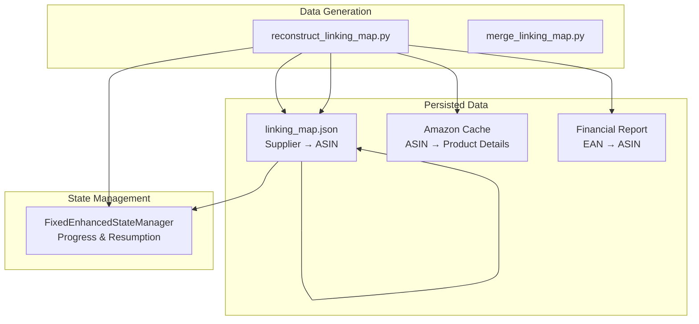
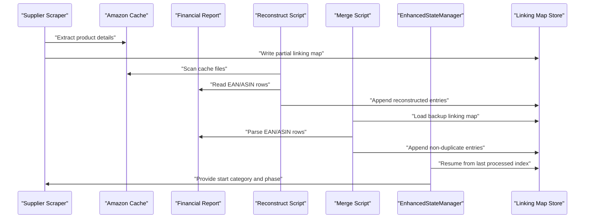
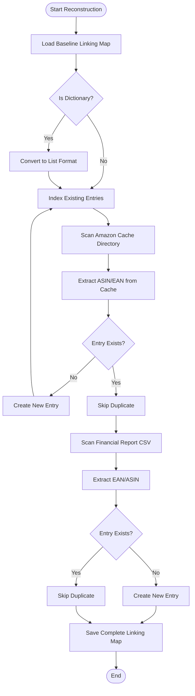
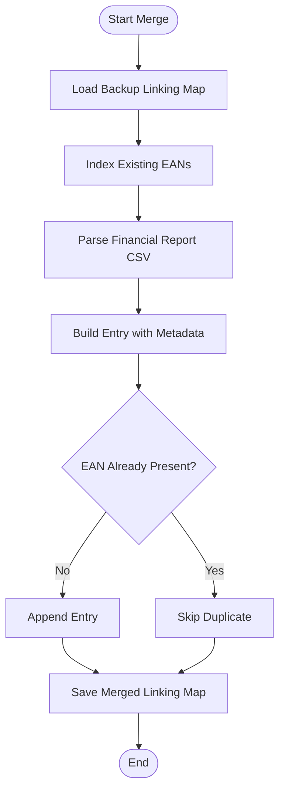
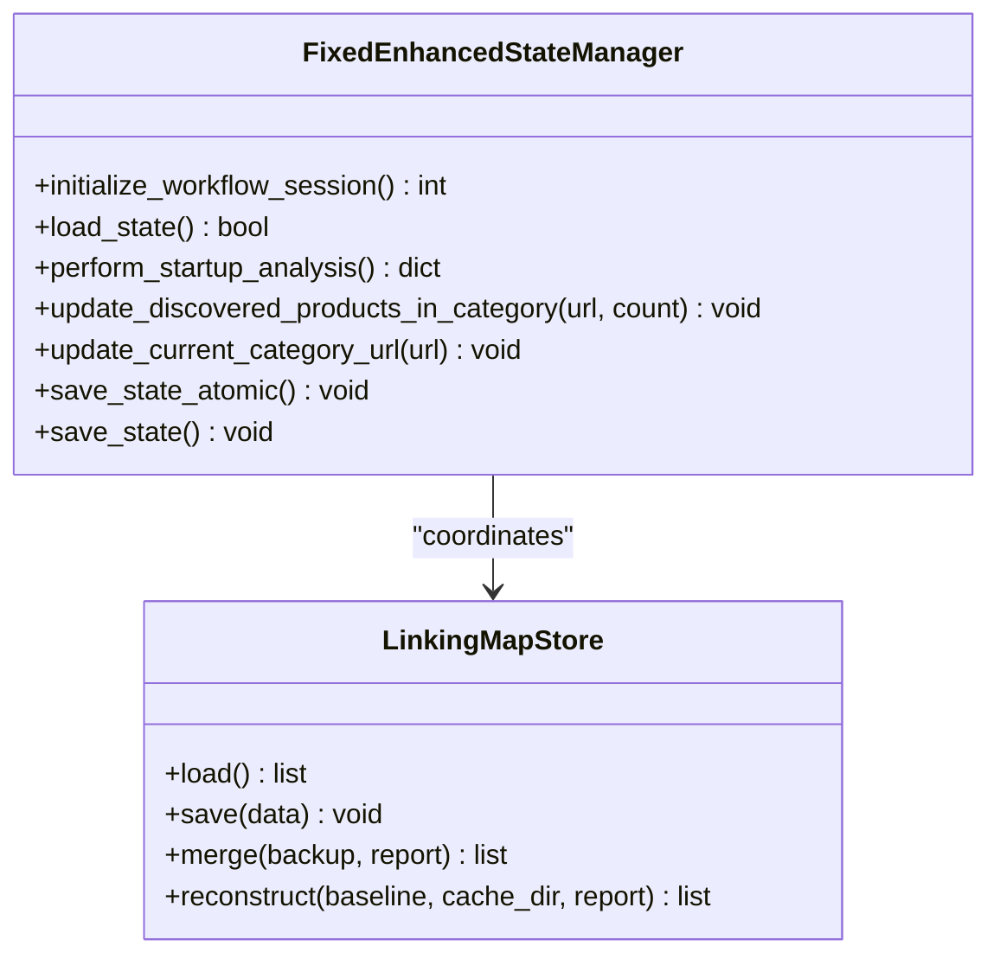
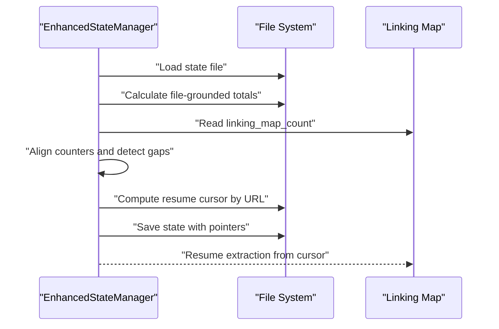
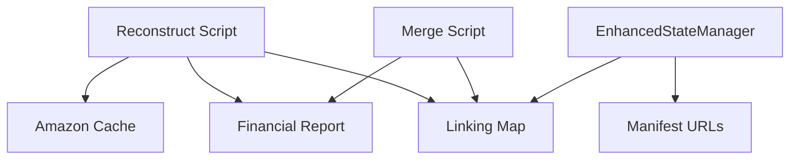

# Linking Map Management

<cite>
**Referenced Files in This Document**
- [reconstruct_linking_map.py](file://tools/reconstruct_linking_map.py)
- [merge_linking_map.py](file://tools/merge_linking_map.py)
- [linking_map.json](file://LLM_ANALYSIS_PACKAGE/output_files/linking_map.json)
- [linking_map.json](file://OUTPUTS/COMBINED OJUTPUTS/LINKING MAP/linking_map.json)
- [fixed_enhanced_state_manager.py](file://utils/fixed_enhanced_state_manager.py)
</cite>

## Table of Contents
1. [Introduction](#introduction)
2. [Project Structure](#project-structure)
3. [Core Components](#core-components)
4. [Architecture Overview](#architecture-overview)
5. [Detailed Component Analysis](#detailed-component-analysis)
6. [Dependency Analysis](#dependency-analysis)
7. [Performance Considerations](#performance-considerations)
8. [Troubleshooting Guide](#troubleshooting-guide)
9. [Conclusion](#conclusion)

## Introduction
This document explains the linking map creation and management system that associates supplier products with matched Amazon ASINs. It covers the linking map data structure, persistence mechanisms, memory management for large datasets, batch processing approaches, and integration with the EnhancedStateManager for progress tracking. Concrete examples illustrate linking map entries, cross-references between supplier and Amazon data, and recovery mechanisms when linking fails.

## Project Structure
The linking map system spans three primary areas:
- Data generation and reconstruction: scripts that build and repair linking maps from Amazon cache and financial reports
- Persisted linking maps: JSON artifacts containing supplier-to-Amazon associations
- State management: EnhancedStateManager tracks progress and enables resumption across runs

**Diagram sources**
- [reconstruct_linking_map.py](file://tools/reconstruct_linking_map.py#L1-L171)
- [merge_linking_map.py](file://tools/merge_linking_map.py#L1-L78)
- [linking_map.json](file://LLM_ANALYSIS_PACKAGE/output_files/linking_map.json#L1-L800)
- [fixed_enhanced_state_manager.py](file://utils/fixed_enhanced_state_manager.py#L1-L800)

**Section sources**
- [reconstruct_linking_map.py](file://tools/reconstruct_linking_map.py#L1-L171)
- [merge_linking_map.py](file://tools/merge_linking_map.py#L1-L78)
- [linking_map.json](file://LLM_ANALYSIS_PACKAGE/output_files/linking_map.json#L1-L800)
- [fixed_enhanced_state_manager.py](file://utils/fixed_enhanced_state_manager.py#L1-L800)

## Core Components
- Linking map data structure: A list of entries mapping supplier product identifiers to chosen Amazon ASINs, with metadata such as match method, confidence, timestamps, and URLs.
- Reconstruction pipeline: Scans Amazon cache and financial reports to fill gaps in the linking map.
- Merge pipeline: Adds report-derived entries to an existing linking map backup while avoiding duplicates.
- Persistence: Atomic file writes and JSON serialization ensure durability and consistency.
- Memory management: Batch processing and duplicate indexing minimize memory footprint for large linking maps.
- Progress tracking: EnhancedStateManager coordinates resumption and progress across supplier and Amazon phases.

**Section sources**
- [linking_map.json](file://LLM_ANALYSIS_PACKAGE/output_files/linking_map.json#L1-L800)
- [reconstruct_linking_map.py](file://tools/reconstruct_linking_map.py#L42-L167)
- [merge_linking_map.py](file://tools/merge_linking_map.py#L22-L77)
- [fixed_enhanced_state_manager.py](file://utils/fixed_enhanced_state_manager.py#L148-L645)

## Architecture Overview
The linking map lifecycle integrates extraction, reconstruction, merging, and stateful persistence:

**Diagram sources**
- [reconstruct_linking_map.py](file://tools/reconstruct_linking_map.py#L42-L167)
- [merge_linking_map.py](file://tools/merge_linking_map.py#L22-L77)
- [fixed_enhanced_state_manager.py](file://utils/fixed_enhanced_state_manager.py#L247-L283)

## Detailed Component Analysis

### Linking Map Data Structure
The linking map is a JSON array of entries. Each entry contains:
- Supplier identity: EAN or identifier
- Chosen Amazon ASIN
- Supplier and Amazon titles
- Prices and match confidence
- Match method and timestamps
- Supplier URL for provenance

Example entry structure (paths):
- [Supplier EAN, ASIN, Titles, Prices, Match Method, Confidence, Timestamp, Supplier URL](file://LLM_ANALYSIS_PACKAGE/output_files/linking_map.json#L1-L800)

Cross-reference patterns:
- EAN-to-ASIN mapping for precise matches
- Title-based matches with medium confidence
- Timestamps and URLs enable traceability and reconciliation

**Section sources**
- [linking_map.json](file://LLM_ANALYSIS_PACKAGE/output_files/linking_map.json#L1-L800)

### Reconstruction Pipeline
The reconstruction script builds a complete linking map by combining:
- Existing linking map entries
- Amazon cache entries (ASIN + EAN)
- Financial report entries (EAN + ASIN)

Key steps:
- Load baseline linking map (convert dict to list if needed)
- Index existing entries by supplier identifier to prevent duplicates
- Scan Amazon cache directory for product JSON files
- Extract ASIN and EAN from cache records
- Create new entries with reconstructed metadata
- Scan financial report CSV for EAN/ASIN pairs
- Append non-duplicate entries with reconstructed metadata
- Save the complete linking map

**Diagram sources**
- [reconstruct_linking_map.py](file://tools/reconstruct_linking_map.py#L42-L167)

**Section sources**
- [reconstruct_linking_map.py](file://tools/reconstruct_linking_map.py#L42-L167)

### Merge Pipeline
The merge script augments an existing linking map backup with entries from a financial report:
- Load backup linking map
- Index existing EANs to avoid duplicates
- Parse report CSV for EAN and ASIN
- Create new entries with metadata (titles, prices, URLs)
- Append and deduplicate
- Save merged linking map

**Diagram sources**
- [merge_linking_map.py](file://tools/merge_linking_map.py#L22-L77)

**Section sources**
- [merge_linking_map.py](file://tools/merge_linking_map.py#L22-L77)

### Persistence Mechanisms
Persistence ensures reliable linking map storage and recovery:
- Atomic file operations: Thread-safe state writer and atomic JSON save utilities
- JSON serialization: Structured, human-readable linking map artifacts
- State manager integration: EnhancedStateManager coordinates resumption and progress

**Diagram sources**
- [fixed_enhanced_state_manager.py](file://utils/fixed_enhanced_state_manager.py#L86-L800)
- [merge_linking_map.py](file://tools/merge_linking_map.py#L22-L77)
- [reconstruct_linking_map.py](file://tools/reconstruct_linking_map.py#L21-L36)

**Section sources**
- [fixed_enhanced_state_manager.py](file://utils/fixed_enhanced_state_manager.py#L86-L800)
- [merge_linking_map.py](file://tools/merge_linking_map.py#L22-L77)
- [reconstruct_linking_map.py](file://tools/reconstruct_linking_map.py#L21-L36)

### Memory Management for Large Linking Maps
Large linking maps require careful memory handling:
- Batch processing: Process cache files and report rows incrementally
- Duplicate indexing: Maintain sets/maps keyed by supplier identifiers to avoid duplication
- Incremental scans: Limit file system traversal and CSV parsing to necessary subsets
- Structured logging: Track progress and memory usage for observability

**Section sources**
- [reconstruct_linking_map.py](file://tools/reconstruct_linking_map.py#L78-L128)
- [merge_linking_map.py](file://tools/merge_linking_map.py#L28-L69)

### Integration with EnhancedStateManager
EnhancedStateManager provides:
- Authoritative resumption: Computes start positions based on linking map counts and manifest URLs
- Startup analysis: Aligns counters and detects reverse gaps
- Progress tracking: Updates category totals and completion status
- Atomic persistence: Ensures consistent state across interruptions

**Diagram sources**
- [fixed_enhanced_state_manager.py](file://utils/fixed_enhanced_state_manager.py#L469-L645)

**Section sources**
- [fixed_enhanced_state_manager.py](file://utils/fixed_enhanced_state_manager.py#L148-L645)

## Dependency Analysis
The linking map system depends on:
- Amazon cache and financial reports for cross-referencing
- EnhancedStateManager for progress and resumption
- Atomic file operations for safe persistence

**Diagram sources**
- [reconstruct_linking_map.py](file://tools/reconstruct_linking_map.py#L78-L167)
- [merge_linking_map.py](file://tools/merge_linking_map.py#L36-L77)
- [fixed_enhanced_state_manager.py](file://utils/fixed_enhanced_state_manager.py#L546-L645)

**Section sources**
- [reconstruct_linking_map.py](file://tools/reconstruct_linking_map.py#L78-L167)
- [merge_linking_map.py](file://tools/merge_linking_map.py#L36-L77)
- [fixed_enhanced_state_manager.py](file://utils/fixed_enhanced_state_manager.py#L546-L645)

## Performance Considerations
- Prefer incremental scans over full reprocessing
- Use indexing to avoid duplicate entries
- Batch writes to reduce I/O overhead
- Monitor memory usage during large merges and reconstructions

## Troubleshooting Guide
Common issues and remedies:
- Missing or corrupted linking map: Use reconstruction to rebuild from cache and report
- Duplicate entries: Merge pipeline avoids duplicates via EAN indexing
- Resume inconsistencies: EnhancedStateManager aligns counters and recomputes resume cursor
- File system errors: Atomic persistence reduces risk of partial writes

**Section sources**
- [reconstruct_linking_map.py](file://tools/reconstruct_linking_map.py#L21-L36)
- [merge_linking_map.py](file://tools/merge_linking_map.py#L28-L69)
- [fixed_enhanced_state_manager.py](file://utils/fixed_enhanced_state_manager.py#L469-L645)

## Conclusion
The linking map management system combines robust reconstruction and merging pipelines with durable persistence and stateful progress tracking. It supports large-scale linking operations through batch processing, duplicate prevention, and atomic file operations, while EnhancedStateManager ensures reliable resumption and accurate progress reporting.