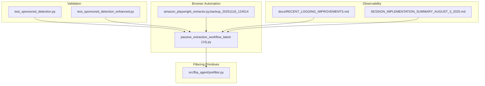
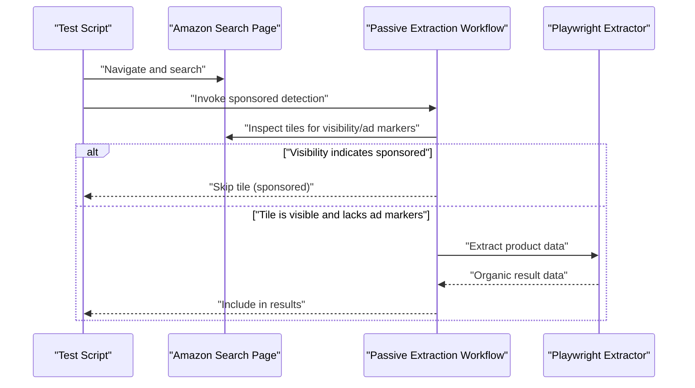
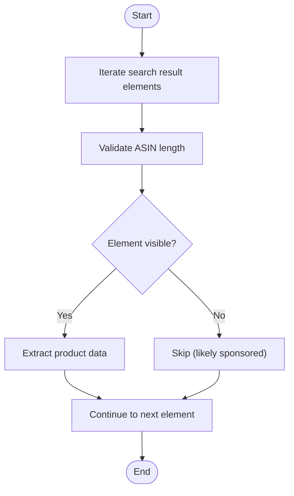
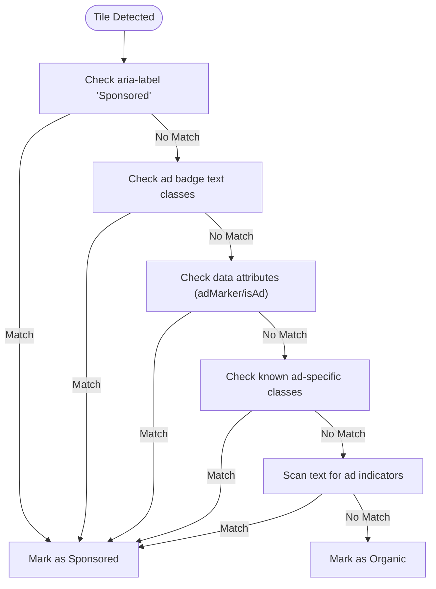
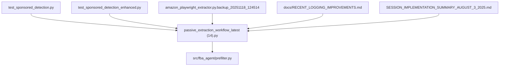

# Sponsored Ad Filtering

<cite>
**Referenced Files in This Document**
- [prefilter.py](file://src/fba_agent/prefilter.py)
- [test_sponsored_detection.py](file://archive/tests/test_sponsored_detection.py)
- [test_sponsored_detection_enhanced.py](file://archive/tests/test_sponsored_detection_enhanced.py)
- [passive_extraction_workflow_latest (14).py](file://passive_extraction_workflow_latest (14).py)
- [amazon_playwright_extractor.py.backup_20251118_124514](file://tools/amazon_playwright_extractor.py.backup_20251118_124514)
- [RECENT_LOGGING_IMPROVEMENTS.md](file://docs/RECENT_LOGGING_IMPROVEMENTS.md)
- [SESSION_IMPLEMENTATION_SUMMARY_AUGUST_3_2025.md](file://SESSION_IMPLEMENTATION_SUMMARY_AUGUST_3_2025.md)
</cite>

## Table of Contents
1. [Introduction](#introduction)
2. [Project Structure](#project-structure)
3. [Core Components](#core-components)
4. [Architecture Overview](#architecture-overview)
5. [Detailed Component Analysis](#detailed-component-analysis)
6. [Dependency Analysis](#dependency-analysis)
7. [Performance Considerations](#performance-considerations)
8. [Troubleshooting Guide](#troubleshooting-guide)
9. [Conclusion](#conclusion)

## Introduction
This document explains the sponsored ad filtering mechanism used in the Amazon FBA Agent system. It focuses on visibility-based sponsored ad detection, the filtering logic that excludes promoted results, and the stability improvements introduced in the new filtering approach. The system distinguishes between organic and sponsored listings using multiple visual inspection methods, ensuring that only non-promoted results are considered for downstream analysis and matching. The document also outlines the impact on search result quality and matching accuracy, with concrete examples derived from test scripts and workflow implementations.

## Project Structure
The sponsored ad filtering spans browser automation, test validation, and workflow orchestration:
- Browser automation and visibility checks are implemented in the passive extraction workflow and a Playwright extractor.
- Sponsored detection logic is validated by dedicated test scripts that exercise multiple detection heuristics.
- A lightweight prefilter module provides general-purpose filtering for profitability and completeness prior to analysis.
- Logging and validation improvements enhance observability and integrity of filtering outcomes.

**Diagram sources**
- [passive_extraction_workflow_latest (14).py](file://passive_extraction_workflow_latest (14).py#L1180-L1261)
- [amazon_playwright_extractor.py.backup_20251118_124514](file://tools/amazon_playwright_extractor.py.backup_20251118_124514#L2300-L2356)
- [test_sponsored_detection.py](file://archive/tests/test_sponsored_detection.py#L14-L131)
- [test_sponsored_detection_enhanced.py](file://archive/tests/test_sponsored_detection_enhanced.py#L14-L189)
- [prefilter.py](file://src/fba_agent/prefilter.py#L110-L179)
- [RECENT_LOGGING_IMPROVEMENTS.md](file://docs/RECENT_LOGGING_IMPROVEMENTS.md#L102-L143)
- [SESSION_IMPLEMENTATION_SUMMARY_AUGUST_3_2025.md](file://SESSION_IMPLEMENTATION_SUMMARY_AUGUST_3_2025.md#L99-L107)

**Section sources**
- [passive_extraction_workflow_latest (14).py](file://passive_extraction_workflow_latest (14).py#L1180-L1261)
- [amazon_playwright_extractor.py.backup_20251118_124514](file://tools/amazon_playwright_extractor.py.backup_20251118_124514#L2300-L2356)
- [test_sponsored_detection.py](file://archive/tests/test_sponsored_detection.py#L14-L131)
- [test_sponsored_detection_enhanced.py](file://archive/tests/test_sponsored_detection_enhanced.py#L14-L189)
- [prefilter.py](file://src/fba_agent/prefilter.py#L110-L179)
- [RECENT_LOGGING_IMPROVEMENTS.md](file://docs/RECENT_LOGGING_IMPROVEMENTS.md#L102-L143)
- [SESSION_IMPLEMENTATION_SUMMARY_AUGUST_3_2025.md](file://SESSION_IMPLEMENTATION_SUMMARY_AUGUST_3_2025.md#L99-L107)

## Core Components
- Visibility-based sponsored detection: Uses Playwright’s visibility checks to identify sponsored results hidden by ad blockers or markup.
- Multi-modal sponsored detection: Complements visibility checks with aria-labels, ad badge text, data attributes, and known ad-specific classes.
- Filtering outcomes: Sponsored results are skipped; only organic results are processed further.
- Stability improvements: Reduced complexity of detection logic, clearer logging, and invariant validation to maintain data integrity.

Key implementation references:
- Visibility filtering and sponsored result skipping in the passive extraction workflow.
- Comprehensive sponsored detection logic in test scripts.
- Prefilter module for general-purpose exclusion of unprofitable rows.

**Section sources**
- [passive_extraction_workflow_latest (14).py](file://passive_extraction_workflow_latest (14).py#L1180-L1261)
- [test_sponsored_detection.py](file://archive/tests/test_sponsored_detection.py#L53-L92)
- [test_sponsored_detection_enhanced.py](file://archive/tests/test_sponsored_detection_enhanced.py#L96-L149)
- [prefilter.py](file://src/fba_agent/prefilter.py#L110-L179)

## Architecture Overview
The sponsored ad filtering sits within the passive extraction workflow and Playwright-based extractor. It operates on Amazon search result tiles, determining whether each result is organic or sponsored. Sponsored results are excluded from downstream processing, while organic results are extracted and considered for matching.

**Diagram sources**
- [test_sponsored_detection.py](file://archive/tests/test_sponsored_detection.py#L14-L131)
- [passive_extraction_workflow_latest (14).py](file://passive_extraction_workflow_latest (14).py#L1180-L1261)
- [amazon_playwright_extractor.py.backup_20251118_124514](file://tools/amazon_playwright_extractor.py.backup_20251118_124514#L2300-L2356)

## Detailed Component Analysis

### Visibility-Based Sponsored Ad Detection
The system leverages Playwright’s visibility checks to quickly identify sponsored results. When a search result tile is not visible, it is assumed to be sponsored and is filtered out. This approach replaces a complex multi-check heuristic with a simpler, more robust signal.

Concrete example from the workflow:
- Iterates over up to a bounded set of search result elements.
- Validates ASIN presence within a realistic length range.
- Skips elements whose visibility check fails (indicative of ad blocker interference or hidden markup).
- Continues with extraction for visible elements.

**Diagram sources**
- [passive_extraction_workflow_latest (14).py](file://passive_extraction_workflow_latest (14).py#L1180-L1261)
- [amazon_playwright_extractor.py.backup_20251118_124514](file://tools/amazon_playwright_extractor.py.backup_20251118_124514#L2300-L2356)

**Section sources**
- [passive_extraction_workflow_latest (14).py](file://passive_extraction_workflow_latest (14).py#L1180-L1261)
- [amazon_playwright_extractor.py.backup_20251118_124514](file://tools/amazon_playwright_extractor.py.backup_20251118_124514#L2300-L2356)

### Multi-Modal Sponsored Detection Heuristics
When visibility checks are inconclusive, the system applies multiple detection heuristics to classify sponsored results:
- Direct aria-label indicators on the tile or its children.
- Known ad badge text patterns within specific classes.
- Presence of data attributes marking items as ads.
- Known wrapper classes associated with sponsored content.
- General text content inspection for ad-related keywords.

These checks are exercised by test scripts to validate detection accuracy across different Amazon layouts.

Concrete example from the test scripts:
- Tests a set of selectors to locate search result tiles.
- Applies the five-point detection logic to each tile.
- Logs detection method and categorizes each result as sponsored or organic.

**Diagram sources**
- [test_sponsored_detection.py](file://archive/tests/test_sponsored_detection.py#L53-L92)
- [test_sponsored_detection_enhanced.py](file://archive/tests/test_sponsored_detection_enhanced.py#L96-L149)

**Section sources**
- [test_sponsored_detection.py](file://archive/tests/test_sponsored_detection.py#L53-L92)
- [test_sponsored_detection_enhanced.py](file://archive/tests/test_sponsored_detection_enhanced.py#L96-L149)

### Filtering Logic That Excludes Promoted Results
The filtering logic integrates visibility checks and heuristic classification to exclude sponsored results:
- Elements marked as sponsored are skipped.
- Organic results are collected and used for subsequent matching and extraction.
- Logging statements report the counts of organic and sponsored results filtered out for transparency.

Concrete example from the workflow:
- After scanning tiles, logs the number of organic and sponsored results.
- Proceeds with extraction only for visible, non-sponsor tiles.

**Section sources**
- [passive_extraction_workflow_latest (14).py](file://passive_extraction_workflow_latest (14).py#L1255-L1261)
- [amazon_playwright_extractor.py.backup_20251118_124514](file://tools/amazon_playwright_extractor.py.backup_20251118_124514#L2350-L2356)

### Stability Improvements in the New Filtering Approach
Stability enhancements focus on reducing complexity, improving reliability, and maintaining data integrity:
- Simplified detection: Visibility checks replace a multi-step heuristic, lowering failure points.
- Clearer logging: Dedicated summaries of sponsored filtering outcomes improve observability.
- Invariant validation: Checks ensure that input and output counts remain consistent across filtering stages.
- Performance: Early exits and capped result scans reduce unnecessary work.

Evidence of improvements:
- Logging improvements document clearer filter summaries and invariant validation.
- Implementation summary highlights hash-based filtering patterns and integration points that preserve performance characteristics.

**Section sources**
- [RECENT_LOGGING_IMPROVEMENTS.md](file://docs/RECENT_LOGGING_IMPROVEMENTS.md#L102-L143)
- [SESSION_IMPLEMENTATION_SUMMARY_AUGUST_3_2025.md](file://SESSION_IMPLEMENTATION_SUMMARY_AUGUST_3_2025.md#L99-L107)

### Impact on Search Result Quality and Matching Accuracy
By excluding sponsored results, the system improves the quality of downstream matching:
- Reduces noise from paid placements, increasing the likelihood of selecting the most relevant organic product.
- Trusts Amazon’s ranking order for EAN searches, avoiding additional title scoring that could misalign with search intent.
- Ensures EAN verification on product pages to confirm match correctness, further improving accuracy.

Concrete example from the extractor:
- After collecting visible results, verifies EAN on the product page to confirm the match before proceeding with extraction.

**Section sources**
- [passive_extraction_workflow_latest (14).py](file://passive_extraction_workflow_latest (14).py#L1268-L1283)
- [amazon_playwright_extractor.py.backup_20251118_124514](file://tools/amazon_playwright_extractor.py.backup_20251118_124514#L2363-L2423)

### Preanalysis Filtering Context
While the primary sponsored filtering occurs during extraction, a general-purpose prefilter module supports early exclusion of obviously unprofitable rows before deeper analysis. This complements the sponsored filtering by ensuring that only viable candidates proceed to profitability calculations.

**Section sources**
- [prefilter.py](file://src/fba_agent/prefilter.py#L110-L179)

## Dependency Analysis
The sponsored filtering mechanism depends on:
- Playwright for DOM traversal and visibility checks.
- Test scripts for validating detection heuristics across Amazon layouts.
- Logging and validation improvements for observability and integrity.

**Diagram sources**
- [test_sponsored_detection.py](file://archive/tests/test_sponsored_detection.py#L14-L131)
- [test_sponsored_detection_enhanced.py](file://archive/tests/test_sponsored_detection_enhanced.py#L14-L189)
- [passive_extraction_workflow_latest (14).py](file://passive_extraction_workflow_latest (14).py#L1180-L1261)
- [amazon_playwright_extractor.py.backup_20251118_124514](file://tools/amazon_playwright_extractor.py.backup_20251118_124514#L2300-L2356)
- [prefilter.py](file://src/fba_agent/prefilter.py#L110-L179)
- [RECENT_LOGGING_IMPROVEMENTS.md](file://docs/RECENT_LOGGING_IMPROVEMENTS.md#L102-L143)
- [SESSION_IMPLEMENTATION_SUMMARY_AUGUST_3_2025.md](file://SESSION_IMPLEMENTATION_SUMMARY_AUGUST_3_2025.md#L99-L107)

**Section sources**
- [test_sponsored_detection.py](file://archive/tests/test_sponsored_detection.py#L14-L131)
- [test_sponsored_detection_enhanced.py](file://archive/tests/test_sponsored_detection_enhanced.py#L14-L189)
- [passive_extraction_workflow_latest (14).py](file://passive_extraction_workflow_latest (14).py#L1180-L1261)
- [amazon_playwright_extractor.py.backup_20251118_124514](file://tools/amazon_playwright_extractor.py.backup_20251118_124514#L2300-L2356)
- [prefilter.py](file://src/fba_agent/prefilter.py#L110-L179)
- [RECENT_LOGGING_IMPROVEMENTS.md](file://docs/RECENT_LOGGING_IMPROVEMENTS.md#L102-L143)
- [SESSION_IMPLEMENTATION_SUMMARY_AUGUST_3_2025.md](file://SESSION_IMPLEMENTATION_SUMMARY_AUGUST_3_2025.md#L99-L107)

## Performance Considerations
- Early exit: Stops scanning after collecting a bounded number of organic results to reduce runtime.
- Visibility-first filtering: Minimizes expensive text and class inspections by leveraging fast visibility checks.
- Invariant validation: Detects potential bugs in filtering logic early, preventing wasted computation on corrupted states.

[No sources needed since this section provides general guidance]

## Troubleshooting Guide
Common issues and remedies:
- No sponsored ads detected: The test scripts indicate that detection may vary depending on page layout or search terms. Use the enhanced test to explore alternative selectors and detection methods.
- Organic results not detected: Ensure visibility checks are passing and that heuristic checks are not overly restrictive. Confirm that the best selector is correctly identified.
- Logging and invariant violations: Review the logging improvements and invariant validation messages to diagnose discrepancies between input and output counts.

Concrete references:
- Test scripts demonstrate detection methods and logging outputs for sponsored and organic results.
- Logging improvements document clearer summaries and invariant validation messages.
- Invariant validation highlights differences between expected and actual counts.

**Section sources**
- [test_sponsored_detection.py](file://archive/tests/test_sponsored_detection.py#L108-L131)
- [test_sponsored_detection_enhanced.py](file://archive/tests/test_sponsored_detection_enhanced.py#L162-L189)
- [RECENT_LOGGING_IMPROVEMENTS.md](file://docs/RECENT_LOGGING_IMPROVEMENTS.md#L102-L143)
- [passive_extraction_workflow_latest (14).py](file://passive_extraction_workflow_latest (14).py#L7110-L7124)

## Conclusion
The sponsored ad filtering mechanism combines visibility checks and targeted heuristics to reliably distinguish organic from sponsored results. By filtering out promoted content early, the system improves the quality of downstream matching and extraction. Stability improvements—such as simplified detection logic, clearer logging, and invariant validation—enhance reliability and observability. Together, these changes increase matching accuracy and reduce false positives caused by paid placements.