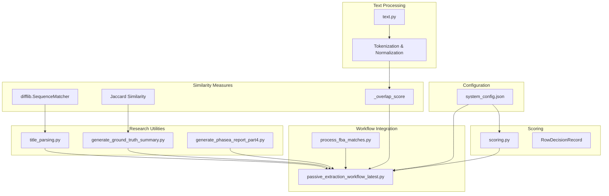
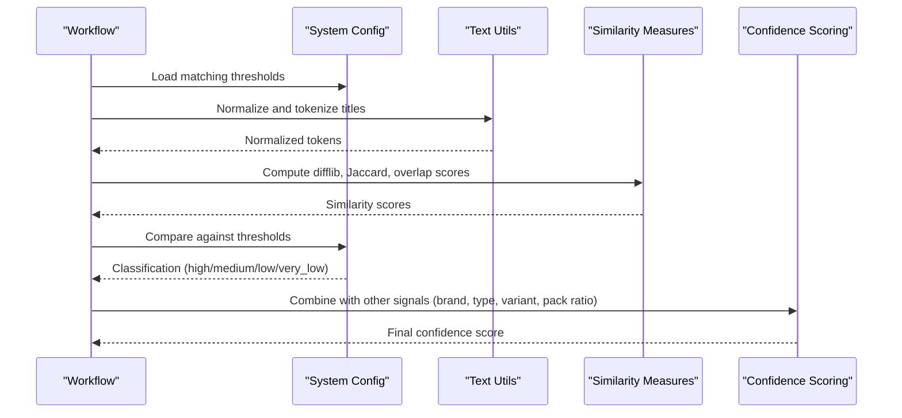
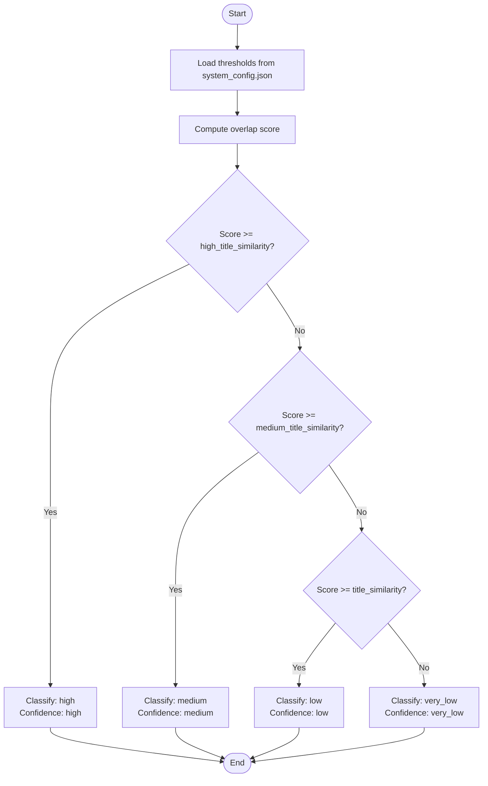
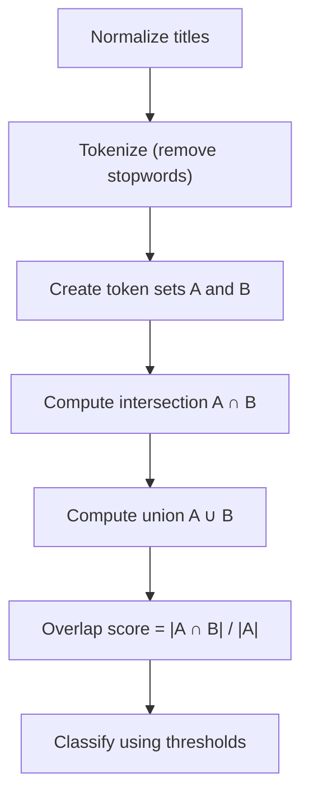
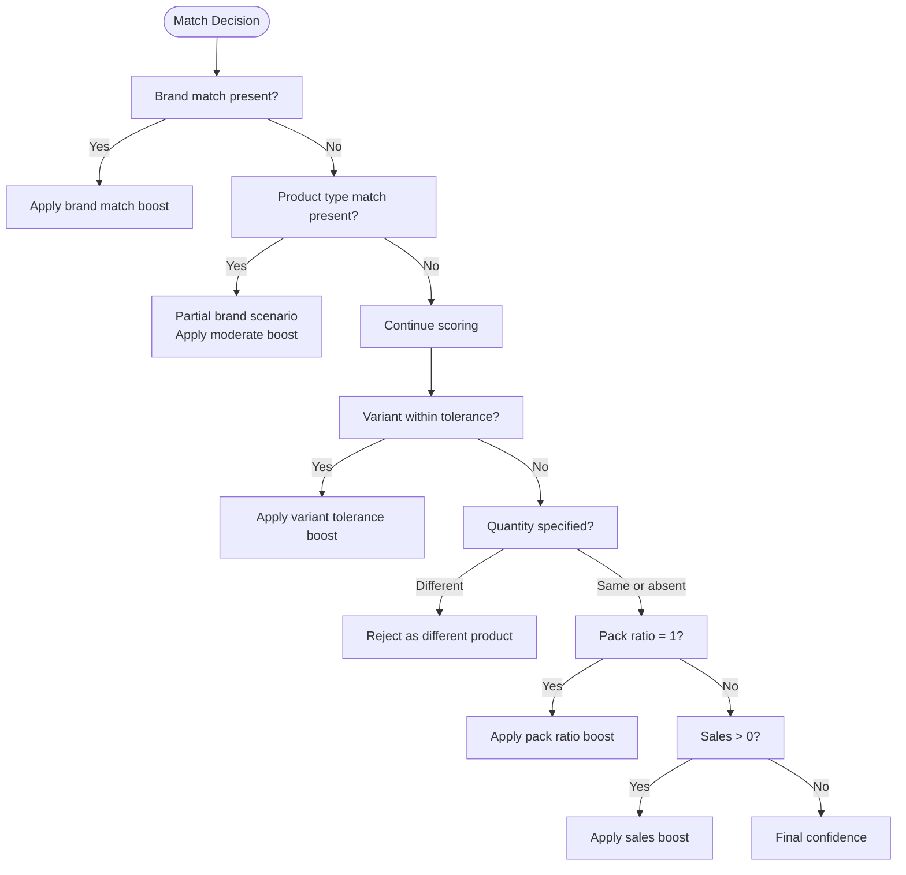
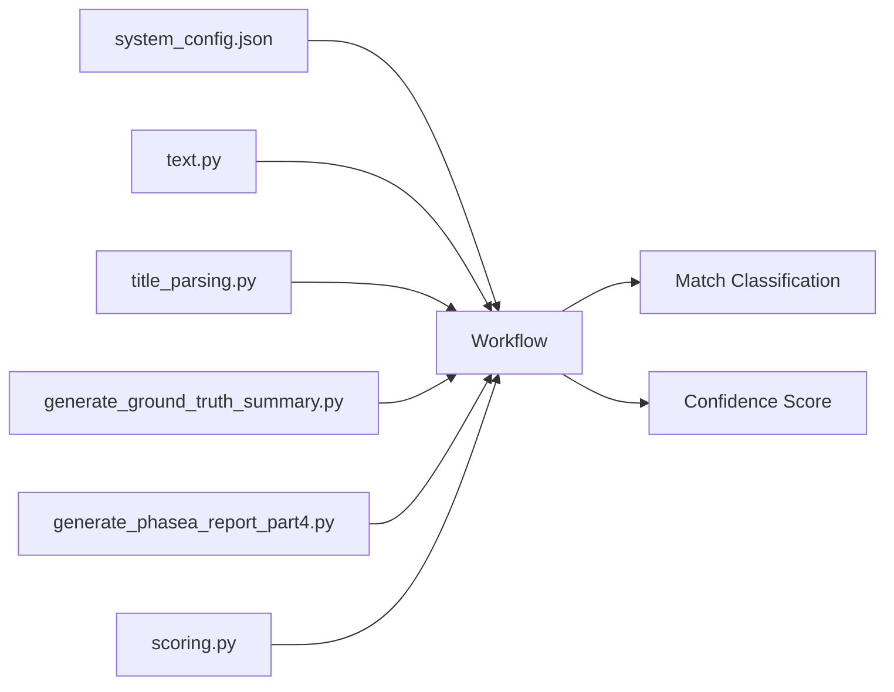

# Title Similarity Validation

<cite>
**Referenced Files in This Document**
- [system_config.json](file://config/system_config.json)
- [text.py](file://src/fba_agent/text.py)
- [scoring.py](file://src/fba_agent/scoring.py)
- [title_parsing.py](file://opus_agent/src/fba_agent/tools/title_parsing.py)
- [passive_extraction_workflow_latest.py](file://tools/passive_extraction_workflow_latest.py)
- [process_fba_matches.py](file://process_fba_matches.py)
- [generate_phasea_report_part4.py](file://RESERACH/REPORT/part_4_jan/codex_1/generate_phasea_report_part4.py)
- [generate_ground_truth_summary.py](file://RESERACH/REPORT/part_30_dec/generate_ground_truth_summary.py)
</cite>

## Table of Contents
1. [Introduction](#introduction)
2. [Project Structure](#project-structure)
3. [Core Components](#core-components)
4. [Architecture Overview](#architecture-overview)
5. [Detailed Component Analysis](#detailed-component-analysis)
6. [Dependency Analysis](#dependency-analysis)
7. [Performance Considerations](#performance-considerations)
8. [Troubleshooting Guide](#troubleshooting-guide)
9. [Conclusion](#conclusion)

## Introduction
This document explains the title similarity validation system used to match supplier product titles with Amazon listings. The system combines multiple similarity measures and confidence thresholds to classify matches as high, medium, low, or very low quality. It leverages difflib-based sequence matching, word overlap scoring, and configurable thresholds defined in the system configuration. The documentation covers preprocessing steps, scoring algorithms, threshold-based classification, and handling of edge cases such as product variations, brand differences, and model numbers.

## Project Structure
The title similarity validation spans several modules:
- Configuration defines matching thresholds and system-wide behavior
- Text utilities provide normalization and tokenization
- Scoring computes confidence scores combining multiple signals
- Title parsing utilities offer difflib-based similarity
- Workflow orchestration integrates similarity checks into the matching pipeline
- Research scripts demonstrate tokenization and overlap strategies

**Diagram sources**
- [system_config.json](file://config/system_config.json#L145-L149)
- [text.py](file://src/fba_agent/text.py#L19-L37)
- [scoring.py](file://src/fba_agent/scoring.py#L7-L58)
- [title_parsing.py](file://opus_agent/src/fba_agent/tools/title_parsing.py#L301-L317)
- [passive_extraction_workflow_latest.py](file://tools/passive_extraction_workflow_latest.py#L757-L786)
- [process_fba_matches.py](file://process_fba_matches.py#L43-L90)
- [generate_ground_truth_summary.py](file://RESERACH/REPORT/part_30_dec/generate_ground_truth_summary.py#L339-L389)
- [generate_phasea_report_part4.py](file://RESERACH/REPORT/part_4_jan/codex_1/generate_phasea_report_part4.py#L205-L244)

**Section sources**
- [system_config.json](file://config/system_config.json#L145-L149)
- [text.py](file://src/fba_agent/text.py#L19-L37)
- [scoring.py](file://src/fba_agent/scoring.py#L7-L58)
- [title_parsing.py](file://opus_agent/src/fba_agent/tools/title_parsing.py#L301-L317)
- [passive_extraction_workflow_latest.py](file://tools/passive_extraction_workflow_latest.py#L757-L786)
- [process_fba_matches.py](file://process_fba_matches.py#L43-L90)
- [generate_ground_truth_summary.py](file://RESERACH/REPORT/part_30_dec/generate_ground_truth_summary.py#L339-L389)
- [generate_phasea_report_part4.py](file://RESERACH/REPORT/part_4_jan/codex_1/generate_phasea_report_part4.py#L205-L244)

## Core Components
- Threshold-based similarity classification: The system uses three thresholds to categorize matches as high, medium, low, or very low based on the computed similarity score.
- Preprocessing pipeline: Titles are normalized and tokenized to remove noise and focus on meaningful terms.
- Similarity measures:
  - difflib-based sequence matching for broad textual similarity
  - Jaccard similarity for token overlap
  - Overlap score for focused term matching
- Confidence computation: Additional signals (brand match, product type match, variant tolerance, pack ratio, sales presence, EAN quality) are combined to produce a final confidence score.

**Section sources**
- [system_config.json](file://config/system_config.json#L145-L149)
- [text.py](file://src/fba_agent/text.py#L19-L37)
- [scoring.py](file://src/fba_agent/scoring.py#L7-L58)
- [title_parsing.py](file://opus_agent/src/fba_agent/tools/title_parsing.py#L301-L317)
- [generate_ground_truth_summary.py](file://RESERACH/REPORT/part_30_dec/generate_ground_truth_summary.py#L339-L389)
- [generate_phasea_report_part4.py](file://RESERACH/REPORT/part_4_jan/codex_1/generate_phasea_report_part4.py#L205-L244)

## Architecture Overview
The title similarity validation sits within the broader matching workflow. It receives supplier and Amazon product titles, applies normalization and tokenization, computes similarity scores using multiple algorithms, and classifies matches according to configurable thresholds. The resulting classification influences downstream decisions such as confidence assignment and match quality buckets.

**Diagram sources**
- [system_config.json](file://config/system_config.json#L145-L149)
- [text.py](file://src/fba_agent/text.py#L19-L37)
- [title_parsing.py](file://opus_agent/src/fba_agent/tools/title_parsing.py#L301-L317)
- [generate_ground_truth_summary.py](file://RESERACH/REPORT/part_30_dec/generate_ground_truth_summary.py#L339-L389)
- [scoring.py](file://src/fba_agent/scoring.py#L7-L58)

## Detailed Component Analysis

### Threshold-based Similarity Classification
The system classifies matches using three thresholds defined in the configuration:
- title_similarity: lower bound for low-quality matches
- medium_title_similarity: lower bound for medium-quality matches
- high_title_similarity: lower bound for high-quality matches

The classification proceeds as follows:
- If overlap score >= high_title_similarity → high match with high confidence
- Else if overlap score >= medium_title_similarity → medium match with medium confidence
- Else if overlap score >= title_similarity → low match with low confidence
- Else → very low match with minimal confidence

**Diagram sources**
- [system_config.json](file://config/system_config.json#L145-L149)
- [passive_extraction_workflow_latest.py](file://tools/passive_extraction_workflow_latest.py#L757-L786)

**Section sources**
- [system_config.json](file://config/system_config.json#L145-L149)
- [passive_extraction_workflow_latest.py](file://tools/passive_extraction_workflow_latest.py#L757-L786)

### Word Overlap Scoring Algorithm
The word overlap score focuses on shared terms between normalized titles:
- Normalize titles: convert to uppercase, replace non-alphanumeric with spaces, collapse whitespace, strip
- Tokenize: split by space, filter stopwords
- Compute overlap: intersection of token sets divided by size of first token set

**Diagram sources**
- [text.py](file://src/fba_agent/text.py#L19-L37)
- [generate_phasea_report_part4.py](file://RESERACH/REPORT/part_4_jan/codex_1/generate_phasea_report_part4.py#L205-L244)

**Section sources**
- [text.py](file://src/fba_agent/text.py#L19-L37)
- [generate_phasea_report_part4.py](file://RESERACH/REPORT/part_4_jan/codex_1/generate_phasea_report_part4.py#L205-L244)

### Title Preprocessing Steps
Preprocessing ensures consistent comparisons:
- Sanitization: replace tabs, pipes, and line breaks with spaces
- Uppercase conversion: normalize case
- Non-alphanumeric replacement: convert punctuation to spaces
- Whitespace normalization: collapse multiple spaces
- Stopword removal: exclude common words that do not contribute meaning

These steps are applied uniformly to supplier and Amazon titles before computing similarity.

**Section sources**
- [text.py](file://src/fba_agent/text.py#L12-L29)

### Handling Edge Cases
The system accounts for various edge cases:
- Product variations: Differences in color, size, or quantity are penalized to avoid false positives
- Brand differences: Full brand matches receive stronger boosts; partial matches inferred from product-type-only scenarios receive moderate boosts
- Model numbers and SKU identifiers: While not explicitly tokenized, normalization and overlap scoring help surface meaningful shared tokens; research scripts show strategies for filtering measurement units and pack words

**Diagram sources**
- [scoring.py](file://src/fba_agent/scoring.py#L22-L37)
- [process_fba_matches.py](file://process_fba_matches.py#L43-L90)

**Section sources**
- [scoring.py](file://src/fba_agent/scoring.py#L22-L37)
- [process_fba_matches.py](file://process_fba_matches.py#L43-L90)

### Alternative Similarity Measures
Two complementary similarity measures are available:
- difflib.SequenceMatcher: Computes a normalized similarity ratio between two strings after lowercasing
- Jaccard similarity: Ratio of intersection over union of token sets

These measures support robust matching across diverse title formats.

**Section sources**
- [title_parsing.py](file://opus_agent/src/fba_agent/tools/title_parsing.py#L301-L317)
- [generate_ground_truth_summary.py](file://RESERACH/REPORT/part_30_dec/generate_ground_truth_summary.py#L339-L389)

### Concrete Examples and Decision-Making
Below are representative examples illustrating how similarity scores translate to match quality and confidence:

- Example A: High similarity
  - Supplier title: "Wireless Bluetooth Headphones"
  - Amazon title: "Wireless Bluetooth Headphones Black"
  - Similarity score: high_title_similarity threshold reached
  - Classification: high
  - Confidence: high

- Example B: Medium similarity
  - Supplier title: "Kitchen Knife Set 12 Pieces"
  - Amazon title: "Chef Knife Set 12pc Stainless Steel"
  - Similarity score: medium_title_similarity threshold reached
  - Classification: medium
  - Confidence: medium

- Example C: Low similarity
  - Supplier title: "Desk Lamp LED"
  - Amazon title: "Bedside Table White"
  - Similarity score: below medium threshold but above low threshold
  - Classification: low
  - Confidence: low

- Example D: Very low similarity
  - Supplier title: "Hair Dryer"
  - Amazon title: "Running Shoes"
  - Similarity score: below low threshold
  - Classification: very_low
  - Confidence: very_low

When multiple similar titles are found, the system selects the highest-scoring candidate and applies the associated confidence classification. Additional signals (brand, product type, variant, pack ratio, sales) further refine the final confidence score.

**Section sources**
- [system_config.json](file://config/system_config.json#L145-L149)
- [passive_extraction_workflow_latest.py](file://tools/passive_extraction_workflow_latest.py#L757-L786)
- [scoring.py](file://src/fba_agent/scoring.py#L7-L58)

## Dependency Analysis
The title similarity validation depends on configuration thresholds, text processing utilities, and scoring logic. The workflow orchestrates these components to produce a final classification and confidence.

**Diagram sources**
- [system_config.json](file://config/system_config.json#L145-L149)
- [text.py](file://src/fba_agent/text.py#L19-L37)
- [title_parsing.py](file://opus_agent/src/fba_agent/tools/title_parsing.py#L301-L317)
- [generate_ground_truth_summary.py](file://RESERACH/REPORT/part_30_dec/generate_ground_truth_summary.py#L339-L389)
- [generate_phasea_report_part4.py](file://RESERACH/REPORT/part_4_jan/codex_1/generate_phasea_report_part4.py#L205-L244)
- [scoring.py](file://src/fba_agent/scoring.py#L7-L58)

**Section sources**
- [system_config.json](file://config/system_config.json#L145-L149)
- [text.py](file://src/fba_agent/text.py#L19-L37)
- [title_parsing.py](file://opus_agent/src/fba_agent/tools/title_parsing.py#L301-L317)
- [generate_ground_truth_summary.py](file://RESERACH/REPORT/part_30_dec/generate_ground_truth_summary.py#L339-L389)
- [generate_phasea_report_part4.py](file://RESERACH/REPORT/part_4_jan/codex_1/generate_phasea_report_part4.py#L205-L244)
- [scoring.py](file://src/fba_agent/scoring.py#L7-L58)

## Performance Considerations
- Preprocessing cost: Normalization and tokenization are lightweight but should be reused across similarity computations to minimize overhead.
- Threshold tuning: Adjusting thresholds impacts precision/recall trade-offs; monitor classification distributions to calibrate thresholds.
- Multi-measure strategy: Using multiple similarity measures (difflib, Jaccard, overlap) improves robustness but increases computational load slightly.
- Early rejection: Reject candidates with obvious mismatches (e.g., different quantities or sizes) early to reduce downstream processing.

## Troubleshooting Guide
- Misclassification due to noise: Ensure preprocessing removes punctuation and normalizes case consistently for both titles.
- Overly strict thresholds: If few matches are found, consider lowering thresholds moderately while monitoring false positives.
- Inconsistent brand handling: Verify brand detection logic and whether partial brand signals are enabled; adjust scoring weights accordingly.
- Token filtering: Confirm that stopwords and measurement units are filtered appropriately to avoid inflated overlap scores.

## Conclusion
The title similarity validation system combines configurable thresholds, robust preprocessing, and multiple similarity measures to reliably match supplier and Amazon product titles. By integrating additional signals (brand, product type, variant, pack ratio, sales), the system produces nuanced confidence assessments suitable for downstream decision-making. Proper tuning of thresholds and careful handling of edge cases ensure high-quality matches across diverse product categories.