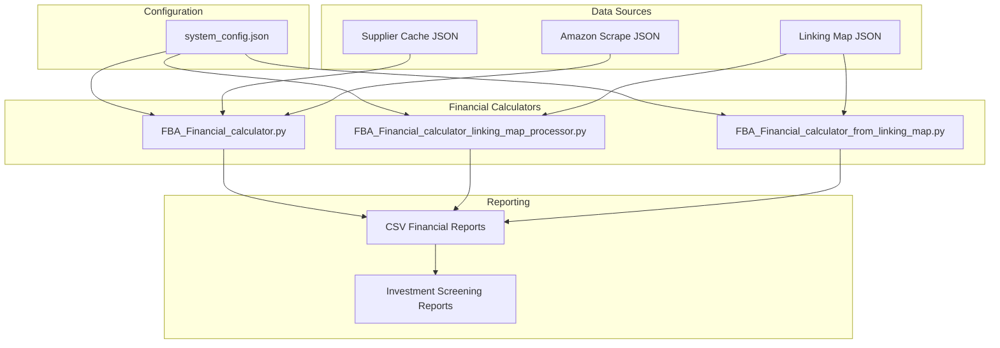
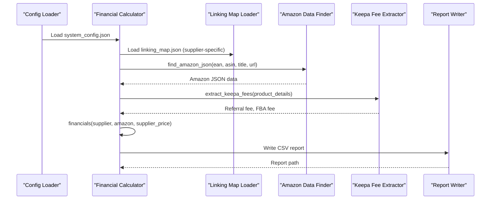
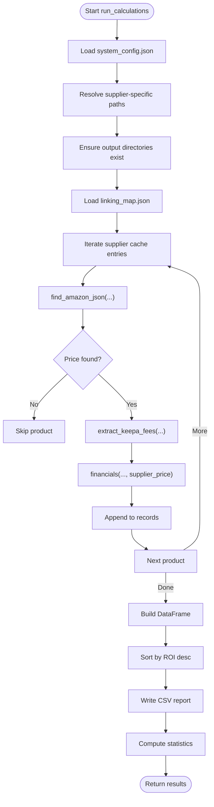
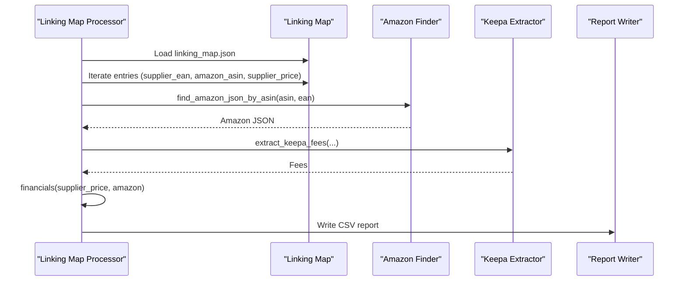
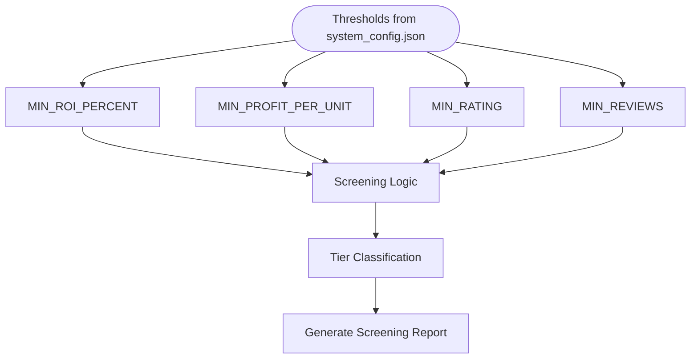
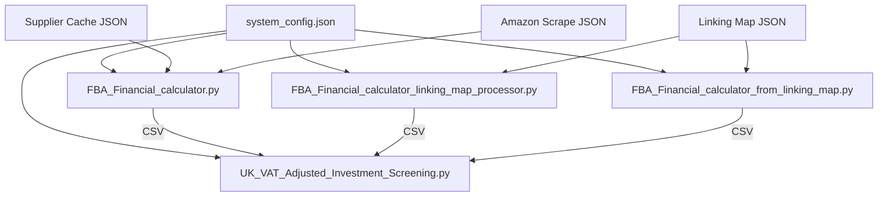

# Financial Analysis Integration

<cite>
**Referenced Files in This Document**
- [FBA_Financial_calculator.py](file://tools/FBA_Financial_calculator.py)
- [FBA_Financial_calculator_from_linking_map.py](file://tools/FBA_Financial_calculator_from_linking_map.py)
- [FBA_Financial_calculator_linking_map_processor.py](file://tools/FBA_Financial_calculator_linking_map_processor.py)
- [merge_linking_map.py](file://tools/merge_linking_map.py)
- [system_config.json](file://config/system_config.json)
- [UK_VAT_Adjusted_Investment_Screening.py](file://OUTPUTS/FBA_ANALYSIS/financial_reports/UK_VAT_Adjusted_Investment_Screening.py)
- [FBA_PROFITABILITY_ANALYSIS_REPORT.md](file://OUTPUTS/FBA_ANALYSIS/financial_reports/FBA_PROFITABILITY_ANALYSIS_REPORT.md)
- [linking_map.json](file://OUTPUTS/FBA_ANALYSIS/linking_maps/angelwholesale.co.uk/linking_map.json)
</cite>

## Table of Contents
1. [Introduction](#introduction)
2. [Project Structure](#project-structure)
3. [Core Components](#core-components)
4. [Architecture Overview](#architecture-overview)
5. [Detailed Component Analysis](#detailed-component-analysis)
6. [Dependency Analysis](#dependency-analysis)
7. [Performance Considerations](#performance-considerations)
8. [Troubleshooting Guide](#troubleshooting-guide)
9. [Conclusion](#conclusion)

## Introduction
This document explains the financial analysis integration subsystem that powers ROI calculation, net profit analysis, and investment screening for Amazon FBA products. It documents how the system integrates with FBA_Financial_calculator to compute financial metrics, validates profitability against configurable thresholds, and generates actionable reports. It also covers the linking map integration for supplier-to-Amazon association, the final reporting mechanisms, and practical guidance for common issues such as fee calculation accuracy, currency handling, and performance optimization for large datasets.

## Project Structure
The financial analysis subsystem comprises:
- Financial calculators that read supplier caches and Amazon scrape data, compute financial metrics, and produce CSV reports.
- Linking map processors that leverage supplier-to-Amazon associations to generate complete financial reports even when supplier cache entries are outdated.
- An investment screening module that applies UK VAT-aware thresholds to classify products into actionable tiers.
- Configuration-driven parameters that define profitability criteria and operational behavior.

**Diagram sources**
- [FBA_Financial_calculator.py](file://tools/FBA_Financial_calculator.py#L1-L712)
- [FBA_Financial_calculator_linking_map_processor.py](file://tools/FBA_Financial_calculator_linking_map_processor.py#L1-L429)
- [FBA_Financial_calculator_from_linking_map.py](file://tools/FBA_Financial_calculator_from_linking_map.py#L1-L408)
- [system_config.json](file://config/system_config.json#L208-L246)

**Section sources**
- [FBA_Financial_calculator.py](file://tools/FBA_Financial_calculator.py#L1-L712)
- [FBA_Financial_calculator_linking_map_processor.py](file://tools/FBA_Financial_calculator_linking_map_processor.py#L1-L429)
- [FBA_Financial_calculator_from_linking_map.py](file://tools/FBA_Financial_calculator_from_linking_map.py#L1-L408)
- [system_config.json](file://config/system_config.json#L208-L246)

## Core Components
- Financial calculator core: Loads system configuration, resolves supplier-specific paths, loads linking maps, finds Amazon data by EAN/URL/ASIN, extracts fees from Keepa data, computes net proceeds, net profit, ROI, breakeven, and profit margin, and writes CSV reports.
- Linking map processors: Alternative workflows that use the linking map as the primary data source to ensure all entries are processed, including those no longer present in the current supplier cache.
- Investment screening: Applies UK VAT-aware thresholds to classify products into tiers and generates summary reports.

Key configuration parameters:
- MIN_ROI_PERCENT: Minimum acceptable ROI percentage for screening.
- MIN_PROFIT_PER_UNIT: Minimum net profit per unit threshold.
- MIN_RATING and MIN_REVIEWS: Minimum rating and minimum number of reviews thresholds.
- Currency and VAT: Defined in configuration for consistent calculations.

**Section sources**
- [FBA_Financial_calculator.py](file://tools/FBA_Financial_calculator.py#L44-L712)
- [FBA_Financial_calculator_linking_map_processor.py](file://tools/FBA_Financial_calculator_linking_map_processor.py#L30-L429)
- [FBA_Financial_calculator_from_linking_map.py](file://tools/FBA_Financial_calculator_from_linking_map.py#L29-L408)
- [system_config.json](file://config/system_config.json#L208-L246)

## Architecture Overview
The financial analysis pipeline integrates supplier data, Amazon scrape data, and linking maps to compute profitability metrics and generate reports. It supports multiple execution modes:
- Supplier cache-driven: Uses supplier cache entries and links to Amazon via EAN/URL/ASIN.
- Linking map-driven: Uses linking map entries directly to compute financials for all matched products.

**Diagram sources**
- [FBA_Financial_calculator.py](file://tools/FBA_Financial_calculator.py#L44-L712)
- [system_config.json](file://config/system_config.json#L208-L246)

## Detailed Component Analysis

### Financial Calculator Core
The core financial calculator:
- Loads system configuration for VAT rate, supplier price inclusion, referral fee rate, fulfillment fee, and prep house fee.
- Resolves supplier-specific paths and ensures output directories exist.
- Loads linking maps (supplier-specific or generic) and falls back to legacy files if needed.
- Finds Amazon data using linking map, ASIN, or filename patterns.
- Extracts Keepa fees and computes net proceeds, net profit, ROI, breakeven, and profit margin.
- Generates CSV reports sorted by ROI and calculates profitability statistics.

**Diagram sources**
- [FBA_Financial_calculator.py](file://tools/FBA_Financial_calculator.py#L472-L712)

**Section sources**
- [FBA_Financial_calculator.py](file://tools/FBA_Financial_calculator.py#L44-L712)

### Linking Map Integration
Two linking map-driven calculators complement the supplier-cache-driven approach:
- Linking map processor: Processes linking map entries directly, extracting supplier data from the map itself and computing financials.
- Linking map generator: Uses linking map as the primary source to produce complete financial reports.

**Diagram sources**
- [FBA_Financial_calculator_linking_map_processor.py](file://tools/FBA_Financial_calculator_linking_map_processor.py#L227-L429)
- [FBA_Financial_calculator_from_linking_map.py](file://tools/FBA_Financial_calculator_from_linking_map.py#L219-L408)

**Section sources**
- [FBA_Financial_calculator_linking_map_processor.py](file://tools/FBA_Financial_calculator_linking_map_processor.py#L227-L429)
- [FBA_Financial_calculator_from_linking_map.py](file://tools/FBA_Financial_calculator_from_linking_map.py#L219-L408)

### Profitability Criteria and Validation
Profitability thresholds are configured centrally and applied during report generation:
- MIN_ROI_PERCENT: Applied to sort and categorize products.
- MIN_PROFIT_PER_UNIT: Used by downstream screening logic.
- MIN_RATING and MIN_REVIEWS: Used by screening logic to filter products.

**Diagram sources**
- [system_config.json](file://config/system_config.json#L208-L232)
- [UK_VAT_Adjusted_Investment_Screening.py](file://OUTPUTS/FBA_ANALYSIS/financial_reports/UK_VAT_Adjusted_Investment_Screening.py#L26-L59)

**Section sources**
- [system_config.json](file://config/system_config.json#L208-L232)
- [UK_VAT_Adjusted_Investment_Screening.py](file://OUTPUTS/FBA_ANALYSIS/financial_reports/UK_VAT_Adjusted_Investment_Screening.py#L26-L59)

### Report Generation and Examples
- CSV reports: Generated per supplier with financial metrics, sorted by ROI, and include statistics such as profitable/marginal/unprofitable counts and top items.
- Screening reports: Four-tier classification with rationale and summaries.
- Example report metadata: See the profitability analysis report metadata for structured output details.

Concrete examples (paths):
- CSV financial report: [fba_financial_report_...csv](file://OUTPUTS/FBA_ANALYSIS/financial_reports/efghousewares-co-uk/fba_financial_report_ALL_linking_map_20260108_005639.csv)
- Screening summary: [UK_VAT_Adjusted_Screening_SUMMARY_...txt](file://OUTPUTS/FBA_ANALYSIS/financial_reports/UK_VAT_Adjusted_Investment_Screening_SUMMARY_20250902_064513.txt)
- Report metadata: [FBA_PROFITABILITY_ANALYSIS_REPORT.md](file://OUTPUTS/FBA_ANALYSIS/financial_reports/FBA_PROFITABILITY_ANALYSIS_REPORT.md)

**Section sources**
- [FBA_Financial_calculator.py](file://tools/FBA_Financial_calculator.py#L622-L664)
- [UK_VAT_Adjusted_Investment_Screening.py](file://OUTPUTS/FBA_ANALYSIS/financial_reports/UK_VAT_Adjusted_Investment_Screening.py#L540-L608)
- [FBA_PROFITABILITY_ANALYSIS_REPORT.md](file://OUTPUTS/FBA_ANALYSIS/financial_reports/FBA_PROFITABILITY_ANALYSIS_REPORT.md#L1-L103)

## Dependency Analysis
The financial analysis subsystem depends on:
- Configuration: Centralized parameters for VAT, fees, and screening thresholds.
- Data sources: Supplier cache JSON, Amazon scrape JSON, and linking map JSON.
- Reporting: CSV outputs and screening summaries.

**Diagram sources**
- [system_config.json](file://config/system_config.json#L208-L246)
- [FBA_Financial_calculator.py](file://tools/FBA_Financial_calculator.py#L44-L712)
- [FBA_Financial_calculator_linking_map_processor.py](file://tools/FBA_Financial_calculator_linking_map_processor.py#L30-L429)
- [FBA_Financial_calculator_from_linking_map.py](file://tools/FBA_Financial_calculator_from_linking_map.py#L29-L408)
- [UK_VAT_Adjusted_Investment_Screening.py](file://OUTPUTS/FBA_ANALYSIS/financial_reports/UK_VAT_Adjusted_Investment_Screening.py#L26-L59)

**Section sources**
- [system_config.json](file://config/system_config.json#L208-L246)
- [FBA_Financial_calculator.py](file://tools/FBA_Financial_calculator.py#L44-L712)
- [FBA_Financial_calculator_linking_map_processor.py](file://tools/FBA_Financial_calculator_linking_map_processor.py#L30-L429)
- [FBA_Financial_calculator_from_linking_map.py](file://tools/FBA_Financial_calculator_from_linking_map.py#L29-L408)
- [UK_VAT_Adjusted_Investment_Screening.py](file://OUTPUTS/FBA_ANALYSIS/financial_reports/UK_VAT_Adjusted_Investment_Screening.py#L26-L59)

## Performance Considerations
- Batch sizes: Financial report batch size and linking map batch size are configurable to balance throughput and resource usage.
- Data locality: Prefer linking map-driven processing to avoid repeated supplier cache lookups and to process all entries efficiently.
- Price extraction robustness: The calculators attempt multiple price fields and log missing data for traceability.
- Sorting and filtering: Sorting by ROI and applying thresholds are efficient operations on pandas DataFrames.

Recommendations:
- Increase batch sizes gradually and monitor memory usage.
- Pre-validate linking map completeness to reduce retries and missing matches.
- Use linking map-driven workflows for large-scale runs to ensure coverage of all entries.

**Section sources**
- [system_config.json](file://config/system_config.json#L29-L30)
- [FBA_Financial_calculator.py](file://tools/FBA_Financial_calculator.py#L528-L664)
- [FBA_Financial_calculator_linking_map_processor.py](file://tools/FBA_Financial_calculator_linking_map_processor.py#L262-L382)

## Troubleshooting Guide
Common issues and resolutions:
- Missing Amazon data: The calculators log warnings when no price is found or when Amazon data cannot be located. Verify linking map entries and Amazon scrape directory contents.
- Fee calculation accuracy: Ensure Keepa product details are present and correctly parsed; fallback rates are applied when Keepa data is unavailable.
- Currency and VAT: Confirm currency and VAT rate in configuration align with the marketplace and supplier pricing model.
- Large dataset performance: Increase batch sizes and enable linking map-driven processing to improve throughput.

Validation steps:
- Inspect CSV reports for missing price entries and ROI statistics.
- Review linking map completeness and reconcile gaps using the merging utility.
- Re-run with verbose logging to identify parsing or file path issues.

**Section sources**
- [FBA_Financial_calculator.py](file://tools/FBA_Financial_calculator.py#L574-L621)
- [FBA_Financial_calculator_linking_map_processor.py](file://tools/FBA_Financial_calculator_linking_map_processor.py#L316-L352)
- [merge_linking_map.py](file://tools/merge_linking_map.py#L1-L78)

## Conclusion
The financial analysis integration subsystem provides robust, configurable ROI and net profit computation, integrates supplier and Amazon data via linking maps, and delivers actionable screening reports. By leveraging configuration-driven thresholds and linking map-driven workflows, it scales effectively for large datasets while maintaining accuracy and transparency through detailed reporting.