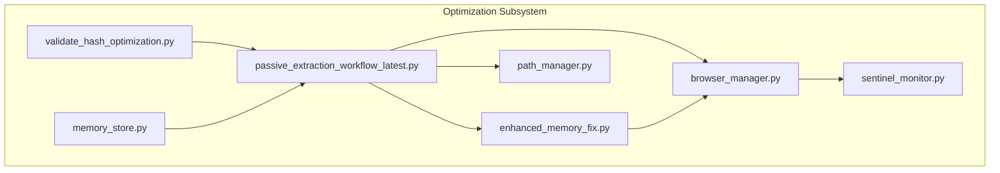
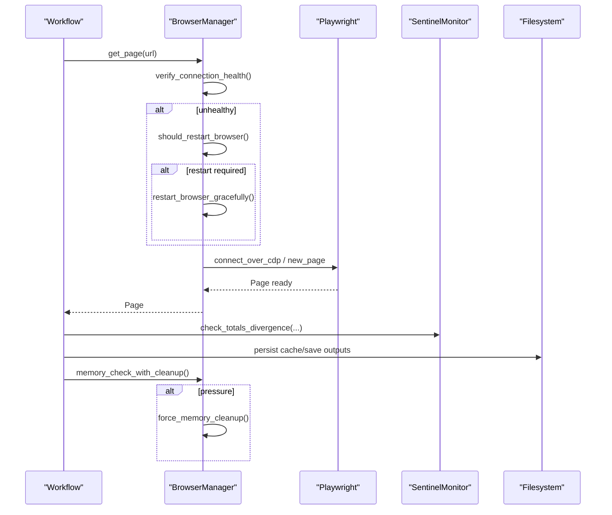
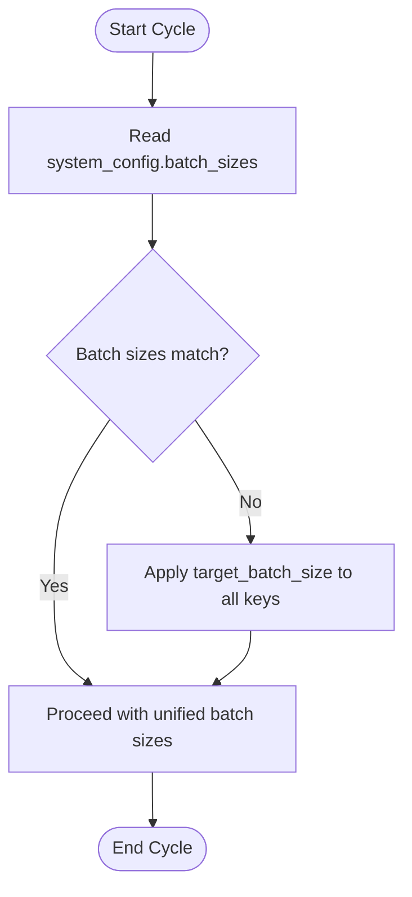
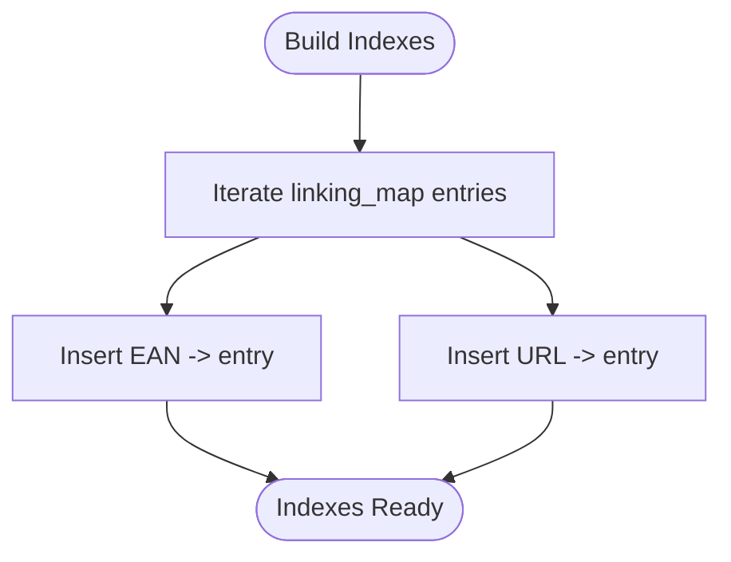
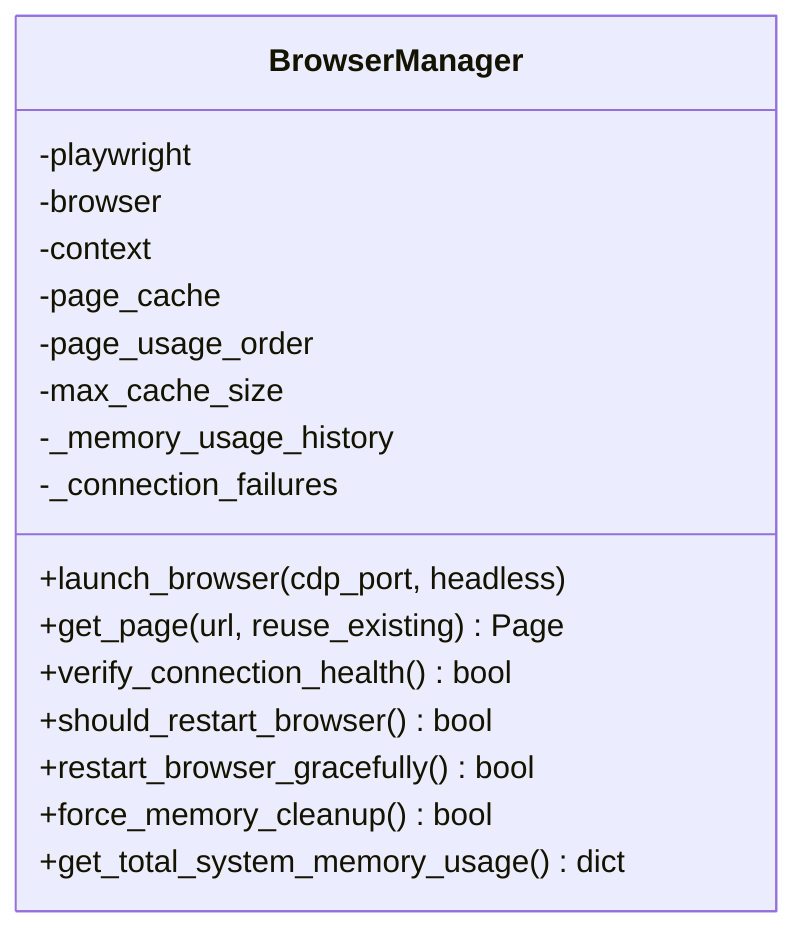
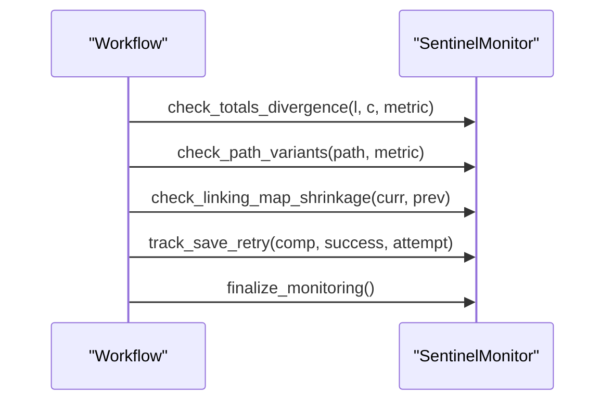
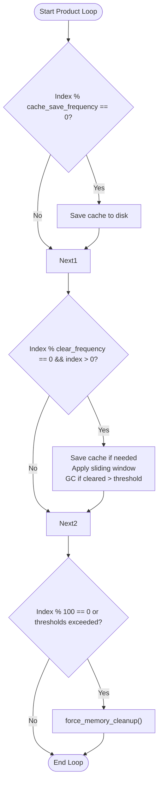
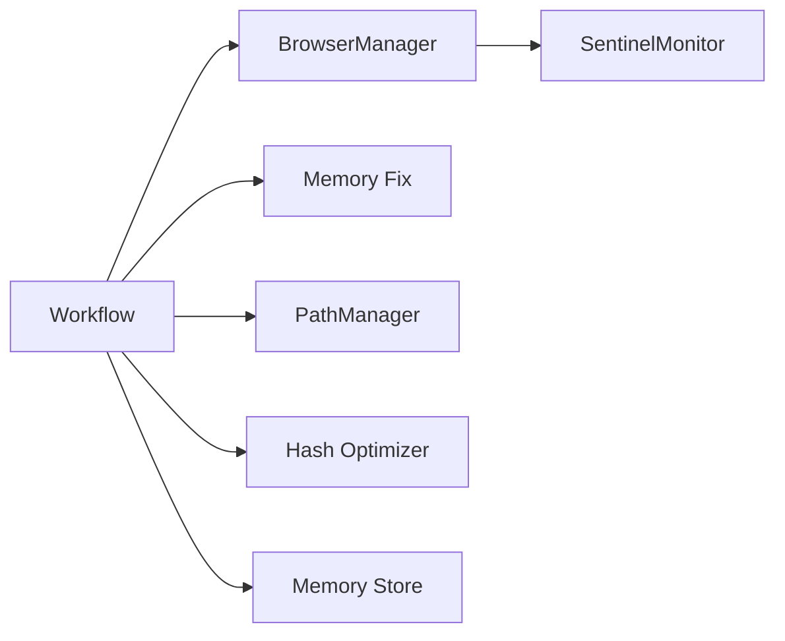
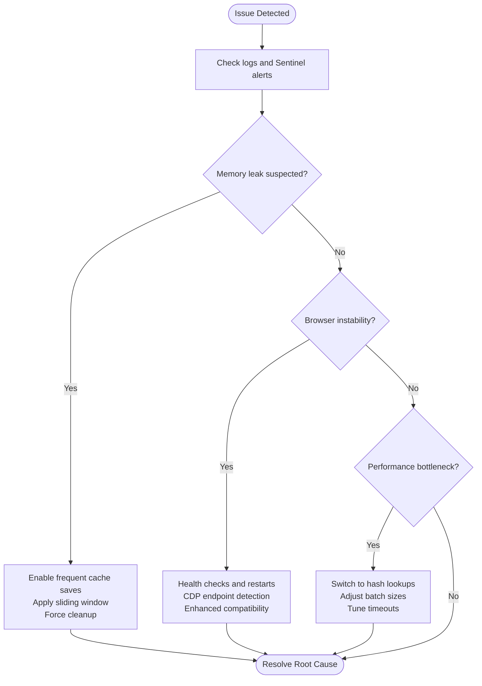

# Memory and Performance Optimization

<cite>
**Referenced Files in This Document**
- [memory_store.py](file://src/fba_agent/memory_store.py)
- [sentinel_monitor.py](file://utils/sentinel_monitor.py)
- [browser_manager.py](file://utils/browser_manager.py)
- [enhanced_memory_fix.py](file://enhanced_memory_fix.py)
- [validate_hash_optimization.py](file://validate_hash_optimization.py)
- [path_manager.py](file://utils/path_manager.py)
- [passive_extraction_workflow_latest.py](file://tools/passive_extraction_workflow_latest.py)
- [Memory Leak Detection.md](file://WIKI REPO SEPT17/11. Troubleshooting Guide/11.2. Memory Management Issues/11.2.1. Memory Leak Detection.md)
- [MEMORY_MANAGEMENT_ANALYSIS.md](file://MEMORY_MANAGEMENT_ANALYSIS.md)
- [Product Scraping.md](file://wiki repo 19 nov/Core Architecture/Supplier Scraper/Product Scraping.md)
</cite>

## Table of Contents
1. [Introduction](#introduction)
2. [Project Structure](#project-structure)
3. [Core Components](#core-components)
4. [Architecture Overview](#architecture-overview)
5. [Detailed Component Analysis](#detailed-component-analysis)
6. [Dependency Analysis](#dependency-analysis)
7. [Performance Considerations](#performance-considerations)
8. [Troubleshooting Guide](#troubleshooting-guide)
9. [Conclusion](#conclusion)

## Introduction
This document explains the memory and performance optimization subsystem used during large-scale supplier scraping and Amazon FBA data extraction. It covers:
- Batched processing model driven by supplier_extraction_batch_size and related cycle sizes
- Hash lookup optimization for O(1) performance
- Browser resource management via a singleton BrowserManager with LRU page caching and health-aware restarts
- Integration with SentinelMonitor for system health tracking and divergence detection
- Concurrent operation handling, timeout management, and resource cleanup
- Practical examples of memory management during long runs, cache optimization, and efficient browser automation
- Common issues such as memory leaks, browser instability, and performance bottlenecks

## Project Structure
The optimization subsystem spans several modules:
- Memory persistence and calibration: memory_store.py
- Sentinel health monitoring: sentinel_monitor.py
- Browser lifecycle and resource management: browser_manager.py
- Memory management enhancements for large runs: enhanced_memory_fix.py
- Hash optimization validation: validate_hash_optimization.py
- Path management for consistent outputs and caches: path_manager.py
- Batch sizing synchronization across the workflow: passive_extraction_workflow_latest.py
- Operational guidance and diagrams: Memory Leak Detection.md, MEMORY_MANAGEMENT_ANALYSIS.md, Product Scraping.md

**Diagram sources**
- [memory_store.py](file://src/fba_agent/memory_store.py#L1-L265)
- [sentinel_monitor.py](file://utils/sentinel_monitor.py#L1-L201)
- [browser_manager.py](file://utils/browser_manager.py#L1-L1153)
- [enhanced_memory_fix.py](file://enhanced_memory_fix.py#L1-L60)
- [validate_hash_optimization.py](file://validate_hash_optimization.py#L1-L140)
- [path_manager.py](file://utils/path_manager.py#L1-L1)
- [passive_extraction_workflow_latest.py](file://tools/passive_extraction_workflow_latest.py)

**Section sources**
- [memory_store.py](file://src/fba_agent/memory_store.py#L1-L265)
- [sentinel_monitor.py](file://utils/sentinel_monitor.py#L1-L201)
- [browser_manager.py](file://utils/browser_manager.py#L1-L1153)
- [enhanced_memory_fix.py](file://enhanced_memory_fix.py#L1-L60)
- [validate_hash_optimization.py](file://validate_hash_optimization.py#L1-L140)
- [path_manager.py](file://utils/path_manager.py#L1-L1)
- [passive_extraction_workflow_latest.py](file://tools/passive_extraction_workflow_latest.py)

## Core Components
- Batched processing model
  - Centralized batch sizing synchronization across extraction, linking, and reporting cycles
  - Consistent supplier_extraction_batch_size drives throughput and memory cadence
- Hash lookup optimization
  - O(1) indexing for EAN and URL lookups to accelerate deduplication and matching
- Browser resource management
  - Singleton BrowserManager with LRU page caching, health checks, and graceful restarts
  - IPv6/IPv4 CDP endpoint detection and enhanced compatibility modes
- SentinelMonitor integration
  - Runtime divergence checks, path variant tracking, and save retry diagnostics
- Memory management for long runs
  - Periodic cache saves, sliding window retention, and forced cleanup triggers
- Path management
  - Standardized output/cache paths to reduce I/O overhead and improve reliability

**Section sources**
- [passive_extraction_workflow_latest.py](file://tools/passive_extraction_workflow_latest.py)
- [validate_hash_optimization.py](file://validate_hash_optimization.py#L1-L140)
- [browser_manager.py](file://utils/browser_manager.py#L1-L1153)
- [sentinel_monitor.py](file://utils/sentinel_monitor.py#L1-L201)
- [enhanced_memory_fix.py](file://enhanced_memory_fix.py#L1-L60)
- [path_manager.py](file://utils/path_manager.py#L1-L1)

## Architecture Overview
The optimization subsystem orchestrates memory-conscious, browser-efficient, and health-aware scraping:

**Diagram sources**
- [browser_manager.py](file://utils/browser_manager.py#L141-L198)
- [browser_manager.py](file://utils/browser_manager.py#L848-L978)
- [sentinel_monitor.py](file://utils/sentinel_monitor.py#L79-L110)
- [enhanced_memory_fix.py](file://enhanced_memory_fix.py#L940-L978)

## Detailed Component Analysis

### Batched Processing Model
- Purpose: Control throughput and memory footprint by processing work in batches aligned to supplier_extraction_batch_size and related cycle sizes.
- Behavior:
  - Batch sizes are synchronized across extraction, linking, and reporting stages to avoid pipeline stalls and inconsistent memory usage.
  - Updates to supplier_extraction_batch_size propagate to system configuration keys for consistency.
- Impact:
  - Predictable memory cadence enables timely cache saves and cleanup triggers.
  - Reduces context switching overhead and improves throughput stability.

**Diagram sources**
- [passive_extraction_workflow_latest.py](file://tools/passive_extraction_workflow_latest.py)

**Section sources**
- [passive_extraction_workflow_latest.py](file://tools/passive_extraction_workflow_latest.py)

### Hash Lookup Optimization (O(1) Indexing)
- Purpose: Replace linear scans with hash-based lookups for EAN and URL to achieve near-constant time retrieval.
- Implementation highlights:
  - Index building for EAN and URL keys from the linking map
  - Lookup methods for both keys with performance validation
  - Benchmarking against legacy linear search to quantify improvements
- Benefits:
  - Dramatically reduces matching time for large linking maps
  - Enables scalable deduplication and cross-reference operations

**Diagram sources**
- [validate_hash_optimization.py](file://validate_hash_optimization.py#L60-L126)

**Section sources**
- [validate_hash_optimization.py](file://validate_hash_optimization.py#L1-L140)

### Browser Resource Management (Singleton, LRU, Health)
- Singleton BrowserManager centralizes Chrome/Chromium lifecycle:
  - LRU page cache capped to a small number to limit memory growth
  - Health checks, memory pressure detection, and time-based restarts
  - IPv6/IPv4 CDP endpoint detection and enhanced compatibility modes for Chrome 139+
  - Graceful restarts preserve session state without closing the persistent browser
- Timeout management:
  - Configurable page timeouts and slow_mo tuning for stability
  - Circuit breaker around navigation to mitigate transient failures
- Resource cleanup:
  - Explicit page cache eviction and forced cleanup on pressure
  - Global cleanup hook to detach from persistent browser cleanly

**Diagram sources**
- [browser_manager.py](file://utils/browser_manager.py#L35-L1153)

**Section sources**
- [browser_manager.py](file://utils/browser_manager.py#L1-L1153)

### SentinelMonitor Integration
- Tracks:
  - Totals divergence between linking and cache counts
  - Path variants for the same resource across runs
  - Unexpected shrinkage in linking map size
  - Save retry attempts and outcomes
- Provides session summaries and warnings to detect anomalies early.

**Diagram sources**
- [sentinel_monitor.py](file://utils/sentinel_monitor.py#L79-L192)

**Section sources**
- [sentinel_monitor.py](file://utils/sentinel_monitor.py#L1-L201)

### Memory Management for Large Runs
- Strategies:
  - Frequent cache saves at a configurable frequency to persist progress
  - Sliding window retention to cap memory growth by discarding older items
  - Forced garbage collection after significant clearing
  - Periodic memory checks and forced cleanup on pressure thresholds
- Dual-tracking counters to separate progress accounting from memory management triggers.

**Diagram sources**
- [enhanced_memory_fix.py](file://enhanced_memory_fix.py#L16-L60)
- [browser_manager.py](file://utils/browser_manager.py#L940-L978)

**Section sources**
- [enhanced_memory_fix.py](file://enhanced_memory_fix.py#L1-L60)
- [MEMORY_MANAGEMENT_ANALYSIS.md](file://MEMORY_MANAGEMENT_ANALYSIS.md#L45-L55)
- [Product Scraping.md](file://wiki repo 19 nov/Core Architecture/Supplier Scraper/Product Scraping.md#L137-L144)

### Path Management and Output Organization
- Centralized path management ensures consistent output locations for logs, caches, and artifacts.
- Reduces I/O overhead and improves reliability by avoiding hard-coded paths.

**Section sources**
- [path_manager.py](file://utils/path_manager.py#L1-L1)

## Dependency Analysis
Key dependencies and relationships:
- Workflow depends on BrowserManager for page acquisition and on SentinelMonitor for anomaly detection
- Memory management relies on frequent cache writes and sliding windows to bound memory growth
- Hash optimization depends on a properly constructed index to enable O(1) lookups
- PathManager provides deterministic output locations for caches and reports

**Diagram sources**
- [browser_manager.py](file://utils/browser_manager.py#L1-L1153)
- [sentinel_monitor.py](file://utils/sentinel_monitor.py#L1-L201)
- [enhanced_memory_fix.py](file://enhanced_memory_fix.py#L1-L60)
- [validate_hash_optimization.py](file://validate_hash_optimization.py#L1-L140)
- [memory_store.py](file://src/fba_agent/memory_store.py#L1-L265)
- [path_manager.py](file://utils/path_manager.py#L1-L1)

**Section sources**
- [browser_manager.py](file://utils/browser_manager.py#L1-L1153)
- [sentinel_monitor.py](file://utils/sentinel_monitor.py#L1-L201)
- [enhanced_memory_fix.py](file://enhanced_memory_fix.py#L1-L60)
- [validate_hash_optimization.py](file://validate_hash_optimization.py#L1-L140)
- [memory_store.py](file://src/fba_agent/memory_store.py#L1-L265)
- [path_manager.py](file://utils/path_manager.py#L1-L1)

## Performance Considerations
- Batch sizing
  - Align supplier_extraction_batch_size with downstream linking and reporting sizes to avoid backpressure
- Hash indexing
  - Build indexes once per cycle and reuse for lookups to minimize latency
- Browser stability
  - Prefer single-page mode and LRU eviction to reduce memory spikes
  - Use time-based restarts to mitigate long-running instability
- Memory cadence
  - Combine frequent cache saves with sliding windows to cap growth
  - Trigger forced cleanup when thresholds are exceeded

[No sources needed since this section provides general guidance]

## Troubleshooting Guide
Common issues and mitigations:
- Memory leaks during long runs
  - Use periodic cache saves and sliding windows to cap retained data
  - Invoke forced cleanup when memory pressure is detected
  - Validate memory management with the leak detection flowchart
- Browser instability and connection failures
  - Rely on health checks and time-based restarts
  - Use IPv6/IPv4 CDP detection and enhanced compatibility modes
  - Ensure persistent browser remains connected without forcing closure
- Performance bottlenecks
  - Switch to O(1) hash lookups for EAN and URL
  - Tune batch sizes to balance throughput and memory usage
- Sentinel alerts
  - Investigate totals divergence and path variants to identify misconfiguration
  - Review save retry logs to diagnose persistence issues

**Diagram sources**
- [Memory Leak Detection.md](file://WIKI REPO SEPT17/11. Troubleshooting Guide/11.2. Memory Management Issues/11.2.1. Memory Leak Detection.md#L237-L251)
- [browser_manager.py](file://utils/browser_manager.py#L848-L978)
- [validate_hash_optimization.py](file://validate_hash_optimization.py#L1-L140)

**Section sources**
- [Memory Leak Detection.md](file://WIKI REPO SEPT17/11. Troubleshooting Guide/11.2. Memory Management Issues/11.2.1. Memory Leak Detection.md#L227-L253)
- [browser_manager.py](file://utils/browser_manager.py#L848-L978)
- [validate_hash_optimization.py](file://validate_hash_optimization.py#L1-L140)

## Conclusion
The optimization subsystem combines batched processing, O(1) hash lookups, robust browser lifecycle management, and health-aware monitoring to sustain large-scale scraping with predictable memory usage. By synchronizing batch sizes, leveraging hash indexes, and applying disciplined memory and browser cleanup strategies, the system maintains stability and performance across extended runs. SentinelMonitor and path management further strengthen reliability by surfacing anomalies early and ensuring consistent artifact placement.