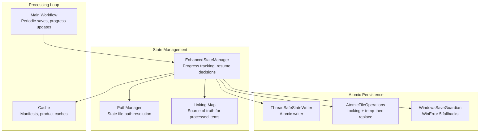
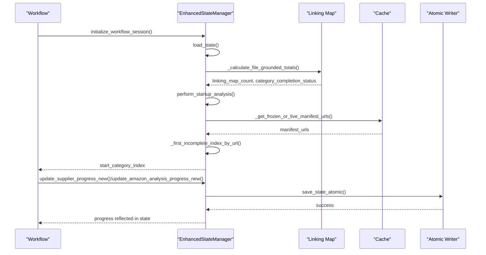
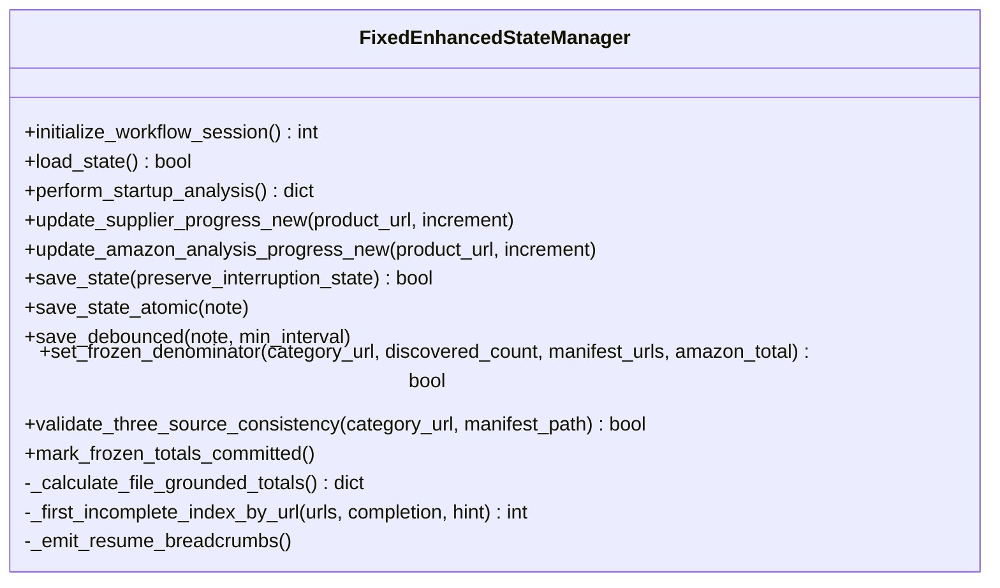
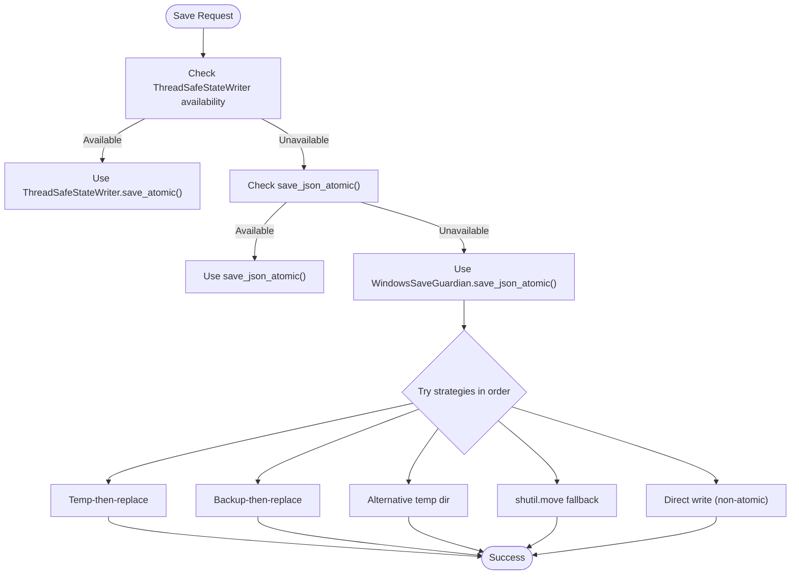
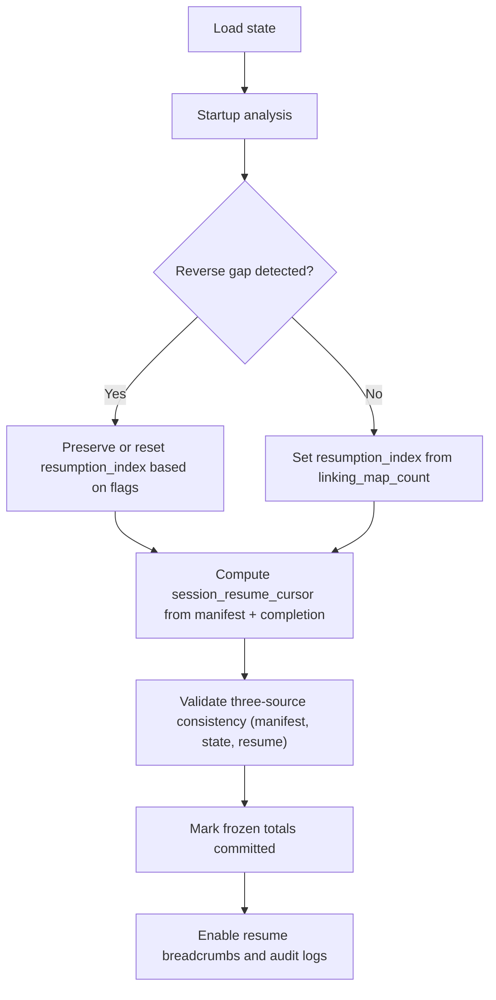
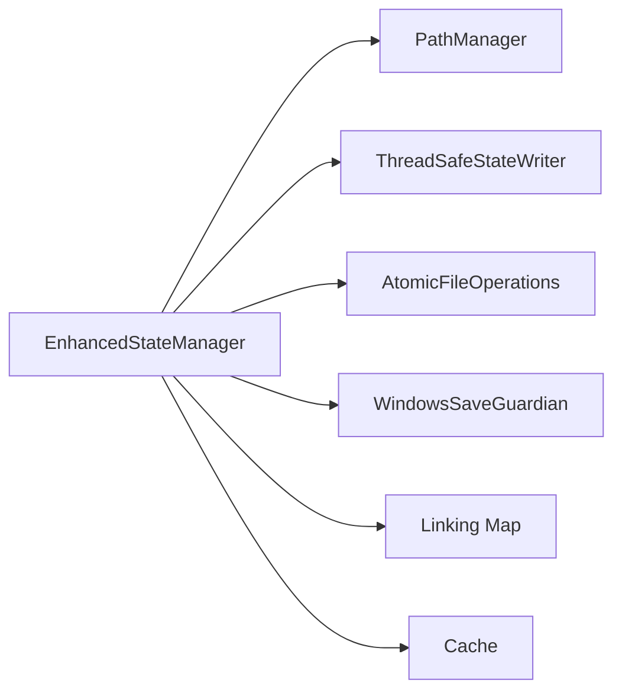

# State Management and Resume

<cite>
**Referenced Files in This Document**
- [fixed_enhanced_state_manager.py](file://utils/fixed_enhanced_state_manager.py)
- [windows_save_guardian.py](file://utils/windows_save_guardian.py)
- [atomic_file_operations.py](file://utils/atomic_file_operations.py)
- [path_manager.py](file://utils/path_manager.py)
- [poundwholesale_co_uk_processing_state.json](file://OUTPUTS/CACHE/poundwholesale_co_uk_processing_state.json)
- [angelwholesale_co_uk_processing_state.json](file://LLM_ANALYSIS_PACKAGE/state_files/angelwholesale_co_uk_processing_state.json)
- [linking_map.json](file://OUTPUTS/FBA_ANALYSIS/linking_maps/angelwholesale.co.uk/linking_map.json)
</cite>

## Table of Contents
1. [Introduction](#introduction)
2. [Project Structure](#project-structure)
3. [Core Components](#core-components)
4. [Architecture Overview](#architecture-overview)
5. [Detailed Component Analysis](#detailed-component-analysis)
6. [Dependency Analysis](#dependency-analysis)
7. [Performance Considerations](#performance-considerations)
8. [Troubleshooting Guide](#troubleshooting-guide)
9. [Conclusion](#conclusion)
10. [Appendices](#appendices)

## Introduction
This document explains the state management and resume capability subsystem that powers reliable long-running workflows. It covers:
- EnhancedStateManager integration for progress tracking and resumption
- Atomic file operations and Windows-safe persistence
- Resume point identification using linking maps and cache
- Linking map persistence and processing state serialization
- Batched saving mechanisms and periodic updates
- Practical examples of resuming after interruptions, recovering from corruption, and maintaining data integrity during crashes
- Integration with the main processing loop and cache management

## Project Structure
The state management subsystem centers around:
- State persistence and coordination: EnhancedStateManager
- Atomic write primitives: ThreadSafeStateWriter and save_json_atomic
- Windows-specific resilience: WindowsSaveGuardian
- Path management: PathManager for standardized state file locations
- Data sources for resume decisions: linking_map.json and cache files



**Diagram sources**
- [fixed_enhanced_state_manager.py](file://utils/fixed_enhanced_state_manager.py#L86-L138)
- [path_manager.py](file://utils/path_manager.py#L1-L1)
- [windows_save_guardian.py](file://utils/windows_save_guardian.py#L26-L44)
- [atomic_file_operations.py](file://utils/atomic_file_operations.py#L17-L154)

**Section sources**
- [fixed_enhanced_state_manager.py](file://utils/fixed_enhanced_state_manager.py#L86-L138)
- [path_manager.py](file://utils/path_manager.py#L1-L1)

## Core Components
- EnhancedStateManager: Central orchestrator for loading, validating, and persisting state; computes resume points from linking maps and cache; enforces thread safety and atomic writes.
- ThreadSafeStateWriter: Atomic writer used by EnhancedStateManager for thread-safe, cross-platform persistence.
- WindowsSaveGuardian: Robust Windows-specific atomic persistence with multiple fallback strategies to handle WinError 5 and file locking issues.
- AtomicFileOperations: Cross-platform atomic operations with file locking and temp-then-replace semantics.
- PathManager: Standardized path resolution for state files, linking maps, and run outputs.

**Section sources**
- [fixed_enhanced_state_manager.py](file://utils/fixed_enhanced_state_manager.py#L86-L138)
- [windows_save_guardian.py](file://utils/windows_save_guardian.py#L26-L44)
- [atomic_file_operations.py](file://utils/atomic_file_operations.py#L17-L154)
- [path_manager.py](file://utils/path_manager.py#L1-L1)

## Architecture Overview
The EnhancedStateManager coordinates resume decisions using:
- Linking map counts to align counters and compute resumption index
- Category completion status from cache to derive session cursor
- Frozen denominators to prevent index overflow and maintain monotonic progress
- Atomic writers to guarantee crash-safe persistence



**Diagram sources**
- [fixed_enhanced_state_manager.py](file://utils/fixed_enhanced_state_manager.py#L247-L283)
- [fixed_enhanced_state_manager.py](file://utils/fixed_enhanced_state_manager.py#L469-L645)
- [fixed_enhanced_state_manager.py](file://utils/fixed_enhanced_state_manager.py#L1127-L1168)
- [fixed_enhanced_state_manager.py](file://utils/fixed_enhanced_state_manager.py#L1170-L1310)

## Detailed Component Analysis

### EnhancedStateManager
Responsibilities:
- Initialize state structure with schema version and metadata
- Load and migrate legacy state formats
- Perform startup analysis to reconcile counters and compute resume decisions
- Update progress and resumption pointers atomically
- Freeze category denominators and validate three-source consistency
- Emit resume breadcrumbs and audit trails

Key behaviors:
- Separate resumption index from progress tracking to avoid accidental resets
- Real-time category total updates with atomic persistence
- Cross-run monotonicity checks to prevent regressions
- Debounced saves to reduce I/O overhead while ensuring durability



**Diagram sources**
- [fixed_enhanced_state_manager.py](file://utils/fixed_enhanced_state_manager.py#L86-L138)
- [fixed_enhanced_state_manager.py](file://utils/fixed_enhanced_state_manager.py#L247-L283)
- [fixed_enhanced_state_manager.py](file://utils/fixed_enhanced_state_manager.py#L469-L645)
- [fixed_enhanced_state_manager.py](file://utils/fixed_enhanced_state_manager.py#L1027-L1168)
- [fixed_enhanced_state_manager.py](file://utils/fixed_enhanced_state_manager.py#L1170-L1310)
- [fixed_enhanced_state_manager.py](file://utils/fixed_enhanced_state_manager.py#L1510-L1556)

**Section sources**
- [fixed_enhanced_state_manager.py](file://utils/fixed_enhanced_state_manager.py#L159-L238)
- [fixed_enhanced_state_manager.py](file://utils/fixed_enhanced_state_manager.py#L285-L328)
- [fixed_enhanced_state_manager.py](file://utils/fixed_enhanced_state_manager.py#L330-L381)
- [fixed_enhanced_state_manager.py](file://utils/fixed_enhanced_state_manager.py#L469-L645)
- [fixed_enhanced_state_manager.py](file://utils/fixed_enhanced_state_manager.py#L737-L807)
- [fixed_enhanced_state_manager.py](file://utils/fixed_enhanced_state_manager.py#L1027-L1168)
- [fixed_enhanced_state_manager.py](file://utils/fixed_enhanced_state_manager.py#L1170-L1310)
- [fixed_enhanced_state_manager.py](file://utils/fixed_enhanced_state_manager.py#L1312-L1508)
- [fixed_enhanced_state_manager.py](file://utils/fixed_enhanced_state_manager.py#L1510-L1556)

### Atomic File Operations and WindowsSaveGuardian
- ThreadSafeStateWriter: Integrates with EnhancedStateManager for atomic writes with thread safety.
- AtomicFileOperations: Provides cross-platform locking and temp-then-replace semantics.
- WindowsSaveGuardian: Implements multiple fallback strategies to resolve WinError 5 and file locking issues on Windows, with telemetry logging.



**Diagram sources**
- [fixed_enhanced_state_manager.py](file://utils/fixed_enhanced_state_manager.py#L1226-L1275)
- [windows_save_guardian.py](file://utils/windows_save_guardian.py#L86-L182)
- [windows_save_guardian.py](file://utils/windows_save_guardian.py#L266-L479)
- [atomic_file_operations.py](file://utils/atomic_file_operations.py#L58-L92)

**Section sources**
- [fixed_enhanced_state_manager.py](file://utils/fixed_enhanced_state_manager.py#L1226-L1275)
- [windows_save_guardian.py](file://utils/windows_save_guardian.py#L86-L182)
- [windows_save_guardian.py](file://utils/windows_save_guardian.py#L266-L479)
- [atomic_file_operations.py](file://utils/atomic_file_operations.py#L58-L92)

### Resume Point Identification and Recovery
Resume decisions are computed from:
- Linking map counts to align counters and set resumption_index
- Category completion status to derive session_resume_cursor
- Frozen denominators to prevent overflow and maintain monotonic progress
- Cross-run validation to detect corruption and suppress unsafe repairs



**Diagram sources**
- [fixed_enhanced_state_manager.py](file://utils/fixed_enhanced_state_manager.py#L469-L645)
- [fixed_enhanced_state_manager.py](file://utils/fixed_enhanced_state_manager.py#L896-L970)
- [fixed_enhanced_state_manager.py](file://utils/fixed_enhanced_state_manager.py#L1510-L1556)

**Section sources**
- [fixed_enhanced_state_manager.py](file://utils/fixed_enhanced_state_manager.py#L469-L645)
- [fixed_enhanced_state_manager.py](file://utils/fixed_enhanced_state_manager.py#L896-L970)
- [fixed_enhanced_state_manager.py](file://utils/fixed_enhanced_state_manager.py#L1510-L1556)

### Integration with Main Processing Loop and Cache Management
- Periodic state updates: EnhancedStateManager exposes save_debounced to throttle frequent writes while preserving crash safety.
- Cache integration: Manifest URLs and category completion status inform resume decisions; frozen denominators prevent inconsistent progress.
- Audit trail: Resume breadcrumbs and diagnostic flags help verify resume correctness.

```mermaid
sequenceDiagram
participant LOOP as "Processing Loop"
participant ESM as "EnhancedStateManager"
participant CACHE as "Cache"
participant AT as "Atomic Writer"
LOOP->>ESM : update_supplier_progress_new()
ESM->>ESM : clamp overflow, update resumption_index
ESM->>AT : save_state_atomic("progress-update")
AT-->>ESM : success
LOOP->>ESM : save_debounced("batch-commit", min_interval)
ESM->>ESM : check elapsed time
ESM->>AT : save_state_atomic("debounced")
AT-->>ESM : success
ESM->>CACHE : read manifest + completion
CACHE-->>ESM : urls, processed counts
ESM->>ESM : compute session_resume_cursor
```

**Diagram sources**
- [fixed_enhanced_state_manager.py](file://utils/fixed_enhanced_state_manager.py#L1027-L1168)
- [fixed_enhanced_state_manager.py](file://utils/fixed_enhanced_state_manager.py#L1466-L1476)
- [fixed_enhanced_state_manager.py](file://utils/fixed_enhanced_state_manager.py#L1478-L1508)

**Section sources**
- [fixed_enhanced_state_manager.py](file://utils/fixed_enhanced_state_manager.py#L1027-L1168)
- [fixed_enhanced_state_manager.py](file://utils/fixed_enhanced_state_manager.py#L1466-L1476)
- [fixed_enhanced_state_manager.py](file://utils/fixed_enhanced_state_manager.py#L1478-L1508)

## Dependency Analysis
- EnhancedStateManager depends on:
  - PathManager for state file paths
  - AtomicFileOperations and WindowsSaveGuardian for atomic writes
  - Linking map and cache for resume decisions
- AtomicFileOperations provides cross-platform locking and temp-then-replace semantics.
- WindowsSaveGuardian provides Windows-specific fallbacks and telemetry.



**Diagram sources**
- [fixed_enhanced_state_manager.py](file://utils/fixed_enhanced_state_manager.py#L103-L123)
- [path_manager.py](file://utils/path_manager.py#L1-L1)
- [windows_save_guardian.py](file://utils/windows_save_guardian.py#L26-L44)
- [atomic_file_operations.py](file://utils/atomic_file_operations.py#L17-L154)

**Section sources**
- [fixed_enhanced_state_manager.py](file://utils/fixed_enhanced_state_manager.py#L103-L123)
- [path_manager.py](file://utils/path_manager.py#L1-L1)
- [windows_save_guardian.py](file://utils/windows_save_guardian.py#L26-L44)
- [atomic_file_operations.py](file://utils/atomic_file_operations.py#L17-L154)

## Performance Considerations
- Debounced saves: Use save_debounced(min_interval) to reduce I/O frequency while preserving crash safety.
- Atomic writes: Prefer ThreadSafeStateWriter or WindowsSaveGuardian to avoid partial writes and truncate risks.
- Anti-truncation guard: WindowsSaveGuardian merges small writes into large files to prevent truncation.
- Cross-run monotonicity: Prevents costly re-computation and ensures progress never regresses.

[No sources needed since this section provides general guidance]

## Troubleshooting Guide

Common issues and resolutions:
- State corruption detection: EnhancedStateManager validates cross-run monotonicity and logs errors; manual intervention required when violations are detected.
- WinError 5 on Windows: Use WindowsSaveGuardian with multiple fallback strategies; telemetry logs failures for diagnosis.
- Frequent state persistence overhead: Use save_debounced to limit write frequency; ensure critical checkpoints still occur.
- Concurrent access protection: Thread-safe atomic writer and file locking prevent race conditions; avoid manual writes outside atomic paths.

Concrete examples:
- Resuming after interruption: EnhancedStateManager loads state, reconciles counters via linking map, and sets resumption_index and session_resume_cursor.
- Handling corrupted state files: validate_and_repair_state repairs missing keys and clamps out-of-range indices; cross-run validation prevents unsafe auto-repairs.
- Maintaining data integrity during crashes: AtomicFileOperations and WindowsSaveGuardian ensure atomic writes; rollback strategies and backups are used when needed.

**Section sources**
- [fixed_enhanced_state_manager.py](file://utils/fixed_enhanced_state_manager.py#L382-L418)
- [fixed_enhanced_state_manager.py](file://utils/fixed_enhanced_state_manager.py#L665-L735)
- [windows_save_guardian.py](file://utils/windows_save_guardian.py#L183-L264)
- [windows_save_guardian.py](file://utils/windows_save_guardian.py#L319-L479)
- [atomic_file_operations.py](file://utils/atomic_file_operations.py#L58-L92)

## Conclusion
The state management and resume subsystem provides robust, crash-safe progress tracking and reliable resumption using linking maps and cache as the single source of truth. EnhancedStateManager centralizes resume logic, enforces monotonic progress, and integrates atomic persistence primitives for cross-platform reliability. With debounced saves, Windows-specific safeguards, and comprehensive validation, the system balances performance and data integrity while supporting long-running workflows.

[No sources needed since this section summarizes without analyzing specific files]

## Appendices

### Example State Files
- poundwholesale_co_uk_processing_state.json: Demonstrates category completion status and progress counters.
- angelwholesale_co_uk_processing_state.json: Shows system_progression, frozen denominators, and resume fields.
- linking_map.json: Provides processed product counts used for resume decisions.

**Section sources**
- [poundwholesale_co_uk_processing_state.json](file://OUTPUTS/CACHE/poundwholesale_co_uk_processing_state.json#L1-L120)
- [angelwholesale_co_uk_processing_state.json](file://LLM_ANALYSIS_PACKAGE/state_files/angelwholesale_co_uk_processing_state.json#L269-L315)
- [linking_map.json](file://OUTPUTS/FBA_ANALYSIS/linking_maps/angelwholesale.co.uk/linking_map.json)