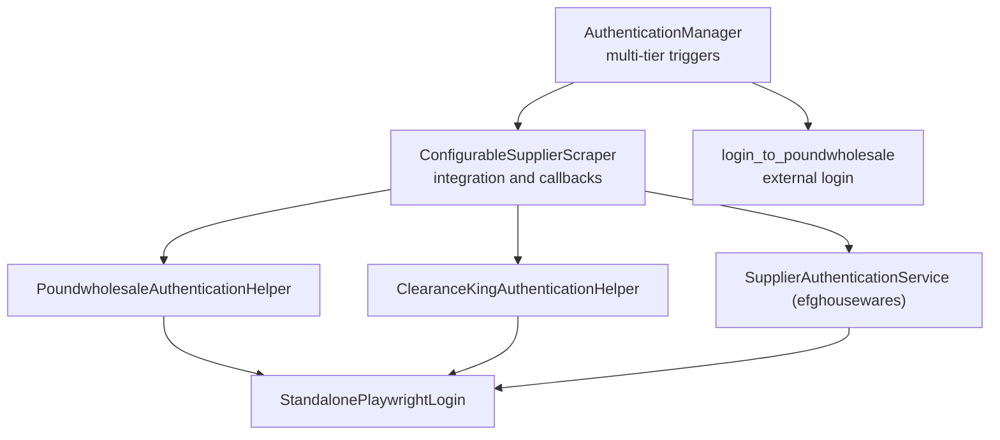
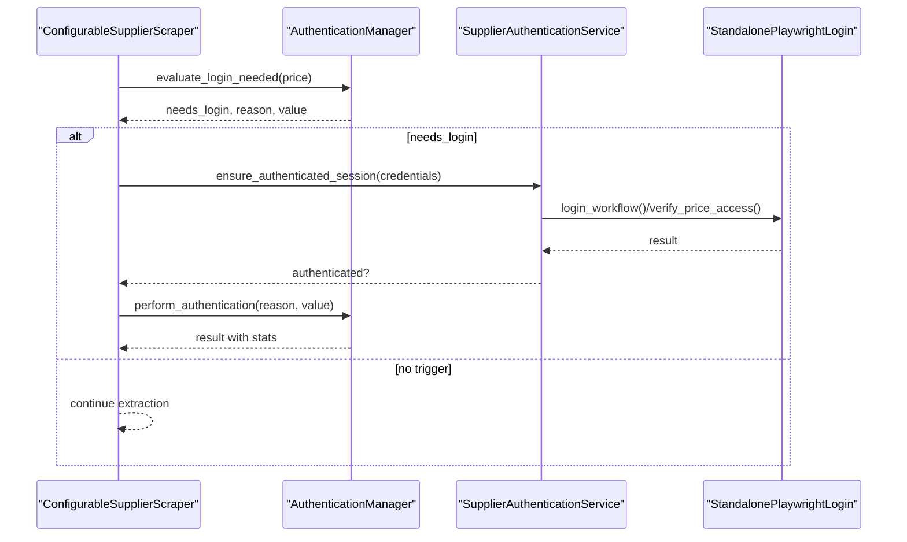
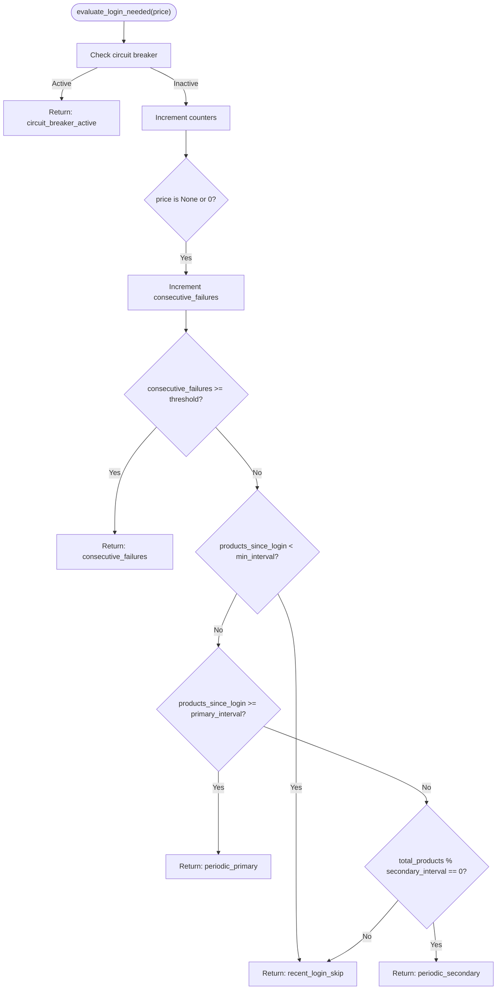
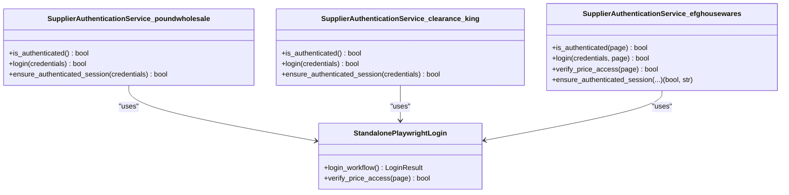
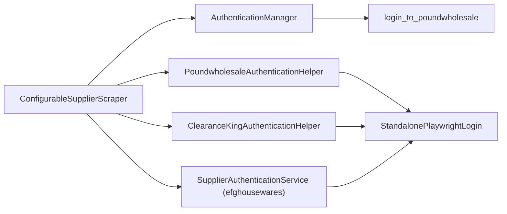

# Authentication Management

<cite>
**Referenced Files in This Document**
- [authentication_manager.py](file://tools/authentication_manager.py)
- [configurable_supplier_scraper.py](file://tools/configurable_supplier_scraper.py)
- [clearance_king_authentication_helper.py](file://tools/clearance_king_authentication_helper.py)
- [clearance_king/supplier_authentication_service.py](file://tools/clearance_king/supplier_authentication_service.py)
- [efghousewares/supplier_authentication_service.py](file://tools/efghousewares/supplier_authentication_service.py)
- [poundwholesale/supplier_authentication_service.py](file://tools/poundwholesale/supplier_authentication_service.py)
- [standalone_playwright_login.py](file://tools/standalone_playwright_login.py)
- [test_authentication_manager.py](file://tests/unit/test_authentication_manager.py)
</cite>

## Table of Contents
1. [Introduction](#introduction)
2. [Project Structure](#project-structure)
3. [Core Components](#core-components)
4. [Architecture Overview](#architecture-overview)
5. [Detailed Component Analysis](#detailed-component-analysis)
6. [Dependency Analysis](#dependency-analysis)
7. [Performance Considerations](#performance-considerations)
8. [Troubleshooting Guide](#troubleshooting-guide)
9. [Conclusion](#conclusion)

## Introduction
This document describes the supplier authentication management subsystem used by the Amazon FBA Agent System. It explains how the system performs supplier login handling, maintains authenticated sessions across long-running scraping runs, and recovers from authentication failures. It covers the multi-tier authentication trigger logic, integration with per-supplier authentication services, session management, timeout handling, and recovery strategies. It also documents how the system detects and responds to session expiration, CAPTCHA challenges, and multi-factor authentication scenarios.

## Project Structure
The authentication management spans several modules:
- Central authentication orchestration and trigger logic
- Per-supplier authentication services
- Shared login utilities and helpers
- Integration within the configurable supplier scraper
- Unit tests validating behavior



**Diagram sources**
- [authentication_manager.py](file://tools/authentication_manager.py#L48-L330)
- [configurable_supplier_scraper.py](file://tools/configurable_supplier_scraper.py#L800-L1180)
- [poundwholesale/supplier_authentication_service.py](file://tools/poundwholesale/supplier_authentication_service.py#L11-L211)
- [clearance_king_authentication_helper.py](file://tools/clearance_king_authentication_helper.py#L11-L176)
- [efghousewares/supplier_authentication_service.py](file://tools/efghousewares/supplier_authentication_service.py#L20-L258)
- [standalone_playwright_login.py](file://tools/standalone_playwright_login.py#L1-L200)

**Section sources**
- [authentication_manager.py](file://tools/authentication_manager.py#L48-L330)
- [configurable_supplier_scraper.py](file://tools/configurable_supplier_scraper.py#L800-L1180)

## Core Components
- AuthenticationManager: Implements multi-tier triggers (startup, consecutive failures, periodic) and manages circuit breaker behavior, statistics, and integration with external login routines.
- SupplierAuthenticationService helpers: Per-supplier authentication modules that verify login status and perform re-authentication using Playwright.
- ConfigurableSupplierScraper: Integrates authentication checks into the scraping pipeline, invoking supplier-specific helpers and triggering the central manager’s evaluation.
- StandalonePlaywrightLogin: Utility used by supplier helpers to perform robust login workflows and verify price access.

Key responsibilities:
- Trigger-based login decisions
- Session health verification
- Recovery from transient failures
- Statistics and reporting for observability

**Section sources**
- [authentication_manager.py](file://tools/authentication_manager.py#L48-L330)
- [configurable_supplier_scraper.py](file://tools/configurable_supplier_scraper.py#L800-L1180)
- [poundwholesale/supplier_authentication_service.py](file://tools/poundwholesale/supplier_authentication_service.py#L11-L211)
- [clearance_king_authentication_helper.py](file://tools/clearance_king_authentication_helper.py#L11-L176)
- [efghousewares/supplier_authentication_service.py](file://tools/efghousewares/supplier_authentication_service.py#L20-L258)
- [standalone_playwright_login.py](file://tools/standalone_playwright_login.py#L1-L200)

## Architecture Overview
The authentication subsystem uses a proactive, callback-driven approach:
- The scraper periodically evaluates whether authentication is needed (every 25 products) and on price extraction failures.
- On triggers, it invokes supplier-specific authentication helpers to verify or restore session state.
- The central AuthenticationManager coordinates triggers, tracks statistics, and enforces a circuit breaker to avoid cascading failures.



**Diagram sources**
- [configurable_supplier_scraper.py](file://tools/configurable_supplier_scraper.py#L800-L1180)
- [authentication_manager.py](file://tools/authentication_manager.py#L97-L221)
- [poundwholesale/supplier_authentication_service.py](file://tools/poundwholesale/supplier_authentication_service.py#L181-L208)
- [standalone_playwright_login.py](file://tools/standalone_playwright_login.py#L1-L200)

## Detailed Component Analysis

### AuthenticationManager
Responsibilities:
- Multi-tier trigger evaluation: consecutive price failures, periodic intervals, and startup verification.
- Circuit breaker: delays repeated authentication attempts after consecutive failures.
- Statistics: counts, success rates, durations, and trigger breakdowns.
- Integration: calls external login routine and records outcomes.

Behavior highlights:
- Consecutive failure detection resets on successful price extraction.
- Periodic triggers are gated by a minimum product interval to avoid redundant logins.
- Circuit breaker activates after a configurable number of failures and remains active until cooldown elapses.



**Diagram sources**
- [authentication_manager.py](file://tools/authentication_manager.py#L97-L144)

**Section sources**
- [authentication_manager.py](file://tools/authentication_manager.py#L48-L330)
- [test_authentication_manager.py](file://tests/unit/test_authentication_manager.py#L126-L215)

### SupplierAuthenticationService Helpers
Each supplier provides a helper class implementing:
- is_authenticated(): Determines session validity using DOM indicators and price access verification.
- login(): Performs login using Playwright with robust error handling.
- ensure_authenticated_session(): Orchestrates status check and login if needed.

Examples:
- PoundwholesaleAuthenticationHelper: Uses DOM selectors and price access verification via StandalonePlaywrightLogin.
- ClearanceKingAuthenticationHelper: Uses DOM indicators and price access verification; integrates with StandalonePlaywrightLogin for robust workflow.
- Efghousewares SupplierAuthenticationService: Uses My Account redirection and price visibility checks; includes extensive price selector validation.



**Diagram sources**
- [poundwholesale/supplier_authentication_service.py](file://tools/poundwholesale/supplier_authentication_service.py#L11-L211)
- [clearance_king_authentication_helper.py](file://tools/clearance_king_authentication_helper.py#L11-L176)
- [efghousewares/supplier_authentication_service.py](file://tools/efghousewares/supplier_authentication_service.py#L20-L258)
- [standalone_playwright_login.py](file://tools/standalone_playwright_login.py#L1-L200)

**Section sources**
- [poundwholesale/supplier_authentication_service.py](file://tools/poundwholesale/supplier_authentication_service.py#L11-L211)
- [clearance_king_authentication_helper.py](file://tools/clearance_king_authentication_helper.py#L11-L176)
- [efghousewares/supplier_authentication_service.py](file://tools/efghousewares/supplier_authentication_service.py#L20-L258)

### ConfigurableSupplierScraper Integration
Integration points:
- Periodic authentication checks every 25 products.
- On price extraction failure, the scraper triggers authentication verification.
- Uses supplier-specific helpers to ensure session validity.
- Calls AuthenticationManager’s callback to feed pricing feedback for adaptive triggers.

Key behaviors:
- Proactive checks use BrowserManager to obtain a page and instantiate the appropriate supplier helper.
- On failure, the scraper attempts authentication and logs actionable guidance when login expires.

```mermaid
sequenceDiagram
participant Loop as "Product Loop"
participant Scraper as "ConfigurableSupplierScraper"
participant AM as "AuthenticationManager"
participant Helper as "SupplierAuthenticationService"
Loop->>Scraper : extract price
alt price missing
Scraper->>Helper : ensure_authenticated_session(credentials)
Helper-->>Scraper : authenticated?
alt not authenticated
Scraper->>AM : perform_authentication(trigger)
AM-->>Scraper : result
end
else price present
Scraper->>AM : auth_callback(price, index)
end
```

**Diagram sources**
- [configurable_supplier_scraper.py](file://tools/configurable_supplier_scraper.py#L800-L1180)
- [authentication_manager.py](file://tools/authentication_manager.py#L146-L221)

**Section sources**
- [configurable_supplier_scraper.py](file://tools/configurable_supplier_scraper.py#L800-L1180)

### StandalonePlaywrightLogin
Role:
- Provides a reusable login workflow and price access verification used by supplier helpers.
- Ensures robustness by encapsulating login steps and verification logic.

Usage:
- Helpers pass a page instance and supplier configuration to verify price access.
- Centralizes error handling and logging for login operations.

**Section sources**
- [standalone_playwright_login.py](file://tools/standalone_playwright_login.py#L1-L200)
- [poundwholesale/supplier_authentication_service.py](file://tools/poundwholesale/supplier_authentication_service.py#L74-L91)
- [clearance_king_authentication_helper.py](file://tools/clearance_king_authentication_helper.py#L145-L182)

## Dependency Analysis
- AuthenticationManager depends on:
  - External login routine for actual authentication.
  - Logging and timing utilities.
- ConfigurableSupplierScraper depends on:
  - AuthenticationManager for trigger evaluation and statistics.
  - Supplier-specific helpers for session verification.
  - BrowserManager for page acquisition.
- Supplier helpers depend on:
  - Playwright Page for DOM interactions.
  - StandalonePlaywrightLogin for login workflow and price verification.
  - SystemConfigLoader for credentials resolution.



**Diagram sources**
- [authentication_manager.py](file://tools/authentication_manager.py#L146-L221)
- [configurable_supplier_scraper.py](file://tools/configurable_supplier_scraper.py#L800-L1180)
- [poundwholesale/supplier_authentication_service.py](file://tools/poundwholesale/supplier_authentication_service.py#L74-L91)
- [clearance_king_authentication_helper.py](file://tools/clearance_king_authentication_helper.py#L145-L182)
- [efghousewares/supplier_authentication_service.py](file://tools/efghousewares/supplier_authentication_service.py#L81-L125)

**Section sources**
- [authentication_manager.py](file://tools/authentication_manager.py#L48-L330)
- [configurable_supplier_scraper.py](file://tools/configurable_supplier_scraper.py#L800-L1180)

## Performance Considerations
- Trigger gating: Minimum product interval prevents excessive logins.
- Circuit breaker: Limits retries during repeated failures to reduce resource waste.
- Periodic triggers: Two intervals (primary and secondary) balance reliability and overhead.
- Memory hygiene: Scraper implements periodic cleanup and garbage collection during long runs.
- Logging: Comprehensive logs enable targeted tuning of thresholds and intervals.

[No sources needed since this section provides general guidance]

## Troubleshooting Guide
Common issues and recovery strategies:
- Session expiration during extraction:
  - The scraper proactively checks authentication every 25 products and on price failures.
  - On failure, it attempts re-authentication and logs recommendations.
  - If re-authentication fails, the circuit breaker activates to avoid cascading failures.
- CAPTCHA challenges:
  - Supplier helpers rely on DOM indicators and price access verification.
  - If login fails due to CAPTCHA, manual intervention may be required; the system logs detailed errors.
- Multi-factor authentication:
  - Helpers focus on DOM and price access verification; MFA flows are handled by the login workflow abstraction.
  - Ensure credentials are correct and consider manual login steps if required.

Detection and logging:
- AuthenticationManager records trigger reasons, success/failure counts, and durations.
- Supplier helpers log explicit indicators (e.g., “Login link found,” “Price access verified”).
- Tests validate trigger logic, circuit breaker behavior, and statistics accuracy.

**Section sources**
- [configurable_supplier_scraper.py](file://tools/configurable_supplier_scraper.py#L800-L1180)
- [authentication_manager.py](file://tools/authentication_manager.py#L240-L258)
- [test_authentication_manager.py](file://tests/unit/test_authentication_manager.py#L306-L375)

## Conclusion
The supplier authentication management subsystem combines proactive session checks, multi-tier triggers, and per-supplier verification to maintain reliable access to supplier pricing data. It integrates tightly with the configurable supplier scraper, leverages robust Playwright-based helpers, and provides observability through comprehensive statistics and logging. The circuit breaker and trigger gating ensure resilience under transient failures, while the callback system enables external integration for monitoring and remediation.