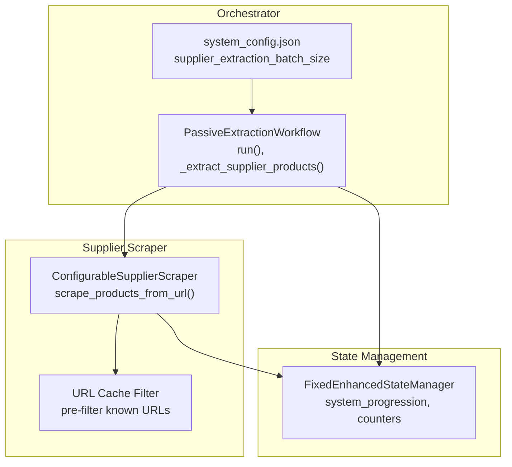
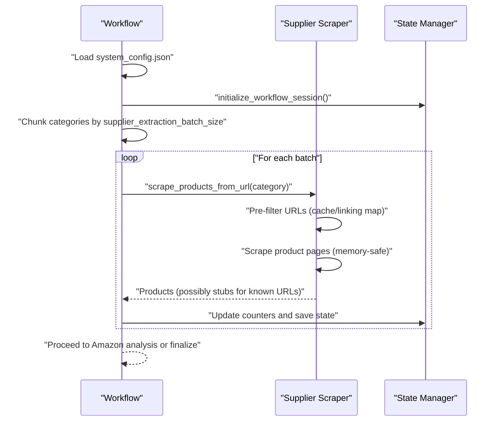
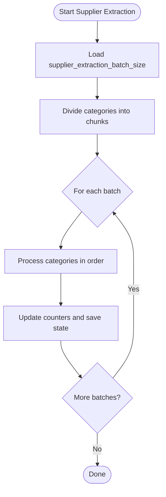
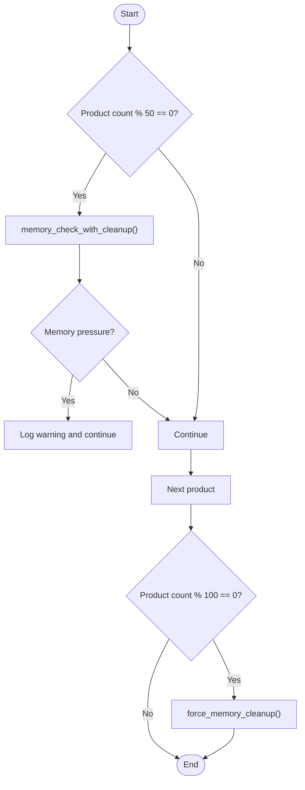
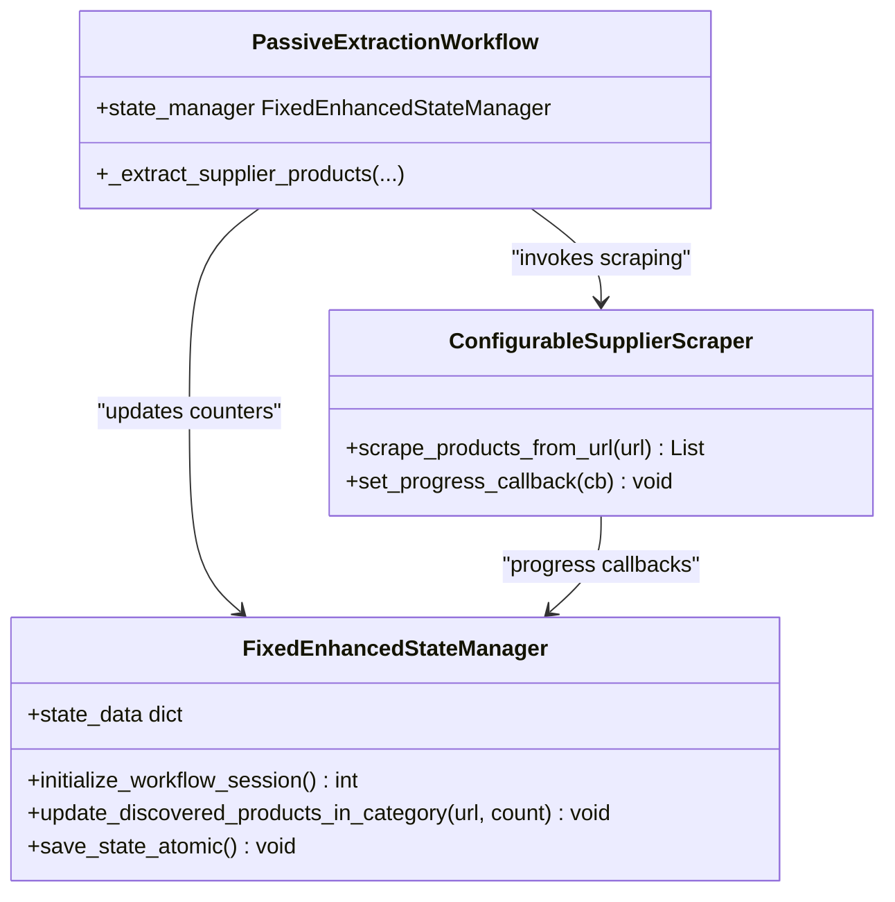
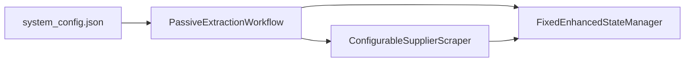

# Batched Processing

<cite>
**Referenced Files in This Document**
- [passive_extraction_workflow_latest.py](file://tools/passive_extraction_workflow_latest.py)
- [configurable_supplier_scraper.py](file://tools/configurable_supplier_scraper.py)
- [fixed_enhanced_state_manager.py](file://utils/fixed_enhanced_state_manager.py)
- [system_config.json](file://config/system_config.json)
- [comprehensive_execution_trace.py](file://tools/comprehensive_execution_trace.py)
</cite>

## Table of Contents
1. [Introduction](#introduction)
2. [Project Structure](#project-structure)
3. [Core Components](#core-components)
4. [Architecture Overview](#architecture-overview)
5. [Detailed Component Analysis](#detailed-component-analysis)
6. [Dependency Analysis](#dependency-analysis)
7. [Performance Considerations](#performance-considerations)
8. [Troubleshooting Guide](#troubleshooting-guide)
9. [Conclusion](#conclusion)

## Introduction
This document explains the batched processing subsystem that powers supplier category scraping at scale. It focuses on:
- How supplier_extraction_batch_size controls chunked processing
- The batch processing logic inside _extract_supplier_products
- Memory management strategies for large-scale scraping
- Integration with EnhancedStateManager for progress tracking across batch boundaries
- Batch size optimization and error recovery within batches
- Relationships with caching and their impact on performance and resource utilization

## Project Structure
The batched processing pipeline spans three primary areas:
- Orchestrator: defines configuration, coordinates phases, and invokes supplier extraction
- Supplier Scraper: executes scraping with memory-conscious techniques and URL pre-filtering
- State Manager: tracks progress, supports resumption, and maintains counters across batches

**Diagram sources**
- [passive_extraction_workflow_latest.py](file://tools/passive_extraction_workflow_latest.py#L2080-L2279)
- [configurable_supplier_scraper.py](file://tools/configurable_supplier_scraper.py#L477-L800)
- [fixed_enhanced_state_manager.py](file://utils/fixed_enhanced_state_manager.py#L148-L284)
- [system_config.json](file://config/system_config.json#L39-L40)

**Section sources**
- [passive_extraction_workflow_latest.py](file://tools/passive_extraction_workflow_latest.py#L2080-L2279)
- [system_config.json](file://config/system_config.json#L39-L40)

## Core Components
- supplier_extraction_batch_size: Controls how many categories are processed in a single supplier extraction batch. Defined in system_config.json and used by the orchestrator to chunk category lists.
- _extract_supplier_products: Orchestrates supplier scraping across categories, applying batch boundaries and resumption logic.
- ConfigurableSupplierScraper: Executes scraping with memory safeguards, URL pre-filtering, and periodic cleanup.
- FixedEnhancedStateManager: Tracks progress, counters, and resumption points; ensures consistency across batch boundaries.

**Section sources**
- [system_config.json](file://config/system_config.json#L39-L40)
- [passive_extraction_workflow_latest.py](file://tools/passive_extraction_workflow_latest.py#L2318-L2517)
- [configurable_supplier_scraper.py](file://tools/configurable_supplier_scraper.py#L477-L800)
- [fixed_enhanced_state_manager.py](file://utils/fixed_enhanced_state_manager.py#L148-L284)

## Architecture Overview
The batched supplier extraction follows a chunked, phase-aware flow:
- Categories are grouped into chunks sized by supplier_extraction_batch_size
- Within each chunk, categories are processed sequentially
- The scraper pre-filters URLs against cache and linking maps to avoid redundant work
- Memory is managed proactively with periodic cleanup and forced resets
- State is updated atomically to reflect progress across batch boundaries

**Diagram sources**
- [passive_extraction_workflow_latest.py](file://tools/passive_extraction_workflow_latest.py#L2236-L2279)
- [configurable_supplier_scraper.py](file://tools/configurable_supplier_scraper.py#L477-L800)
- [fixed_enhanced_state_manager.py](file://utils/fixed_enhanced_state_manager.py#L148-L284)

## Detailed Component Analysis

### supplier_extraction_batch_size Configuration
- Location: system_config.json under system.supplier_extraction_batch_size
- Purpose: Defines the number of categories processed in a single supplier extraction batch
- Defaults: 100 in the provided configuration
- Behavior: Used by the orchestrator to divide the category list into contiguous chunks before invoking scraping

**Section sources**
- [system_config.json](file://config/system_config.json#L39-L40)
- [passive_extraction_workflow_latest.py](file://tools/passive_extraction_workflow_latest.py#L2244-L2268)

### Batch Processing Logic in _extract_supplier_products
- Chunking: The orchestrator divides the category list into chunks sized by supplier_extraction_batch_size
- Sequential Processing: Within a chunk, categories are processed one after another
- Resumption Awareness: The method accounts for persistent category indices and phase transitions to avoid reprocessing
- Integration with State Manager: Progress counters and category indices are updated and saved atomically across batches

**Diagram sources**
- [passive_extraction_workflow_latest.py](file://tools/passive_extraction_workflow_latest.py#L2318-L2517)
- [system_config.json](file://config/system_config.json#L39-L40)

**Section sources**
- [passive_extraction_workflow_latest.py](file://tools/passive_extraction_workflow_latest.py#L2318-L2517)

### Memory Management Strategies During Large-Scale Scraping
- Periodic cleanup: Every N products, the scraper forces memory cleanup via the browser manager
- Real-time monitoring: Memory pressure triggers warnings and cleanup without halting processing
- Local list clearing: The scraper periodically clears local product accumulators to prevent accumulation
- BeautifulSoup cleanup: Explicit cleanup of parsed content to ensure garbage collection
- URL pre-filtering: Reduces page visits by filtering known URLs from cache and linking maps

**Diagram sources**
- [configurable_supplier_scraper.py](file://tools/configurable_supplier_scraper.py#L627-L642)

**Section sources**
- [configurable_supplier_scraper.py](file://tools/configurable_supplier_scraper.py#L477-L800)

### Integration with EnhancedStateManager for Progress Tracking Across Batch Boundaries
- Persistent category index: system_progression.persistent_category_index tracks the authoritative start position
- Supplier counters: supplier_products_needing_extraction and supplier_products_completed are updated per batch
- Atomic saves: State Manager persists progress atomically to avoid corruption across interruptions
- Startup analysis: On resume, the State Manager reconciles counters and aligns them with file-grounded evidence (e.g., linking map)

**Diagram sources**
- [fixed_enhanced_state_manager.py](file://utils/fixed_enhanced_state_manager.py#L148-L284)
- [passive_extraction_workflow_latest.py](file://tools/passive_extraction_workflow_latest.py#L2318-L2517)
- [configurable_supplier_scraper.py](file://tools/configurable_supplier_scraper.py#L477-L800)

**Section sources**
- [fixed_enhanced_state_manager.py](file://utils/fixed_enhanced_state_manager.py#L148-L284)
- [passive_extraction_workflow_latest.py](file://tools/passive_extraction_workflow_latest.py#L2318-L2517)

### Batch Size Optimization Techniques
- Centralized configuration: supplier_extraction_batch_size is defined in system_config.json and loaded at runtime
- Batch synchronization: Optional synchronization adjusts related batch sizes (e.g., max_products_per_cycle, linking_map_batch_size) to maintain throughput balance
- Chunking simulation: Execution traces demonstrate how total categories are divided into chunks and how supplier batches are formed within each chunk

**Section sources**
- [system_config.json](file://config/system_config.json#L39-L40)
- [passive_extraction_workflow_latest.py](file://tools/passive_extraction_workflow_latest.py#L2252-L2260)
- [comprehensive_execution_trace.py](file://tools/comprehensive_execution_trace.py#L122-L142)

### Error Recovery Within Batches
- Robust navigation and retry: The scraper retries navigation with exponential backoff and handles rate limits and bot detection signals
- Authentication checks: Periodic checks help recover from session timeouts without failing the entire batch
- Graceful handling of partial failures: Known URLs are skipped via stubs; unknown failures are retried or skipped based on conditions
- State integrity: Atomic state saves ensure progress is preserved even if a batch fails mid-run

**Section sources**
- [configurable_supplier_scraper.py](file://tools/configurable_supplier_scraper.py#L330-L467)
- [fixed_enhanced_state_manager.py](file://utils/fixed_enhanced_state_manager.py#L148-L284)

### Examples from the Codebase
- Category chunking and batch formation: The execution trace simulates dividing categories into chunks and forming supplier batches within each chunk
- Supplier extraction batching: The orchestrator uses supplier_extraction_batch_size to iterate over category batches
- Stub generation for known URLs: The scraper returns “stub” entries for URLs already cached or linked, preserving list lengths and avoiding redundant scraping

**Section sources**
- [comprehensive_execution_trace.py](file://tools/comprehensive_execution_trace.py#L122-L142)
- [passive_extraction_workflow_latest.py](file://tools/passive_extraction_workflow_latest.py#L2244-L2268)
- [configurable_supplier_scraper.py](file://tools/configurable_supplier_scraper.py#L554-L591)

## Dependency Analysis
The batched processing subsystem depends on:
- Configuration: system_config.json supplies supplier_extraction_batch_size and related toggles
- Scraper: ConfigurableSupplierScraper implements memory-conscious scraping and URL pre-filtering
- State Manager: FixedEnhancedStateManager provides atomic, resumable progress tracking

**Diagram sources**
- [system_config.json](file://config/system_config.json#L39-L40)
- [passive_extraction_workflow_latest.py](file://tools/passive_extraction_workflow_latest.py#L2236-L2279)
- [configurable_supplier_scraper.py](file://tools/configurable_supplier_scraper.py#L477-L800)
- [fixed_enhanced_state_manager.py](file://utils/fixed_enhanced_state_manager.py#L148-L284)

**Section sources**
- [system_config.json](file://config/system_config.json#L39-L40)
- [passive_extraction_workflow_latest.py](file://tools/passive_extraction_workflow_latest.py#L2236-L2279)
- [configurable_supplier_scraper.py](file://tools/configurable_supplier_scraper.py#L477-L800)
- [fixed_enhanced_state_manager.py](file://utils/fixed_enhanced_state_manager.py#L148-L284)

## Performance Considerations
- Throughput: Larger supplier_extraction_batch_size increases throughput but risks memory pressure; tune based on available resources
- Memory footprint: Periodic cleanup and forced resets mitigate leaks; pre-filtering reduces I/O and CPU overhead
- Atomic persistence: State saves are atomic, reducing contention and corruption risk during frequent writes
- File-grounded reconciliation: State Manager aligns counters with linking map and cache counts to maintain accuracy

[No sources needed since this section provides general guidance]

## Troubleshooting Guide
- Symptom: Memory growth during long runs
  - Cause: Accumulation of product lists or HTML content
  - Resolution: Scraper clears local lists periodically and forces cleanup; ensure cleanup intervals are effective
- Symptom: Inconsistent progress across restarts
  - Cause: Counter drift or missing frozen denominators
  - Resolution: State Manager reconciles counters using file-grounded evidence and preserves monotonicity
- Symptom: Partial failures within a batch
  - Cause: Network errors or bot detection
  - Resolution: Scraper retries with backoff; authentication checks recover from session timeouts

**Section sources**
- [configurable_supplier_scraper.py](file://tools/configurable_supplier_scraper.py#L627-L642)
- [fixed_enhanced_state_manager.py](file://utils/fixed_enhanced_state_manager.py#L469-L645)

## Conclusion
The batched processing subsystem combines configurable chunking, memory-conscious scraping, and robust state management to enable scalable supplier extraction. By tuning supplier_extraction_batch_size, leveraging URL pre-filtering, and relying on atomic state persistence, the system achieves high throughput while maintaining reliability and resumability across large-scale operations.