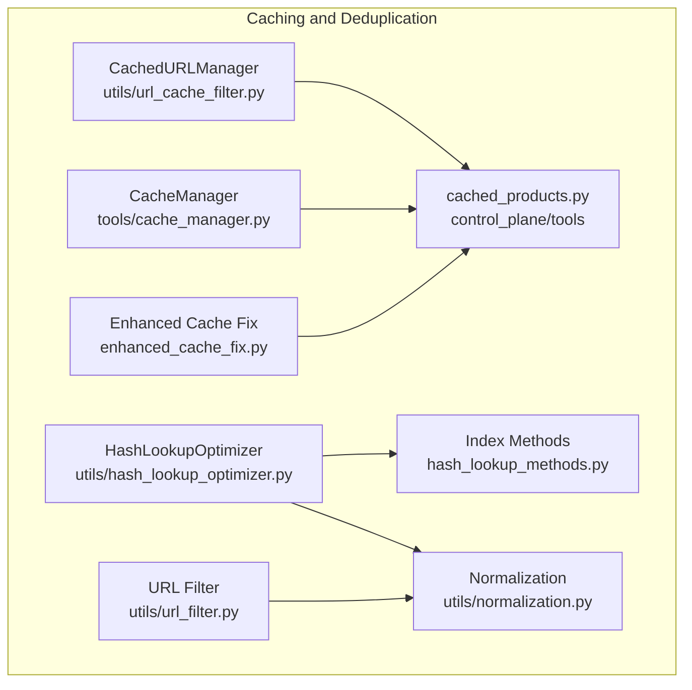
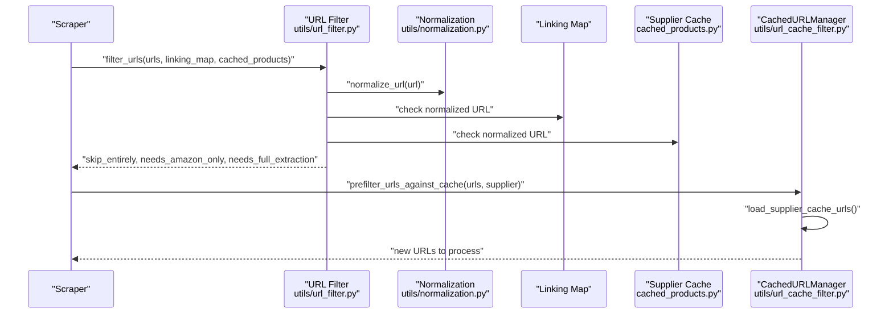
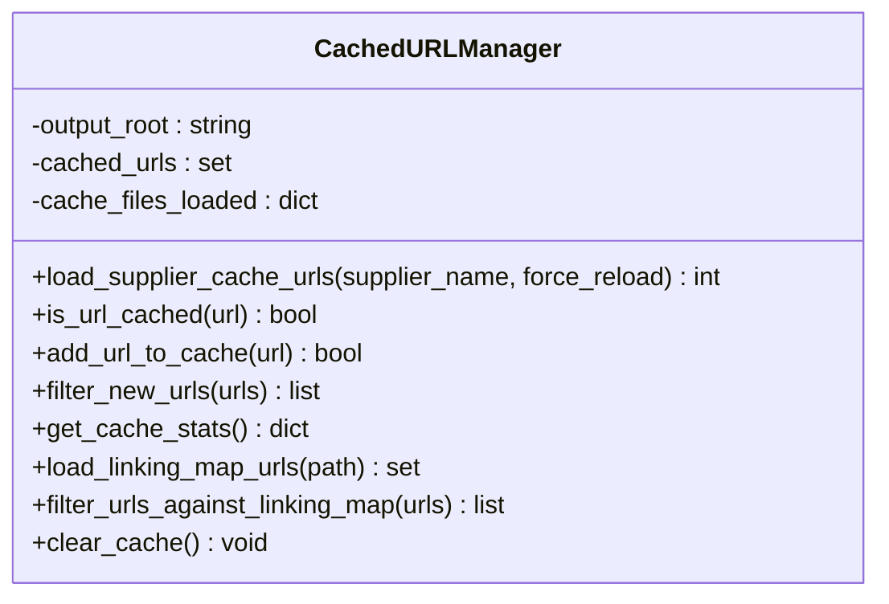
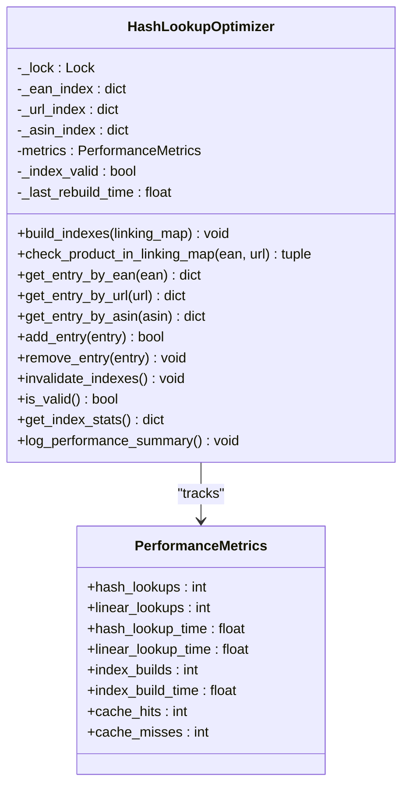
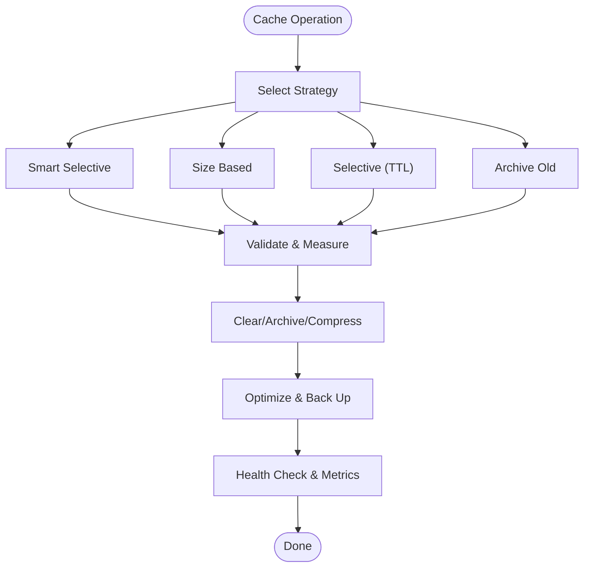
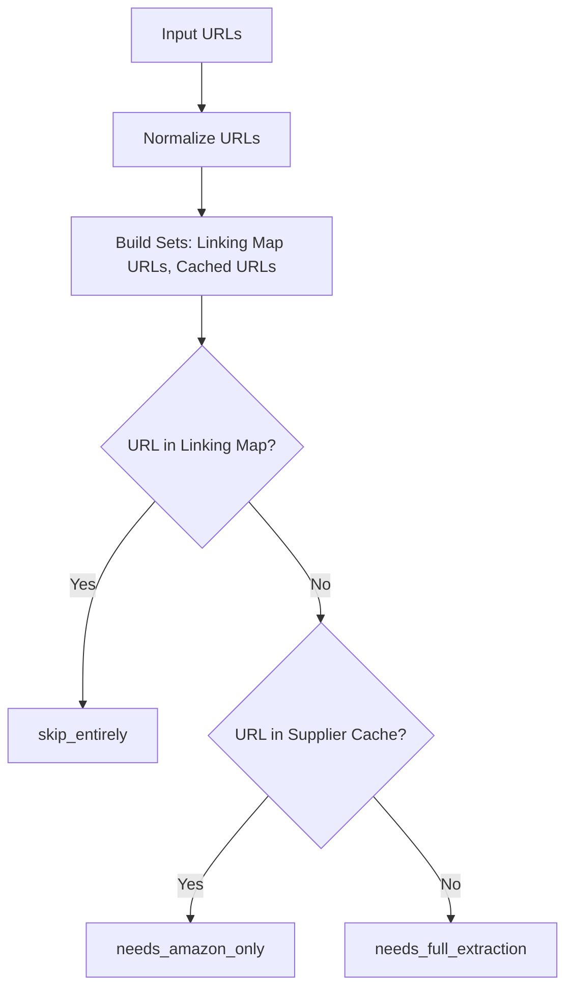
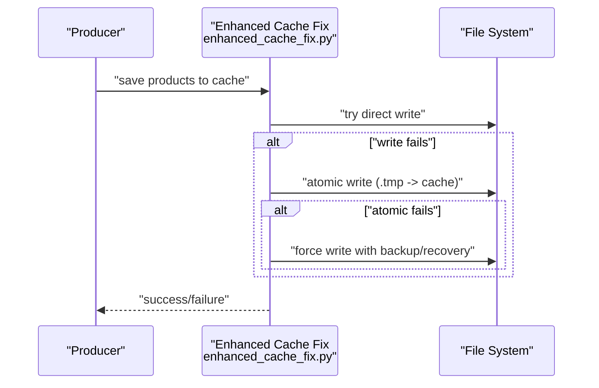
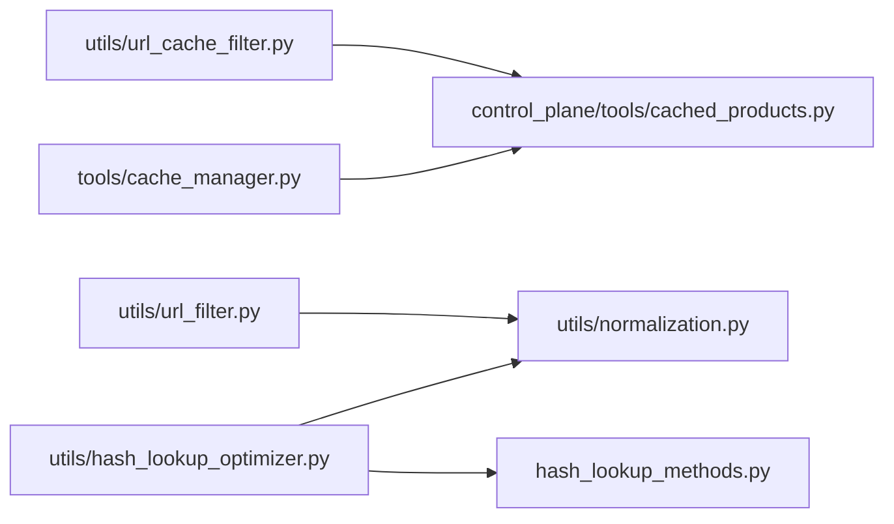

# Cache Management

<cite>
**Referenced Files in This Document**
- [url_cache_filter.py](file://utils/url_cache_filter.py)
- [hash_lookup_optimizer.py](file://utils/hash_lookup_optimizer.py)
- [hash_lookup_methods.py](file://hash_lookup_methods.py)
- [cache_manager.py](file://tools/cache_manager.py)
- [cached_products.py](file://control_plane/tools/cached_products.py)
- [url_filter.py](file://utils/url_filter.py)
- [normalization.py](file://utils/normalization.py)
- [enhanced_cache_fix.py](file://enhanced_cache_fix.py)
- [DEPLOYMENT_READY_SUMMARY.md](file://DEPLOYMENT_READY_SUMMARY.md)
</cite>

## Table of Contents
1. [Introduction](#introduction)
2. [Project Structure](#project-structure)
3. [Core Components](#core-components)
4. [Architecture Overview](#architecture-overview)
5. [Detailed Component Analysis](#detailed-component-analysis)
6. [Dependency Analysis](#dependency-analysis)
7. [Performance Considerations](#performance-considerations)
8. [Troubleshooting Guide](#troubleshooting-guide)
9. [Conclusion](#conclusion)

## Introduction
This document explains the cache management subsystem that powers supplier product caching, hash-based lookup optimization, and URL filtering to prevent duplicate processing. It covers:
- How product caches are persisted and integrated with the state management system
- How hash-based indexes accelerate linking map lookups
- How URL filtering prevents redundant page visits
- How cache invalidation and clearing strategies maintain reliability and performance
- How memory optimization and monitoring support large product datasets

## Project Structure
The cache management subsystem spans several modules:
- URL pre-filtering and caching: utils/url_cache_filter.py
- Hash-based lookup optimization: utils/hash_lookup_optimizer.py and hash_lookup_methods.py
- Cache persistence and integration: control_plane/tools/cached_products.py and enhanced_cache_fix.py
- URL classification and deduplication: utils/url_filter.py and utils/normalization.py
- Centralized cache lifecycle management: tools/cache_manager.py

**Diagram sources**
- [url_cache_filter.py](file://utils/url_cache_filter.py#L31-L272)
- [hash_lookup_optimizer.py](file://utils/hash_lookup_optimizer.py#L1-L1)
- [hash_lookup_methods.py](file://hash_lookup_methods.py#L1-L45)
- [cache_manager.py](file://tools/cache_manager.py#L1-L1)
- [cached_products.py](file://control_plane/tools/cached_products.py#L1-L96)
- [url_filter.py](file://utils/url_filter.py#L1-L40)
- [normalization.py](file://utils/normalization.py#L1-L31)
- [enhanced_cache_fix.py](file://enhanced_cache_fix.py#L1-L113)

**Section sources**
- [url_cache_filter.py](file://utils/url_cache_filter.py#L1-L272)
- [hash_lookup_optimizer.py](file://utils/hash_lookup_optimizer.py#L1-L1)
- [hash_lookup_methods.py](file://hash_lookup_methods.py#L1-L45)
- [cache_manager.py](file://tools/cache_manager.py#L1-L1)
- [cached_products.py](file://control_plane/tools/cached_products.py#L1-L96)
- [url_filter.py](file://utils/url_filter.py#L1-L40)
- [normalization.py](file://utils/normalization.py#L1-L31)
- [enhanced_cache_fix.py](file://enhanced_cache_fix.py#L1-L113)

## Core Components
- CachedURLManager: Loads supplier product cache files into memory, exposes O(1) URL lookup, filters new URLs, and tracks statistics.
- HashLookupOptimizer: Builds and maintains hash indexes (by EAN, URL, ASIN) for fast linking map lookups, with thread-safe operations and performance metrics.
- CacheManager: Centralized cache lifecycle management with strategies for selective clearing, size-based eviction, archival, validation, and optimization.
- cached_products.py: Resolves supplier cache file paths and reads cached product data for downstream processing.
- url_filter.py and normalization.py: Normalize URLs and classify URLs by linking map presence and cache availability.
- enhanced_cache_fix.py: Enhances cache writes with deduplication, metadata, and multiple persistence strategies.

**Section sources**
- [url_cache_filter.py](file://utils/url_cache_filter.py#L31-L272)
- [hash_lookup_optimizer.py](file://utils/hash_lookup_optimizer.py#L1-L1)
- [cache_manager.py](file://tools/cache_manager.py#L1-L1)
- [cached_products.py](file://control_plane/tools/cached_products.py#L1-L96)
- [url_filter.py](file://utils/url_filter.py#L1-L40)
- [normalization.py](file://utils/normalization.py#L1-L31)
- [enhanced_cache_fix.py](file://enhanced_cache_fix.py#L1-L113)

## Architecture Overview
The cache management subsystem integrates three pillars:
- Supplier product caching: persisted JSON files under OUTPUTS/cached_products, indexed by URL/EAN for fast retrieval and deduplication.
- Hash-based linking map optimization: O(1) lookups via EAN, URL, and ASIN indexes, with automatic rebuilds and thread-safety.
- URL filtering pipeline: pre-filters URLs against linking map and cache to avoid redundant processing.

**Diagram sources**
- [url_filter.py](file://utils/url_filter.py#L7-L40)
- [normalization.py](file://utils/normalization.py#L9-L31)
- [cached_products.py](file://control_plane/tools/cached_products.py#L37-L96)
- [url_cache_filter.py](file://utils/url_cache_filter.py#L226-L247)

## Detailed Component Analysis

### CachedURLManager: Supplier Product Caching and URL Pre-filtering
- Purpose: Load supplier cache files into memory, expose O(1) URL lookup, and filter new URLs to avoid duplicate processing.
- Key behaviors:
  - Load URLs from supplier cache files into an in-memory set.
  - Provide O(1) existence checks and add-to-cache operations.
  - Filter lists of URLs to return only those not yet cached.
  - Track statistics and support linking map URL filtering.
- Integration:
  - Works with cached_products.py to resolve supplier cache file paths.
  - Used by prefilter_urls_against_cache to minimize page visits.

**Diagram sources**
- [url_cache_filter.py](file://utils/url_cache_filter.py#L31-L207)

**Section sources**
- [url_cache_filter.py](file://utils/url_cache_filter.py#L31-L272)
- [cached_products.py](file://control_plane/tools/cached_products.py#L19-L44)

### HashLookupOptimizer: O(1) Linking Map Indexes
- Purpose: Replace O(n) linear searches with O(1) hash-based lookups using EAN, URL, and ASIN indexes.
- Key behaviors:
  - Build indexes from linking map entries with normalization.
  - Thread-safe operations using locks; supports add/remove/update.
  - Expose fast lookup APIs and provide performance metrics.
  - Auto-invalidation and rebuild triggers.
- Integration:
  - Uses normalization utilities for consistent keys.
  - Methods to rebuild indexes and maintain consistency.

**Diagram sources**
- [hash_lookup_optimizer.py](file://utils/hash_lookup_optimizer.py#L1-L1)

**Section sources**
- [hash_lookup_optimizer.py](file://utils/hash_lookup_optimizer.py#L1-L1)
- [hash_lookup_methods.py](file://hash_lookup_methods.py#L6-L45)
- [normalization.py](file://utils/normalization.py#L9-L31)

### CacheManager: Lifecycle, Invalidation, and Monitoring
- Purpose: Centralized cache lifecycle management with multiple clearing strategies, validation, optimization, and health reporting.
- Key behaviors:
  - Strategies: smart_selective, size_based, selective, archive_old.
  - Validation: schema-aware checks for supplier, Amazon, linking map, and AI category caches.
  - Optimization: compression of old files, metadata aggregation.
  - Monitoring: metrics, health checks, system resource usage.
- Integration:
  - Reads configuration for cache directories and policies.
  - Coordinates with cached_products.py for supplier cache access.

**Diagram sources**
- [cache_manager.py](file://tools/cache_manager.py#L1-L1)

**Section sources**
- [cache_manager.py](file://tools/cache_manager.py#L1-L1)
- [cached_products.py](file://control_plane/tools/cached_products.py#L19-L44)

### URL Filtering Pipeline: Duplicate Prevention
- Purpose: Prevent duplicate processing by prioritizing linking map coverage and existing supplier cache hits.
- Key behaviors:
  - Normalize URLs for consistent comparison.
  - Classify URLs into skip_entirely, needs_amazon_only, needs_full_extraction.
  - Integrate with CachedURLManager for runtime cache updates.

**Diagram sources**
- [url_filter.py](file://utils/url_filter.py#L7-L40)
- [normalization.py](file://utils/normalization.py#L9-L31)
- [url_cache_filter.py](file://utils/url_cache_filter.py#L104-L171)

**Section sources**
- [url_filter.py](file://utils/url_filter.py#L1-L40)
- [normalization.py](file://utils/normalization.py#L1-L31)
- [url_cache_filter.py](file://utils/url_cache_filter.py#L104-L171)

### Cache Persistence and Deduplication
- Purpose: Persist supplier product caches reliably, deduplicate entries, and attach metadata for auditing.
- Key behaviors:
  - Load existing cache, deduplicate by URL, clean metadata, append metadata block.
  - Multiple persistence strategies: direct write, atomic write, force write with backup/recovery.
- Integration:
  - Works with cached_products.py to locate supplier cache files.

**Diagram sources**
- [enhanced_cache_fix.py](file://enhanced_cache_fix.py#L2-L113)
- [cached_products.py](file://control_plane/tools/cached_products.py#L19-L44)

**Section sources**
- [enhanced_cache_fix.py](file://enhanced_cache_fix.py#L1-L113)
- [cached_products.py](file://control_plane/tools/cached_products.py#L1-L96)

## Dependency Analysis
- CachedURLManager depends on:
  - cached_products.py for supplier cache file resolution.
  - utils/normalization.py indirectly via prefiltering and URL filtering.
- HashLookupOptimizer depends on:
  - utils/normalization.py for normalized keys.
  - Thread safety via locks; integrates with workflow classes via hash_lookup_methods.py.
- CacheManager coordinates:
  - Multiple cache directories and strategies.
  - Validation and optimization routines.
- URL filtering pipeline depends on:
  - utils/normalization.py for canonical URLs.
  - Linking map and supplier cache data.

**Diagram sources**
- [url_cache_filter.py](file://utils/url_cache_filter.py#L1-L272)
- [cached_products.py](file://control_plane/tools/cached_products.py#L1-L96)
- [url_filter.py](file://utils/url_filter.py#L1-L40)
- [normalization.py](file://utils/normalization.py#L1-L31)
- [hash_lookup_optimizer.py](file://utils/hash_lookup_optimizer.py#L1-L1)
- [hash_lookup_methods.py](file://hash_lookup_methods.py#L1-L45)
- [cache_manager.py](file://tools/cache_manager.py#L1-L1)

**Section sources**
- [url_cache_filter.py](file://utils/url_cache_filter.py#L1-L272)
- [cached_products.py](file://control_plane/tools/cached_products.py#L1-L96)
- [url_filter.py](file://utils/url_filter.py#L1-L40)
- [normalization.py](file://utils/normalization.py#L1-L31)
- [hash_lookup_optimizer.py](file://utils/hash_lookup_optimizer.py#L1-L1)
- [hash_lookup_methods.py](file://hash_lookup_methods.py#L1-L45)
- [cache_manager.py](file://tools/cache_manager.py#L1-L1)

## Performance Considerations
- Hash-based lookups:
  - O(1) indexing for EAN, URL, ASIN reduces lookup time from O(n) to constant time.
  - Thread-safe operations ensure safe concurrent access.
- URL pre-filtering:
  - In-memory sets enable O(1) duplicate detection before scraping.
  - Reduces network and compute overhead by skipping processed URLs.
- Cache lifecycle:
  - Smart selective clearing removes processed items based on linking map.
  - Size-based eviction and compression reclaim disk space.
- Monitoring and metrics:
  - CacheManager tracks hit rates, sizes, and performance improvements.
  - HashLookupOptimizer logs cache hit rate and average lookup times.

[No sources needed since this section provides general guidance]

## Troubleshooting Guide
- Cache corruption:
  - Use CacheManager.validate_cache to detect invalid JSON and missing fields.
  - Review ValidationResult for errors and warnings.
- Persistence failures:
  - Enhanced cache write falls back through direct, atomic, and force-write strategies.
  - Backup restoration is supported when force write is enabled.
- Performance regressions:
  - Inspect HashLookupOptimizer.get_index_stats for cache hit rate and average lookup times.
  - Use log_performance_summary to compare hash vs linear lookup performance.
- Resource pressure:
  - Run CacheManager.health_check to assess disk usage and cache sizes.
  - Apply size_based or archive_old strategies to free space.

**Section sources**
- [cache_manager.py](file://tools/cache_manager.py#L1-L1)
- [enhanced_cache_fix.py](file://enhanced_cache_fix.py#L51-L113)
- [hash_lookup_optimizer.py](file://utils/hash_lookup_optimizer.py#L1-L1)
- [DEPLOYMENT_READY_SUMMARY.md](file://DEPLOYMENT_READY_SUMMARY.md#L142-L184)

## Conclusion
The cache management subsystem delivers:
- Reliable supplier product caching with deduplication and metadata.
- Substantial performance gains via hash-based linking map lookups.
- Effective URL filtering to prevent duplicate processing.
- Robust lifecycle management, validation, and optimization for large-scale operations.
Together, these mechanisms improve system reliability, reduce processing time, and support scalable handling of large product datasets.