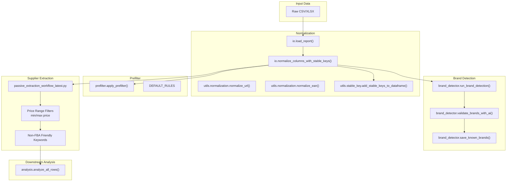
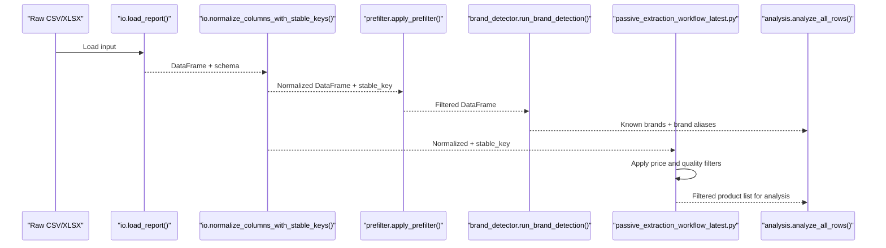
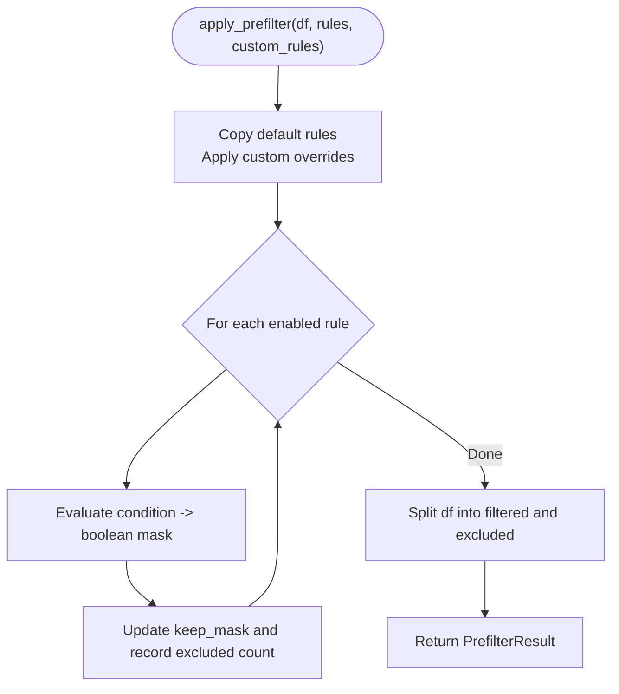
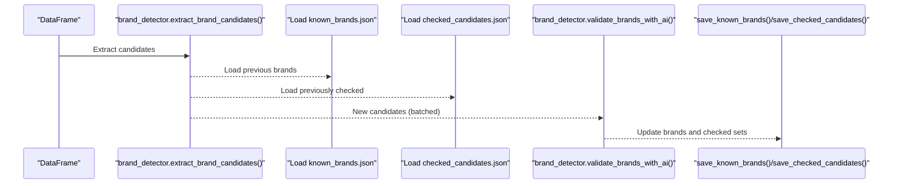
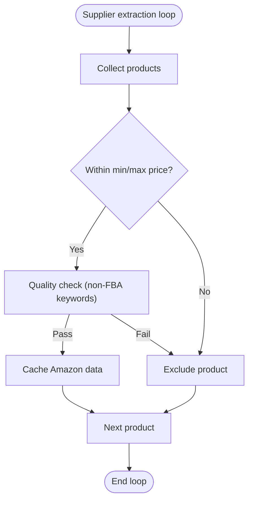
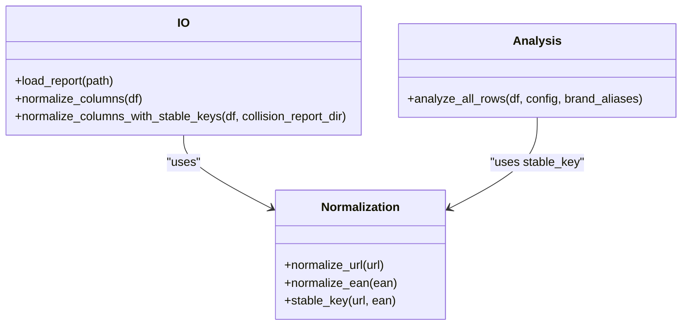
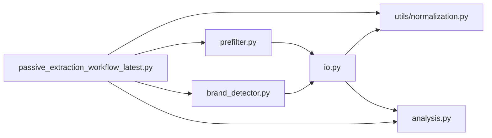

# Product Filtering

<cite>
**Referenced Files in This Document**
- [prefilter.py](file://src/fba_agent/prefilter.py)
- [brand_detector.py](file://src/fba_agent/brand_detector.py)
- [run.py](file://src/fba_agent/run.py)
- [analysis.py](file://src/fba_agent/analysis.py)
- [io.py](file://src/fba_agent/io.py)
- [constants.py](file://src/fba_agent/constants.py)
- [normalization.py](file://utils/normalization.py)
- [passive_extraction_workflow_latest.py](file://tools/passive_extraction_workflow_latest.py)
- [toggle_definition_proof.md](file://config/toggle_definition_proof.md)
- [EXPERIMENT_SUMMARY.md](file://OUTPUTS - Copy/EXPERIMENTS/experiment_1_processing_limits_20250715/EXPERIMENT_SUMMARY.md)
</cite>

## Table of Contents
1. [Introduction](#introduction)
2. [Project Structure](#project-structure)
3. [Core Components](#core-components)
4. [Architecture Overview](#architecture-overview)
5. [Detailed Component Analysis](#detailed-component-analysis)
6. [Dependency Analysis](#dependency-analysis)
7. [Performance Considerations](#performance-considerations)
8. [Troubleshooting Guide](#troubleshooting-guide)
9. [Conclusion](#conclusion)

## Introduction
This document explains the product filtering subsystem that ensures only viable, compliant, and high-quality products proceed to downstream matching and analysis. It covers:
- Price range filtering during scraping and post-scrape processing
- Quality filtering based on non-FBA-friendly keywords
- Brand context filtering for restricted products
- Integration with normalization utilities for consistent product comparison
- Filter configuration management and toggles
- Relationships with caching systems and downstream processing

## Project Structure
The filtering subsystem spans several modules:
- Pre-filtering for obvious unprofitable rows before analysis
- Brand detection and validation for context-aware filtering
- Price and quality filters integrated into the supplier extraction workflow
- Normalization utilities for stable product comparisons
- Configuration-driven toggles controlling filtering behavior

**Diagram sources**
- [io.py](file://src/fba_agent/io.py#L12-L185)
- [normalization.py](file://utils/normalization.py#L1-L31)
- [prefilter.py](file://src/fba_agent/prefilter.py#L69-L179)
- [brand_detector.py](file://src/fba_agent/brand_detector.py#L272-L367)
- [passive_extraction_workflow_latest.py](file://tools/passive_extraction_workflow_latest.py#L1-L200)
- [analysis.py](file://src/fba_agent/analysis.py#L348-L418)

**Section sources**
- [io.py](file://src/fba_agent/io.py#L12-L185)
- [normalization.py](file://utils/normalization.py#L1-L31)
- [prefilter.py](file://src/fba_agent/prefilter.py#L69-L179)
- [brand_detector.py](file://src/fba_agent/brand_detector.py#L272-L367)
- [passive_extraction_workflow_latest.py](file://tools/passive_extraction_workflow_latest.py#L1-L200)
- [analysis.py](file://src/fba_agent/analysis.py#L348-L418)

## Core Components
- Pre-filtering: Applies boolean rules to remove obviously unprofitable rows prior to analysis.
- Brand detection: Validates brand candidates and builds a canonical brand list to inform context-aware filtering.
- Price and quality filters: Enforced during supplier extraction and post-extraction processing.
- Normalization: Ensures stable keys and consistent numeric fields for reliable filtering and matching.
- Configuration: Toggles define price thresholds and other filter behaviors.

**Section sources**
- [prefilter.py](file://src/fba_agent/prefilter.py#L69-L179)
- [brand_detector.py](file://src/fba_agent/brand_detector.py#L272-L367)
- [passive_extraction_workflow_latest.py](file://tools/passive_extraction_workflow_latest.py#L463-L529)
- [io.py](file://src/fba_agent/io.py#L146-L185)

## Architecture Overview
The filtering pipeline integrates upstream normalization, pre-filtering, brand validation, and downstream analysis. It also interacts with the supplier extraction workflow to enforce price and quality constraints during scraping.

**Diagram sources**
- [io.py](file://src/fba_agent/io.py#L12-L185)
- [prefilter.py](file://src/fba_agent/prefilter.py#L110-L179)
- [brand_detector.py](file://src/fba_agent/brand_detector.py#L272-L367)
- [passive_extraction_workflow_latest.py](file://tools/passive_extraction_workflow_latest.py#L1-L200)
- [analysis.py](file://src/fba_agent/analysis.py#L348-L418)

## Detailed Component Analysis

### Pre-filtering for Obvious Unprofitability
Purpose:
- Remove rows with non-positive sales or net profit before analysis to reduce computational overhead.

Key behaviors:
- Boolean rule evaluation per row using numeric conversion with safe handling of missing/null values.
- Configurable rule set with enable/disable toggles.
- Aggregated statistics on excluded rows and reasons.

Performance characteristics:
- Vectorized boolean masking for efficient filtering.
- Early exit reduces downstream computation.

**Diagram sources**
- [prefilter.py](file://src/fba_agent/prefilter.py#L110-L179)

**Section sources**
- [prefilter.py](file://src/fba_agent/prefilter.py#L41-L94)
- [prefilter.py](file://src/fba_agent/prefilter.py#L110-L179)

### Brand Context Filtering for Restricted Products
Purpose:
- Use validated brand context to improve filtering decisions and avoid false positives.

Key behaviors:
- Extract brand candidates from supplier titles and filter out common non-brands.
- Validate candidates with AI (limited batches per run) and persist results.
- Merge validated brands into brand aliases used by downstream analysis.

**Diagram sources**
- [brand_detector.py](file://src/fba_agent/brand_detector.py#L58-L111)
- [brand_detector.py](file://src/fba_agent/brand_detector.py#L114-L160)
- [brand_detector.py](file://src/fba_agent/brand_detector.py#L220-L270)
- [brand_detector.py](file://src/fba_agent/brand_detector.py#L272-L367)

**Section sources**
- [brand_detector.py](file://src/fba_agent/brand_detector.py#L58-L111)
- [brand_detector.py](file://src/fba_agent/brand_detector.py#L220-L270)
- [brand_detector.py](file://src/fba_agent/brand_detector.py#L272-L367)

### Price Range Filtering During Scraping and Post-Scrape
Purpose:
- Enforce minimum and maximum price thresholds to constrain the product pool.

Implementation highlights:
- Non-FBA-friendly keyword lists are maintained in the supplier extraction workflow.
- Price thresholds are defined via configuration toggles and enforced during extraction and post-processing.

**Diagram sources**
- [passive_extraction_workflow_latest.py](file://tools/passive_extraction_workflow_latest.py#L463-L529)
- [toggle_definition_proof.md](file://config/toggle_definition_proof.md#L49-L74)

**Section sources**
- [passive_extraction_workflow_latest.py](file://tools/passive_extraction_workflow_latest.py#L463-L529)
- [toggle_definition_proof.md](file://config/toggle_definition_proof.md#L49-L74)
- [EXPERIMENT_SUMMARY.md](file://OUTPUTS - Copy/EXPERIMENTS/experiment_1_processing_limits_20250715/EXPERIMENT_SUMMARY.md#L53-L88)

### Quality Filtering Based on Non-FBA-Friendly Keywords
Purpose:
- Exclude products containing restricted keywords aligned with Amazon policies.

Implementation highlights:
- Keyword lists cover smoking/drugs, weapons/dangerous items, adult content, hazardous materials, restricted electronics, medical devices, and counterfeit indicators.
- Filtering occurs during supplier extraction and post-extraction processing.

**Section sources**
- [passive_extraction_workflow_latest.py](file://tools/passive_extraction_workflow_latest.py#L463-L529)

### Integration with Normalization Utilities for Consistent Comparison
Purpose:
- Ensure stable keys and normalized numeric fields for reliable filtering and matching.

Key integrations:
- Stable key generation for deduplication and cache lookups.
- URL and EAN normalization for consistent identifiers.
- Numeric normalization for price, profit, and ROI fields.

**Diagram sources**
- [io.py](file://src/fba_agent/io.py#L12-L185)
- [normalization.py](file://utils/normalization.py#L1-L31)
- [analysis.py](file://src/fba_agent/analysis.py#L348-L418)

**Section sources**
- [io.py](file://src/fba_agent/io.py#L146-L185)
- [normalization.py](file://utils/normalization.py#L1-L31)
- [analysis.py](file://src/fba_agent/analysis.py#L348-L418)

### Filter Configuration Management
Purpose:
- Centralize filter behavior via configuration toggles.

Examples of toggles:
- Minimum and maximum price thresholds
- Product limits per run and per category
- Price midpoint for analysis

Verification status:
- Some toggles show functional behavior; others require verification or appear bypassed.

**Section sources**
- [toggle_definition_proof.md](file://config/toggle_definition_proof.md#L49-L74)
- [EXPERIMENT_SUMMARY.md](file://OUTPUTS - Copy/EXPERIMENTS/experiment_1_processing_limits_20250715/EXPERIMENT_SUMMARY.md#L53-L88)

## Dependency Analysis
The filtering subsystem depends on:
- Normalization utilities for stable keys and normalized fields
- Brand detection for validated brand context
- Configuration toggles for price thresholds and limits
- Downstream analysis for final decision-making

**Diagram sources**
- [prefilter.py](file://src/fba_agent/prefilter.py#L110-L179)
- [io.py](file://src/fba_agent/io.py#L12-L185)
- [brand_detector.py](file://src/fba_agent/brand_detector.py#L272-L367)
- [passive_extraction_workflow_latest.py](file://tools/passive_extraction_workflow_latest.py#L1-L200)
- [analysis.py](file://src/fba_agent/analysis.py#L348-L418)

**Section sources**
- [prefilter.py](file://src/fba_agent/prefilter.py#L110-L179)
- [io.py](file://src/fba_agent/io.py#L12-L185)
- [brand_detector.py](file://src/fba_agent/brand_detector.py#L272-L367)
- [passive_extraction_workflow_latest.py](file://tools/passive_extraction_workflow_latest.py#L1-L200)
- [analysis.py](file://src/fba_agent/analysis.py#L348-L418)

## Performance Considerations
- Pre-filtering reduces dataset size early, lowering cost of downstream analysis.
- Brand validation uses batched AI calls to limit token consumption while incrementally learning brand mappings.
- Normalization utilities operate on vectors for speed; stable key generation avoids expensive recomputation.
- Price and quality filters during extraction minimize unnecessary Amazon lookups and cache writes.

[No sources needed since this section provides general guidance]

## Troubleshooting Guide
Common issues and resolutions:
- Price filtering not enforced:
  - Verify configuration toggles and their integration points in the extraction workflow.
  - Review experiment summaries indicating price filtering toggle failures.
- Brand validation not updating:
  - Ensure AI provider availability and batch limits are configured appropriately.
  - Confirm persistence of known brands and checked candidates.
- Stable key collisions:
  - Inspect normalization reports and collision counts; resolve duplicates before proceeding.

**Section sources**
- [toggle_definition_proof.md](file://config/toggle_definition_proof.md#L49-L74)
- [EXPERIMENT_SUMMARY.md](file://OUTPUTS - Copy/EXPERIMENTS/experiment_1_processing_limits_20250715/EXPERIMENT_SUMMARY.md#L53-L88)
- [brand_detector.py](file://src/fba_agent/brand_detector.py#L145-L160)
- [io.py](file://src/fba_agent/io.py#L146-L185)

## Conclusion
The product filtering subsystem combines pre-filtering, brand validation, and configuration-driven price/quality constraints to ensure only suitable products advance to matching and analysis. Normalization utilities underpin stable comparisons, while caching and state management support efficient, resumable workflows. Addressing configuration gaps and validating brand context further strengthens downstream matching accuracy and reliability.