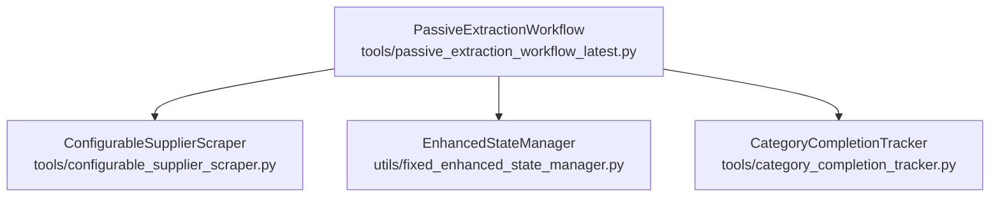
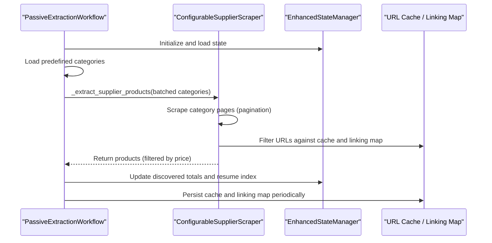
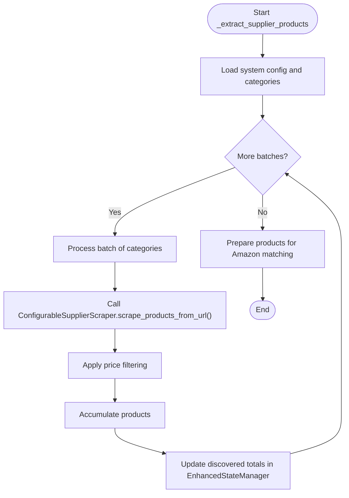
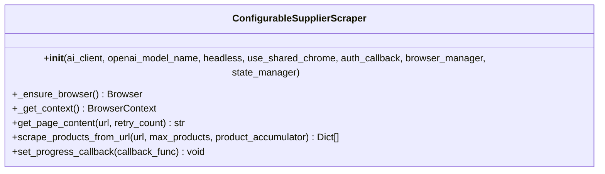
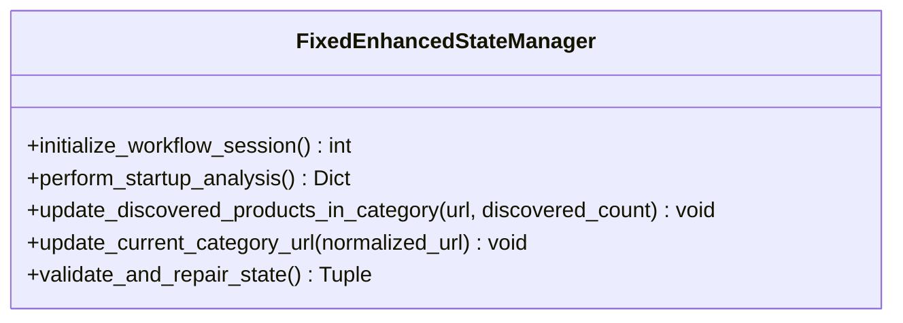
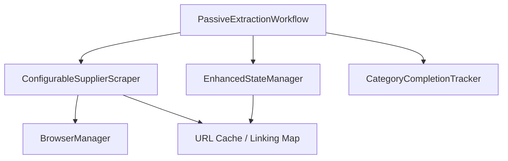

# Supplier Product Extraction

<cite>
**Referenced Files in This Document**
- [passive_extraction_workflow_latest.py](file://tools/passive_extraction_workflow_latest.py)
- [configurable_supplier_scraper.py](file://tools/configurable_supplier_scraper.py)
- [fixed_enhanced_state_manager.py](file://utils/fixed_enhanced_state_manager.py)
- [category_completion_tracker.py](file://tools/category_completion_tracker.py)
- [run.py](file://src/fba_agent/run.py)
- [constants.py](file://src/fba_agent/constants.py)
</cite>

## Table of Contents
1. [Introduction](#introduction)
2. [Project Structure](#project-structure)
3. [Core Components](#core-components)
4. [Architecture Overview](#architecture-overview)
5. [Detailed Component Analysis](#detailed-component-analysis)
6. [Dependency Analysis](#dependency-analysis)
7. [Performance Considerations](#performance-considerations)
8. [Troubleshooting Guide](#troubleshooting-guide)
9. [Conclusion](#conclusion)

## Introduction
This document explains the supplier product extraction subsystem that powers the passive extraction workflow. It focuses on the _extract_supplier_products method, detailing how it processes supplier categories in configurable batches, integrates with ConfigurableSupplierScraper for robust scraping, manages supplier authentication, and leverages EnhancedStateManager for progress tracking and cache synchronization. It also covers product caching, URL filtering, pagination handling, and price-range filtering prior to Amazon matching.

## Project Structure
The supplier extraction workflow is orchestrated by a central workflow script that delegates scraping to a configurable supplier scraper and tracks progress via an enhanced state manager. Supporting utilities provide category completion metrics and integration hooks.

**Diagram sources**
- [passive_extraction_workflow_latest.py](file://tools/passive_extraction_workflow_latest.py#L1-L200)
- [configurable_supplier_scraper.py](file://tools/configurable_supplier_scraper.py#L82-L167)
- [fixed_enhanced_state_manager.py](file://utils/fixed_enhanced_state_manager.py#L86-L131)
- [category_completion_tracker.py](file://tools/category_completion_tracker.py#L1-L160)

**Section sources**
- [passive_extraction_workflow_latest.py](file://tools/passive_extraction_workflow_latest.py#L1-L200)
- [configurable_supplier_scraper.py](file://tools/configurable_supplier_scraper.py#L82-L167)
- [fixed_enhanced_state_manager.py](file://utils/fixed_enhanced_state_manager.py#L86-L131)
- [category_completion_tracker.py](file://tools/category_completion_tracker.py#L1-L160)

## Core Components
- PassiveExtractionWorkflow orchestrates the end-to-end process, including batched supplier extraction, filtering, and Amazon matching.
- ConfigurableSupplierScraper encapsulates supplier-specific scraping logic, pagination, authentication callbacks, and caching integrations.
- EnhancedStateManager maintains resilient progress tracking, category totals, and atomic state persistence.
- CategoryCompletionTracker provides integration metrics for category completion status.

**Section sources**
- [passive_extraction_workflow_latest.py](file://tools/passive_extraction_workflow_latest.py#L40-L51)
- [configurable_supplier_scraper.py](file://tools/configurable_supplier_scraper.py#L82-L167)
- [fixed_enhanced_state_manager.py](file://utils/fixed_enhanced_state_manager.py#L86-L131)
- [category_completion_tracker.py](file://tools/category_completion_tracker.py#L1-L160)

## Architecture Overview
The supplier extraction subsystem follows a deterministic, stateful pipeline:
- The workflow loads system configuration and predefined categories.
- _extract_supplier_products processes categories in batches defined by supplier_extraction_batch_size.
- ConfigurableSupplierScraper scrapes product pages, applies price filtering, and updates caches.
- EnhancedStateManager tracks discovered totals, resumes from the correct index, and persists state atomically.
- CategoryCompletionTracker exposes metrics for integration and monitoring.

**Diagram sources**
- [passive_extraction_workflow_latest.py](file://tools/passive_extraction_workflow_latest.py#L43-L51)
- [configurable_supplier_scraper.py](file://tools/configurable_supplier_scraper.py#L477-L780)
- [fixed_enhanced_state_manager.py](file://utils/fixed_enhanced_state_manager.py#L737-L787)

## Detailed Component Analysis

### _extract_supplier_products Method
The _extract_supplier_products method orchestrates batched supplier product extraction:
- Loads system configuration and predefined categories.
- Processes categories in batches controlled by supplier_extraction_batch_size.
- Delegates scraping to ConfigurableSupplierScraper and collects products.
- Applies price filtering and prepares products for downstream Amazon matching.
- Updates EnhancedStateManager with discovered totals and resume index.

**Diagram sources**
- [passive_extraction_workflow_latest.py](file://tools/passive_extraction_workflow_latest.py#L2318-L2435)
- [configurable_supplier_scraper.py](file://tools/configurable_supplier_scraper.py#L477-L780)
- [fixed_enhanced_state_manager.py](file://utils/fixed_enhanced_state_manager.py#L737-L787)

**Section sources**
- [passive_extraction_workflow_latest.py](file://tools/passive_extraction_workflow_latest.py#L2318-L2435)

### ConfigurableSupplierScraper: Multi-Supplier Support and Pagination
ConfigurableSupplierScraper provides:
- Playwright-based scraping with anti-bot evasion and dynamic content handling.
- Selector-driven extraction with AI fallbacks.
- Centralized browser management via BrowserManager.
- Pagination handling and product page visits.
- URL pre-filtering using cached URLs and linking maps to avoid redundant scraping.
- Price filtering and authentication callback integration.

**Diagram sources**
- [configurable_supplier_scraper.py](file://tools/configurable_supplier_scraper.py#L82-L167)
- [configurable_supplier_scraper.py](file://tools/configurable_supplier_scraper.py#L243-L310)
- [configurable_supplier_scraper.py](file://tools/configurable_supplier_scraper.py#L329-L467)
- [configurable_supplier_scraper.py](file://tools/configurable_supplier_scraper.py#L477-L780)

**Section sources**
- [configurable_supplier_scraper.py](file://tools/configurable_supplier_scraper.py#L82-L167)
- [configurable_supplier_scraper.py](file://tools/configurable_supplier_scraper.py#L243-L310)
- [configurable_supplier_scraper.py](file://tools/configurable_supplier_scraper.py#L329-L467)
- [configurable_supplier_scraper.py](file://tools/configurable_supplier_scraper.py#L477-L780)

### EnhancedStateManager: Progress Tracking and Cache Synchronization
EnhancedStateManager provides:
- Atomic state persistence and thread-safe operations.
- Real-time updates to discovered product totals per category.
- Resumption index management and cross-run monotonicity validation.
- Integration with linking maps and cache for consistent resume behavior.

**Diagram sources**
- [fixed_enhanced_state_manager.py](file://utils/fixed_enhanced_state_manager.py#L86-L131)
- [fixed_enhanced_state_manager.py](file://utils/fixed_enhanced_state_manager.py#L247-L283)
- [fixed_enhanced_state_manager.py](file://utils/fixed_enhanced_state_manager.py#L469-L645)
- [fixed_enhanced_state_manager.py](file://utils/fixed_enhanced_state_manager.py#L737-L787)

**Section sources**
- [fixed_enhanced_state_manager.py](file://utils/fixed_enhanced_state_manager.py#L86-L131)
- [fixed_enhanced_state_manager.py](file://utils/fixed_enhanced_state_manager.py#L247-L283)
- [fixed_enhanced_state_manager.py](file://utils/fixed_enhanced_state_manager.py#L469-L645)
- [fixed_enhanced_state_manager.py](file://utils/fixed_enhanced_state_manager.py#L737-L787)

### Category Completion Metrics
CategoryCompletionTracker provides integration metrics for category completion status, enabling external systems to monitor progress and determine next steps.

**Section sources**
- [category_completion_tracker.py](file://tools/category_completion_tracker.py#L23-L160)

### Integration with FBA Analysis Pipeline
After supplier extraction, the workflow feeds products into the FBA analysis pipeline, which includes normalization, iteration loops, validation, and report generation.

**Section sources**
- [run.py](file://src/fba_agent/run.py#L59-L321)
- [constants.py](file://src/fba_agent/constants.py#L1-L89)

## Dependency Analysis
The supplier extraction subsystem exhibits clear separation of concerns:
- PassiveExtractionWorkflow depends on ConfigurableSupplierScraper for scraping and EnhancedStateManager for progress tracking.
- ConfigurableSupplierScraper depends on BrowserManager for page lifecycle and on URL cache/linking map utilities for filtering.
- EnhancedStateManager depends on atomic file operations and path management for resilient persistence.
- CategoryCompletionTracker depends on cache and linking map files for metrics computation.

**Diagram sources**
- [passive_extraction_workflow_latest.py](file://tools/passive_extraction_workflow_latest.py#L141-L173)
- [configurable_supplier_scraper.py](file://tools/configurable_supplier_scraper.py#L33-L41)
- [fixed_enhanced_state_manager.py](file://utils/fixed_enhanced_state_manager.py#L37-L47)
- [category_completion_tracker.py](file://tools/category_completion_tracker.py#L42-L56)

**Section sources**
- [passive_extraction_workflow_latest.py](file://tools/passive_extraction_workflow_latest.py#L141-L173)
- [configurable_supplier_scraper.py](file://tools/configurable_supplier_scraper.py#L33-L41)
- [fixed_enhanced_state_manager.py](file://utils/fixed_enhanced_state_manager.py#L37-L47)
- [category_completion_tracker.py](file://tools/category_completion_tracker.py#L42-L56)

## Performance Considerations
- Batched category processing: supplier_extraction_batch_size controls memory footprint and stability during large-scale scraping.
- URL pre-filtering: Reduces redundant page visits by leveraging cached URLs and linking maps.
- Price filtering: Limits downstream Amazon matching workload by excluding products outside configured price ranges.
- Memory management: ConfigurableSupplierScraper implements periodic cleanup and local list clearing to mitigate memory accumulation.
- Atomic persistence: EnhancedStateManager uses atomic writes to ensure data integrity and reduce crash risk.

[No sources needed since this section provides general guidance]

## Troubleshooting Guide
Common issues and mitigations:
- Authentication failures: The workflow can trigger re-authentication via SupplierAuthenticationService when pricing fails or periodically during scraping. Verify credentials and supplier-specific login configuration.
- Timeout handling: ConfigurableSupplierScraper includes retry logic with exponential backoff and human-like delays. Adjust REQUEST_TIMEOUT and retry_count as needed.
- Memory optimization: Use batched processing, periodic cleanup, and local list clearing to manage memory during large runs.
- State corruption: EnhancedStateManager validates and repairs state consistency, clamps progress counters, and enforces cross-run monotonicity.

**Section sources**
- [configurable_supplier_scraper.py](file://tools/configurable_supplier_scraper.py#L329-L467)
- [configurable_supplier_scraper.py](file://tools/configurable_supplier_scraper.py#L594-L800)
- [fixed_enhanced_state_manager.py](file://utils/fixed_enhanced_state_manager.py#L469-L645)

## Conclusion
The supplier product extraction subsystem combines deterministic batched processing, robust scraping with pagination, intelligent URL filtering, and resilient state management. ConfigurableSupplierScraper delivers multi-supplier support with authentication callbacks and caching integration, while EnhancedStateManager ensures reliable progress tracking and atomic persistence. Together, these components enable scalable, fault-tolerant supplier data collection for downstream Amazon matching and financial analysis.