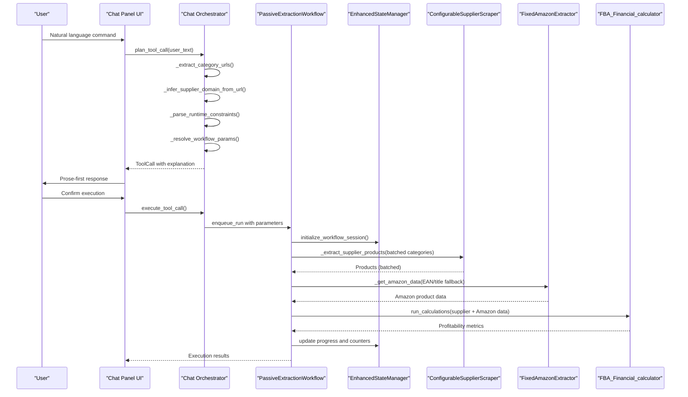
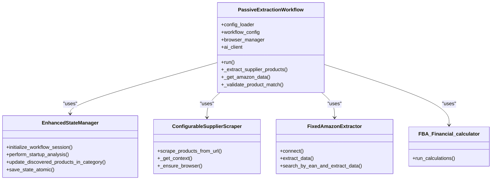
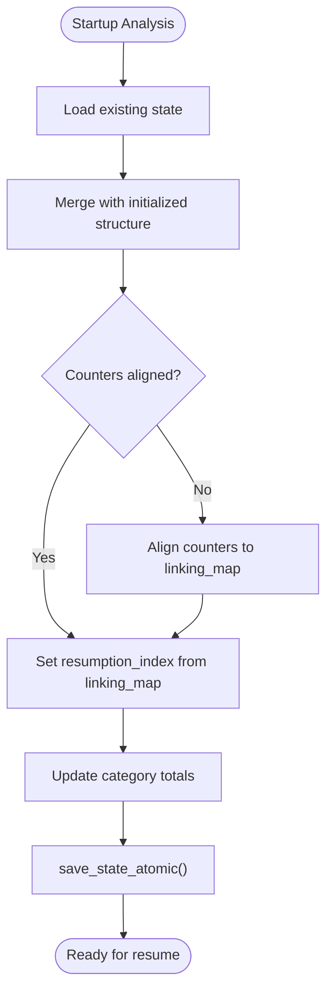
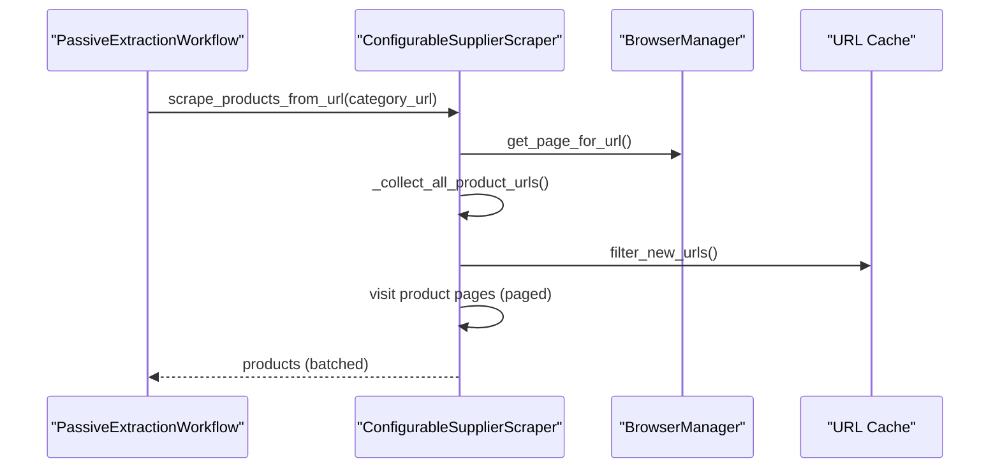
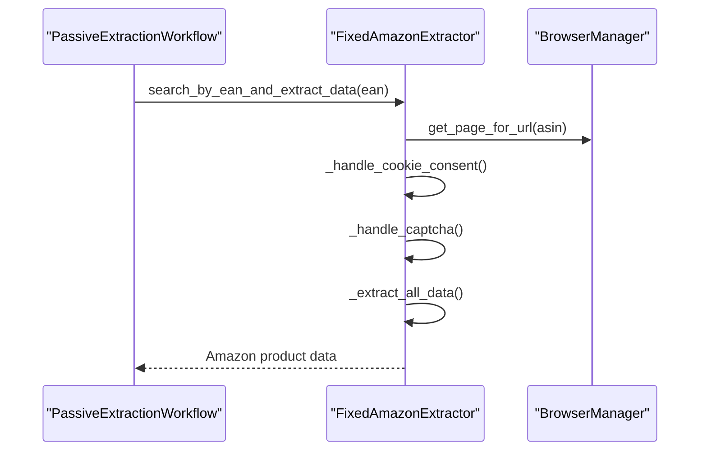
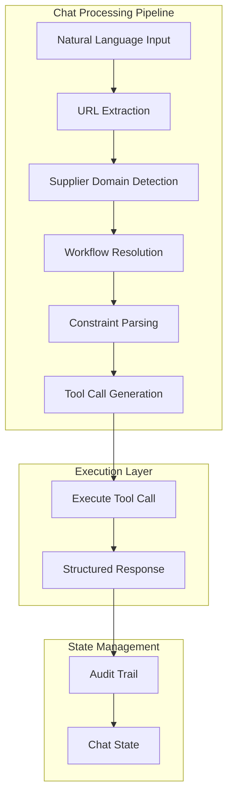
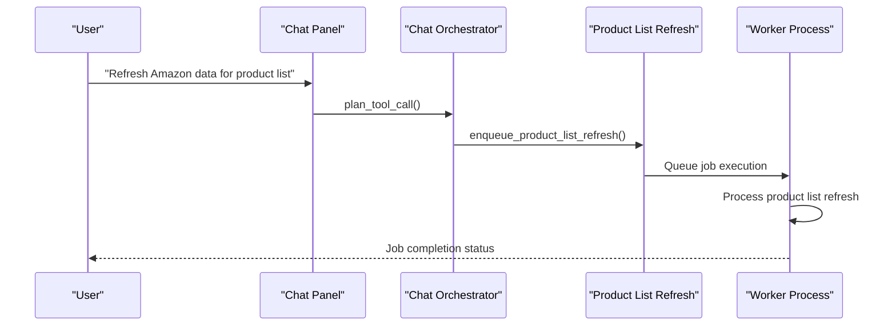
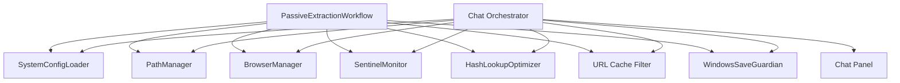

# Workflow Engine

<cite>
**Referenced Files in This Document**
- [passive_extraction_workflow_latest.py](file://tools/passive_extraction_workflow_latest.py)
- [fixed_enhanced_state_manager.py](file://utils/fixed_enhanced_state_manager.py)
- [configurable_supplier_scraper.py](file://tools/configurable_supplier_scraper.py)
- [amazon_playwright_extractor.py](file://tools/amazon_playwright_extractor.py)
- [run_custom_poundwholesale.py](file://run_custom_poundwholesale.py)
- [FBA_Financial_calculator.py](file://tools/FBA_Financial_calculator.py)
- [chat_orchestrator.py](file://control_plane/chat_orchestrator.py)
- [chat_panel.py](file://dashboard/chat_panel.py)
- [product_list_refresh.py](file://control_plane/tools/product_list_refresh.py)
- [path_manager.py](file://utils/path_manager.py)
- [system_config_loader.py](file://config/system_config_loader.py)
- [BrowserManager](file://utils/browser_manager.py)
- [SentinelMonitor](file://utils/sentinel_monitor.py)
- [HashLookupOptimizer](file://utils/hash_lookup_optimizer.py)
- [url_cache_filter.py](file://utils/url_cache_filter.py)
- [windows_save_guardian.py](file://utils/windows_save_guardian.py)
</cite>

## Update Summary
**Changes Made**
- Added new chat orchestrator system with sophisticated tool selection and natural language processing
- Integrated automatic supplier domain detection and dynamic workflow resolution
- Enhanced workflow management with intelligent constraint parsing
- Added product list refresh workflow capabilities
- Updated architecture diagrams to reflect new conversational control plane UI
- Enhanced state management with chat-based workflow orchestration

## Table of Contents
1. [Introduction](#introduction)
2. [Project Structure](#project-structure)
3. [Core Components](#core-components)
4. [Architecture Overview](#architecture-overview)
5. [Detailed Component Analysis](#detailed-component-analysis)
6. [Chat Orchestrator System](#chat-orchestrator-system)
7. [Dependency Analysis](#dependency-analysis)
8. [Performance Considerations](#performance-considerations)
9. [Troubleshooting Guide](#troubleshooting-guide)
10. [Conclusion](#conclusion)

## Introduction
This document describes the Workflow Engine component responsible for orchestrating the multi-stage product sourcing workflow. The PassiveExtractionWorkflow class is the central orchestrator that manages deterministic execution using predefined category lists, batched supplier scraping with configurable batch sizes, and stateful resume capability. The workflow now integrates with an advanced chat orchestrator system that provides natural language processing, automatic supplier domain detection, dynamic workflow resolution, and intelligent constraint parsing. The system supports sophisticated tool selection with prose-first responses and deterministic execution patterns.

## Project Structure
The Workflow Engine now operates within a comprehensive control plane architecture that includes both traditional workflow execution and conversational AI-driven orchestration. The system coordinates between the PassiveExtractionWorkflow for traditional batch processing and the Chat Orchestrator for natural language-driven workflow management.

```mermaid
graph TB
subgraph "Control Plane"
CO["Chat Orchestrator<br/>control_plane/chat_orchestrator.py"]
CP["Chat Panel UI<br/>dashboard/chat_panel.py"]
PLR["Product List Refresh<br/>control_plane/tools/product_list_refresh.py"]
end
subgraph "Traditional Workflow"
PEW["PassiveExtractionWorkflow<br/>tools/passive_extraction_workflow_latest.py"]
CSS["ConfigurableSupplierScraper<br/>tools/configurable_supplier_scraper.py"]
FAE["FixedAmazonExtractor<br/>tools/amazon_playwright_extractor.py"]
FC["FBA_Financial_calculator<br/>tools/FBA_Financial_calculator.py"]
end
subgraph "State Management"
SEM["EnhancedStateManager<br/>utils/fixed_enhanced_state_manager.py"]
end
subgraph "Supporting Utilities"
BM["BrowserManager<br/>utils/browser_manager.py"]
PM["PathManager<br/>utils/path_manager.py"]
SG["WindowsSaveGuardian<br/>utils/windows_save_guardian.py"]
HLO["HashLookupOptimizer<br/>utils/hash_lookup_optimizer.py"]
UCF["URL Cache Filter<br/>utils/url_cache_filter.py"]
SM["SentinelMonitor<br/>utils/sentinel_monitor.py"]
end
subgraph "Configuration"
SCL["SystemConfigLoader<br/>config/system_config_loader.py"]
end
CO --> CP
CO --> PLR
CO --> SCL
PEW --> CSS
PEW --> FAE
PEW --> FC
PEW --> SEM
PEW --> SCL
PEW --> PM
PEW --> BM
PEW --> SG
PEW --> HLO
PEW --> UCF
PEW --> SM
```

**Diagram sources**
- [chat_orchestrator.py](file://control_plane/chat_orchestrator.py#L1-L120)
- [chat_panel.py](file://dashboard/chat_panel.py#L1-L200)
- [product_list_refresh.py](file://control_plane/tools/product_list_refresh.py#L1-L148)
- [passive_extraction_workflow_latest.py](file://tools/passive_extraction_workflow_latest.py#L1-L120)

## Core Components
- **PassiveExtractionWorkflow**: Central orchestrator managing supplier scraping, Amazon data retrieval, financial analysis, and state persistence with deterministic execution patterns.
- **EnhancedStateManager**: Provides thread-safe, atomic state persistence with resume capability, progress tracking, and metrics.
- **ConfigurableSupplierScraper**: Supplier-side scraper using Playwright with selector-driven extraction and optional AI fallbacks.
- **FixedAmazonExtractor**: Amazon-side extractor leveraging BrowserManager and extension data for comprehensive product information.
- **FBA_Financial_calculator**: Computes profitability metrics to filter profitable products.
- **Chat Orchestrator**: Advanced natural language processing system with automatic supplier domain detection, dynamic workflow resolution, and intelligent constraint parsing.
- **Product List Refresh**: Specialized workflow for refreshing Amazon data for existing product lists.
- **Chat Panel UI**: Streamlit-based conversational interface with prose-first responses and deterministic tool execution.
- **Supporting utilities**: Path management, browser management, sentinel monitoring, hash optimization, URL caching, and atomic file operations.

**Section sources**
- [passive_extraction_workflow_latest.py](file://tools/passive_extraction_workflow_latest.py#L851-L2650)
- [chat_orchestrator.py](file://control_plane/chat_orchestrator.py#L1-L800)
- [chat_panel.py](file://dashboard/chat_panel.py#L1-L200)

## Architecture Overview
The workflow follows a hybrid architecture combining deterministic traditional processing with conversational AI orchestration:
- **Traditional Workflow**: Deterministic execution using predefined category lists, batched supplier scraping, and stateful resume capability.
- **Chat Orchestrator**: Natural language processing with automatic supplier domain detection, dynamic workflow resolution, and intelligent constraint parsing.
- **Integration Layer**: Seamless coordination between chat-driven commands and traditional workflow execution.
- **State Management**: Unified state persistence across both traditional and chat-driven workflows.

**Diagram sources**
- [chat_orchestrator.py](file://control_plane/chat_orchestrator.py#L380-L551)
- [chat_panel.py](file://dashboard/chat_panel.py#L136-L200)
- [passive_extraction_workflow_latest.py](file://tools/passive_extraction_workflow_latest.py#L2318-L2525)

## Detailed Component Analysis

### PassiveExtractionWorkflow
The PassiveExtractionWorkflow class orchestrates the entire workflow with enhanced integration with the chat system:
- **Initialization and configuration**: Loads system_config.json, sets paths, and prepares browser and AI clients.
- **Deterministic execution**: Uses predefined category lists and batch sizes for supplier extraction.
- **Supplier scraping**: Processes categories in batches, filters by price range, and resumes from last processed index.
- **Amazon data retrieval**: Implements EAN-first search with title similarity validation as fallback.
- **Financial analysis**: Integrates FBA financial calculator to assess profitability.
- **State persistence**: Periodically saves state and linking map using atomic file operations.
- **Reporting**: Produces JSON and CSV reports summarizing profitable products and financial analysis.

**Diagram sources**
- [passive_extraction_workflow_latest.py](file://tools/passive_extraction_workflow_latest.py#L851-L2650)

**Section sources**
- [passive_extraction_workflow_latest.py](file://tools/passive_extraction_workflow_latest.py#L851-L2650)

### EnhancedStateManager
The EnhancedStateManager provides:
- Thread-safe, atomic state persistence with re-entrant locks and file-based atomic operations.
- Startup analysis to reconcile counters and resume from correct positions.
- Real-time category product count updates and progress tracking.
- Metrics emission and cross-run monotonicity checks to prevent regressions.

**Diagram sources**
- [fixed_enhanced_state_manager.py](file://utils/fixed_enhanced_state_manager.py#L469-L646)

**Section sources**
- [fixed_enhanced_state_manager.py](file://utils/fixed_enhanced_state_manager.py#L86-L240)
- [fixed_enhanced_state_manager.py](file://utils/fixed_enhanced_state_manager.py#L247-L284)
- [fixed_enhanced_state_manager.py](file://utils/fixed_enhanced_state_manager.py#L469-L646)

### ConfigurableSupplierScraper
The ConfigurableSupplierScraper:
- Uses Playwright via BrowserManager for robust, anti-bot evasion scraping.
- Applies selector-driven extraction with AI fallbacks and dynamic content handling.
- Implements memory management and URL pre-filtering to reduce redundant page visits.
- Supports progress callbacks and integration with state manager for real-time updates.

**Diagram sources**
- [configurable_supplier_scraper.py](file://tools/configurable_supplier_scraper.py#L477-L768)

**Section sources**
- [configurable_supplier_scraper.py](file://tools/configurable_supplier_scraper.py#L82-L170)
- [configurable_supplier_scraper.py](file://tools/configurable_supplier_scraper.py#L477-L768)

### FixedAmazonExtractor
The FixedAmazonExtractor:
- Leverages BrowserManager for centralized Chrome control and extension stability.
- Implements EAN-first search with sponsored ad filtering and title similarity scoring.
- Handles cookie consent, CAPTCHA resolution, and extension data waits.
- Reuses pages to maintain extension functionality across extractions.

**Diagram sources**
- [amazon_playwright_extractor.py](file://tools/amazon_playwright_extractor.py#L317-L466)

**Section sources**
- [amazon_playwright_extractor.py](file://tools/amazon_playwright_extractor.py#L63-L122)
- [amazon_playwright_extractor.py](file://tools/amazon_playwright_extractor.py#L317-L466)

### Financial Analysis Integration
The workflow integrates the FBA_Financial_calculator to compute profitability metrics. Inputs include combined supplier and Amazon data, and outputs drive the decision to mark a product as profitable and persist it in the linking map.

**Section sources**
- [passive_extraction_workflow_latest.py](file://tools/passive_extraction_workflow_latest.py#L2437-L2525)
- [FBA_Financial_calculator.py](file://tools/FBA_Financial_calculator.py)

## Chat Orchestrator System

### Overview
The chat orchestrator system provides a sophisticated conversational interface for workflow management with natural language processing capabilities. It automatically detects supplier domains, resolves dynamic workflows, and parses intelligent constraints from user input.

### Key Features
- **Natural Language Processing**: Parses user commands to extract meaningful intent and parameters.
- **Automatic Supplier Domain Detection**: Extracts supplier domains from URLs and validates against system configuration.
- **Dynamic Workflow Resolution**: Maps supplier domains to appropriate workflow keys and runner scripts.
- **Intelligent Constraint Parsing**: Extracts product limits and constraints from natural language input.
- **Prose-First Responses**: Provides human-readable explanations alongside structured tool execution.

### Architecture Components

**Diagram sources**
- [chat_orchestrator.py](file://control_plane/chat_orchestrator.py#L380-L551)

### Tool Selection and Execution
The chat orchestrator supports both read and write operations with deterministic execution patterns:

**Read Tools**:
- `ask_clarify`: Requests clarification for ambiguous inputs
- `query_financial`: Financial data queries with filtering
- `show_status`: Run status monitoring
- `tail_logs`: Log file monitoring
- `show_trace_summary`: Execution trace analysis
- `read_processing_state`: State file inspection
- `find_cached_products`: Product cache queries
- `find_linking_entries`: Linking map searches
- `read_amazon_cache_by_asin`: Amazon cache lookup
- `run_readiness_check`: System readiness validation
- `onboarding_sanity_check`: Onboarding validation
- `read_repo_file`: Repository file inspection
- `list_repo_dir`: Directory listing

**Write Tools**:
- `enqueue_run`: Queue workflow execution with parameters
- `cancel_run`: Cancel running or pending jobs
- `enqueue_onboarding`: Start supplier onboarding process
- `enqueue_product_list_refresh`: Refresh Amazon data for product lists

### Natural Language Processing Capabilities

The system excels at parsing natural language constraints:

**Max Products Constraints**:
- "Limit to 50 products"
- "First 100 products only"
- "Up to 25 products maximum"
- "Process no more than 75 products"

**Products Per Category Constraints**:
- "Products per category: 10"
- "Max 5 products per category"
- "Set products per category to 15"

**Intelligent Pattern Recognition**:
- "Analyze only the first 20 products"
- "Run sandboxed category analysis for these URLs"
- "Refresh Amazon data for this product list"

**Section sources**
- [chat_orchestrator.py](file://control_plane/chat_orchestrator.py#L196-L318)
- [chat_orchestrator.py](file://control_plane/chat_orchestrator.py#L321-L377)
- [chat_orchestrator.py](file://control_plane/chat_orchestrator.py#L558-L941)

### Product List Refresh Workflow
The system includes a specialized workflow for refreshing Amazon data for existing product lists:

**Diagram sources**
- [product_list_refresh.py](file://control_plane/tools/product_list_refresh.py#L34-L148)

**Section sources**
- [product_list_refresh.py](file://control_plane/tools/product_list_refresh.py#L1-L148)

### Chat Panel Interface
The Streamlit-based chat panel provides a conversational interface with:
- **Prose-First Responses**: Human-readable explanations for all actions
- **Confirmation Prompts**: Write operations require explicit confirmation
- **Structured JSON Display**: Tool outputs available in expandable JSON viewers
- **RAG Integration**: Optional retrieval-augmented generation for enhanced context
- **Audit Trail**: Complete logging of all tool executions

**Section sources**
- [chat_panel.py](file://dashboard/chat_panel.py#L1-L200)

## Dependency Analysis
The PassiveExtractionWorkflow and Chat Orchestrator system depend on:
- System configuration loader for operational parameters and integrations.
- Path manager for consistent output paths.
- BrowserManager for shared Chrome control.
- Sentinel monitor for system health insights.
- HashLookupOptimizer for efficient lookups.
- URL cache filter for pre-filtering known URLs.
- WindowsSaveGuardian for atomic file writes.
- Chat orchestrator for natural language processing and tool selection.

**Diagram sources**
- [passive_extraction_workflow_latest.py](file://tools/passive_extraction_workflow_latest.py#L173-L184)
- [chat_orchestrator.py](file://control_plane/chat_orchestrator.py#L1-L40)
- [chat_panel.py](file://dashboard/chat_panel.py#L1-L20)

**Section sources**
- [passive_extraction_workflow_latest.py](file://tools/passive_extraction_workflow_latest.py#L173-L184)
- [chat_orchestrator.py](file://control_plane/chat_orchestrator.py#L1-L40)

## Performance Considerations
- **Memory management**: ConfigurableSupplierScraper implements aggressive memory cleanup and periodic local list clearing to prevent accumulation during long scraping sessions.
- **Batched processing**: Supplier extraction uses configurable batch sizes to balance throughput and stability.
- **Atomic persistence**: WindowsSaveGuardian ensures crash-safe state writes, minimizing partial writes and corruption risks.
- **Hash optimization**: HashLookupOptimizer enables O(1) performance for lookups, improving matching and filtering efficiency.
- **Browser lifecycle**: Reuse of pages and centralized BrowserManager reduces overhead and maintains extension state.
- **Chat system optimization**: Natural language processing includes RAG integration for enhanced context without compromising performance.
- **Constraint parsing efficiency**: Intelligent constraint extraction minimizes processing overhead while maximizing user convenience.

**Section sources**
- [configurable_supplier_scraper.py](file://tools/configurable_supplier_scraper.py#L638-L721)
- [windows_save_guardian.py](file://utils/windows_save_guardian.py)
- [HashLookupOptimizer](file://utils/hash_lookup_optimizer.py)
- [chat_orchestrator.py](file://control_plane/chat_orchestrator.py#L321-L377)

## Troubleshooting Guide
- **State corruption**: EnhancedStateManager includes validation and repair routines to detect and align counters, preserving monotonicity across runs.
- **Resume issues**: Startup analysis reconciles linking map counts and category completion status to determine correct resume position.
- **Browser instability**: FixedAmazonExtractor and ConfigurableSupplierScraper leverage BrowserManager health checks and circuit breakers to recover from failures.
- **Authentication problems**: ConfigurableSupplierScraper supports authentication callbacks and proactive checks to maintain session validity.
- **Performance bottlenecks**: Use HashLookupOptimizer and URL cache filtering to minimize redundant operations; adjust batch sizes and timeouts via system_config.json.
- **Chat system issues**: Natural language processing includes fallback mechanisms and error recovery for ambiguous inputs.
- **Workflow resolution failures**: Automatic supplier domain detection and dynamic workflow resolution provide clear error messages for misconfigured suppliers.

**Section sources**
- [fixed_enhanced_state_manager.py](file://utils/fixed_enhanced_state_manager.py#L665-L736)
- [fixed_enhanced_state_manager.py](file://utils/fixed_enhanced_state_manager.py#L469-L646)
- [amazon_playwright_extractor.py](file://tools/amazon_playwright_extractor.py#L321-L337)
- [configurable_supplier_scraper.py](file://tools/configurable_supplier_scraper.py#L594-L626)
- [chat_orchestrator.py](file://control_plane/chat_orchestrator.py#L470-L511)

## Conclusion
The Workflow Engine now delivers a comprehensive, dual-mode system that combines deterministic, stateful, and resilient multi-stage product sourcing with sophisticated conversational AI orchestration. The PassiveExtractionWorkflow continues to provide reliable traditional processing, while the new chat orchestrator system enhances accessibility through natural language processing, automatic supplier domain detection, dynamic workflow resolution, and intelligent constraint parsing. Integration with EnhancedStateManager, ConfigurableSupplierScraper, and FixedAmazonExtractor ensures scalability, reliability, and maintainability for both traditional and conversational workflow management scenarios.