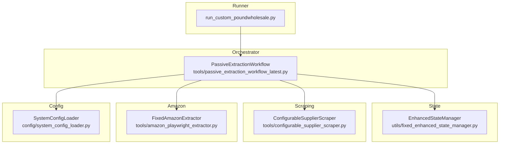
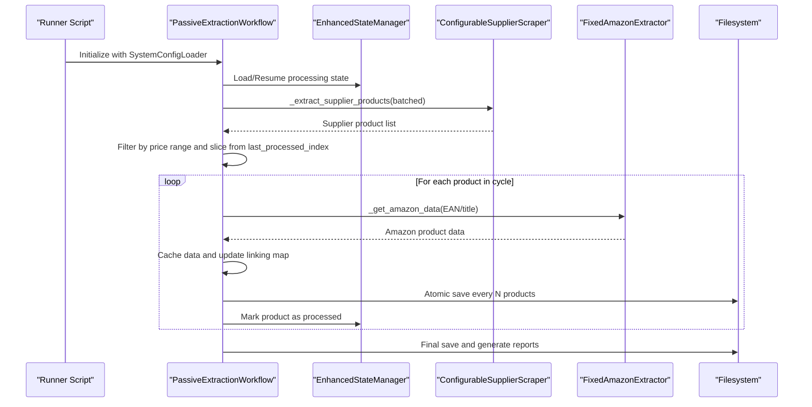
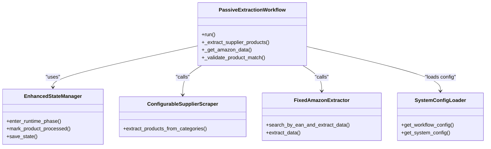
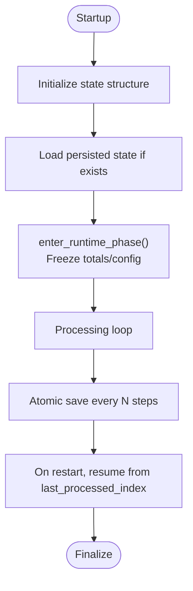
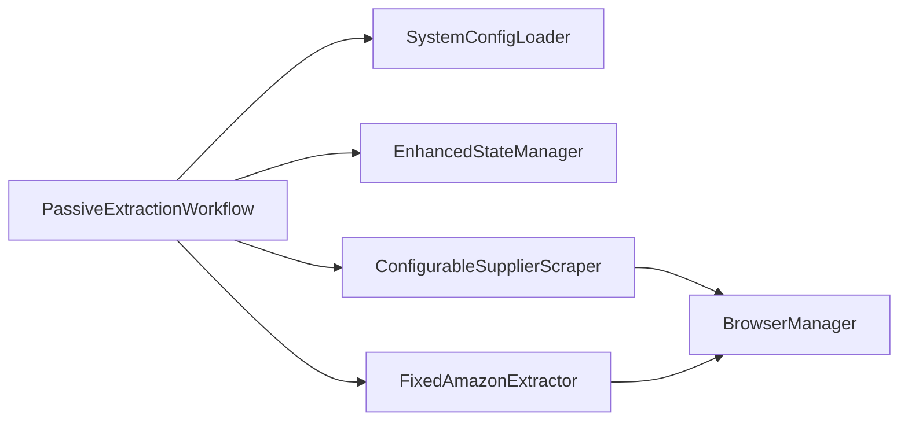

# Workflow Overview

<cite>
**Referenced Files in This Document**
- [passive_extraction_workflow_latest.py](file://tools/passive_extraction_workflow_latest.py)
- [fixed_enhanced_state_manager.py](file://utils/fixed_enhanced_state_manager.py)
- [configurable_supplier_scraper.py](file://tools/configurable_supplier_scraper.py)
- [amazon_playwright_extractor.py](file://tools/amazon_playwright_extractor.py)
- [system_config_loader.py](file://config/system_config_loader.py)
- [Workflow Orchestration API.md](file://WIKI REPO SEPT17/10. Api Reference/10.1. Workflow Orchestration Api.md)
- [3. Core Architecture - Workflow Engine.md](file://wiki repo 19 nov/3. Core Architecture/3.1. Workflow Engine.md)
</cite>

## Table of Contents
1. [Introduction](#introduction)
2. [Project Structure](#project-structure)
3. [Core Components](#core-components)
4. [Architecture Overview](#architecture-overview)
5. [Detailed Component Analysis](#detailed-component-analysis)
6. [Dependency Analysis](#dependency-analysis)
7. [Performance Considerations](#performance-considerations)
8. [Troubleshooting Guide](#troubleshooting-guide)
9. [Conclusion](#conclusion)

## Introduction
This document explains the Workflow Engine’s central orchestrator: the PassiveExtractionWorkflow class. It describes how the workflow deterministically executes a multi-stage product sourcing pipeline—starting from supplier category scraping, through Amazon data retrieval and financial analysis, to periodic state persistence and final reporting. The workflow emphasizes:
- Deterministic execution using predefined category lists
- Batched supplier scraping with configurable batch sizes
- Stateful resume capability for long-running runs
- Integration with EnhancedStateManager, ConfigurableSupplierScraper, and FixedAmazonExtractor
- Memory management, error handling, and progress tracking

## Project Structure
The workflow is implemented as a self-contained engine driven by a centralized configuration file. The runner script acts as a simple trigger, while the orchestrator class coordinates all stages.

**Diagram sources**
- [passive_extraction_workflow_latest.py](file://tools/passive_extraction_workflow_latest.py#L1-L120)
- [fixed_enhanced_state_manager.py](file://utils/fixed_enhanced_state_manager.py#L86-L147)
- [configurable_supplier_scraper.py](file://tools/configurable_supplier_scraper.py#L82-L166)
- [amazon_playwright_extractor.py](file://tools/amazon_playwright_extractor.py#L63-L96)
- [system_config_loader.py](file://config/system_config_loader.py#L9-L54)

**Section sources**
- [passive_extraction_workflow_latest.py](file://tools/passive_extraction_workflow_latest.py#L1-L120)
- [Workflow Orchestration API.md](file://WIKI REPO SEPT17/10. Api Reference/10.1. Workflow Orchestration Api.md#L293-L334)

## Core Components
- PassiveExtractionWorkflow: Central orchestrator that loads configuration, controls scraping and analysis loops, and persists state.
- EnhancedStateManager: Provides thread-safe, atomic state persistence and resume tracking.
- ConfigurableSupplierScraper: Supplier-side scraping with Playwright, selector-driven extraction, and optional AI fallback.
- FixedAmazonExtractor: Amazon-side extraction with cookie/CAPTCHA handling and extension-aware data retrieval.
- SystemConfigLoader: Loads and exposes system-wide configuration for the workflow.

**Section sources**
- [passive_extraction_workflow_latest.py](file://tools/passive_extraction_workflow_latest.py#L40-L51)
- [fixed_enhanced_state_manager.py](file://utils/fixed_enhanced_state_manager.py#L86-L147)
- [configurable_supplier_scraper.py](file://tools/configurable_supplier_scraper.py#L82-L166)
- [amazon_playwright_extractor.py](file://tools/amazon_playwright_extractor.py#L63-L96)
- [system_config_loader.py](file://config/system_config_loader.py#L9-L54)

## Architecture Overview
The workflow follows a deterministic, batched, stateful execution model:
- Initialization: Load system configuration and initialize state manager.
- Predefined categories: Use a curated category list to ensure repeatable runs.
- Batched supplier scraping: Process categories in chunks controlled by a configurable batch size.
- Resume-aware processing: Start from the last processed index and continue.
- Amazon matching: EAN-first search with title-similarity validation as fallback.
- Financial analysis: Calculate profitability metrics for matched items.
- Periodic persistence: Atomic writes of linking map and processing state at configurable intervals.
- Finalization: Produce JSON and CSV reports summarizing results.

**Diagram sources**
- [passive_extraction_workflow_latest.py](file://tools/passive_extraction_workflow_latest.py#L21-L33)
- [passive_extraction_workflow_latest.py](file://tools/passive_extraction_workflow_latest.py#L40-L51)
- [passive_extraction_workflow_latest.py](file://tools/passive_extraction_workflow_latest.py#L42-L44)
- [passive_extraction_workflow_latest.py](file://tools/passive_extraction_workflow_latest.py#L2318-L2525)
- [fixed_enhanced_state_manager.py](file://utils/fixed_enhanced_state_manager.py#L148-L200)

## Detailed Component Analysis

### PassiveExtractionWorkflow
Responsibilities:
- Load system configuration and initialize services.
- Manage deterministic execution using predefined categories.
- Drive batched supplier scraping and resume-aware processing.
- Orchestrate Amazon data retrieval and financial analysis.
- Persist state periodically and at completion.

Key methods and roles:
- run(): Main execution entry point that coordinates the entire workflow lifecycle.
- _extract_supplier_products(): Processes category URLs in batches controlled by supplier_extraction_batch_size.
- _get_amazon_data(): Implements EAN-first search with title-similarity validation.
- Integration points: EnhancedStateManager for resume and metrics, ConfigurableSupplierScraper for supplier data, FixedAmazonExtractor for Amazon data.

**Diagram sources**
- [passive_extraction_workflow_latest.py](file://tools/passive_extraction_workflow_latest.py#L40-L51)
- [passive_extraction_workflow_latest.py](file://tools/passive_extraction_workflow_latest.py#L42-L44)
- [passive_extraction_workflow_latest.py](file://tools/passive_extraction_workflow_latest.py#L851-L1050)
- [fixed_enhanced_state_manager.py](file://utils/fixed_enhanced_state_manager.py#L86-L147)
- [configurable_supplier_scraper.py](file://tools/configurable_supplier_scraper.py#L82-L166)
- [amazon_playwright_extractor.py](file://tools/amazon_playwright_extractor.py#L63-L96)
- [system_config_loader.py](file://config/system_config_loader.py#L9-L54)

**Section sources**
- [passive_extraction_workflow_latest.py](file://tools/passive_extraction_workflow_latest.py#L40-L51)
- [passive_extraction_workflow_latest.py](file://tools/passive_extraction_workflow_latest.py#L851-L1050)
- [passive_extraction_workflow_latest.py](file://tools/passive_extraction_workflow_latest.py#L2318-L2525)

### EnhancedStateManager
Responsibilities:
- Thread-safe, atomic state persistence for resume capability.
- Separate resumption index from progress tracking.
- Real-time category product counts and metrics.
- One-way runtime phase latch to freeze configuration and totals.

Key behaviors:
- enter_runtime_phase(): Freezes configuration and prevents recomputation during runtime.
- Atomic save methods with file locking and fallbacks.
- Metrics logging for observability.

**Diagram sources**
- [fixed_enhanced_state_manager.py](file://utils/fixed_enhanced_state_manager.py#L148-L200)
- [fixed_enhanced_state_manager.py](file://utils/fixed_enhanced_state_manager.py#L103-L147)

**Section sources**
- [fixed_enhanced_state_manager.py](file://utils/fixed_enhanced_state_manager.py#L86-L147)
- [fixed_enhanced_state_manager.py](file://utils/fixed_enhanced_state_manager.py#L148-L200)

### ConfigurableSupplierScraper
Responsibilities:
- Playwright-based supplier scraping with selector-driven extraction.
- Optional AI-powered fallback extraction.
- Shared browser management integration.
- Rate limiting and request timing.

Integration with workflow:
- Called by PassiveExtractionWorkflow to fetch supplier product data in batches.

**Section sources**
- [configurable_supplier_scraper.py](file://tools/configurable_supplier_scraper.py#L82-L166)
- [configurable_supplier_scraper.py](file://tools/configurable_supplier_scraper.py#L1-L200)

### FixedAmazonExtractor
Responsibilities:
- Amazon product page extraction with cookie consent and CAPTCHA handling.
- Extension-aware data retrieval and caching.
- Centralized browser connection via BrowserManager.

Integration with workflow:
- Called by PassiveExtractionWorkflow to retrieve Amazon data for supplier products.

**Section sources**
- [amazon_playwright_extractor.py](file://tools/amazon_playwright_extractor.py#L63-L96)
- [amazon_playwright_extractor.py](file://tools/amazon_playwright_extractor.py#L1-L200)

### SystemConfigLoader
Responsibilities:
- Load system_config.json and expose granular configuration accessors.
- Provide workflow-specific configuration and financial report batch size.

Integration with workflow:
- PassiveExtractionWorkflow loads system and workflow configuration from this loader.

**Section sources**
- [system_config_loader.py](file://config/system_config_loader.py#L9-L54)
- [system_config_loader.py](file://config/system_config_loader.py#L52-L54)

## Dependency Analysis
The workflow exhibits clear separation of concerns:
- Orchestrator depends on configuration, state, and integrations for scraping and extraction.
- State manager encapsulates persistence and resume logic.
- Scraper and extractor are pluggable components integrated via the orchestrator.
- Configuration is the single source of truth for all operational toggles.

**Diagram sources**
- [passive_extraction_workflow_latest.py](file://tools/passive_extraction_workflow_latest.py#L141-L173)
- [configurable_supplier_scraper.py](file://tools/configurable_supplier_scraper.py#L32-L41)
- [amazon_playwright_extractor.py](file://tools/amazon_playwright_extractor.py#L21-L29)

**Section sources**
- [passive_extraction_workflow_latest.py](file://tools/passive_extraction_workflow_latest.py#L141-L173)
- [configurable_supplier_scraper.py](file://tools/configurable_supplier_scraper.py#L32-L41)
- [amazon_playwright_extractor.py](file://tools/amazon_playwright_extractor.py#L21-L29)

## Performance Considerations
- Batched supplier scraping: Use supplier_extraction_batch_size to limit memory footprint and stabilize long runs.
- Atomic writes: Periodic saves reduce risk of partial state corruption and support reliable resume.
- Browser resource management: Centralized BrowserManager reduces overhead and improves stability.
- Title similarity scoring: Threshold-based validation avoids false positives and reduces retries.
- Financial report batching: financial_report_batch_size controls report granularity and I/O frequency.

[No sources needed since this section provides general guidance]

## Troubleshooting Guide
Common issues and remedies:
- Authentication failures during supplier scraping: The workflow can detect failures and trigger re-login attempts via the supplier authentication service, then retry the workflow.
- State corruption or reset: EnhancedStateManager prevents automatic index resets and preserves interruption state correctly.
- Session timeouts or browser instability: Centralized BrowserManager and circuit breaker help mitigate transient failures.
- Resume behavior: Ensure the runner script is restarted with the same configuration; the workflow detects previous state and resumes from last_processed_index.

**Section sources**
- [passive_extraction_workflow_latest.py](file://tools/passive_extraction_workflow_latest.py#L1-L20)
- [fixed_enhanced_state_manager.py](file://utils/fixed_enhanced_state_manager.py#L86-L147)

## Conclusion
The PassiveExtractionWorkflow class is the central orchestrator that coordinates a deterministic, batched, and stateful multi-stage product sourcing pipeline. By integrating EnhancedStateManager, ConfigurableSupplierScraper, and FixedAmazonExtractor, it ensures reliable resume capability, robust error handling, and efficient memory management. Configuration-driven operation and atomic persistence make it suitable for long-running, interruptible scraping tasks across complex supplier catalogs.