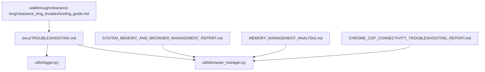
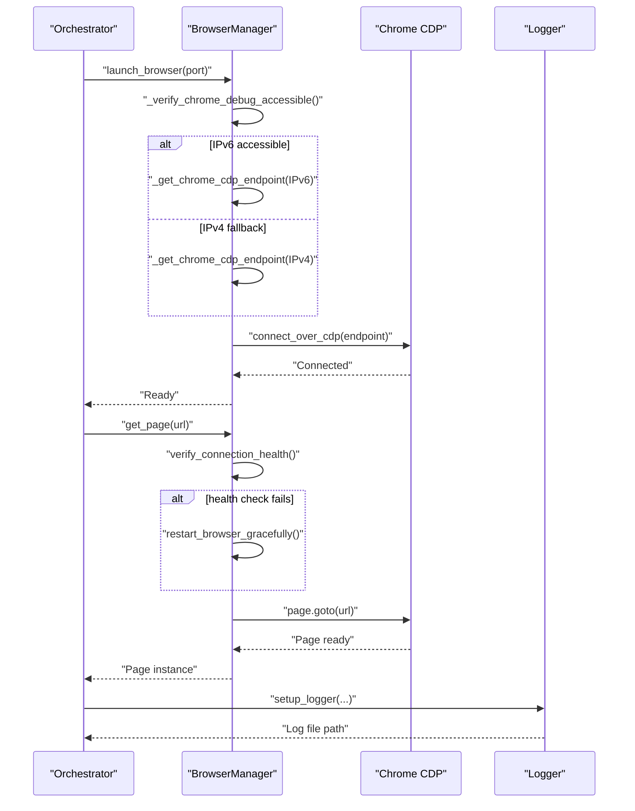
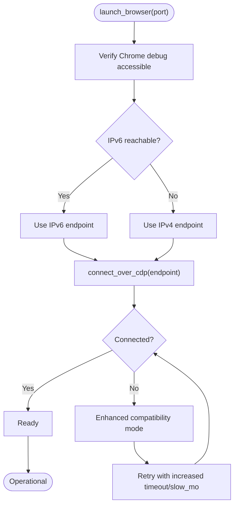
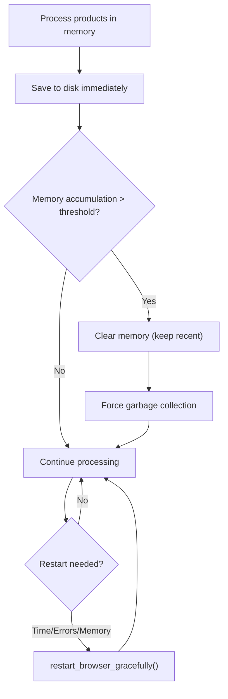
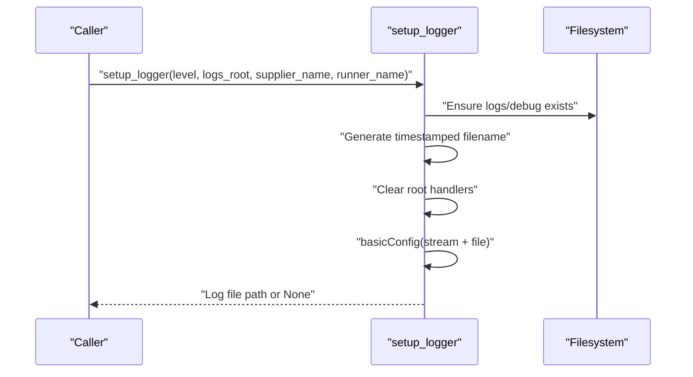
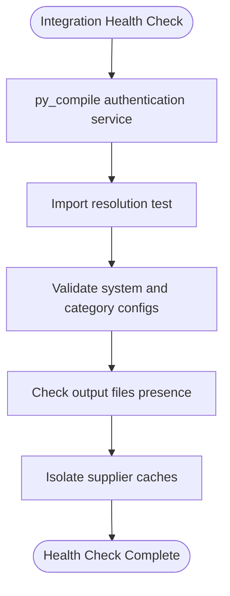
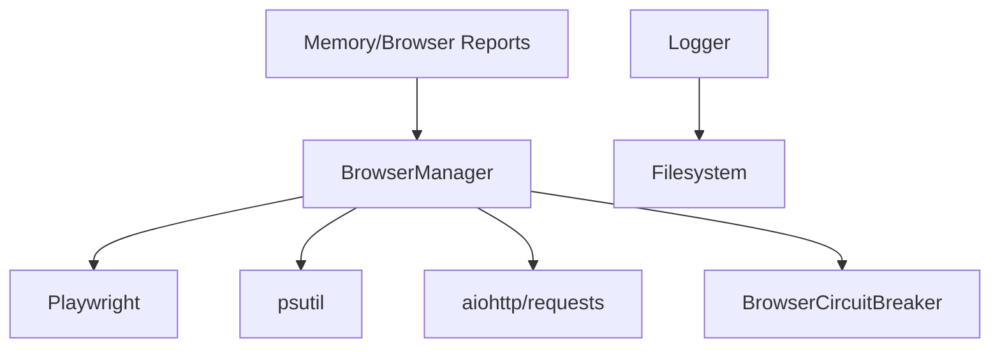

# Troubleshooting & Support

<cite>
**Referenced Files in This Document**
- [docs/TROUBLESHOOTING.md](file://docs/TROUBLESHOOTING.md)
- [utils/browser_manager.py](file://utils/browser_manager.py)
- [utils/logger.py](file://utils/logger.py)
- [SYSTEM_MEMORY_AND_BROWSER_MANAGEMENT_REPORT.md](file://SYSTEM_MEMORY_AND_BROWSER_MANAGEMENT_REPORT.md)
- [MEMORY_MANAGEMENT_ANALYSIS.md](file://MEMORY_MANAGEMENT_ANALYSIS.md)
- [CHROME_CDP_CONNECTIVITY_TROUBLESHOOTING_REPORT.md](file://CHROME_CDP_CONNECTIVITY_TROUBLESHOOTING_REPORT.md)
- [walkthrough/clearance-king/clearance_king_troubleshooting_guide.md](file://walkthrough/clearance-king/clearance_king_troubleshooting_guide.md)
</cite>

## Table of Contents
1. [Introduction](#introduction)
2. [Project Structure](#project-structure)
3. [Core Components](#core-components)
4. [Architecture Overview](#architecture-overview)
5. [Detailed Component Analysis](#detailed-component-analysis)
6. [Dependency Analysis](#dependency-analysis)
7. [Performance Considerations](#performance-considerations)
8. [Troubleshooting Guide](#troubleshooting-guide)
9. [Conclusion](#conclusion)
10. [Appendices](#appendices)

## Introduction
This document provides comprehensive troubleshooting and support guidance for the Amazon FBA Agent System v3.7+. It focuses on diagnosing and resolving common issues including Chrome debug port connectivity, memory management, authentication failures, and browser automation problems. It also includes performance optimization guidance, system health monitoring, preventive maintenance, and escalation procedures.

## Project Structure
The troubleshooting content is distributed across:
- Centralized troubleshooting guide with quick checks and categorized resolutions
- Browser manager with built-in health checks, restart logic, and Chrome CDP compatibility
- Logger utility for consistent log file creation and rotation
- Memory and browser management reports detailing strategies and validations
- Chrome CDP connectivity report with diagnostic steps and version-specific guidance
- Supplier-specific troubleshooting guide for integration issues

**Diagram sources**
- [docs/TROUBLESHOOTING.md](file://docs/TROUBLESHOOTING.md#L1-L934)
- [utils/browser_manager.py](file://utils/browser_manager.py#L1-L1153)
- [utils/logger.py](file://utils/logger.py#L1-L48)
- [SYSTEM_MEMORY_AND_BROWSER_MANAGEMENT_REPORT.md](file://SYSTEM_MEMORY_AND_BROWSER_MANAGEMENT_REPORT.md#L1-L246)
- [MEMORY_MANAGEMENT_ANALYSIS.md](file://MEMORY_MANAGEMENT_ANALYSIS.md#L1-L230)
- [CHROME_CDP_CONNECTIVITY_TROUBLESHOOTING_REPORT.md](file://CHROME_CDP_CONNECTIVITY_TROUBLESHOOTING_REPORT.md#L1-L126)
- [walkthrough/clearance-king/clearance_king_troubleshooting_guide.md](file://walkthrough/clearance-king/clearance_king_troubleshooting_guide.md#L1-L392)

**Section sources**
- [docs/TROUBLESHOOTING.md](file://docs/TROUBLESHOOTING.md#L1-L934)

## Core Components
- Browser Manager: Centralizes Chrome connection, page caching, health monitoring, and automatic restarts. Implements IPv6/IPv4 CDP endpoint detection, circuit breaker protection, and enhanced compatibility modes for Chrome 139.x.
- Logger Utility: Creates timestamped log files per run, supports optional supplier or runner naming, and ensures clean root logger configuration.
- Memory and Browser Management Reports: Define the hybrid memory strategy (disk-first), smart clearing, and automatic browser restart cadence.
- Chrome CDP Connectivity Report: Documents IPv6/IPv4 endpoint selection, protocol version detection, and troubleshooting steps for Chrome 139.x.

**Section sources**
- [utils/browser_manager.py](file://utils/browser_manager.py#L1-L1153)
- [utils/logger.py](file://utils/logger.py#L1-L48)
- [SYSTEM_MEMORY_AND_BROWSER_MANAGEMENT_REPORT.md](file://SYSTEM_MEMORY_AND_BROWSER_MANAGEMENT_REPORT.md#L1-L246)
- [MEMORY_MANAGEMENT_ANALYSIS.md](file://MEMORY_MANAGEMENT_ANALYSIS.md#L1-L230)
- [CHROME_CDP_CONNECTIVITY_TROUBLESHOOTING_REPORT.md](file://CHROME_CDP_CONNECTIVITY_TROUBLESHOOTING_REPORT.md#L1-L126)

## Architecture Overview
The system integrates browser automation with robust health monitoring and memory management:
- Browser Manager connects to an existing Chrome instance via CDP, validates endpoints, and applies compatibility modes.
- Memory management persists critical state to disk while keeping memory usage bounded.
- Logging is standardized and rotated to prevent disk pressure.
- Supplier integrations include dedicated troubleshooting procedures.

**Diagram sources**
- [utils/browser_manager.py](file://utils/browser_manager.py#L77-L198)
- [utils/browser_manager.py](file://utils/browser_manager.py#L242-L300)
- [utils/browser_manager.py](file://utils/browser_manager.py#L302-L314)
- [utils/browser_manager.py](file://utils/browser_manager.py#L375-L397)
- [utils/browser_manager.py](file://utils/browser_manager.py#L477-L512)
- [utils/browser_manager.py](file://utils/browser_manager.py#L566-L622)
- [utils/browser_manager.py](file://utils/browser_manager.py#L623-L656)
- [utils/logger.py](file://utils/logger.py#L7-L47)

## Detailed Component Analysis

### Browser Manager and Chrome CDP Connectivity
Key behaviors:
- Validates CDP accessibility using IPv6 first, with IPv4 fallback for compatibility.
- Determines the correct endpoint dynamically and applies enhanced compatibility for Chrome 139.x.
- Provides detailed troubleshooting logs and steps for connection failures.
- Monitors browser memory and triggers graceful restarts based on thresholds and intervals.

**Diagram sources**
- [utils/browser_manager.py](file://utils/browser_manager.py#L242-L300)
- [utils/browser_manager.py](file://utils/browser_manager.py#L398-L428)
- [utils/browser_manager.py](file://utils/browser_manager.py#L430-L454)
- [utils/browser_manager.py](file://utils/browser_manager.py#L77-L140)

**Section sources**
- [utils/browser_manager.py](file://utils/browser_manager.py#L242-L300)
- [utils/browser_manager.py](file://utils/browser_manager.py#L398-L428)
- [utils/browser_manager.py](file://utils/browser_manager.py#L430-L454)
- [utils/browser_manager.py](file://utils/browser_manager.py#L77-L140)
- [CHROME_CDP_CONNECTIVITY_TROUBLESHOOTING_REPORT.md](file://CHROME_CDP_CONNECTIVITY_TROUBLESHOOTING_REPORT.md#L1-L126)

### Memory Management and Browser Restart Strategy
Highlights:
- Hybrid strategy: process in memory, persist to disk, then clear memory safely.
- Smart clearing preserves recent items for continuity and triggers GC.
- Automatic browser restarts every 2.5 hours, plus on memory and error thresholds.
- Authentication resilience with proactive restarts and error recovery.

**Diagram sources**
- [SYSTEM_MEMORY_AND_BROWSER_MANAGEMENT_REPORT.md](file://SYSTEM_MEMORY_AND_BROWSER_MANAGEMENT_REPORT.md#L21-L57)
- [SYSTEM_MEMORY_AND_BROWSER_MANAGEMENT_REPORT.md](file://SYSTEM_MEMORY_AND_BROWSER_MANAGEMENT_REPORT.md#L76-L109)
- [MEMORY_MANAGEMENT_ANALYSIS.md](file://MEMORY_MANAGEMENT_ANALYSIS.md#L15-L43)

**Section sources**
- [SYSTEM_MEMORY_AND_BROWSER_MANAGEMENT_REPORT.md](file://SYSTEM_MEMORY_AND_BROWSER_MANAGEMENT_REPORT.md#L11-L109)
- [MEMORY_MANAGEMENT_ANALYSIS.md](file://MEMORY_MANAGEMENT_ANALYSIS.md#L11-L96)

### Logging and Diagnostic Output
Highlights:
- Timestamped log files per run with optional supplier/runner naming.
- Stream handler and file handler configured with consistent formatting.
- Fallback behavior if setup fails.

**Diagram sources**
- [utils/logger.py](file://utils/logger.py#L7-L47)

**Section sources**
- [utils/logger.py](file://utils/logger.py#L1-L48)

### Supplier-Specific Troubleshooting (Clearance-King)
Highlights:
- Authentication service import and constructor signature validation.
- Flexible category configuration parsing supporting multiple formats.
- Processing state and product cache verification.
- Health check covering file integrity, imports, configuration, and output files.

**Diagram sources**
- [walkthrough/clearance-king/clearance_king_troubleshooting_guide.md](file://walkthrough/clearance-king/clearance_king_troubleshooting_guide.md#L324-L374)

**Section sources**
- [walkthrough/clearance-king/clearance_king_troubleshooting_guide.md](file://walkthrough/clearance-king/clearance_king_troubleshooting_guide.md#L1-L392)

## Dependency Analysis
- Browser Manager depends on:
  - Playwright for CDP connections
  - psutil for memory monitoring
  - aiohttp/requests for CDP endpoint verification
  - BrowserCircuitBreaker for resilience
- Logger depends on standard logging and filesystem APIs.
- Memory and browser management reports inform Browser Manager behavior and thresholds.

**Diagram sources**
- [utils/browser_manager.py](file://utils/browser_manager.py#L19-L26)
- [utils/browser_manager.py](file://utils/browser_manager.py#L64-L68)
- [utils/logger.py](file://utils/logger.py#L1-L10)
- [SYSTEM_MEMORY_AND_BROWSER_MANAGEMENT_REPORT.md](file://SYSTEM_MEMORY_AND_BROWSER_MANAGEMENT_REPORT.md#L197-L214)

**Section sources**
- [utils/browser_manager.py](file://utils/browser_manager.py#L19-L26)
- [utils/browser_manager.py](file://utils/browser_manager.py#L64-L68)
- [utils/logger.py](file://utils/logger.py#L1-L10)
- [SYSTEM_MEMORY_AND_BROWSER_MANAGEMENT_REPORT.md](file://SYSTEM_MEMORY_AND_BROWSER_MANAGEMENT_REPORT.md#L197-L214)

## Performance Considerations
- Prefer disk-first memory management to avoid accumulation and enable safe clearing.
- Use smart clearing with sliding window to preserve continuity while controlling memory.
- Schedule automatic browser restarts to prevent CDP degradation.
- Monitor memory usage and adjust thresholds based on workload.
- Validate logging levels and rotation to prevent disk pressure.

[No sources needed since this section provides general guidance]

## Troubleshooting Guide

### Quick Diagnostic Checklist
Run the following checks before investigating deeper:
- System compatibility test
- Chrome debug port accessibility
- Python dependencies
- Configuration validity
- Memory manager availability

**Section sources**
- [docs/TROUBLESHOOTING.md](file://docs/TROUBLESHOOTING.md#L15-L42)

### Browser & Chrome Issues
Common symptoms:
- Chrome debug port not accessible
- Browser memory issues
- Circuit breaker activation

Resolution procedures:
- Verify Chrome debug port accessibility and kill conflicting processes if needed.
- Restart browser gracefully to clear memory and resume operations.
- Reset circuit breakers if automatic recovery does not occur.

**Section sources**
- [docs/TROUBLESHOOTING.md](file://docs/TROUBLESHOOTING.md#L46-L155)
- [utils/browser_manager.py](file://utils/browser_manager.py#L77-L140)
- [utils/browser_manager.py](file://utils/browser_manager.py#L302-L314)

### Memory Management Issues
Common symptoms:
- High memory usage
- WSL memory leak

Resolution procedures:
- Verify smart memory clearing is active and monitor logs for “SMART MEMORY CLEARED”.
- Manually trigger memory cleanup if needed.
- Adjust memory thresholds in environment configuration.
- For WSL, use automatic or manual emergency cleanup and tune .wslconfig.

**Section sources**
- [docs/TROUBLESHOOTING.md](file://docs/TROUBLESHOOTING.md#L158-L258)
- [SYSTEM_MEMORY_AND_BROWSER_MANAGEMENT_REPORT.md](file://SYSTEM_MEMORY_AND_BROWSER_MANAGEMENT_REPORT.md#L11-L75)
- [MEMORY_MANAGEMENT_ANALYSIS.md](file://MEMORY_MANAGEMENT_ANALYSIS.md#L69-L122)

### Authentication Failures
Common symptoms:
- Supplier login failures
- Authentication circuit breaker activation

Resolution procedures:
- Verify credentials in configuration.
- Test authentication manually against supplier websites.
- Clear authentication cache and restart browser.
- Reset authentication circuit breaker if suspended.

**Section sources**
- [docs/TROUBLESHOOTING.md](file://docs/TROUBLESHOOTING.md#L261-L360)
- [walkthrough/clearance-king/clearance_king_troubleshooting_guide.md](file://walkthrough/clearance-king/clearance_king_troubleshooting_guide.md#L248-L321)

### File & Data Issues
Common symptoms:
- Missing output files
- Corrupted configuration files

Resolution procedures:
- Create missing directories and fix file permissions.
- Validate JSON syntax and restore from backups if needed.
- Reset to minimal configuration when necessary.

**Section sources**
- [docs/TROUBLESHOOTING.md](file://docs/TROUBLESHOOTING.md#L363-L467)

### Python & Dependency Issues
Common symptoms:
- Import errors
- Playwright browser issues

Resolution procedures:
- Reinstall dependencies and ensure Playwright browser installation.
- Recreate virtual environments if path issues are suspected.
- Install system dependencies for Linux/WSL.

**Section sources**
- [docs/TROUBLESHOOTING.md](file://docs/TROUBLESHOOTING.md#L470-L558)

### Performance Issues
Common symptoms:
- Slow processing speed
- Hash optimization not working

Resolution procedures:
- Optimize configuration for concurrency and timeouts.
- Check network connectivity and DNS resolution.
- Verify hash optimization status and rebuild indexes if needed.

**Section sources**
- [docs/TROUBLESHOOTING.md](file://docs/TROUBLESHOOTING.md#L561-L685)

### Monitoring & Logging Issues
Common symptoms:
- Missing log files
- Log files too large

Resolution procedures:
- Create log directories and verify logging configuration.
- Rotate logs and reduce log level if needed.

**Section sources**
- [docs/TROUBLESHOOTING.md](file://docs/TROUBLESHOOTING.md#L688-L752)
- [utils/logger.py](file://utils/logger.py#L7-L47)

### System-Specific Issues
Windows-specific:
- Windows Defender exclusions and running as administrator.
- Windows path length issues.

Resolution procedures:
- Add exclusions and run elevated when necessary.
- Enable long paths or shorten project paths.

**Section sources**
- [docs/TROUBLESHOOTING.md](file://docs/TROUBLESHOOTING.md#L755-L800)

### Escalation Procedures and Support Resources
- Include exact error messages, configurations, processing state, product cache counts, recent debug logs, and integration health check output when escalating.
- Reference integration-specific guides for supplier issues.

**Section sources**
- [walkthrough/clearance-king/clearance_king_troubleshooting_guide.md](file://walkthrough/clearance-king/clearance_king_troubleshooting_guide.md#L376-L392)

## Conclusion
The system employs robust mechanisms to maintain reliability: intelligent browser management with CDP compatibility, hybrid memory strategies with disk persistence, resilient authentication, and comprehensive logging. By following the diagnostic procedures and resolution workflows outlined above, most issues can be quickly identified and resolved with minimal downtime.

[No sources needed since this section summarizes without analyzing specific files]

## Appendices

### Error Codes, Warning Messages, and Meanings
- Chrome debug port accessibility failures indicate Chrome not launched with proper flags or port conflicts.
- “Circuit breaker OPENED” indicates repeated failures and temporary suspension; automatic recovery occurs after a timeout.
- Authentication circuit breaker activation indicates consecutive authentication failures; reset to resume.
- “ModuleNotFoundError” and dependency errors indicate missing or incompatible packages; reinstall dependencies.
- “Cache update failed” and “All save attempts failed” indicate persistence layer issues; verify disk writes and retry.

**Section sources**
- [docs/TROUBLESHOOTING.md](file://docs/TROUBLESHOOTING.md#L127-L155)
- [docs/TROUBLESHOOTING.md](file://docs/TROUBLESHOOTING.md#L338-L360)
- [docs/TROUBLESHOOTING.md](file://docs/TROUBLESHOOTING.md#L472-L501)
- [MEMORY_MANAGEMENT_ANALYSIS.md](file://MEMORY_MANAGEMENT_ANALYSIS.md#L187-L200)

### Preventive Maintenance Procedures
- Schedule periodic browser restarts to prevent CDP degradation.
- Monitor memory usage and adjust thresholds.
- Validate configuration syntax and rotate logs regularly.
- Keep Playwright and system dependencies updated.

**Section sources**
- [SYSTEM_MEMORY_AND_BROWSER_MANAGEMENT_REPORT.md](file://SYSTEM_MEMORY_AND_BROWSER_MANAGEMENT_REPORT.md#L167-L182)
- [docs/TROUBLESHOOTING.md](file://docs/TROUBLESHOOTING.md#L561-L616)
- [docs/TROUBLESHOOTING.md](file://docs/TROUBLESHOOTING.md#L724-L752)