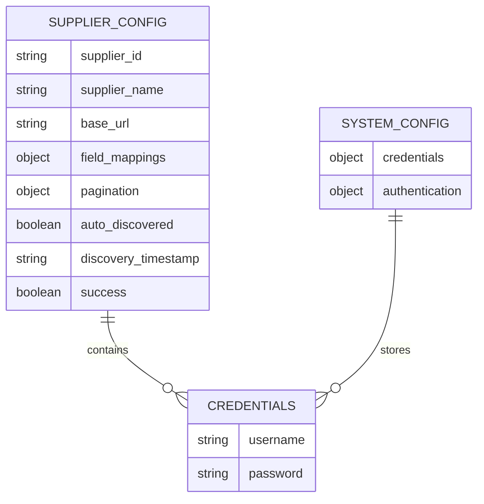
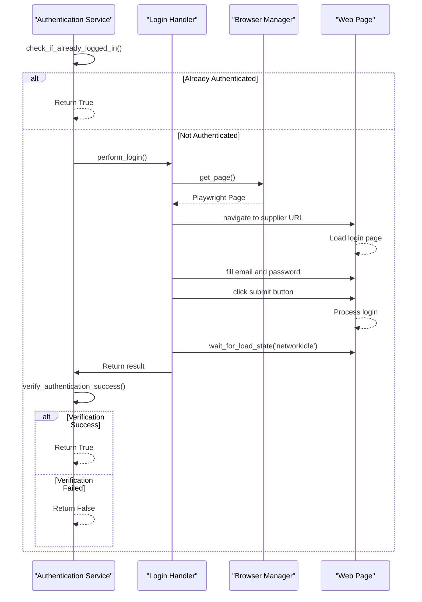
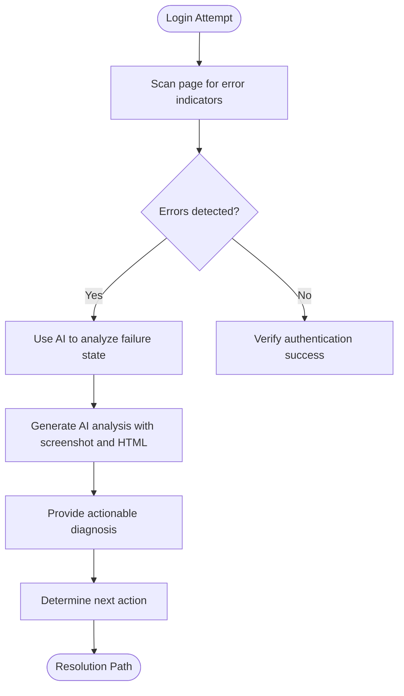
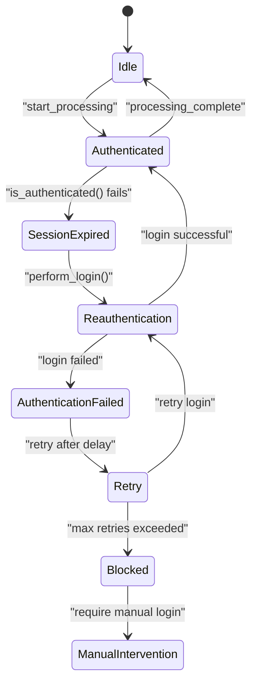

# Authentication Issues

<cite>
**Referenced Files in This Document**   
- [supplier_authentication_service.py](file://diagnostics/audit_bundle_20250905_001040/supplier_authentication_service.py)
- [supplier_script_generator.py](file://tools/supplier_script_generator.py)
- [www.poundwholesale.co.uk.json](file://config/supplier_configs/www.poundwholesale.co.uk.json)
- [system_config.json](file://config/system_config.json)
- [run_custom_poundwholesale_20250904_223041.txt](file://logs/debug/run_custom_poundwholesale_20250904_223041.txt)
</cite>

## Table of Contents
1. [Introduction](#introduction)
2. [Supplier Configuration Structure](#supplier-configuration-structure)
3. [Authentication Flow and Credential Validation](#authentication-flow-and-credential-validation)
4. [CAPTCHA and Multi-Factor Authentication Detection](#captcha-and-multi-factor-authentication-detection)
5. [Session Management and Token Refresh](#session-management-and-token-refresh)
6. [Authentication Service Logs and Failure Pattern Analysis](#authentication-service-logs-and-failure-pattern-analysis)
7. [Common Authentication Issues and Troubleshooting](#common-authentication-issues-and-troubleshooting)
8. [Conclusion](#conclusion)

## Introduction
This document provides a comprehensive guide to diagnosing and resolving authentication issues encountered during supplier website login attempts within the Amazon FBA Agent System. It focuses on the poundwholesale.co.uk supplier as a primary example, detailing credential verification, CAPTCHA detection, session handling, and log analysis. The system leverages automated browser workflows and structured configuration files to maintain authenticated sessions for data extraction. This guide outlines the mechanisms used to detect authentication states, handle failures, and ensure reliable access to supplier pricing and product data.

## Supplier Configuration Structure
The authentication process begins with properly structured supplier configuration files that define the supplier's domain, base URL, and credentials. These configurations are stored in JSON format within the `config/supplier_configs/` directory.



**Diagram sources**
- [www.poundwholesale.co.uk.json](file://config/supplier_configs/www.poundwholesale.co.uk.json)
- [system_config.json](file://config/system_config.json)

**Section sources**
- [www.poundwholesale.co.uk.json](file://config/supplier_configs/www.poundwholesale.co.uk.json)
- [system_config.json](file://config/system_config.json)

### Configuration File Example
The configuration for `poundwholesale.co.uk` includes essential authentication details:

```json
{
  "supplier_id": "poundwholesale-co-uk",
  "supplier_name": "poundwholesale-co-uk",
  "base_url": "https://www.poundwholesale.co.uk/",
  "field_mappings": { ... },
  "pagination": { ... },
  "auto_discovered": true,
  "discovery_timestamp": "2025-07-05T20:51:29.812652",
  "success": true
}
```

Credentials are securely stored in the central `system_config.json` file:

```json
"credentials": {
  "poundwholesale.co.uk": {
    "username": "info@theblacksmithmarket.com",
    "password": "0Dqixm9c&"
  }
}
```

The system uses these configurations to initialize the authentication service and perform login operations.

## Authentication Flow and Credential Validation
The authentication flow is managed by the `supplier_authentication_service.py` module, which checks the current session state and performs login if necessary. The process is designed to be idempotent, ensuring that login is only attempted when required.



**Diagram sources**
- [supplier_authentication_service.py](file://diagnostics/audit_bundle_20250905_001040/supplier_authentication_service.py)

**Section sources**
- [supplier_authentication_service.py](file://diagnostics/audit_bundle_20250905_001040/supplier_authentication_service.py)

### Credential Verification Process
The system verifies credential validity through a multi-step process:
1. **Session Check**: The `_is_session_authenticated` method navigates to the supplier URL and checks for DOM elements indicating a logged-in state, such as logout links.
2. **Price Access Verification**: After login, the system verifies price access by checking if price elements are visible and contain valid pricing data.
3. **Error Detection**: The system scans page text for error indicators like "invalid", "incorrect", "blocked", or "suspended" to detect failed login attempts.

Log entries confirm successful authentication:
```
2025-09-04 22:30:46,990 - tools.supplier_authentication_service - INFO - ✅ Logout link found - user is authenticated
2025-09-04 22:31:05,429 - tools.supplier_authentication_service - INFO - ✅ Already logged in! Price access verified: True
```

## CAPTCHA and Multi-Factor Authentication Detection
The system implements proactive detection mechanisms for CAPTCHA challenges and multi-factor authentication (MFA) requirements, which can interrupt the automated login flow.



**Diagram sources**
- [supplier_script_generator.py](file://tools/supplier_script_generator.py)

**Section sources**
- [supplier_script_generator.py](file://tools/supplier_script_generator.py)

### Detection Mechanisms
The system uses the following methods to detect authentication challenges:

1. **Text-Based Error Detection**: The login verification function checks page content for keywords indicating CAPTCHA or MFA requirements:
   ```python
   error_indicators = [
       "captcha", "verification required", "two-factor", "2fa", "code", "security"
   ]
   ```

2. **AI-Assisted Failure Analysis**: When login fails, the system captures a screenshot and HTML content, then uses AI to analyze the failure state:
   ```python
   def _analyze_login_failure_with_ai(self, screenshot_path: str, html_content: str, current_url: str) -> str:
       # Encode screenshot and prepare HTML snippet
       # Generate analysis prompt for AI
   ```

3. **Visual Verification**: The system can detect visual elements such as CAPTCHA widgets or 2FA code input fields through DOM inspection.

The AI analysis prompt requests specific information:
- Current page state after login attempt
- Visible error messages
- Whether login succeeded but verification failed
- Additional steps needed (CAPTCHA, 2FA, etc.)
- Recommended next actions

## Session Management and Token Refresh
The system implements robust session management to handle session expiration and token refresh failures. It uses a combination of proactive checks and reactive recovery mechanisms.



**Diagram sources**
- [supplier_authentication_service.py](file://diagnostics/audit_bundle_20250905_001040/supplier_authentication_service.py)

**Section sources**
- [supplier_authentication_service.py](file://diagnostics/audit_bundle_20250905_001040/supplier_authentication_service.py)

### Session Verification Process
The system periodically verifies authentication status using the `is_authenticated()` method:
1. The method checks for the presence of a browser manager instance
2. It navigates to the supplier URL and waits for the page to load
3. It searches for DOM elements that indicate a logged-in state (e.g., logout links)
4. It verifies price access by checking for visible price elements

The authentication service is configured with retry logic and failure thresholds:
- Maximum of 3 login retries (`supplier_login_max_retries`: 3)
- 5-second backoff between retries (`supplier_login_backoff_sec`: 5)
- Circuit breaker to prevent repeated attempts after consecutive failures

## Authentication Service Logs and Failure Pattern Analysis
Authentication service logs provide critical insights into login success/failure patterns and help diagnose recurring issues.

**Section sources**
- [run_custom_poundwholesale_20250904_223041.txt](file://logs/debug/run_custom_poundwholesale_20250904_223041.txt)

### Log Analysis for Failure Patterns
Key log entries reveal the authentication workflow and potential failure points:

```
2025-09-04 22:30:41,865 - __main__ - INFO - 🔐 Initializing authentication service for logout detection...
2025-09-04 22:30:41,865 - __main__ - INFO - ✅ Using hardcoded credentials for poundwholesale.co.uk
2025-09-04 22:30:46,990 - tools.supplier_authentication_service - INFO - ✅ Logout link found - user is authenticated
2025-09-04 22:31:05,429 - tools.standalone_playwright_login - INFO - ✅ Price access confirmed: £1.02
2025-09-04 22:31:05,430 - tools.supplier_authentication_service - INFO - ✅ Already logged in! Price access verified: True
```

These logs show a successful authentication flow where:
1. The authentication service initializes
2. Credentials are loaded
3. The system detects an existing authenticated session via logout link
4. Price access is verified to confirm full authentication

Failure patterns can be identified by:
- Repeated "Authentication failed" messages
- Consecutive login retry attempts
- Presence of error indicators like "captcha" or "blocked"
- Session expiration followed by failed reauthentication

## Common Authentication Issues and Troubleshooting
This section addresses common authentication issues and provides troubleshooting steps for resolution.

### IP Blocking and Rate Limiting
The system may encounter IP blocking or rate limiting, especially during intensive scraping operations.

**Troubleshooting Steps:**
1. Check logs for "blocked" or "suspended" error messages
2. Verify if the issue persists across multiple login attempts
3. Implement IP rotation if available
4. Adjust request timing to comply with rate limits
5. Contact supplier support to request IP whitelisting

The system's rate limiting configuration helps prevent triggering blocks:
```json
"performance": {
    "rate_limiting": {
        "rate_limit_delay": 1.5,
        "batch_delay": 8.0
    }
}
```

### Multi-Factor Authentication Challenges
MFA can disrupt automated login flows when unexpected challenges are presented.

**Troubleshooting Steps:**
1. Monitor for "two-factor", "2fa", or "code" in page content
2. Implement MFA code input mechanism if supported by supplier
3. Use session persistence to avoid frequent reauthentication
4. Consider alternative authentication methods (e.g., API tokens)
5. Update login scripts to handle MFA challenges when detected

### General Troubleshooting Protocol
When authentication issues occur:

1. **Verify Credentials**: Confirm username and password are correct and up-to-date
2. **Check Network Connectivity**: Ensure stable internet connection
3. **Review Supplier Status**: Verify the supplier website is accessible and not undergoing maintenance
4. **Analyze Logs**: Examine debug logs for specific error messages
5. **Test Manually**: Attempt login manually to identify visual challenges
6. **Update Configuration**: Adjust selectors or login flow if supplier UI has changed
7. **Clear Browser State**: Reset browser cookies and cache if session corruption is suspected

## Conclusion
The Amazon FBA Agent System employs a comprehensive authentication framework to ensure reliable access to supplier websites. By leveraging structured configuration files, automated credential validation, and intelligent failure detection, the system maintains authenticated sessions for data extraction. Key components include DOM-based authentication verification, AI-assisted failure analysis, and robust session management. When issues arise, detailed logs provide valuable insights for troubleshooting common problems such as CAPTCHA challenges, IP blocking, and multi-factor authentication requirements. Regular monitoring of authentication service logs and proactive configuration updates ensure the system maintains reliable access to critical supplier data.