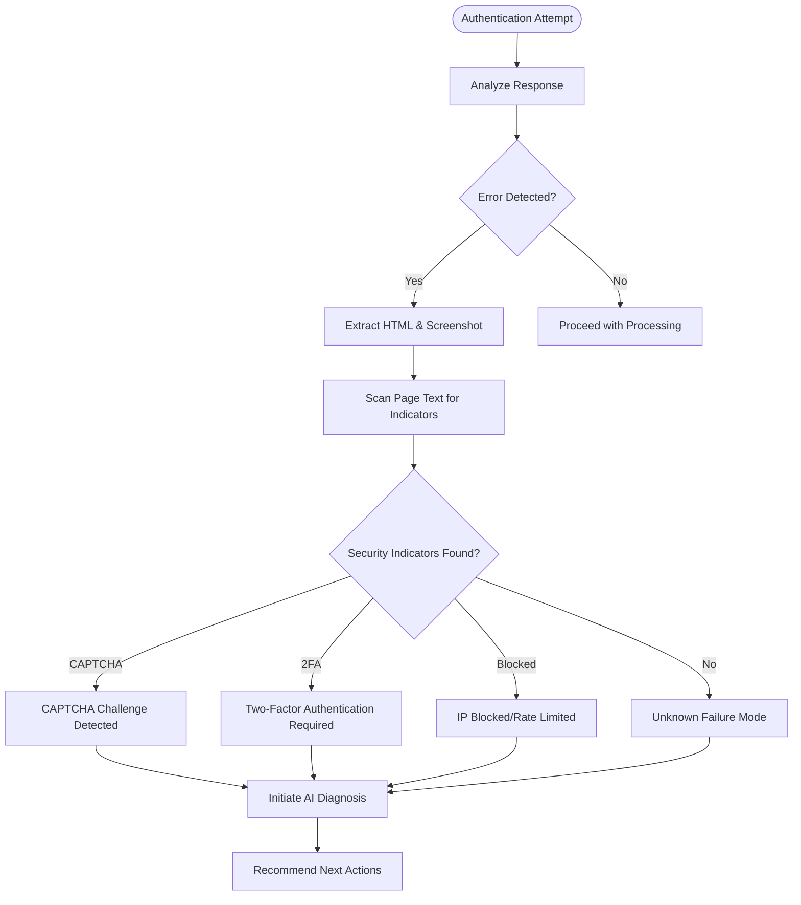
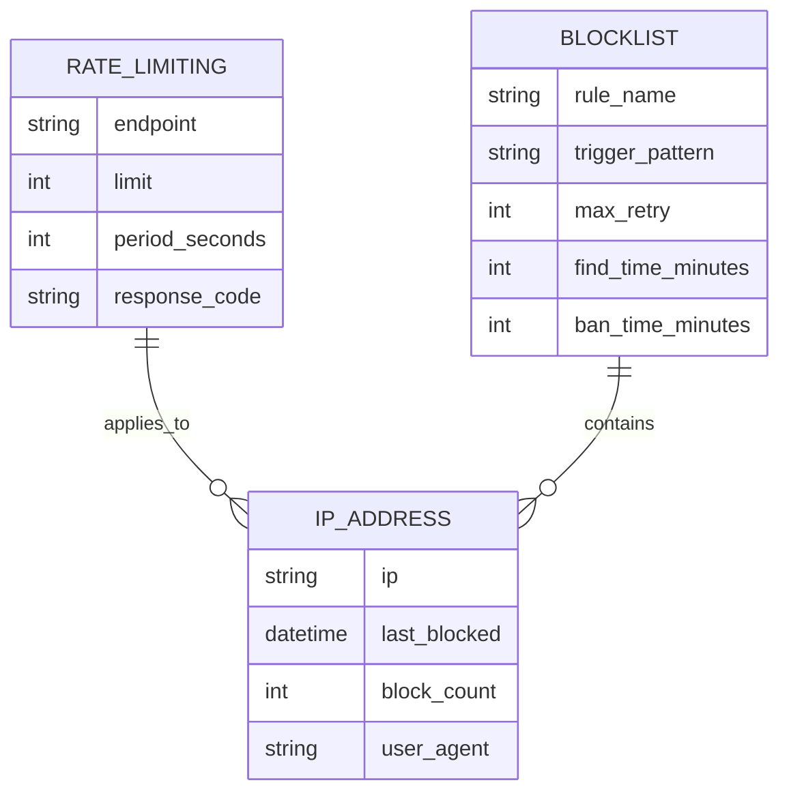
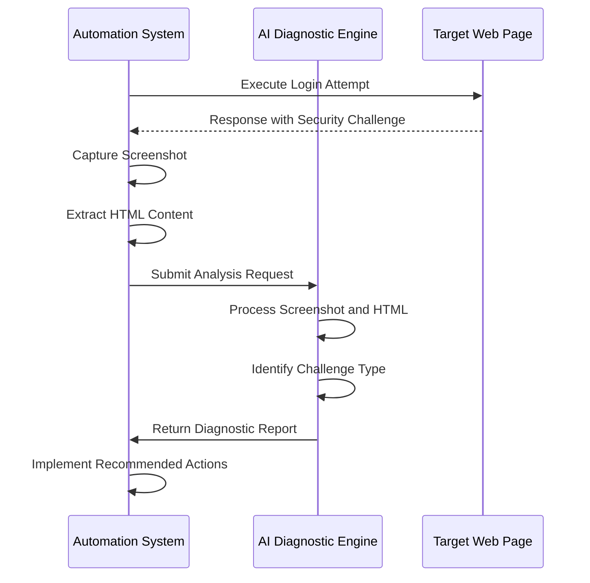
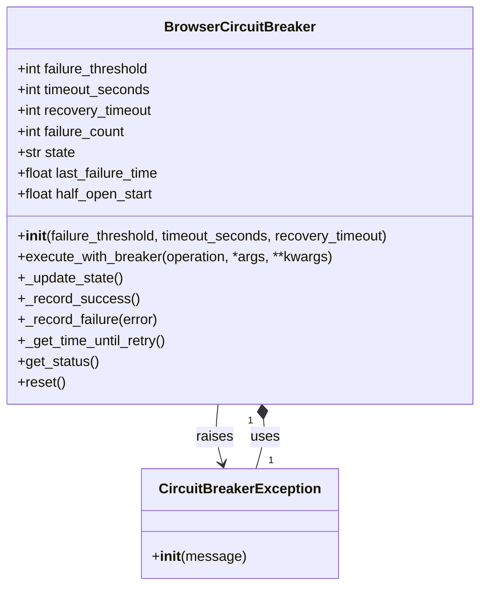

# Security Challenges

<cite>
**Referenced Files in This Document**   
- [supplier_script_generator.py](file://tools/supplier_script_generator.py)
- [security_checks.py](file://tools/security_checks.py)
- [browser_circuit_breaker.py](file://utils/browser_circuit_breaker.py)
- [supplier_authentication_service.py](file://tools/supplier_authentication_service.py)
- [state_1757010909.json](file://diagnostics/state_events/state_1757010909.json)
</cite>

## Table of Contents
1. [Introduction](#introduction)
2. [Security Challenge Detection Mechanisms](#security-challenge-detection-mechanisms)
3. [CAPTCHA Detection and Resolution](#captcha-detection-and-resolution)
4. [Multi-Factor Authentication Handling](#multi-factor-authentication-handling)
5. [IP Blocking and Rate Limiting](#ip-blocking-and-rate-limiting)
6. [AI-Assisted Failure Diagnosis](#ai-assisted-failure-diagnosis)
7. [Troubleshooting Procedures](#troubleshooting-procedures)
8. [Preventive Security Measures](#preventive-security-measures)

## Introduction
This document details the security challenges encountered during automated supplier authentication and data extraction processes within the Amazon FBA Agent System. It focuses on diagnosing and resolving CAPTCHA triggers, multi-factor authentication requirements, and IP blocking incidents. The system employs sophisticated error analysis, AI-assisted diagnostics, and circuit breaker patterns to maintain operational resilience against security protections implemented by target websites.

**Section sources**
- [supplier_script_generator.py](file://tools/supplier_script_generator.py#L640-L664)
- [security_checks.py](file://tools/security_checks.py#L0-L427)

## Security Challenge Detection Mechanisms

The system detects security challenges through comprehensive analysis of page content and response patterns. When authentication failures occur, the system performs multi-layered inspection of the HTML content and visible text to identify security-related indicators.

**Diagram sources**
- [supplier_script_generator.py](file://tools/supplier_script_generator.py#L640-L664)
- [supplier_script_generator.py](file://tools/supplier_script_generator.py#L710-L741)

**Section sources**
- [supplier_script_generator.py](file://tools/supplier_script_generator.py#L640-L664)

## CAPTCHA Detection and Resolution

The system identifies CAPTCHA challenges by scanning page text for specific keywords and patterns. When CAPTCHA indicators are detected in the page content, the system flags the authentication attempt as failed due to security verification requirements.

Common CAPTCHA indicators monitored include:
- "captcha"
- "verification required" 
- "prove you are human"
- "security check"
- "reCAPTCHA"
- "image challenge"

Upon detection, the system captures both the current page HTML and a screenshot for further analysis. These artifacts are used in the AI-assisted diagnosis process to determine the specific type of CAPTCHA implementation and appropriate resolution strategy.

The system does not attempt automated CAPTCHA solving but instead relies on diagnostic analysis to recommend manual intervention or alternative access methods.

**Section sources**
- [supplier_script_generator.py](file://tools/supplier_script_generator.py#L640-L664)

## Multi-Factor Authentication Handling

Multi-factor authentication (MFA) challenges are detected through keyword analysis of page content. The system monitors for MFA-specific indicators including:
- "two-factor"
- "2fa" 
- "authentication code"
- "security code"
- "verification code"
- "multi-factor"

When MFA requirements are detected, the system recognizes that additional authentication steps beyond username/password are required. The current implementation does not support automated entry of time-based one-time passwords (TOTP) or other second factors.

Instead, the system documents the MFA requirement and recommends configuration adjustments, such as:
- Using alternative authentication methods if available
- Configuring app-specific passwords where supported
- Temporarily disabling MFA for automation accounts (if permitted by security policy)
- Implementing manual intervention workflows for code entry

**Section sources**
- [supplier_script_generator.py](file://tools/supplier_script_generator.py#L640-L664)

## IP Blocking and Rate Limiting

IP blocking and rate limiting are detected through analysis of server responses and error patterns. The system monitors for indicators of IP-based restrictions as demonstrated in the Rack::Attack configuration.

**Diagram sources**
- [state_1757010909.json](file://diagnostics/state_events/state_1757010909.json#L260-L304)

**Section sources**
- [state_1757010909.json](file://diagnostics/state_events/state_1757010909.json#L260-L304)

The system implements several rate limiting patterns:
- 300 requests per 5 minutes by IP
- 5 login attempts per 20 seconds by IP
- 1000 API requests per hour by authenticated user

When rate limiting is detected, the system receives HTTP 429 (Too Many Requests) responses with Retry-After headers indicating when requests may resume.

## AI-Assisted Failure Diagnosis

The system employs AI-assisted analysis to diagnose login failures by combining visual and structural information from authentication attempts.

**Diagram sources**
- [supplier_script_generator.py](file://tools/supplier_script_generator.py#L710-L741)

**Section sources**
- [supplier_script_generator.py](file://tools/supplier_script_generator.py#L710-L741)

The AI analysis process includes:
1. Capturing a screenshot of the current page state
2. Extracting the full HTML content (truncated to 5000 characters for token efficiency)
3. Encoding the screenshot in base64 format
4. Submitting both artifacts with a structured diagnostic prompt
5. Receiving actionable recommendations for resolution

The diagnostic prompt requests analysis of:
- Current page state after login attempt
- Visible error messages
- Additional required steps (CAPTCHA, 2FA, etc.)
- Recommended next actions

## Troubleshooting Procedures

The following troubleshooting procedures are recommended for resolving common security challenges:

### CAPTCHA Issues
1. Verify if the target site offers API access as an alternative to web scraping
2. Implement request throttling to reduce request frequency
3. Rotate user agent strings to appear more like legitimate traffic
4. Consider using residential proxy services to diversify IP addresses
5. Implement longer delays between requests (10-30 seconds)

### Multi-Factor Authentication
1. Check if the target service provides application-specific passwords
2. Configure dedicated automation accounts with reduced security requirements (if permitted)
3. Implement manual intervention workflows for periodic code entry
4. Explore API-based authentication methods that may bypass MFA
5. Document MFA requirements for operational planning

### IP Blocking and Rate Limiting
1. Implement exponential backoff strategies after failed attempts
2. Introduce random delays between requests to avoid pattern detection
3. Rotate IP addresses using proxy services
4. Respect Retry-After headers in 429 responses
5. Implement circuit breaker patterns to prevent cascading failures

**Diagram sources**
- [browser_circuit_breaker.py](file://utils/browser_circuit_breaker.py#L0-L213)

**Section sources**
- [browser_circuit_breaker.py](file://utils/browser_circuit_breaker.py#L0-L213)

## Preventive Security Measures

The system implements several preventive measures to minimize security challenges:

### Security Configuration Validation
The `security_checks.py` module performs comprehensive security validation including:
- API key exposure detection
- Sensitive data pattern scanning  
- Configuration security validation
- .gitignore coverage verification

### Request Pattern Management
- Implement circuit breaker patterns to prevent cascading failures
- Use exponential backoff for retry strategies
- Respect rate limiting headers and policies
- Distribute requests across multiple IP addresses when possible

### Monitoring and Alerting
- Track authentication success/failure rates
- Monitor for changes in login page structure
- Log security challenge occurrences for pattern analysis
- Generate alerts for repeated blocking incidents

These preventive measures work together to maintain system reliability while respecting the security mechanisms of target websites.

**Section sources**
- [security_checks.py](file://tools/security_checks.py#L0-L427)
- [browser_circuit_breaker.py](file://utils/browser_circuit_breaker.py#L0-L213)