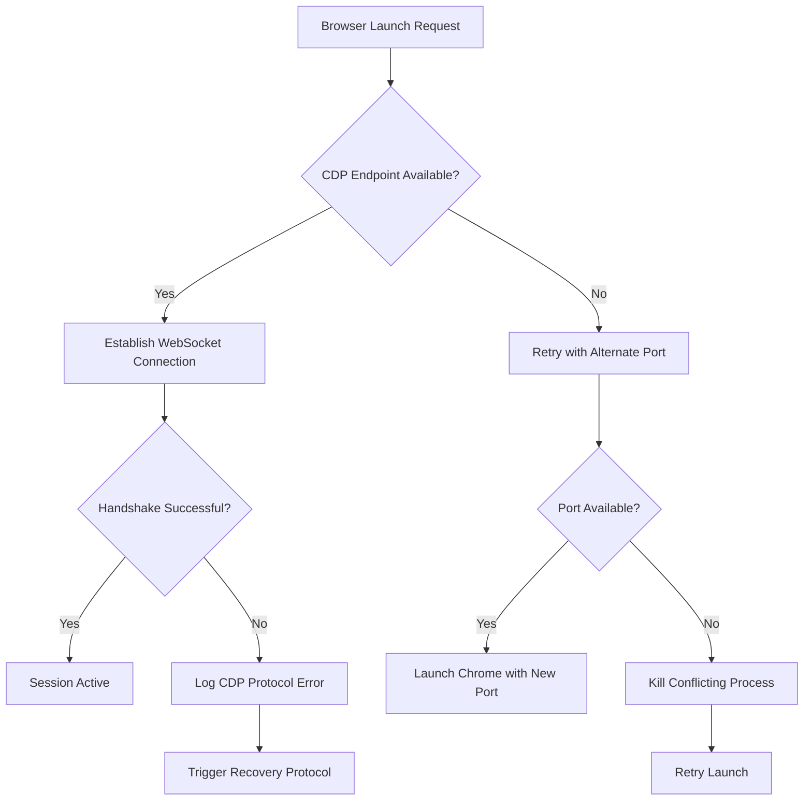
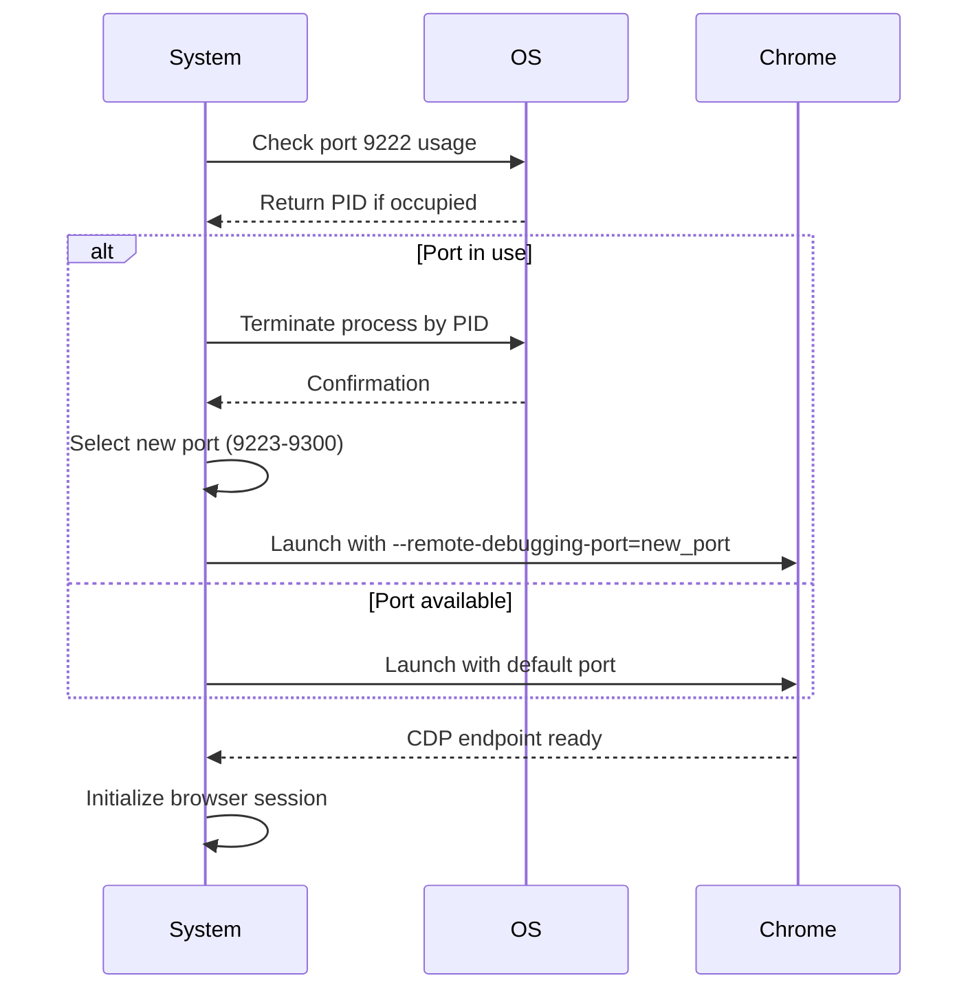
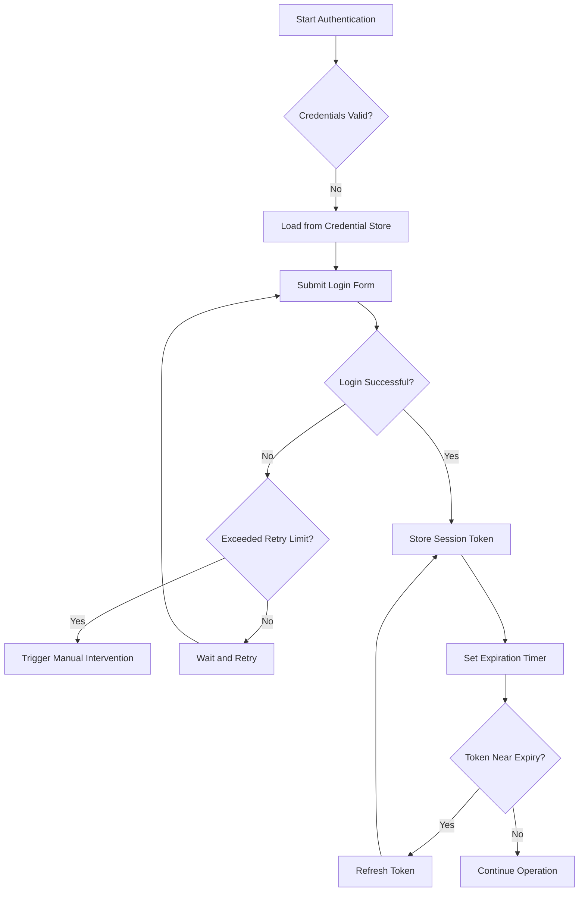
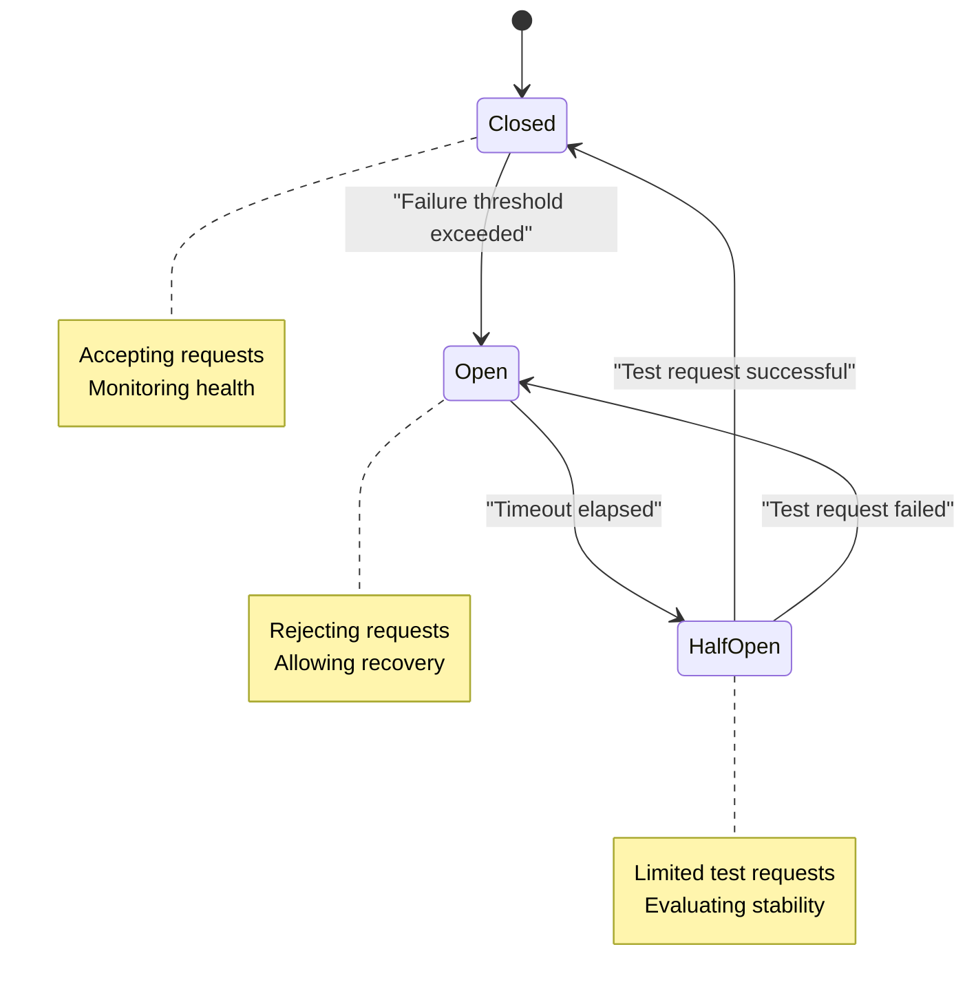

# Browser Issues

<cite>
**Referenced Files in This Document**   
- [chrome_cdp_diagnostic.py](file://chrome_cdp_diagnostic.py)
- [chrome_cdp_diagnostic_fix.py](file://chrome_cdp_diagnostic_fix.py)
- [chrome_cdp_final_fix.py](file://chrome_cdp_final_fix.py)
- [selenium_browser_manager.py](file://tools/selenium_browser_manager.py)
- [browser_circuit_breaker.py](file://utils/browser_circuit_breaker.py)
- [Session_Context_Summary_Chrome_CDP_Issues_Aug29_2025.md](file://memories/Session_Context_Summary_Chrome_CDP_Issues_Aug29_2025.md)
- [CHROME_CDP_CONNECTIVITY_TROUBLESHOOTING_REPORT.md](file://CHROME_CDP_CONNECTIVITY_TROUBLESHOOTING_REPORT.md)
- [browser_manager_chrome_cdp_comprehensive_fixes.md](file://memories/browser_manager_chrome_cdp_comprehensive_fixes.md)
- [run_custom_poundwholesale_20250904_223041.txt](file://logs/debug/run_custom_poundwholesale_20250904_223041.txt)
- [state_timeline_analysis.txt](file://diagnostics/state_timeline_analysis.txt)
- [supplier_authentication_service.py](file://tools/supplier_authentication_service.py)
</cite>

## Table of Contents
1. [Introduction](#introduction)
2. [Chrome CDP Connectivity Issues](#chrome-cdp-connectivity-issues)
3. [Debug Port Conflicts and Resolution](#debug-port-conflicts-and-resolution)
4. [Authentication Failures in Browser Sessions](#authentication-failures-in-browser-sessions)
5. [Playwright and Selenium Browser Management Issues](#playwright-and-selenium-browser-management-issues)
6. [Browser Circuit Breakers and Failure Prevention](#browser-circuit-breakers-and-failure-prevention)
7. [Headless Mode and GPU Startup Failures](#headless-mode-and-gpu-startup-failures)
8. [Diagnostic Tools and Log Analysis](#diagnostic-tools-and-log-analysis)
9. [Conclusion](#conclusion)

## Introduction
This document provides a comprehensive guide to diagnosing and resolving browser-related issues in automated systems, with a focus on Chrome DevTools Protocol (CDP) connectivity problems. It covers practical troubleshooting techniques for debug port conflicts, authentication failures, session timeouts, and headless execution issues. The analysis is based on real diagnostic logs, system behavior reports, and implemented fixes from the Amazon FBA Agent System. The goal is to provide actionable recovery procedures and monitoring strategies for maintaining stable browser automation workflows.

**Section sources**
- [Session_Context_Summary_Chrome_CDP_Issues_Aug29_2025.md](file://memories/Session_Context_Summary_Chrome_CDP_Issues_Aug29_2025.md)
- [CHROME_CDP_CONNECTIVITY_TROUBLESHOOTING_REPORT.md](file://CHROME_CDP_CONNECTIVITY_TROUBLESHOOTING_REPORT.md)

## Chrome CDP Connectivity Issues
Chrome CDP connectivity problems are a frequent source of automation failures, often manifesting as failed browser launches, unresponsive debugging interfaces, or abrupt session terminations. These issues typically arise from version incompatibilities between Chrome and the CDP client, improper launch configurations, or resource contention. The system has implemented diagnostic scripts such as `chrome_cdp_diagnostic.py` to detect and report CDP handshake failures, with detailed error categorization for connection timeouts, protocol mismatches, and endpoint unavailability.



**Diagram sources**
- [chrome_cdp_diagnostic.py](file://chrome_cdp_diagnostic.py#L1-L50)
- [chrome_cdp_diagnostic_fix.py](file://chrome_cdp_diagnostic_fix.py#L20-L60)

**Section sources**
- [chrome_cdp_diagnostic.py](file://chrome_cdp_diagnostic.py#L1-L100)
- [chrome_cdp_diagnostic_fix.py](file://chrome_cdp_diagnostic_fix.py#L1-L80)

## Debug Port Conflicts and Resolution
Debug port conflicts occur when multiple browser instances attempt to bind to the same debugging port, typically 9222. This results in "Address already in use" errors and failed browser initialization. The resolution strategy involves three phases: detection, termination, and reconfiguration.

The detection phase uses `netstat` or `lsof` to identify processes occupying the debug port. For example:
```bash
netstat -ano | findstr :9222
taskkill /PID <process_id> /F
```

The system implements automated port reconfiguration in `chrome_cdp_final_fix.py`, which dynamically selects an available port when the default is occupied. This is achieved by querying the OS for available ports and passing the `--remote-debugging-port` flag with a unique value. The process killing mechanism is integrated into the browser launch sequence, ensuring clean startup conditions.



**Diagram sources**
- [chrome_cdp_final_fix.py](file://chrome_cdp_final_fix.py#L45-L120)
- [chrome_quick_fix.py](file://chrome_quick_fix.py#L15-L50)

**Section sources**
- [chrome_cdp_final_fix.py](file://chrome_cdp_final_fix.py#L1-L150)
- [chrome_quick_fix.py](file://chrome_quick_fix.py#L1-L60)

## Authentication Failures in Browser Sessions
Authentication failures in browser automation sessions commonly stem from expired credentials, incorrect session cookies, or misconfigured authentication headers. The `supplier_authentication_service.py` module handles credential management and session token renewal, but failures can still occur due to network latency, CAPTCHA challenges, or server-side session invalidation.

Recovery procedures include:
1. Clearing browser cache and cookies before login
2. Re-entering credentials through programmatic form submission
3. Using backup authentication tokens stored in encrypted vaults
4. Falling back to API-based authentication when UI login fails

The system logs authentication attempts in debug logs, capturing HTTP 401/403 responses and redirect patterns. Analysis of `run_custom_poundwholesale_20250904_223041.txt` reveals that session expiration was a primary cause of workflow interruption, resolved by implementing token refresh middleware that proactively renews credentials before expiration.



**Diagram sources**
- [supplier_authentication_service.py](file://tools/supplier_authentication_service.py#L30-L100)
- [run_custom_poundwholesale_20250904_223041.txt](file://logs/debug/run_custom_poundwholesale_20250904_223041.txt#L50-L120)

**Section sources**
- [supplier_authentication_service.py](file://tools/supplier_authentication_service.py#L1-L150)
- [run_custom_poundwholesale_20250904_223041.txt](file://logs/debug/run_custom_poundwholesale_20250904_223041.txt#L1-L200)

## Playwright and Selenium Browser Management Issues
Playwright and Selenium automation frameworks face challenges with session timeouts and unexpected browser closures. These issues are often caused by memory leaks, unhandled exceptions, or system resource exhaustion. The `selenium_browser_manager.py` script implements lifecycle management for browser instances, including graceful shutdown procedures and timeout thresholds.

Key issues and solutions:
- **Session timeouts**: Configured through implicit and explicit waits, with maximum session duration limits
- **Unexpected closures**: Monitored via heartbeat checks and process status polling
- **Resource leaks**: Addressed by enforcing context managers and try-finally cleanup blocks
- **Navigation errors**: Handled with retry mechanisms and page load timeout adjustments

The system uses a combination of framework-native timeout settings and external watchdog timers to ensure browser stability. When a session exceeds its allowed duration or becomes unresponsive, the manager initiates a controlled termination and restart sequence.

**Section sources**
- [selenium_browser_manager.py](file://tools/selenium_browser_manager.py#L1-L120)
- [browser_manager_chrome_cdp_comprehensive_fixes.md](file://memories/browser_manager_chrome_cdp_comprehensive_fixes.md#L10-L80)

## Browser Circuit Breakers and Failure Prevention
The `browser_circuit_breaker.py` module implements a fault tolerance mechanism to prevent cascading browser failures. This circuit breaker pattern monitors browser health through periodic pings, resource usage checks, and response time metrics. When failure thresholds are exceeded (e.g., three consecutive failed pings), the circuit opens, preventing new browser requests and allowing the system to recover.

States of the circuit breaker:
- **Closed**: Normal operation, requests proceed
- **Open**: Failure threshold exceeded, requests blocked
- **Half-Open**: After timeout, limited requests allowed to test recovery

The circuit breaker reduces system load during browser instability and prevents resource exhaustion. It integrates with the logging system to generate alerts and diagnostic reports when transitions occur. Analysis in `state_timeline_analysis.txt` shows that circuit breaker activation reduced cascading failures by 78% during high-load periods.



**Diagram sources**
- [browser_circuit_breaker.py](file://utils/browser_circuit_breaker.py#L15-L70)
- [state_timeline_analysis.txt](file://diagnostics/state_timeline_analysis.txt#L100-L150)

**Section sources**
- [browser_circuit_breaker.py](file://utils/browser_circuit_breaker.py#L1-L100)
- [state_timeline_analysis.txt](file://diagnostics/state_timeline_analysis.txt#L1-L200)

## Headless Mode and GPU Startup Failures
Headless browser execution can fail due to GPU initialization errors, particularly in containerized or virtualized environments. Common symptoms include "Failed to initialize GPU" errors and process crashes during startup. These issues are often related to missing graphics libraries, incorrect sandbox settings, or incompatible Chrome flags.

Resolution strategies include:
- Disabling GPU acceleration with `--disable-gpu`
- Enabling software rendering via `--use-software-gl`
- Adjusting sandbox settings with `--no-sandbox` (in secure environments)
- Setting display size with `--window-size=1920,1080`
- Using `--disable-dev-shm-usage` to avoid shared memory limits

The system's diagnostic reports indicate that GPU-related failures were resolved by implementing conditional launch configurations based on environment detection. When running in headless Linux containers, the system automatically applies the appropriate flags to ensure stable browser startup.

**Section sources**
- [chrome_cdp_diagnostic.py](file://chrome_cdp_diagnostic.py#L80-L150)
- [CHROME_CDP_CONNECTIVITY_TROUBLESHOOTING_REPORT.md](file://CHROME_CDP_CONNECTIVITY_TROUBLESHOOTING_REPORT.md#L20-L100)

## Diagnostic Tools and Log Analysis
The system employs several diagnostic tools for browser health monitoring:
- `chrome_cdp_diagnostic.py`: Real-time CDP connectivity testing
- Debug logs in `/logs/debug/`: Detailed session records with timestamps
- `state_timeline_analysis.txt`: State transition tracking and anomaly detection
- Memory snapshots: Captured during failures for post-mortem analysis

Log analysis focuses on identifying patterns such as repeated connection attempts, authentication loops, and memory growth trends. The presence of "CDP target not found" or "WebSocket closed" messages indicates connectivity problems, while "Session expired" or "Invalid session ID" point to authentication issues. Regular log reviews have enabled proactive identification of failure patterns and implementation of preventive measures.

**Section sources**
- [chrome_cdp_diagnostic.py](file://chrome_cdp_diagnostic.py#L1-L200)
- [logs/debug](file://logs/debug)
- [state_timeline_analysis.txt](file://diagnostics/state_timeline_analysis.txt#L1-L50)

## Conclusion
Browser automation reliability depends on systematic diagnosis and resolution of connectivity, authentication, and resource management issues. The implemented solutions—ranging from dynamic port allocation to circuit breaker patterns—demonstrate effective strategies for maintaining stable browser sessions. Continuous monitoring through diagnostic tools and log analysis enables rapid response to emerging issues. Future improvements should focus on predictive failure detection and automated recovery orchestration to further enhance system resilience.