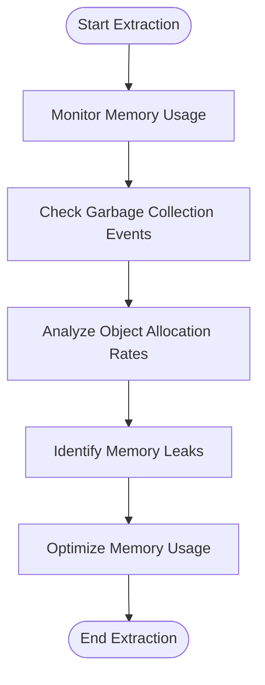
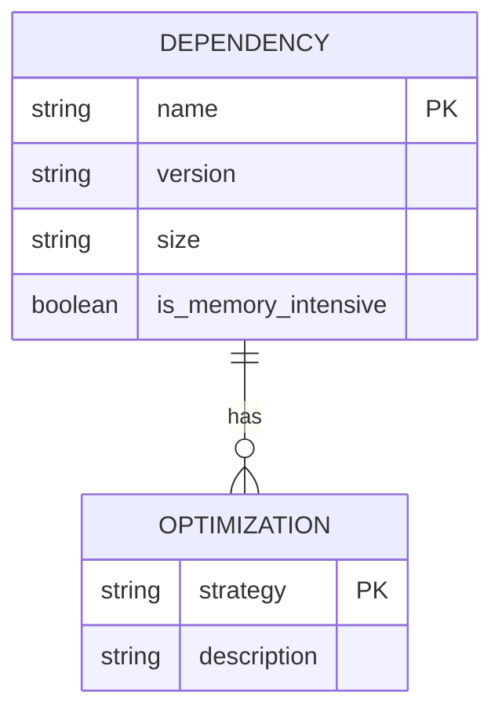
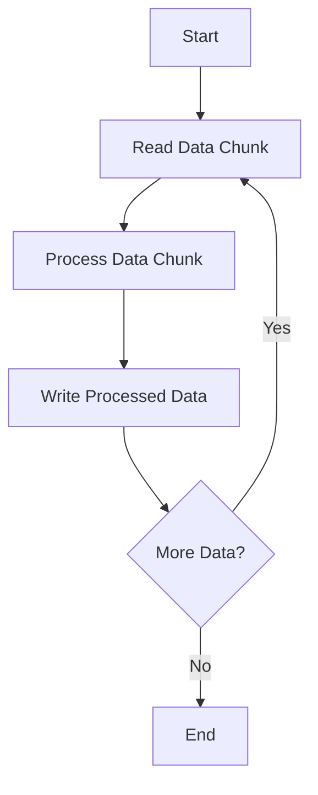

# Memory Management Issues

<cite>
**Referenced Files in This Document**   
- [pip_freeze.txt](file://diagnostics/session_20250904_222414/pip_freeze.txt)
- [run_custom_poundwholesale_20250904_223041.txt](file://logs/debug/run_custom_poundwholesale_20250904_223041.txt)
- [data_integrity_guardian.py](file://utils/data_integrity_guardian.py)
- [passive_extraction_workflow_latest.py](file://tools/passive_extraction_workflow_latest.py)
- [system_config.json](file://config/system_config.json)
</cite>

## Table of Contents
1. [Introduction](#introduction)
2. [Memory Leak Diagnosis and High Memory Pressure](#memory-leak-diagnosis-and-high-memory-pressure)
3. [Interpreting Memory Monitoring Logs](#interpreting-memory-monitoring-logs)
4. [Garbage Collection Tuning and Object Lifecycle Management](#garbage-collection-tuning-and-object-lifecycle-management)
5. [Analysis of pip freeze Output](#analysis-of-pip-freeze-output)
6. [Configuring Data Integrity Guardians](#configuring-data-integrity-guardians)
7. [Streaming Large Datasets](#streaming-large-datasets)
8. [Conclusion](#conclusion)

## Introduction
This document focuses on diagnosing and resolving memory-related issues in long-running extraction processes within the Amazon FBA Agent System. It provides guidance on interpreting memory monitoring logs, identifying patterns of inefficient data retention, tuning garbage collection, managing object lifecycles, analyzing dependencies for memory optimization, configuring data integrity guardians to minimize memory footprint, and streaming large datasets without full in-memory caching.

## Memory Leak Diagnosis and High Memory Pressure
Memory leaks and high memory pressure are critical issues in long-running extraction processes. The system must efficiently manage memory to prevent degradation in performance and potential crashes. Key indicators of memory leaks include a steady increase in memory usage over time without corresponding increases in workload, and failure to release memory after objects are no longer needed.

### Patterns Indicating Inefficient Data Retention
Inefficient data retention can be identified through several patterns in the logs:
- **Excessive Caching**: The system may retain large amounts of data in memory longer than necessary, especially when processing large datasets.
- **Unreleased Resources**: Objects that are no longer in use but are still referenced, preventing garbage collection.
- **Redundant Data Structures**: Multiple copies of the same data stored in different structures, increasing memory footprint.

**Section sources**
- [run_custom_poundwholesale_20250904_223041.txt](file://logs/debug/run_custom_poundwholesale_20250904_223041.txt#L1-L2678)

## Interpreting Memory Monitoring Logs
Memory monitoring logs provide insights into the system's memory usage patterns. Key metrics to monitor include:
- **Memory Usage Over Time**: Track the total memory usage to identify trends and spikes.
- **Garbage Collection Events**: Monitor the frequency and duration of garbage collection events to assess memory management efficiency.
- **Object Allocation Rates**: Analyze the rate at which new objects are allocated to detect potential memory leaks.

### Real Debug Logs Demonstration
The debug logs from `run_custom_poundwholesale_20250904_223041.txt` show memory growth patterns and intervention points. For example, the logs indicate periodic saves of the processing state and linking map, which can be optimized to reduce memory pressure.

**Diagram sources**
- [run_custom_poundwholesale_20250904_223041.txt](file://logs/debug/run_custom_poundwholesale_20250904_223041.txt#L1-L2678)

## Garbage Collection Tuning and Object Lifecycle Management
Effective garbage collection tuning and object lifecycle management are essential for maintaining optimal memory usage. The system should be configured to perform garbage collection at appropriate intervals and ensure that objects are properly released when no longer needed.

### Best Practices for Garbage Collection Tuning
- **Adjust Garbage Collection Frequency**: Configure the garbage collector to run more frequently during high-memory usage periods.
- **Use Generational Garbage Collection**: Implement generational garbage collection to improve efficiency by focusing on recently allocated objects.
- **Monitor and Tune Parameters**: Continuously monitor garbage collection performance and adjust parameters such as heap size and collection thresholds.

### Object Lifecycle Management
- **Proper Resource Disposal**: Ensure that resources such as file handles and network connections are properly disposed of.
- **Weak References**: Use weak references for objects that should not prevent garbage collection.
- **Object Pooling**: Implement object pooling to reuse objects and reduce allocation overhead.

**Section sources**
- [passive_extraction_workflow_latest.py](file://tools/passive_extraction_workflow_latest.py#L0-L11512)
- [system_config.json](file://config/system_config.json#L0-L300)

## Analysis of pip freeze Output
The `pip freeze` output provides a list of installed Python packages and their versions. Analyzing this output helps identify memory-intensive dependencies that can be optimized.

### Memory-Intensive Dependencies
- **Large Libraries**: Libraries such as `pandas`, `numpy`, and `matplotlib` can consume significant memory.
- **Unused Dependencies**: Remove unused dependencies to reduce memory footprint.
- **Version Optimization**: Ensure that the latest, most efficient versions of libraries are used.

### Optimization Strategies
- **Lazy Loading**: Load libraries only when needed.
- **Alternative Libraries**: Consider using lighter alternatives for specific tasks.
- **Dependency Auditing**: Regularly audit dependencies to identify and remove unnecessary packages.

**Diagram sources**
- [pip_freeze.txt](file://diagnostics/session_20250904_222414/pip_freeze.txt#L0-L197)

## Configuring Data Integrity Guardians
Data integrity guardians ensure the consistency and reliability of data throughout the extraction process. Configuring these guardians to minimize memory footprint while maintaining processing accuracy is crucial.

### Minimizing Memory Footprint
- **Efficient Data Structures**: Use data structures that minimize memory usage, such as generators instead of lists.
- **Incremental Processing**: Process data in chunks rather than loading entire datasets into memory.
- **Caching Strategies**: Implement caching strategies that balance memory usage and performance.

### Maintaining Processing Accuracy
- **Data Validation**: Validate data at each stage of processing to ensure accuracy.
- **Error Handling**: Implement robust error handling to manage data inconsistencies.
- **Consistency Checks**: Perform regular consistency checks to detect and correct data integrity issues.

**Section sources**
- [data_integrity_guardian.py](file://utils/data_integrity_guardian.py#L0-L5)

## Streaming Large Datasets
Streaming large datasets without full in-memory caching is essential for efficient memory management. This approach allows the system to process data in a continuous flow, reducing memory pressure.

### Strategies for Streaming
- **Chunked Processing**: Divide large datasets into smaller chunks and process them sequentially.
- **Asynchronous Processing**: Use asynchronous processing to handle multiple data streams concurrently.
- **Buffer Management**: Implement buffer management to control the amount of data held in memory at any time.

### Implementation Example
The `passive_extraction_workflow_latest.py` script demonstrates chunked processing by configuring the `supplier_extraction_batch_size` parameter in `system_config.json`. This ensures that the system processes categories in manageable batches, reducing memory usage.

**Diagram sources**
- [passive_extraction_workflow_latest.py](file://tools/passive_extraction_workflow_latest.py#L0-L11512)
- [system_config.json](file://config/system_config.json#L0-L300)

## Conclusion
Effective memory management is critical for the performance and reliability of long-running extraction processes. By diagnosing memory leaks, interpreting monitoring logs, tuning garbage collection, managing object lifecycles, analyzing dependencies, configuring data integrity guardians, and streaming large datasets, the system can maintain optimal memory usage and ensure efficient processing. Regular monitoring and optimization are essential to address memory-related issues proactively.