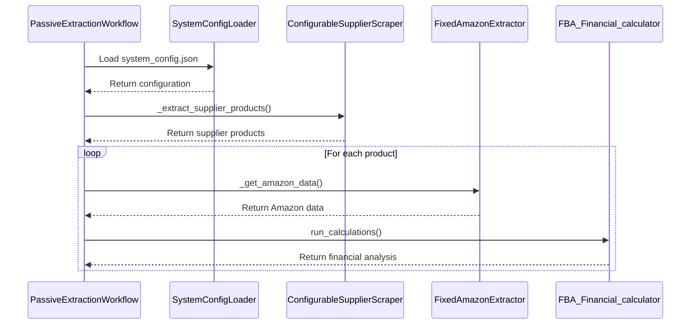
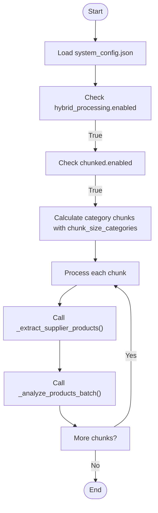
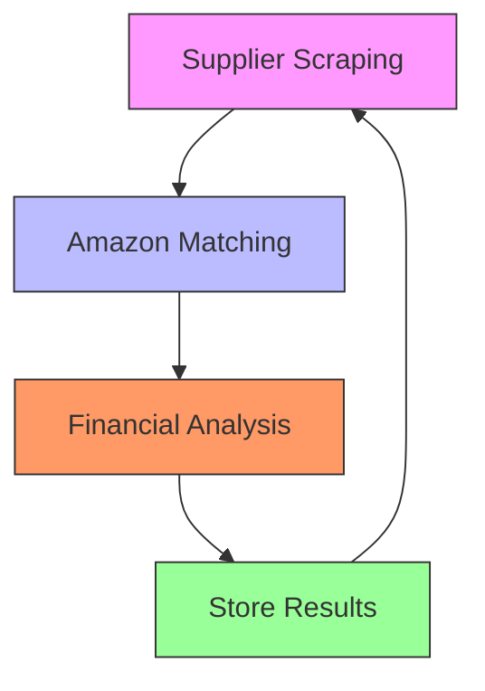
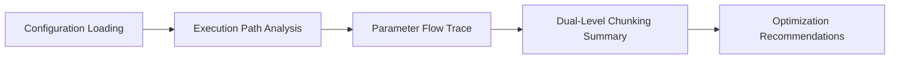
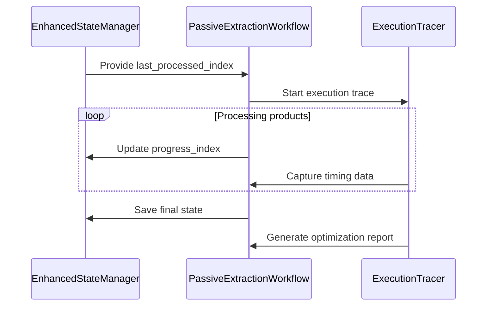
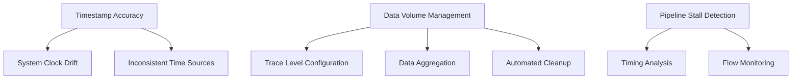

# Execution Tracing

<cite>
**Referenced Files in This Document**   
- [comprehensive_execution_trace.py](file://tools/comprehensive_execution_trace.py)
- [chunking_execution_tracer.py](file://tools/chunking_execution_tracer.py)
- [passive_extraction_workflow_latest.py](file://tools/passive_extraction_workflow_latest.py)
- [system_config.json](file://config/system_config.json)
- [poundwholesale_co_uk_processing_state.json](file://processing_states/poundwholesale_co_uk_processing_state.json)
</cite>

## Table of Contents
1. [Introduction](#introduction)
2. [Comprehensive Execution Tracer](#comprehensive-execution-tracer)
3. [Chunking Execution Tracer](#chunking-execution-tracer)
4. [Performance Bottleneck Identification](#performance-bottleneck-identification)
5. [Trace Output Interpretation](#trace-output-interpretation)
6. [Integration with Passive Extraction Workflow](#integration-with-passive-extraction-workflow)
7. [Common Tracing Issues](#common-tracing-issues)
8. [Conclusion](#conclusion)

## Introduction
The FBA agent system employs a dual-tracing mechanism to monitor and optimize its multi-stage processing pipeline. This document details the execution tracing capabilities designed to identify performance bottlenecks across supplier scraping, Amazon matching, and financial analysis stages. The system utilizes both a comprehensive execution tracer for end-to-end method call analysis and a chunking execution tracer for monitoring data flow between processing stages. These tools enable optimization of workflow concurrency, reduction of idle time, and informed decision-making based on trace data.

## Comprehensive Execution Tracer
The comprehensive execution tracer provides detailed timing data for each processing stage in the FBA agent system. It analyzes the complete method call chain from start to finish, capturing parameter passing and execution flow.

**Diagram sources**
- [passive_extraction_workflow_latest.py](file://tools/passive_extraction_workflow_latest.py#L1970-L2316)
- [system_config.json](file://config/system_config.json#L1-L300)

**Section sources**
- [comprehensive_execution_trace.py](file://tools/comprehensive_execution_trace.py#L1-L214)
- [passive_extraction_workflow_latest.py](file://tools/passive_extraction_workflow_latest.py#L851-L2650)

## Chunking Execution Tracer
The chunking execution tracer monitors data flow between processing stages and identifies pipeline stalls. It tracks the progress of category processing in chunks, enabling detection of bottlenecks in the hybrid processing workflow.

**Diagram sources**
- [comprehensive_execution_trace.py](file://tools/comprehensive_execution_trace.py#L100-L200)
- [system_config.json](file://config/system_config.json#L100-L150)

**Section sources**
- [chunking_execution_tracer.py](file://tools/chunking_execution_tracer.py#L1-L146)
- [system_config.json](file://config/system_config.json#L150-L200)

## Performance Bottleneck Identification
The execution tracing system identifies performance bottlenecks by analyzing timing data across processing stages. The comprehensive execution tracer captures timing for supplier scraping, Amazon matching, and financial analysis, while the chunking execution tracer monitors data flow between these stages.

Key configuration parameters that affect performance include:
- `supplier_extraction_batch_size`: Controls memory management during supplier scraping
- `chunk_size_categories`: Determines the number of categories processed per chunk
- `switch_to_amazon_after_categories`: Controls workflow alternation between extraction and analysis

The system's dual-level chunking approach combines hybrid chunking for workflow alternation with supplier batching for memory management within each extraction phase.

**Diagram sources**
- [passive_extraction_workflow_latest.py](file://tools/passive_extraction_workflow_latest.py#L2318-L2435)
- [system_config.json](file://config/system_config.json#L200-L250)

**Section sources**
- [comprehensive_execution_trace.py](file://tools/comprehensive_execution_trace.py#L50-L100)
- [poundwholesale_co_uk_processing_state.json](file://processing_states/poundwholesale_co_uk_processing_state.json#L1-L100)

## Trace Output Interpretation
Trace output provides insights for optimizing workflow concurrency and reducing idle time. The comprehensive execution trace shows the complete path from configuration loading to final reporting, including parameter flow and method calls.

Key metrics for interpretation include:
- Execution time per processing stage
- Frequency of workflow alternation between extraction and analysis
- Memory usage patterns during supplier batching
- Idle time between processing stages

For example, when `chunk_size_categories` is set to 1 and `supplier_extraction_batch_size` is set to 100, each hybrid chunk contains only one category, resulting in very frequent switching between extraction and analysis phases. This configuration may lead to increased overhead and reduced efficiency.

**Diagram sources**
- [comprehensive_execution_trace.py](file://tools/comprehensive_execution_trace.py#L150-L200)
- [passive_extraction_workflow_latest.py](file://tools/passive_extraction_workflow_latest.py#L1970-L2316)

**Section sources**
- [comprehensive_execution_trace.py](file://tools/comprehensive_execution_trace.py#L1-L214)
- [system_config.json](file://config/system_config.json#L250-L300)

## Integration with Passive Extraction Workflow
The execution tracing system is fully integrated with the passive extraction workflow, providing real-time monitoring and optimization capabilities. The workflow's state manager tracks progress through categories and products, enabling precise resumption of interrupted sessions.

The integration enables trace data to inform optimization decisions, such as:
- Adjusting batch sizes based on memory usage patterns
- Modifying chunk sizes to balance extraction and analysis workloads
- Optimizing concurrency settings based on observed idle times
- Identifying and addressing pipeline stalls in real-time

**Diagram sources**
- [passive_extraction_workflow_latest.py](file://tools/passive_extraction_workflow_latest.py#L860-L989)
- [poundwholesale_co_uk_processing_state.json](file://processing_states/poundwholesale_co_uk_processing_state.json#L100-L200)

**Section sources**
- [passive_extraction_workflow_latest.py](file://tools/passive_extraction_workflow_latest.py#L1970-L2316)
- [poundwholesale_co_uk_processing_state.json](file://processing_states/poundwholesale_co_uk_processing_state.json#L1-L1437)

## Common Tracing Issues
Several common issues can affect the accuracy and effectiveness of execution tracing in the FBA agent system:

### Timestamp Accuracy
Timestamp accuracy can be affected by system clock drift or inconsistent time sources across distributed components. The system uses UTC timestamps with timezone information to ensure consistency.

### Data Volume Management
Large volumes of trace data can impact system performance and storage requirements. The system addresses this through:
- Configurable trace levels (INFO, DEBUG, TRACE)
- Periodic aggregation of trace data
- Automated cleanup of old trace files
- Selective tracing of critical paths only

### Pipeline Stall Detection
Detecting pipeline stalls requires careful analysis of timing data between processing stages. The chunking execution tracer monitors the flow of data between supplier scraping, Amazon matching, and financial analysis stages to identify stalls.

**Diagram sources**
- [system_config.json](file://config/system_config.json#L250-L300)
- [poundwholesale_co_uk_processing_state.json](file://processing_states/poundwholesale_co_uk_processing_state.json#L200-L300)

**Section sources**
- [system_config.json](file://config/system_config.json#L1-L300)
- [poundwholesale_co_uk_processing_state.json](file://processing_states/poundwholesale_co_uk_processing_state.json#L1-L1437)

## Conclusion
The execution tracing system in the FBA agent provides comprehensive monitoring capabilities for identifying performance bottlenecks across supplier scraping, Amazon matching, and financial analysis stages. The combination of comprehensive execution tracing and chunking execution tracing enables detailed analysis of method calls, parameter flow, and data movement between processing stages. By interpreting trace output, users can optimize workflow concurrency, reduce idle time, and make informed decisions about system configuration. The integration with the passive extraction workflow ensures that trace data directly informs optimization decisions, leading to improved system performance and efficiency.