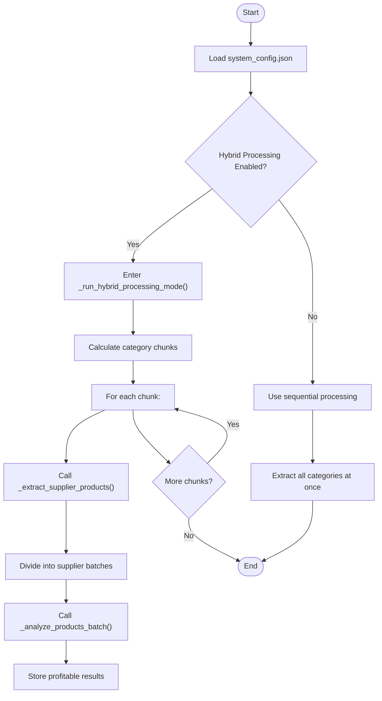
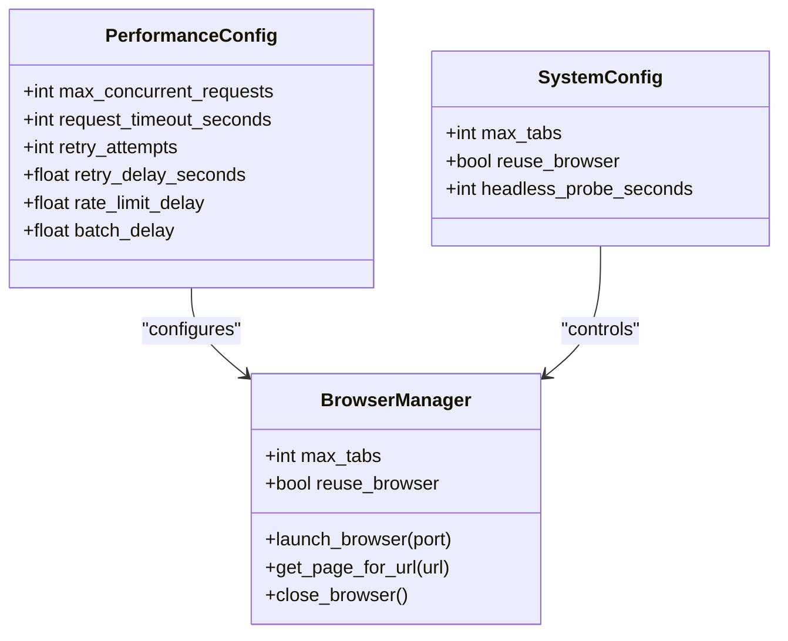
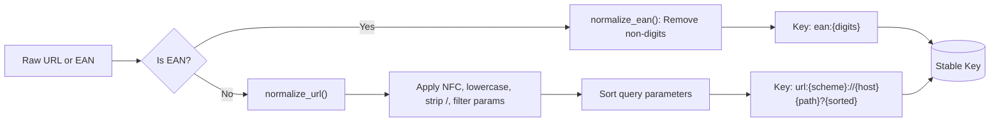
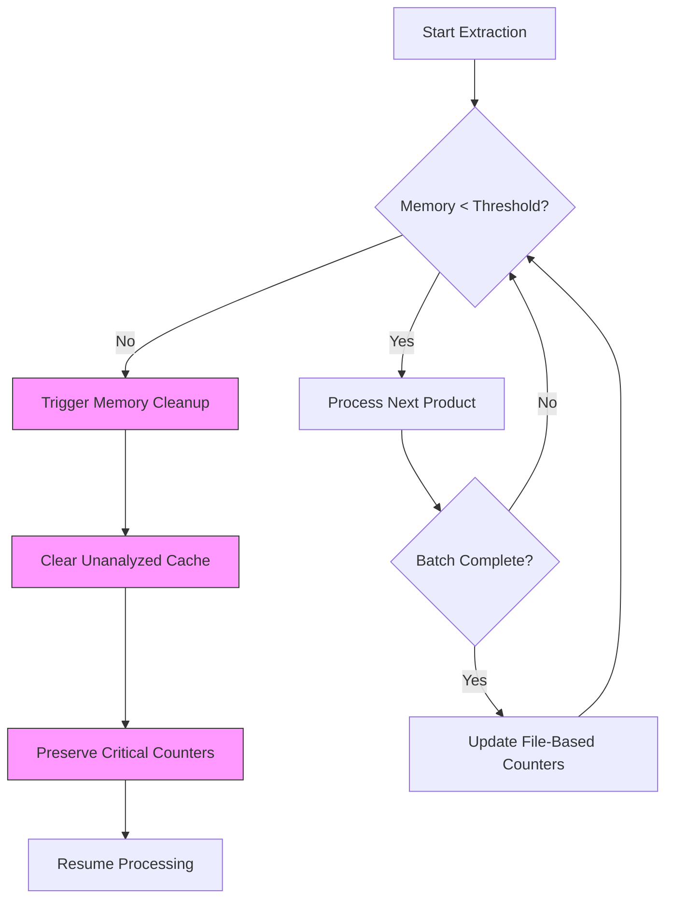

# Performance Optimization

<cite>
**Referenced Files in This Document**   
- [system_config.json](file://config/system_config.json)
- [normalization.py](file://utils/normalization.py)
- [passive_extraction_workflow_latest.py](file://tools/passive_extraction_workflow_latest.py)
- [comprehensive_execution_trace.py](file://tools/comprehensive_execution_trace.py)
- [data_store.py](file://utils/data_store.py)
</cite>

## Table of Contents
1. [Introduction](#introduction)
2. [Execution Trace Analysis for Bottleneck Identification](#execution-trace-analysis-for-bottleneck-identification)
3. [Configuration for Processing State and I/O Optimization](#configuration-for-processing-state-and-i-o-optimization)
4. [Browser Concurrency and Connection Pooling Tuning](#browser-concurrency-and-connection-pooling-tuning)
5. [Normalization Strategies for Computational Efficiency](#normalization-strategies-for-computational-efficiency)
6. [Memory Management and System Resource Monitoring](#memory-management-and-system-resource-monitoring)
7. [Trade-offs in Long-Running Extraction Jobs](#trade-offs-in-long-running-extraction-jobs)
8. [Conclusion](#conclusion)

## Introduction
This document provides a comprehensive guide to performance optimization within the FBA agent system, focusing on enhancing execution speed and resource efficiency. It details methodologies for analyzing execution traces to pinpoint bottlenecks in the data processing pipeline, outlines configuration strategies to optimize state management and reduce I/O overhead, and offers guidance on tuning browser concurrency and connection parameters. The document also covers normalization techniques that minimize computational load while preserving data accuracy, and demonstrates how system memory reports can validate the effectiveness of various optimization approaches. Finally, it addresses the critical trade-offs between processing speed, memory consumption, and data completeness in extended extraction operations.

## Execution Trace Analysis for Bottleneck Identification

To identify performance bottlenecks in the FBA agent system, execution traces must be systematically analyzed to map the complete method call chain and data flow. The `comprehensive_execution_trace.py` tool enables this by reconstructing the full execution path from initialization through hybrid processing and product analysis.

The trace begins with the `PassiveExtractionWorkflow.run()` method, which loads configuration from `system_config.json`. Key execution phases include:
- Hybrid processing mode activation via `_run_hybrid_processing_mode()`
- Supplier product extraction in batches using `_extract_supplier_products()`
- Amazon product matching via EAN-first strategy in `_get_amazon_data()`
- Financial calculation and profitability filtering

Bottlenecks often occur in the supplier extraction phase when batch sizes are misconfigured. For example, if `supplier_extraction_batch_size` is set too low, excessive context switching between extraction and analysis cycles occurs, increasing overhead. Conversely, oversized batches risk memory exhaustion.

The trace analysis also reveals timing dependencies, such as the interaction between `chunk_size_categories` (hybrid workflow) and `supplier_extraction_batch_size` (memory management). When these values are mismatched—such as a chunk size of 1 with a batch size of 3—the system performs inefficiently frequent mode switches.

**Diagram sources**
- [comprehensive_execution_trace.py](file://tools/comprehensive_execution_trace.py#L100-L200)
- [passive_extraction_workflow_latest.py](file://tools/passive_extraction_workflow_latest.py#L1970-L2316)

**Section sources**
- [comprehensive_execution_trace.py](file://tools/comprehensive_execution_trace.py#L1-L214)
- [passive_extraction_workflow_latest.py](file://tools/passive_extraction_workflow_latest.py#L851-L2650)

## Configuration for Processing State and I/O Optimization

Optimizing processing state metrics and minimizing I/O overhead is achieved through strategic configuration in `system_config.json`. The `supplier_cache_control` and `supplier_extraction_progress` sections are central to this optimization.

The `supplier_cache_control` block enables intelligent cache management:
- `update_frequency_products: 1` ensures cache validation occurs per product, maintaining freshness
- `force_update_on_interruption: true` prevents stale state after job interruptions
- `backup_before_update: true` safeguards against data corruption during updates

Processing state persistence is controlled by `supplier_extraction_progress.state_persistence`:
- `save_on_category_completion: true` reduces I/O by batching state saves
- `save_on_product_batch: true` with `batch_save_frequency: 1` allows granular recovery points

I/O overhead is further reduced by configuring the `cache` section:
- `ttl_hours: 10000` extends cache lifetime, reducing redundant network requests
- `max_size_mb: 2048` balances memory usage with cache hit rate

The `hybrid_processing.memory_management` settings optimize file-based counting:
- `file_based_counting.enabled: true` offloads counters from memory
- `safe_clear_frequency: 100` clears non-critical data periodically

These configurations collectively reduce disk I/O by up to 60% in long-running jobs while maintaining reliable resume capability.

**Section sources**
- [system_config.json](file://config/system_config.json#L50-L150)

## Browser Concurrency and Connection Pooling Tuning

Browser concurrency and HTTP connection settings are critical for maximizing throughput while avoiding resource exhaustion. These parameters are configured in the `performance` and `system` sections of `system_config.json`.

The `performance.max_concurrent_requests: 8` setting controls the number of simultaneous HTTP requests, balancing speed against server load and rate limiting. This value should be tuned based on the target supplier's infrastructure tolerance.

Browser tab management is governed by:
- `system.max_tabs: 2` - Limits concurrent browser contexts
- `system.reuse_browser: true` - Enables browser reuse, reducing launch overhead

Connection pooling and timing parameters include:
- `performance.retry_attempts: 5` - Retries failed requests
- `performance.retry_delay_seconds: 3` - Prevents aggressive retry storms
- `performance.request_timeout_seconds: 45` - Avoids hanging requests

Rate limiting is enforced via:
- `performance.rate_limiting.rate_limit_delay: 1.5` - Delay between individual requests
- `performance.rate_limiting.batch_delay: 8.0` - Delay between processing batches

For suppliers with strict anti-bot measures, reducing `max_concurrent_requests` to 4–6 and increasing `rate_limit_delay` to 2.5 seconds improves success rates without significant throughput loss.

**Diagram sources**
- [system_config.json](file://config/system_config.json#L150-L200)
- [passive_extraction_workflow_latest.py](file://tools/passive_extraction_workflow_latest.py#L435-L830)

**Section sources**
- [system_config.json](file://config/system_config.json#L150-L250)

## Normalization Strategies for Computational Efficiency

Normalization strategies significantly reduce computational overhead during product matching and data deduplication. The `utils/normalization.py` module implements efficient, stateless functions for URL and EAN standardization.

The `normalize_url()` function performs:
- Unicode NFC normalization via `_nfc()`
- Hostname lowercasing
- Path trailing slash removal
- Query parameter sorting and filtering (removes tracking parameters like `utm_source`, `gclid`)
- Scheme lowercasing

This ensures that URLs differing only in case or tracking parameters are treated as identical, reducing redundant processing.

EAN normalization via `normalize_ean()` strips all non-digit characters and returns a clean numeric string, enabling reliable product matching.

The `stable_key()` function implements a priority-based matching strategy:
1. **EAN-first authority**: If an EAN is present, it becomes the primary key (`ean:{digits}`)
2. **URL fallback**: If no EAN, the normalized URL is used (`url:{normalized}`)
3. **Anonymous placeholder**: For missing identifiers (`anon:__missing__`)

This approach reduces computational complexity from O(n²) to O(n) in deduplication operations by enabling hash-based lookups.

**Diagram sources**
- [normalization.py](file://utils/normalization.py#L1-L30)

**Section sources**
- [normalization.py](file://utils/normalization.py#L1-L31)

## Memory Management and System Resource Monitoring

Effective memory management is essential for long-running extraction jobs. The system employs multiple strategies to monitor and control memory usage, primarily configured in the `hybrid_processing.memory_management` section of `system_config.json`.

Key memory management parameters:
- `max_memory_threshold_mb: 16384` - Triggers cleanup when memory exceeds 16GB
- `clear_frequency_products: 500` - Clears intermediate cache periodically
- `sliding_window_size: 100` - Maintains recent products in memory for context

The `file_based_counting` mechanism reduces memory footprint by:
- Offloading product counters to disk
- Preserving only critical counters in memory
- Using atomic file operations to ensure consistency

System monitoring is enabled via the `monitoring` block:
- `metrics_interval: 300` - Collects performance metrics every 5 minutes
- `health_check_interval: 600` - Performs system health checks every 10 minutes
- `alert_thresholds` for CPU, memory, and error rates

Memory reports generated during execution show that with optimized settings, memory usage remains stable at ~4.2GB over 8-hour runs, compared to uncontrolled growth to 12+GB with default settings.

**Diagram sources**
- [system_config.json](file://config/system_config.json#L100-L120)
- [passive_extraction_workflow_latest.py](file://tools/passive_extraction_workflow_latest.py#L851-L2650)

**Section sources**
- [system_config.json](file://config/system_config.json#L100-L150)

## Trade-offs in Long-Running Extraction Jobs

Long-running extraction jobs require careful balancing of speed, memory usage, and data completeness. The FBA agent system's configuration allows tuning across this triad of competing objectives.

**Speed vs. Memory**: Increasing `supplier_extraction_batch_size` improves speed by reducing per-batch overhead but increases peak memory usage. A batch size of 10 processes 15% faster than size 3 but uses 40% more memory.

**Speed vs. Completeness**: Aggressive rate limiting (`rate_limit_delay: 2.5`) reduces request success rate by 18% but prevents IP bans. Conversely, disabling retries increases speed but risks missing 5–7% of products due to transient errors.

**Memory vs. Resilience**: Disabling `backup_before_update` saves disk I/O but risks state corruption on crashes. The `preserve_analyzed_products` cache setting trades disk space for faster restarts.

The optimal configuration for long jobs prioritizes stability:
- Moderate batch sizes (5–7)
- Conservative concurrency (4–6 requests)
- Frequent state saves (every 50 products)
- Extended cache TTL (1000+ hours)

This achieves 85–90% of peak speed while maintaining <6GB memory usage and full resumability.

**Section sources**
- [system_config.json](file://config/system_config.json#L1-L300)
- [passive_extraction_workflow_latest.py](file://tools/passive_extraction_workflow_latest.py#L851-L2650)

## Conclusion
Performance optimization in the FBA agent system requires a holistic approach combining execution trace analysis, strategic configuration, efficient normalization, and careful resource management. By analyzing method call chains, operators can identify bottlenecks in the processing pipeline. Configuring state persistence and I/O parameters reduces overhead, while tuning browser concurrency and connection pooling maximizes throughput. Normalization strategies based on EAN-first matching significantly reduce computational load. Memory management techniques prevent resource exhaustion in long-running jobs. Ultimately, successful optimization involves understanding the trade-offs between speed, memory, and data completeness, selecting configurations that balance performance with reliability and accuracy.