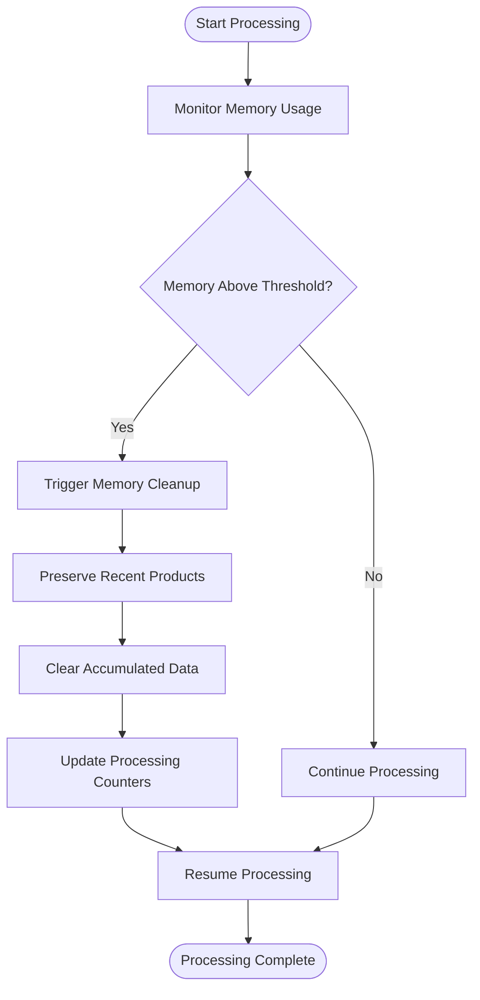
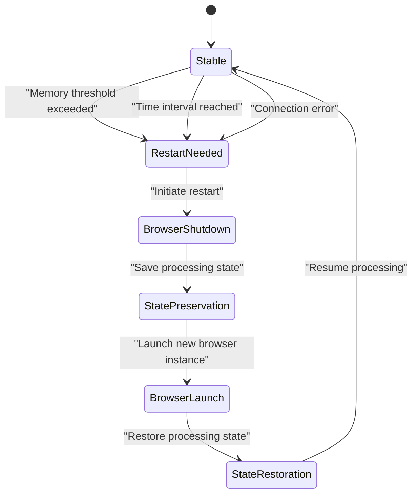
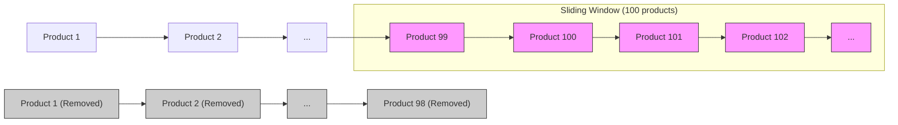
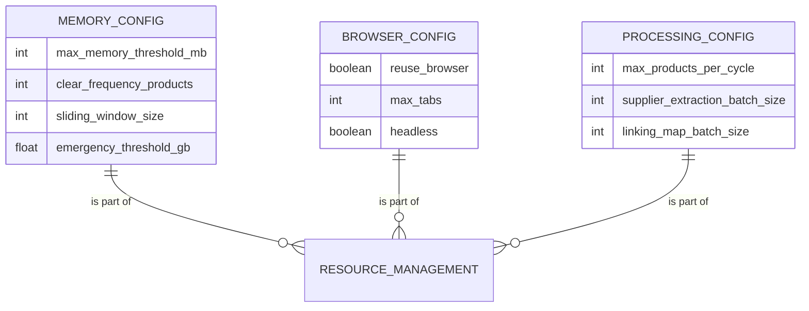

# Resource Management

<cite>
**Referenced Files in This Document**   
- [system_config.json](file://config/system_config.json)
- [passive_extraction_workflow_latest.py](file://tools/passive_extraction_workflow_latest.py)
- [browser_circuit_breaker.py](file://utils/browser_circuit_breaker.py)
- [data_store.py](file://utils/data_store.py)
- [supplier_authentication_service.py](file://tools/supplier_authentication_service.py)
</cite>

## Table of Contents
1. [Introduction](#introduction)
2. [Smart Memory Management System](#smart-memory-management-system)
3. [Browser Restart Mechanism](#browser-restart-mechanism)
4. [Sliding Window Data Preservation](#sliding-window-data-preservation)
5. [Configuration Options](#configuration-options)
6. [Performance and Stability Guidance](#performance-and-stability-guidance)
7. [Conclusion](#conclusion)

## Introduction
This document details the resource management system within the Amazon FBA Agent System, focusing on long-term extraction job stability. The system employs advanced memory management and browser lifecycle control to prevent crashes and maintain processing continuity over extended periods. Key features include a smart memory cleanup system, a robust browser restart mechanism, and a sliding window approach to data retention.

**Section sources**
- [system_config.json](file://config/system_config.json#L1-L300)

## Smart Memory Management System

The system implements a sophisticated memory management strategy to prevent resource exhaustion during long-running extraction jobs. Memory usage is continuously monitored, and cleanup operations are triggered based on configurable thresholds and processing milestones.

The memory management system operates on a tiered approach:
- **Proactive monitoring**: Memory usage is tracked throughout the processing lifecycle
- **Threshold-based cleanup**: Memory cleanup is initiated when predefined limits are reached
- **File-based counting**: A file-based system tracks processing progress to ensure accurate memory state assessment
- **Critical data preservation**: Essential counters and state information are preserved during cleanup operations

The system prevents memory bloat by clearing accumulated data while maintaining the processing context through the sliding window mechanism described in subsequent sections.

**Diagram sources**
- [system_config.json](file://config/system_config.json#L1-L300)
- [passive_extraction_workflow_latest.py](file://tools/passive_extraction_workflow_latest.py#L0-L799)

**Section sources**
- [system_config.json](file://config/system_config.json#L1-L300)
- [passive_extraction_workflow_latest.py](file://tools/passive_extraction_workflow_latest.py#L0-L799)

## Browser Restart Mechanism

The browser restart mechanism ensures stable operation by proactively managing browser instances based on multiple triggers. This prevents browser crashes and connection issues that commonly occur during extended scraping sessions.

The system restarts the browser under three conditions:
1. **Time intervals**: Periodic restarts at configurable intervals
2. **Memory thresholds**: When memory usage exceeds predefined limits
3. **Connection errors**: After encountering network or browser connectivity issues

The restart process is seamless, preserving the current processing state and resuming operations from the last successful point. This ensures continuity while eliminating accumulated browser state that could lead to instability.

**Diagram sources**
- [browser_circuit_breaker.py](file://utils/browser_circuit_breaker.py#L0-L213)
- [passive_extraction_workflow_latest.py](file://tools/passive_extraction_workflow_latest.py#L0-L799)

**Section sources**
- [browser_circuit_breaker.py](file://utils/browser_circuit_breaker.py#L0-L213)
- [passive_extraction_workflow_latest.py](file://tools/passive_extraction_workflow_latest.py#L0-L799)

## Sliding Window Data Preservation

The system employs a sliding window approach to maintain processing context while freeing memory. This mechanism preserves the most recent 100 products processed, ensuring continuity and context for ongoing operations.

The sliding window functions as follows:
- **Recent product retention**: The last 100 processed products are kept in memory
- **Accumulated data clearance**: Older data beyond the window is cleared to free memory
- **Context maintenance**: Recent products provide context for pattern recognition and data validation
- **Seamless transition**: Processing continues without interruption during data cleanup

This approach balances memory efficiency with processing intelligence, allowing the system to make informed decisions based on recent activity while preventing memory exhaustion.

**Diagram sources**
- [system_config.json](file://config/system_config.json#L1-L300)
- [passive_extraction_workflow_latest.py](file://tools/passive_extraction_workflow_latest.py#L0-L799)

**Section sources**
- [system_config.json](file://config/system_config.json#L1-L300)
- [passive_extraction_workflow_latest.py](file://tools/passive_extraction_workflow_latest.py#L0-L799)

## Configuration Options

The resource management system provides several configurable parameters to balance memory usage with processing efficiency:

### Memory Management Configuration
- **max_memory_threshold_mb**: Maximum memory usage threshold in megabytes (default: 16384)
- **clear_frequency_products**: Product processing count triggering memory cleanup (default: 500)
- **sliding_window_size**: Number of recent products to preserve (default: 100)
- **emergency_threshold_gb**: Emergency memory threshold in gigabytes

### Browser Management Configuration
- **reuse_browser**: Whether to reuse browser instances (default: true)
- **max_tabs**: Maximum number of browser tabs (default: 2)
- **headless**: Whether to run browser in headless mode (default: false)

### Processing Configuration
- **max_products_per_cycle**: Maximum products processed per cycle (default: 100)
- **supplier_extraction_batch_size**: Batch size for supplier extraction (default: 100)
- **linking_map_batch_size**: Batch size for linking map updates (default: 1)

These configuration options allow users to fine-tune the system's behavior based on available system resources and specific operational requirements.

**Diagram sources**
- [system_config.json](file://config/system_config.json#L1-L300)

**Section sources**
- [system_config.json](file://config/system_config.json#L1-L300)

## Performance and Stability Guidance

To optimize system performance and prevent crashes during extended operations, follow these guidelines:

### Memory Usage Optimization
- Set appropriate memory thresholds based on available system RAM
- Adjust the sliding window size to balance context preservation with memory efficiency
- Monitor memory usage patterns and adjust cleanup frequency accordingly
- Consider reducing batch sizes if memory pressure is consistently high

### Processing Efficiency
- Balance product processing cycles with analysis requirements
- Optimize supplier extraction batch sizes for the target website's performance
- Use the file-based counting system to ensure accurate progress tracking
- Enable selective cache clearing to preserve critical data while freeing memory

### Crash Prevention
- Implement regular browser restarts to prevent memory leaks
- Use the circuit breaker pattern to handle connection errors gracefully
- Configure appropriate timeout values for network operations
- Monitor system metrics and set up alerts for abnormal conditions

### Configuration Recommendations
For systems with 16GB RAM:
- Set max_memory_threshold_mb to 12288 (75% of total RAM)
- Keep sliding_window_size at 100 for optimal context
- Set clear_frequency_products to 500 for regular cleanup
- Use moderate batch sizes (50-100) for stable processing

For systems with 32GB+ RAM:
- Set max_memory_threshold_mb to 24576 (75% of total RAM)
- Consider increasing sliding_window_size to 200 for enhanced context
- Increase clear_frequency_products to 1000 for less frequent cleanup
- Use larger batch sizes (100-200) for improved throughput

These guidelines help maintain system stability while maximizing processing efficiency during long-running extraction jobs.

**Section sources**
- [system_config.json](file://config/system_config.json#L1-L300)
- [passive_extraction_workflow_latest.py](file://tools/passive_extraction_workflow_latest.py#L0-L799)

## Conclusion
The Amazon FBA Agent System's resource management framework provides a robust solution for long-running extraction jobs. By combining smart memory management, proactive browser lifecycle control, and intelligent data preservation, the system maintains stability and efficiency over extended periods. The configurable nature of the system allows users to optimize performance based on their specific hardware and operational requirements, preventing crashes and ensuring reliable processing continuity.