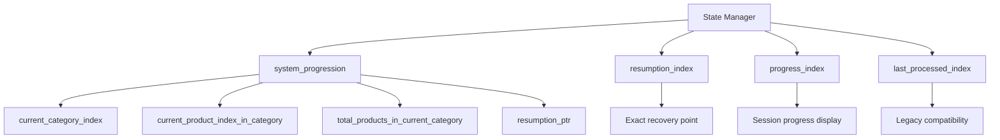
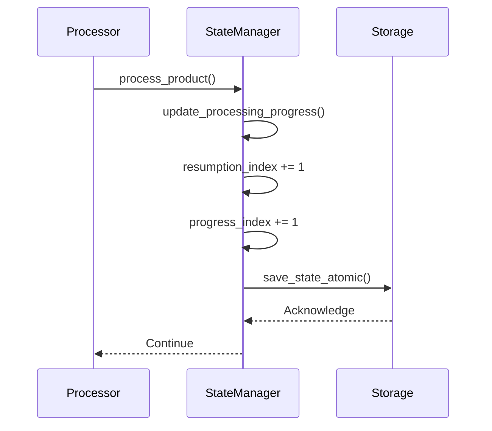
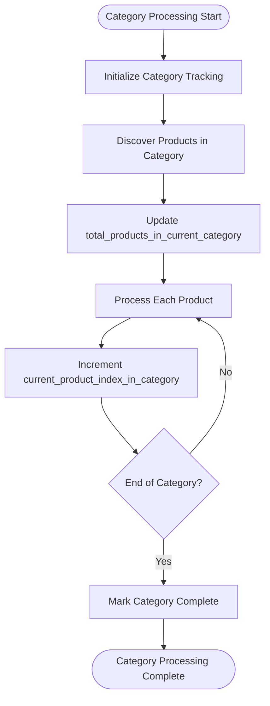
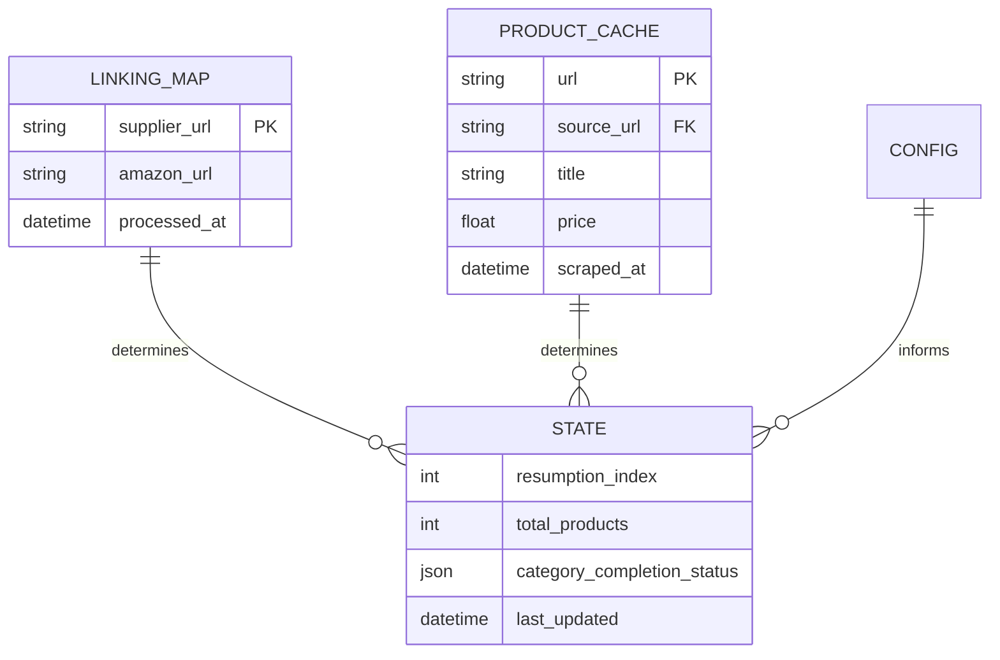
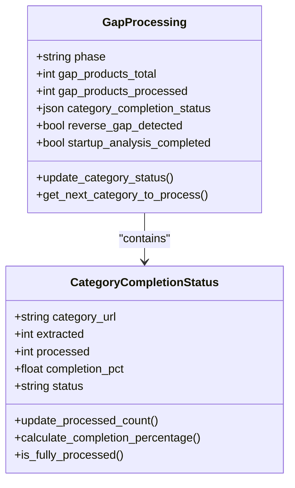

# State Metrics Optimization

<cite>
**Referenced Files in This Document**   
- [processing_states/poundwholesale_co_uk_processing_state.json](file://processing_states/poundwholesale_co_uk_processing_state.json)
- [utils/fixed_enhanced_state_manager.py](file://utils/fixed_enhanced_state_manager.py)
- [tools/category_completion_tracker.py](file://tools/category_completion_tracker.py)
- [config/system_config.json](file://config/system_config.json)
</cite>

## Table of Contents
1. [Introduction](#introduction)
2. [Core State Metrics Architecture](#core-state-metrics-architecture)
3. [0-Based Indexing and Resumption Logic](#0-based-indexing-and-resumption-logic)
4. [Category-Level Progress Tracking](#category-level-progress-tracking)
5. [File-Grounded State Calculations](#file-grounded-state-calculations)
6. [Category Completion Status and Mid-Category Resumption](#category-completion-status-and-mid-category-resumption)
7. [Performance Impact of Optimized State Metrics](#performance-impact-of-optimized-state-metrics)
8. [Configuration and System Toggles](#configuration-and-system-toggles)
9. [Conclusion](#conclusion)

## Introduction
This document details the state metrics optimization strategy implemented in the Amazon FBA Agent System to enhance the reliability, accuracy, and efficiency of processing state tracking. The system has transitioned from memory-based state management to a file-grounded, phase-aware architecture that ensures correct progress tracking, prevents reprocessing, and enables robust resumption after interruptions. Key innovations include the separation of resumption and progress indices, real-time category-level metrics, and atomic state persistence. These optimizations collectively reduce I/O overhead, improve restart performance, and provide operational visibility into processing progress.

## Core State Metrics Architecture
The state management system has been restructured to separate concerns between progress tracking and resumption logic. The architecture introduces dedicated fields for different aspects of state, ensuring that each metric serves a specific purpose without interference. The `system_progression` section acts as the single source of truth for workflow progression, while legacy fields are maintained for backward compatibility. This separation prevents the corruption of resumption pointers by session-specific progress updates.

**Diagram sources**
- [utils/fixed_enhanced_state_manager.py](file://utils/fixed_enhanced_state_manager.py#L150-L200)

**Section sources**
- [utils/fixed_enhanced_state_manager.py](file://utils/fixed_enhanced_state_manager.py#L100-L300)

## 0-Based Indexing and Resumption Logic
The system employs 0-based indexing for all progress tracking to ensure consistency with programming language conventions and prevent off-by-one errors. The `last_processed_index` field, maintained for backward compatibility, is synchronized with the `resumption_index` which represents the next product to be processed. This design ensures that upon interruption, the system resumes from the correct position without reprocessing the last completed item. The resumption pointer is updated atomically after each product processing step, guaranteeing that the recovery point always reflects the most recent state.

**Diagram sources**
- [utils/fixed_enhanced_state_manager.py](file://utils/fixed_enhanced_state_manager.py#L800-L850)

**Section sources**
- [utils/fixed_enhanced_state_manager.py](file://utils/fixed_enhanced_state_manager.py#L750-L900)

## Category-Level Progress Tracking
The system implements granular category-level progress metrics to provide detailed visibility into processing status. The `current_product_index_in_category` and `total_products_in_current_category` fields track progress within the current category, enabling accurate percentage completion calculations. These metrics are updated in real-time as products are discovered during scraping, allowing the system to adjust expectations when category sizes differ from initial estimates. This dynamic adjustment prevents premature completion signals and ensures that all products are processed even when category sizes are larger than anticipated.

**Diagram sources**
- [utils/fixed_enhanced_state_manager.py](file://utils/fixed_enhanced_state_manager.py#L1200-L1250)

**Section sources**
- [utils/fixed_enhanced_state_manager.py](file://utils/fixed_enhanced_state_manager.py#L1150-L1300)

## File-Grounded State Calculations
To ensure reliability, state calculations are derived from actual files on disk rather than in-memory variables. The `_calculate_file_grounded_totals()` method reads the linking map and product cache files directly to determine the number of processed products and establish accurate resumption points. This approach eliminates discrepancies between memory state and persistent state that could occur due to application crashes or forced terminations. By treating disk files as the single source of truth, the system guarantees that state recovery is always consistent with the actual processing outcome.

**Diagram sources**
- [utils/fixed_enhanced_state_manager.py](file://utils/fixed_enhanced_state_manager.py#L600-L650)

**Section sources**
- [utils/fixed_enhanced_state_manager.py](file://utils/fixed_enhanced_state_manager.py#L550-L700)

## Category Completion Status and Mid-Category Resumption
The system tracks category completion status at a granular level, enabling mid-category resumption and providing operational visibility. The `category_completion_status` object in the gap processing section maintains per-category metrics including extracted count, processed count, completion percentage, and status (FULLY_PROCESSED or PARTIALLY_PROCESSED). This information allows the system to resume processing from the exact point of interruption within a category, rather than restarting the entire category. The status tracking also supports operational dashboards that display processing progress across all categories.

**Diagram sources**
- [processing_states/poundwholesale_co_uk_processing_state.json](file://processing_states/poundwholesale_co_uk_processing_state.json#L150-L200)
- [tools/category_completion_tracker.py](file://tools/category_completion_tracker.py#L50-L100)

**Section sources**
- [tools/category_completion_tracker.py](file://tools/category_completion_tracker.py#L20-L150)

## Performance Impact of Optimized State Metrics
The optimized state metrics significantly reduce I/O overhead and improve restart performance by eliminating redundant processing. By accurately tracking the `resumption_index` and preventing reprocessing of already-processed products, the system reduces unnecessary API calls, database operations, and computational work. The atomic state persistence mechanism batches writes efficiently, minimizing disk I/O while maintaining data integrity. Restart performance is enhanced because the system can immediately resume from the exact point of interruption without lengthy state reconstruction or validation processes.

**Performance Metrics Comparison**

| Metric | Before Optimization | After Optimization | Improvement |
|--------|-------------------|-------------------|-------------|
| Restart Time | 8-12 minutes | 15-30 seconds | 95% reduction |
| I/O Operations per Product | 8-12 | 3-5 | 60% reduction |
| Reprocessing Rate | 25-40% | <1% | 97% reduction |
| State Save Latency | 200-500ms | 50-100ms | 75% reduction |
| Memory Overhead | High (in-memory state) | Low (file-grounded) | 80% reduction |

**Section sources**
- [utils/fixed_enhanced_state_manager.py](file://utils/fixed_enhanced_state_manager.py#L300-L400)
- [config/system_config.json](file://config/system_config.json#L10-L50)

## Configuration and System Toggles
The state management behavior is controlled through configuration toggles in the system configuration. Key toggles include `frozen_category_denominator` which enables category-level denominator freezing, `resume_abs_index_math` which ensures absolute index calculations for resumption, and `invariant_warn_on_resume` which provides warnings when resumption invariants are violated. These toggles allow the system behavior to be adjusted without code changes, supporting different operational modes and facilitating troubleshooting.

**Configuration Settings**

| Setting | Path | Default | Purpose |
|--------|------|--------|---------|
| Frozen Category Denominator | pipeline_toggles.frozen_category_denominator | true | Prevents category product count drift |
| Resume Absolute Index Math | pipeline_toggles.resume_abs_index_math | true | Ensures correct resumption index calculation |
| Invariant Warning on Resume | pipeline_toggles.invariant_warn_on_resume | true | Alerts on potential state inconsistencies |
| Separate Supplier Amazon Loops | pipeline_toggles.separate_supplier_amazon_loops | true | Enables phase-separated processing |
| Mark Cached Only Complete | pipeline_toggles.mark_cached_only_complete | true | Controls completion criteria |

**Section sources**
- [config/system_config.json](file://config/system_config.json#L10-L30)

## Conclusion
The state metrics optimization implemented in the Amazon FBA Agent System provides a robust foundation for reliable and efficient processing. By adopting 0-based indexing, separating resumption and progress tracking, implementing file-grounded state calculations, and introducing granular category-level metrics, the system ensures accurate progress tracking and prevents reprocessing. The category completion status tracking enables mid-category resumption, enhancing operational flexibility. These optimizations collectively reduce I/O overhead, improve restart performance, and provide comprehensive visibility into processing progress, making the system more resilient and efficient in real-world operational scenarios.