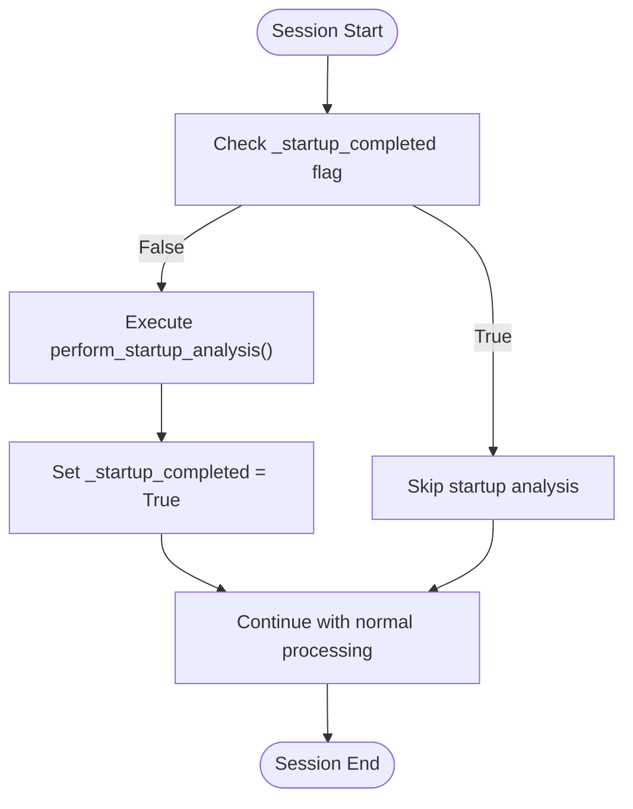
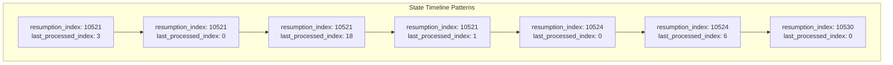
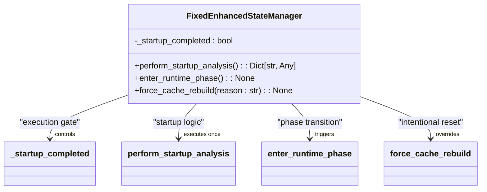

# Resumption Failures

<cite>
**Referenced Files in This Document**   
- [state_timeline_analysis.txt](file://diagnostics/state_timeline_analysis.txt)
- [fixed_enhanced_state_manager.py](file://utils/fixed_enhanced_state_manager.py)
</cite>

## Table of Contents
1. [Introduction](#introduction)
2. [Problem Analysis](#problem-analysis)
3. [Root Cause: Automatic Reverse Gap Reset](#root-cause-automatic-reverse-gap-reset)
4. [Solution: Startup Analysis Execution Control](#solution-startup-analysis-execution-control)
5. [State Timeline Analysis](#state-timeline-analysis)
6. [Code Implementation Details](#code-implementation-details)
7. [Common Issues and Resolution Guidance](#common-issues-and-resolution-guidance)
8. [Conclusion](#conclusion)

## Introduction
This document addresses critical resumption failures in the Amazon FBA Agent System where the system fails to resume from the correct processing point after interruption. The analysis focuses on diagnosing and resolving issues related to state management, particularly the problematic behavior of the `save_state()` method that caused progress loss through automatic reverse gap reset. The document provides a comprehensive examination of the issue, its root cause, and the implemented solution using the `_startup_completed` flag to control startup analysis execution.

## Problem Analysis
The system experienced significant resumption failures characterized by incorrect processing state recovery after interruptions. The core issue manifested as the system failing to resume from the expected processing point, leading to redundant processing and potential data inconsistencies. Analysis of the state timeline revealed patterns where the `resumption_index` remained constant while the `last_processed_index` fluctuated, indicating a fundamental flaw in the state management logic. This behavior resulted in progress loss and inefficient processing, particularly in long-running extraction workflows.

**Section sources**
- [state_timeline_analysis.txt](file://diagnostics/state_timeline_analysis.txt#L1-L330)

## Root Cause: Automatic Reverse Gap Reset
The primary cause of resumption failures was the automatic reverse gap reset mechanism in the `save_state()` method. This mechanism was incorrectly implemented to perform startup analysis on every save operation rather than only once at the beginning of a session. The reverse gap detection logic, designed to identify discrepancies between the linking map count and cached products, was being triggered repeatedly during normal processing.

This repeated execution caused the resumption index to be reset unnecessarily, effectively rolling back progress and forcing the system to reprocess already completed items. The issue was particularly problematic because it violated the principle of monotonic progress, where the processing state should only move forward and never regress. The automatic reset undermined the reliability of the resumption mechanism and led to significant performance degradation.

**Section sources**
- [fixed_enhanced_state_manager.py](file://utils/fixed_enhanced_state_manager.py#L500-L550)

## Solution: Startup Analysis Execution Control
The solution implemented was to ensure that startup analysis runs only once per session via the `perform_startup_analysis()` method rather than on every save operation. This was achieved through the introduction of the `_startup_completed` flag in the `FixedEnhancedStateManager` class. The flag acts as a one-way latch that prevents the startup analysis from being executed multiple times.

The implementation ensures that reverse gap detection and category analysis are performed exclusively during the initial phase of a session. Once the startup analysis is completed, the `_startup_completed` flag is set to `True`, preventing any subsequent execution of the analysis logic. This change guarantees that the resumption index is only determined once at the beginning of a session and remains stable throughout the processing lifecycle.

**Diagram sources**
- [fixed_enhanced_state_manager.py](file://utils/fixed_enhanced_state_manager.py#L500-L550)

**Section sources**
- [fixed_enhanced_state_manager.py](file://utils/fixed_enhanced_state_manager.py#L500-L550)

## State Timeline Analysis
The `state_timeline_analysis.txt` file provides critical evidence of the problematic resumption patterns. The analysis reveals a consistent pattern where the `resumption_index` remains fixed at specific values (10521, 10524, 10530) while the `last_processed_index` fluctuates between 0 and 16. This pattern indicates that the system was attempting to resume from a fixed point but was experiencing interruptions that caused the processing index to reset.

The timeline shows multiple instances where the `last_processed_index` drops to 0 or low values while the `resumption_index` remains unchanged, demonstrating the disconnect between the intended resumption point and the actual processing state. This behavior is characteristic of the automatic reverse gap reset issue, where the system's attempt to detect and handle gaps was interfering with normal processing flow.

**Diagram sources**
- [state_timeline_analysis.txt](file://diagnostics/state_timeline_analysis.txt#L1-L330)

**Section sources**
- [state_timeline_analysis.txt](file://diagnostics/state_timeline_analysis.txt#L1-L330)

## Code Implementation Details
The fix was implemented in the `FixedEnhancedStateManager` class with specific modifications to control the execution of startup analysis. The key components of the solution include:

1. The `_startup_completed` instance variable initialized to `False` in the constructor
2. The `perform_startup_analysis()` method that checks the flag before executing analysis
3. The setting of both `_startup_completed` and `startup_analysis_completed` flags after analysis completion

The implementation ensures that the resource-intensive startup analysis, including reverse gap detection and category completion status calculation, is performed only once at the beginning of a session. Subsequent save operations skip this analysis, preserving the established resumption point and preventing unnecessary index resets.

**Diagram sources**
- [fixed_enhanced_state_manager.py](file://utils/fixed_enhanced_state_manager.py#L100-L200)

**Section sources**
- [fixed_enhanced_state_manager.py](file://utils/fixed_enhanced_state_manager.py#L100-L200)

## Common Issues and Resolution Guidance
Several common issues related to resumption failures require specific attention:

1. **Incorrect handling of reverse gap scenarios**: The system must distinguish between genuine reverse gaps (new categories added) and processing interruptions. The solution uses the `force_cache_rebuild()` method to handle intentional restarts.

2. **Progress loss due to frequent saves**: When startup analysis runs on every save, it can reset the resumption index. The `_startup_completed` flag prevents this by ensuring analysis runs only once.

3. **Inconsistent state recovery**: The system may fail to resume from the correct point if the state file is corrupted or incomplete. The validation methods in `FixedEnhancedStateManager` help detect and repair such issues.

For cases where an intentional restart is needed, the `force_cache_rebuild()` method should be used. This method explicitly resets the resumption index to 0 and clears the startup completion flag, allowing a fresh analysis to be performed on the next execution. This approach ensures that cache rebuilds are intentional and controlled rather than occurring automatically during normal processing.

**Section sources**
- [fixed_enhanced_state_manager.py](file://utils/fixed_enhanced_state_manager.py#L550-L600)

## Conclusion
The resumption failures in the Amazon FBA Agent System were successfully diagnosed and resolved by addressing the automatic reverse gap reset issue in the state management system. By implementing the `_startup_completed` flag and ensuring that startup analysis runs only once via the `perform_startup_analysis()` method, the system now maintains a stable resumption point throughout processing sessions. This fix eliminates progress loss and ensures reliable recovery from interruptions, significantly improving the robustness and efficiency of the extraction workflow.