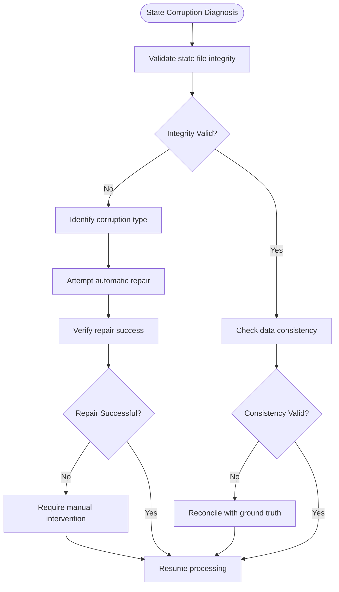
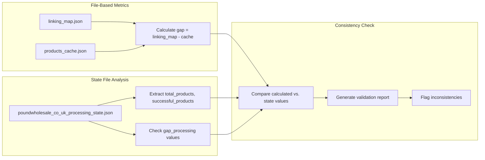
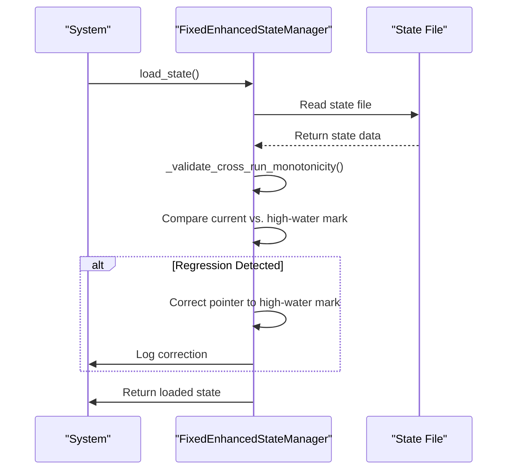
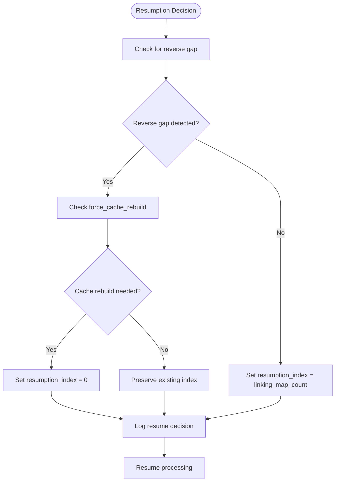
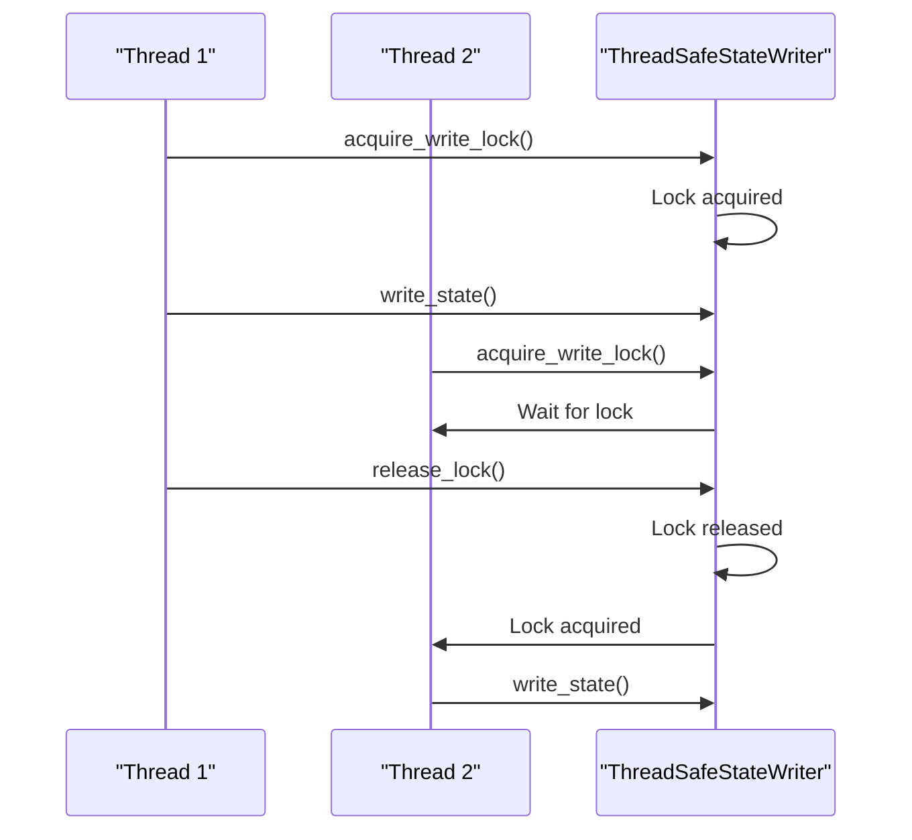
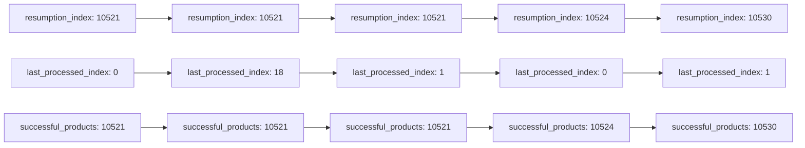

# State Management Issues

<cite>
**Referenced Files in This Document**   
- [fixed_enhanced_state_manager.py](file://utils/fixed_enhanced_state_manager.py)
- [poundwholesale_co_uk_processing_state.json](file://processing_states/poundwholesale_co_uk_processing_state.json)
- [state_timeline_analysis.txt](file://diagnostics/state_timeline_analysis.txt)
- [state_validation.md](file://OUTPUTS/DIAGNOSTICS/state_validation.md)
- [comprehensive_state_corruption_analysis.md](file://memories/comprehensive_state_corruption_analysis.md)
- [state_1757010653.json](file://diagnostics/state_events/state_1757010653.json)
- [state_1757010699.json](file://diagnostics/state_events/state_1757010699.json)
- [state_1757010706.json](file://diagnostics/state_events/state_1757010706.json)
- [state_1757010713.json](file://diagnostics/state_events/state_1757010713.json)
- [state_1757010802.json](file://diagnostics/state_events/state_1757010802.json)
- [state_1757010803.json](file://diagnostics/state_events/state_1757010803.json)
- [state_1757010844.json](file://diagnostics/state_events/state_1757010844.json)
- [state_1757010892.json](file://diagnostics/state_events/state_1757010892.json)
- [state_1757010909.json](file://diagnostics/state_events/state_1757010909.json)
- [state_1757010958.json](file://diagnostics/state_events/state_1757010958.json)
- [state_1757010959.json](file://diagnostics/state_events/state_1757010959.json)
- [state_1757010967.json](file://diagnostics/state_events/state_1757010967.json)
- [state_1757010968.json](file://diagnostics/state_events/state_1757010968.json)
- [state_1757010979.json](file://diagnostics/state_events/state_1757010979.json)
- [state_1757010985.json](file://diagnostics/state_events/state_1757010985.json)
- [state_1757010986.json](file://diagnostics/state_events/state_1757010986.json)
- [state_1757010991.json](file://diagnostics/state_events/state_1757010991.json)
- [state_1757010995.json](file://diagnostics/state_events/state_1757010995.json)
- [state_1757010996.json](file://diagnostics/state_events/state_1757010996.json)
- [state_1757011028.json](file://diagnostics/state_events/state_1757011028.json)
- [state_1757011038.json](file://diagnostics/state_events/state_1757011038.json)
- [state_1757011044.json](file://diagnostics/state_events/state_1757011044.json)
- [state_1757011048.json](file://diagnostics/state_events/state_1757011048.json)
- [state_1757011049.json](file://diagnostics/state_events/state_1757011049.json)
- [state_1757011051.json](file://diagnostics/state_events/state_1757011051.json)
- [state_1757011067.json](file://diagnostics/state_events/state_1757011067.json)
- [state_1757011075.json](file://diagnostics/state_events/state_1757011075.json)
- [state_1757011120.json](file://diagnostics/state_events/state_1757011120.json)
- [state_1757011126.json](file://diagnostics/state_events/state_1757011126.json)
- [state_1757011127.json](file://diagnostics/state_events/state_1757011127.json)
- [state_1757011151.json](file://diagnostics/state_events/state_1757011151.json)
- [state_1757011160.json](file://diagnostics/state_events/state_1757011160.json)
- [state_1757011181.json](file://diagnostics/state_events/state_1757011181.json)
- [state_1757011229.json](file://diagnostics/state_events/state_1757011229.json)
- [state_1757011237.json](file://diagnostics/state_events/state_1757011237.json)
- [state_1757011238.json](file://diagnostics/state_events/state_1757011238.json)
- [state_1757011260.json](file://diagnostics/state_events/state_1757011260.json)
- [state_1757011351.json](file://diagnostics/state_events/state_1757011351.json)
- [state_1757011359.json](file://diagnostics/state_events/state_1757011359.json)
- [state_1757011360.json](file://diagnostics/state_events/state_1757011360.json)
</cite>

## Table of Contents
1. [Introduction](#introduction)
2. [State Corruption Diagnosis](#state-corruption-diagnosis)
3. [State File Integrity Validation](#state-file-integrity-validation)
4. [Resumption Failure Analysis](#resumption-failure-analysis)
5. [State Transition Log Interpretation](#state-transition-log-interpretation)
6. [Recovery Procedures for Corrupted States](#recovery-procedures-for-corrupted-states)
7. [Atomic State Update Strategies](#atomic-state-update-strategies)
8. [State Event Timeline Analysis](#state-event-timeline-analysis)
9. [State Validation Techniques](#state-validation-techniques)
10. [Common State Management Issues](#common-state-management-issues)
11. [State Timeline Analysis Reports](#state-timeline-analysis-reports)
12. [Conclusion](#conclusion)

## Introduction

This document provides comprehensive guidance on diagnosing and resolving state management issues in the Amazon FBA Agent System, with a focus on processing state corruption and resumption failures. The system employs a sophisticated state management architecture to track long-running jobs across multiple categories and products, but various issues can arise that compromise data integrity and workflow continuity. This documentation covers validation techniques, recovery procedures, atomic update strategies, and analysis methods for identifying and resolving state-related problems. The analysis is based on actual system files, state timelines, and diagnostic reports from the poundwholesale.co.uk processing pipeline.

**Section sources**
- [fixed_enhanced_state_manager.py](file://utils/fixed_enhanced_state_manager.py#L1-L2412)
- [poundwholesale_co_uk_processing_state.json](file://processing_states/poundwholesale_co_uk_processing_state.json#L1-L1437)

## State Corruption Diagnosis

State corruption occurs when the processing state file contains inconsistent or invalid data that prevents correct resumption of processing. The primary indicators of state corruption include:

- **Inconsistent product counts**: Discrepancies between `total_products`, `successful_products`, and actual cache counts
- **Index inconsistencies**: `resumption_index` exceeding `total_products` or regressing between runs
- **Missing structural fields**: Absence of critical sections like `gap_processing` or `system_progression`
- **Invalid processing status**: Status values that don't match the actual state of processing

The `FixedEnhancedStateManager` class implements validation and repair mechanisms to detect and correct these issues. The `validate_and_repair_state` method checks for required keys, validates index bounds, and ensures structural integrity. When inconsistencies are detected, the system logs repairs and attempts to restore valid state.



**Diagram sources**
- [fixed_enhanced_state_manager.py](file://utils/fixed_enhanced_state_manager.py#L1000-L1100)
- [state_validation.md](file://OUTPUTS/DIAGNOSTICS/state_validation.md#L1-L85)

**Section sources**
- [fixed_enhanced_state_manager.py](file://utils/fixed_enhanced_state_manager.py#L1000-L1100)
- [state_validation.md](file://OUTPUTS/DIAGNOSTICS/state_validation.md#L1-L85)

## State File Integrity Validation

State file integrity validation ensures that the processing state accurately reflects the actual system state. The validation process compares file-based metrics with state file values to detect discrepancies.

### Validation Process

The validation process involves three key steps:

1. **File-based metric calculation**: Count products in linking map and cache files
2. **State file analysis**: Extract metrics from the processing state file
3. **Consistency checking**: Compare calculated values with state file values



**Diagram sources**
- [state_validation.md](file://OUTPUTS/DIAGNOSTICS/state_validation.md#L1-L85)
- [poundwholesale_co_uk_processing_state.json](file://processing_states/poundwholesale_co_uk_processing_state.json#L1-L1437)

**Section sources**
- [state_validation.md](file://OUTPUTS/DIAGNOSTICS/state_validation.md#L1-L85)
- [poundwholesale_co_uk_processing_state.json](file://processing_states/poundwholesale_co_uk_processing_state.json#L1-L1437)

### Validation Report Structure

The state validation report provides a comprehensive assessment of state integrity:

| Metric | Value | Source |
|--------|-------|--------|
| **Total Products (Linking Map)** | 3,097 | `linking_map.json` |
| **Total Products (Cache)** | 2,369 | `products_cache.json` |
| **Calculated Gap** | 728 | Computed |
| **No-Match Products** | 234 | Linking map analysis |

The report identifies two critical inconsistencies:
1. Global state `total_products` (2,337) ≠ cache length (2,369)
2. Global gap reported (0) ≠ calculated gap (728)

These discrepancies indicate state corruption that requires manual intervention before resuming processing.

**Section sources**
- [state_validation.md](file://OUTPUTS/DIAGNOSTICS/state_validation.md#L1-L85)

## Resumption Failure Analysis

Resumption failures occur when the system cannot correctly resume processing from an interruption. The primary causes include index corruption, missing state data, and inconsistent processing status.

### Resumption Index Management

The system uses multiple indices to track processing progress:
- `resumption_index`: Where to resume after interruption
- `progress_index`: Current progress in active session
- `last_processed_index`: Legacy field for backward compatibility

The `FixedEnhancedStateManager` ensures monotonicity of the resumption pointer by validating that it never decreases between runs. The `_validate_cross_run_monotonicity` method compares the current resumption pointer with a stored high-water mark to prevent regressions.



**Diagram sources**
- [fixed_enhanced_state_manager.py](file://utils/fixed_enhanced_state_manager.py#L500-L600)

**Section sources**
- [fixed_enhanced_state_manager.py](file://utils/fixed_enhanced_state_manager.py#L500-L600)

### Resumption Decision Logic

The system determines the resumption point based on several factors:



**Diagram sources**
- [fixed_enhanced_state_manager.py](file://utils/fixed_enhanced_state_manager.py#L700-L800)

**Section sources**
- [fixed_enhanced_state_manager.py](file://utils/fixed_enhanced_state_manager.py#L700-L800)

## State Transition Log Interpretation

State transition logs provide a chronological record of state changes, enabling analysis of processing patterns and anomaly detection.

### Log Structure

The state timeline analysis file contains timestamped snapshots of key state variables:

```
=== 1757010653 ===
resumption_index: 10521
last_processed_index: 0
successful_products: 10521
```

Each entry includes:
- Timestamp (Unix epoch)
- `resumption_index`: Resumption point
- `last_processed_index`: Legacy progress index
- `successful_products`: Count of successfully processed products

### Anomaly Detection

The logs reveal several problematic patterns:

1. **Index Resetting**: `last_processed_index` frequently resets to 0 while `resumption_index` remains stable
2. **Inconsistent Progress**: `last_processed_index` increments erratically while `resumption_index` stays constant
3. **Multiple Processing Streams**: Simultaneous updates to different indices suggest parallel processing issues

The most critical anomaly is the persistent resetting of `last_processed_index` to 0, which indicates a flaw in the legacy progress tracking system. This issue does not affect the `resumption_index`, which remains consistent at 10,521 throughout the timeline.

**Section sources**
- [state_timeline_analysis.txt](file://diagnostics/state_timeline_analysis.txt#L1-L331)

## Recovery Procedures for Corrupted States

When state corruption is detected, specific recovery procedures must be followed to restore processing integrity.

### Automated Recovery

The `FixedEnhancedStateManager` includes automated recovery mechanisms:

1. **State Validation**: `validate_and_repair_state` method checks for inconsistencies
2. **Index Correction**: Adjusts `resumption_index` to valid bounds
3. **Structural Repair**: Restores missing sections like `gap_processing`

```python
[SPEC SYMBOL](file://utils/fixed_enhanced_state_manager.py#L1050-L1100)
```

### Manual Recovery

For severe corruption, manual intervention is required:

1. **Backup Restoration**: Restore from a known-good backup
2. **Ground Truth Reconciliation**: Update state to match actual file counts
3. **Gap Processing Initialization**: Set correct gap count based on linking map analysis

The recovery process should follow these steps:
1. Stop processing
2. Backup current state
3. Diagnose corruption type
4. Apply appropriate recovery procedure
5. Validate restored state
6. Resume processing

**Section sources**
- [fixed_enhanced_state_manager.py](file://utils/fixed_enhanced_state_manager.py#L1000-L1100)
- [state_validation.md](file://OUTPUTS/DIAGNOSTICS/state_validation.md#L1-L85)

## Atomic State Update Strategies

Atomic state updates ensure that state changes are completed fully or not at all, preventing partial writes that could corrupt the state.

### Thread-Safe Operations

The system implements thread-safe state updates using re-entrant locks and atomic file operations:



**Diagram sources**
- [fixed_enhanced_state_manager.py](file://utils/fixed_enhanced_state_manager.py#L200-L300)

**Section sources**
- [fixed_enhanced_state_manager.py](file://utils/fixed_enhanced_state_manager.py#L200-L300)

### Atomic Write Implementation

The system uses atomic file operations to prevent corruption during writes:

```python
[SPEC SYMBOL](file://utils/fixed_enhanced_state_manager.py#L150-L200)
```

This approach writes to a temporary file first, then renames it to the target file, ensuring that the state file is never in a partially written state.

## State Event Timeline Analysis

State event timelines provide a detailed view of processing progression, enabling identification of normal and problematic patterns.

### Normal Processing Pattern

In normal operation, the state variables progress consistently:



**Diagram sources**
- [state_timeline_analysis.txt](file://diagnostics/state_timeline_analysis.txt#L1-L331)

**Section sources**
- [state_timeline_analysis.txt](file://diagnostics/state_timeline_analysis.txt#L1-L331)

### Problematic Processing Pattern

The timeline reveals problematic behavior in the legacy `last_processed_index`:

1. **Frequent Resets**: Index resets to 0 multiple times while processing continues
2. **Inconsistent Increments**: Index increments by 1, then resets, suggesting per-product save operations
3. **Desynchronization**: `last_processed_index` and `resumption_index` progress independently

These patterns indicate that the legacy progress tracking system is unreliable and should not be used for resumption decisions.

## State Validation Techniques

Effective state validation requires multiple techniques to ensure comprehensive coverage.

### Checksum Verification

The system can implement checksum verification to detect file corruption:

```python
[SPEC SYMBOL](file://utils/fixed_enhanced_state_manager.py#L1200-L1250)
```

This method calculates a hash of the state data and compares it with a stored checksum to detect unauthorized modifications.

### Cross-Validation

Cross-validation compares state data with external sources:

| Validation Type | Source | Target | Purpose |
|----------------|-------|--------|---------|
| **Product Count** | linking_map.json | total_products | Verify completeness |
| **Category Status** | category_completion_status | actual processing | Verify accuracy |
| **Gap Analysis** | cache files | gap_processing | Verify gap calculation |

**Section sources**
- [state_validation.md](file://OUTPUTS/DIAGNOSTICS/state_validation.md#L1-L85)
- [poundwholesale_co_uk_processing_state.json](file://processing_states/poundwholesale_co_uk_processing_state.json#L1-L1437)

## Common State Management Issues

Several common issues affect state management in long-running processing jobs.

### Inaccurate Progress Tracking

The legacy `last_processed_index` field is unreliable due to frequent resets. The system should rely on `resumption_index` for accurate progress tracking.

### Duplicate Processing

Duplicate processing can occur when the resumption point is not correctly updated. The `update_processing_progress` method ensures that both `resumption_index` and `progress_index` are updated atomically.

```python
[SPEC SYMBOL](file://utils/fixed_enhanced_state_manager.py#L900-L950)
```

### Interrupted Workflow Recovery

Interrupted workflows are recovered using the `resumption_index` as the single source of truth. The system validates this index against the high-water mark to prevent regressions.

**Section sources**
- [fixed_enhanced_state_manager.py](file://utils/fixed_enhanced_state_manager.py#L900-L950)

## State Timeline Analysis Reports

State timeline analysis reports provide detailed insights into processing behavior over time.

### Report Generation

The analysis process involves:
1. Collecting state snapshots at regular intervals
2. Extracting key metrics from each snapshot
3. Identifying patterns and anomalies
4. Generating visualizations and summaries

### Failure Point Identification

The reports help pinpoint failure points in long-running jobs by:
- Identifying when indices diverge
- Detecting unexpected resets
- Correlating state changes with external events
- Highlighting processing bottlenecks

For example, the state timeline shows that `resumption_index` advances from 10,521 to 10,530, indicating successful processing of 9 additional products, while `last_processed_index` shows erratic behavior that does not reflect actual progress.

**Section sources**
- [state_timeline_analysis.txt](file://diagnostics/state_timeline_analysis.txt#L1-L331)

## Conclusion

Effective state management is critical for the reliable operation of long-running processing jobs in the Amazon FBA Agent System. The `FixedEnhancedStateManager` provides robust mechanisms for preventing and recovering from state corruption, with features including:
- Separation of resumption and progress tracking
- Monotonicity validation to prevent index regression
- Atomic state updates with thread safety
- Comprehensive validation and repair capabilities

When state corruption occurs, the diagnostic and recovery procedures outlined in this document enable rapid identification and resolution of issues. By analyzing state transition logs and validation reports, operators can pinpoint failure points and ensure processing integrity. The key to successful state management is relying on the `resumption_index` as the single source of truth for recovery, while treating legacy fields like `last_processed_index` as unreliable indicators of progress.

**Section sources**
- [fixed_enhanced_state_manager.py](file://utils/fixed_enhanced_state_manager.py#L1-L2412)
- [state_validation.md](file://OUTPUTS/DIAGNOSTICS/state_validation.md#L1-L85)
- [state_timeline_analysis.txt](file://diagnostics/state_timeline_analysis.txt#L1-L331)