# Project Index: Amazon FBA Agent System

Generated: 2026-01-25T00:00:00Z
Index Type: Full-system documentation index
Repository Root: `C:\Users\chris\Desktop\Amazon-FBA-Agent-System-v32 - latest good - Copy (8) - Copy - Copy - POSTLONGRUNPREKIRO2 beforecompletion-`

---

## System Overview

The Amazon FBA Agent System is a file-grounded, Playwright-driven automation platform for extracting supplier product data, matching it to Amazon listings, and producing financial analysis outputs. The system is organized around supplier-specific runners that call a central orchestrator, and includes a dashboard, onboarding workflow, and extensive documentation.

---

## Entry Points

### Supplier Runner Scripts

- `C:\Users\chris\Desktop\Amazon-FBA-Agent-System-v32 - latest good - Copy (8) - Copy - Copy - POSTLONGRUNPREKIRO2 beforecompletion-\run_custom_poundwholesale.py` — PoundWholesale runner with persistent browser behavior.
- `C:\Users\chris\Desktop\Amazon-FBA-Agent-System-v32 - latest good - Copy (8) - Copy - Copy - POSTLONGRUNPREKIRO2 beforecompletion-\run_custom_clearance_king.py` — Clearance King runner with browser cleanup.
- `C:\Users\chris\Desktop\Amazon-FBA-Agent-System-v32 - latest good - Copy (8) - Copy - Copy - POSTLONGRUNPREKIRO2 beforecompletion-\run_custom_dkwholesale-com.py` — DK Wholesale runner.
- `C:\Users\chris\Desktop\Amazon-FBA-Agent-System-v32 - latest good - Copy (8) - Copy - Copy - POSTLONGRUNPREKIRO2 beforecompletion-\run_custom_efghousewares-co-uk.py` — EFG Housewares runner.
- `C:\Users\chris\Desktop\Amazon-FBA-Agent-System-v32 - latest good - Copy (8) - Copy - Copy - POSTLONGRUNPREKIRO2 beforecompletion-\run_custom_kdwholesale-co-uk.py` — KD Wholesale runner.
- `C:\Users\chris\Desktop\Amazon-FBA-Agent-System-v32 - latest good - Copy (8) - Copy - Copy - POSTLONGRUNPREKIRO2 beforecompletion-\run_custom_laceywholesale-co-uk.py` — Lacey Wholesale runner.
- `C:\Users\chris\Desktop\Amazon-FBA-Agent-System-v32 - latest good - Copy (8) - Copy - Copy - POSTLONGRUNPREKIRO2 beforecompletion-\run_custom_angelwholesale-co-uk.py` — Angel Wholesale runner.
- `C:\Users\chris\Desktop\Amazon-FBA-Agent-System-v32 - latest good - Copy (8) - Copy - Copy - POSTLONGRUNPREKIRO2 beforecompletion-\run_custom_wholesaletradingsupplies-co-uk.py` — Wholesale Trading Supplies runner.

### Master Runner

- `C:\Users\chris\Desktop\Amazon-FBA-Agent-System-v32 - latest good - Copy (8) - Copy - Copy - POSTLONGRUNPREKIRO2 beforecompletion-\run_complete_fba_system.py` — Legacy master runner with supplier guard and output verification; contains hard-coded OpenAI API key fallback.

### Analysis + Utility Entrypoints

- `C:\Users\chris\Desktop\Amazon-FBA-Agent-System-v32 - latest good - Copy (8) - Copy - Copy - POSTLONGRUNPREKIRO2 beforecompletion-\run_ai_setup.py` — Conversational onboarding driver.
- `C:\Users\chris\Desktop\Amazon-FBA-Agent-System-v32 - latest good - Copy (8) - Copy - Copy - POSTLONGRUNPREKIRO2 beforecompletion-\run_fba_analysis_v3b.py` — Post-processing analysis runner.
- `C:\Users\chris\Desktop\Amazon-FBA-Agent-System-v32 - latest good - Copy (8) - Copy - Copy - POSTLONGRUNPREKIRO2 beforecompletion-\dashboard\run_dashboard.py` — Dashboard launcher.
- `C:\Users\chris\Desktop\Amazon-FBA-Agent-System-v32 - latest good - Copy (8) - Copy - Copy - POSTLONGRUNPREKIRO2 beforecompletion-\start_dashboard.py` — Alternate dashboard runner.

---

## Central Orchestrator

- `C:\Users\chris\Desktop\Amazon-FBA-Agent-System-v32 - latest good - Copy (8) - Copy - Copy - POSTLONGRUNPREKIRO2 beforecompletion-\tools\passive_extraction_workflow_latest.py` — `PassiveExtractionWorkflow` orchestrates supplier scraping, Amazon matching, state persistence, and financial calculations.

---

## Core Tools (Direct Workflow Dependencies)

- `C:\Users\chris\Desktop\Amazon-FBA-Agent-System-v32 - latest good - Copy (8) - Copy - Copy - POSTLONGRUNPREKIRO2 beforecompletion-\tools\configurable_supplier_scraper.py` — Supplier scraping with configurable selectors.
- `C:\Users\chris\Desktop\Amazon-FBA-Agent-System-v32 - latest good - Copy (8) - Copy - Copy - POSTLONGRUNPREKIRO2 beforecompletion-\tools\amazon_playwright_extractor.py` — Amazon extraction and extension data retrieval.
- `C:\Users\chris\Desktop\Amazon-FBA-Agent-System-v32 - latest good - Copy (8) - Copy - Copy - POSTLONGRUNPREKIRO2 beforecompletion-\tools\FBA_Financial_calculator.py` — ROI, profit, and fee calculations.
- `C:\Users\chris\Desktop\Amazon-FBA-Agent-System-v32 - latest good - Copy (8) - Copy - Copy - POSTLONGRUNPREKIRO2 beforecompletion-\tools\cache_manager.py` — Cache read/write orchestration.
- `C:\Users\chris\Desktop\Amazon-FBA-Agent-System-v32 - latest good - Copy (8) - Copy - Copy - POSTLONGRUNPREKIRO2 beforecompletion-\tools\standalone_playwright_login.py` — Standalone login flows.
- `C:\Users\chris\Desktop\Amazon-FBA-Agent-System-v32 - latest good - Copy (8) - Copy - Copy - POSTLONGRUNPREKIRO2 beforecompletion-\tools\authentication_manager.py` — Authentication utilities.
- `C:\Users\chris\Desktop\Amazon-FBA-Agent-System-v32 - latest good - Copy (8) - Copy - Copy - POSTLONGRUNPREKIRO2 beforecompletion-\tools\category_navigator.py` — Category navigation utilities.
- `C:\Users\chris\Desktop\Amazon-FBA-Agent-System-v32 - latest good - Copy (8) - Copy - Copy - POSTLONGRUNPREKIRO2 beforecompletion-\tools\category_completion_tracker.py` — Category completion tracking.

---

## Supporting Tools (Workflow Services)

- `C:\Users\chris\Desktop\Amazon-FBA-Agent-System-v32 - latest good - Copy (8) - Copy - Copy - POSTLONGRUNPREKIRO2 beforecompletion-\tools\supplier_guard.py` — Supplier readiness guard and archiving.
- `C:\Users\chris\Desktop\Amazon-FBA-Agent-System-v32 - latest good - Copy (8) - Copy - Copy - POSTLONGRUNPREKIRO2 beforecompletion-\tools\output_verification_node.py` — Output validation for runs.
- `C:\Users\chris\Desktop\Amazon-FBA-Agent-System-v32 - latest good - Copy (8) - Copy - Copy - POSTLONGRUNPREKIRO2 beforecompletion-\tools\supplier_output_manager.py` — Output structuring for suppliers.
- `C:\Users\chris\Desktop\Amazon-FBA-Agent-System-v32 - latest good - Copy (8) - Copy - Copy - POSTLONGRUNPREKIRO2 beforecompletion-\tools\supplier_parser.py` — Supplier parsing utilities.
- `C:\Users\chris\Desktop\Amazon-FBA-Agent-System-v32 - latest good - Copy (8) - Copy - Copy - POSTLONGRUNPREKIRO2 beforecompletion-\tools\product_data_extractor.py` — Product data normalization.
- `C:\Users\chris\Desktop\Amazon-FBA-Agent-System-v32 - latest good - Copy (8) - Copy - Copy - POSTLONGRUNPREKIRO2 beforecompletion-\tools\system_monitor.py` — System monitoring utilities.
- `C:\Users\chris\Desktop\Amazon-FBA-Agent-System-v32 - latest good - Copy (8) - Copy - Copy - POSTLONGRUNPREKIRO2 beforecompletion-\tools\system_audit_monitor.py` — System audit monitoring.
- `C:\Users\chris\Desktop\Amazon-FBA-Agent-System-v32 - latest good - Copy (8) - Copy - Copy - POSTLONGRUNPREKIRO2 beforecompletion-\tools\run_monitor.py` — Run monitoring helpers.

---

## Analysis / Trace Tools

- `C:\Users\chris\Desktop\Amazon-FBA-Agent-System-v32 - latest good - Copy (8) - Copy - Copy - POSTLONGRUNPREKIRO2 beforecompletion-\tools\analyze_part1.py`
- `C:\Users\chris\Desktop\Amazon-FBA-Agent-System-v32 - latest good - Copy (8) - Copy - Copy - POSTLONGRUNPREKIRO2 beforecompletion-\tools\analyze_fba_report_v2.py`
- `C:\Users\chris\Desktop\Amazon-FBA-Agent-System-v32 - latest good - Copy (8) - Copy - Copy - POSTLONGRUNPREKIRO2 beforecompletion-\tools\deep_analysis_runner.py`
- `C:\Users\chris\Desktop\Amazon-FBA-Agent-System-v32 - latest good - Copy (8) - Copy - Copy - POSTLONGRUNPREKIRO2 beforecompletion-\tools\comprehensive_execution_trace.py`
- `C:\Users\chris\Desktop\Amazon-FBA-Agent-System-v32 - latest good - Copy (8) - Copy - Copy - POSTLONGRUNPREKIRO2 beforecompletion-\tools\chunking_execution_tracer.py`

---

## Supplier Authentication Services

- `C:\Users\chris\Desktop\Amazon-FBA-Agent-System-v32 - latest good - Copy (8) - Copy - Copy - POSTLONGRUNPREKIRO2 beforecompletion-\tools\poundwholesale\supplier_authentication_service.py`
- `C:\Users\chris\Desktop\Amazon-FBA-Agent-System-v32 - latest good - Copy (8) - Copy - Copy - POSTLONGRUNPREKIRO2 beforecompletion-\tools\clearance_king\supplier_authentication_service.py`
- `C:\Users\chris\Desktop\Amazon-FBA-Agent-System-v32 - latest good - Copy (8) - Copy - Copy - POSTLONGRUNPREKIRO2 beforecompletion-\tools\dkwholesale\supplier_authentication_service.py`
- `C:\Users\chris\Desktop\Amazon-FBA-Agent-System-v32 - latest good - Copy (8) - Copy - Copy - POSTLONGRUNPREKIRO2 beforecompletion-\tools\efghousewares\supplier_authentication_service.py`

---

## State / Resume / Data Integrity

- `C:\Users\chris\Desktop\Amazon-FBA-Agent-System-v32 - latest good - Copy (8) - Copy - Copy - POSTLONGRUNPREKIRO2 beforecompletion-\utils\fixed_enhanced_state_manager.py`
- `C:\Users\chris\Desktop\Amazon-FBA-Agent-System-v32 - latest good - Copy (8) - Copy - Copy - POSTLONGRUNPREKIRO2 beforecompletion-\utils\windows_save_guardian.py`
- `C:\Users\chris\Desktop\Amazon-FBA-Agent-System-v32 - latest good - Copy (8) - Copy - Copy - POSTLONGRUNPREKIRO2 beforecompletion-\utils\hash_lookup_optimizer.py`
- `C:\Users\chris\Desktop\Amazon-FBA-Agent-System-v32 - latest good - Copy (8) - Copy - Copy - POSTLONGRUNPREKIRO2 beforecompletion-\utils\url_aware_state_manager.py`
- `C:\Users\chris\Desktop\Amazon-FBA-Agent-System-v32 - latest good - Copy (8) - Copy - Copy - POSTLONGRUNPREKIRO2 beforecompletion-\utils\data_integrity_guardian.py`

---

## Browser Automation / Resilience

- `C:\Users\chris\Desktop\Amazon-FBA-Agent-System-v32 - latest good - Copy (8) - Copy - Copy - POSTLONGRUNPREKIRO2 beforecompletion-\utils\browser_manager.py`
- `C:\Users\chris\Desktop\Amazon-FBA-Agent-System-v32 - latest good - Copy (8) - Copy - Copy - POSTLONGRUNPREKIRO2 beforecompletion-\utils\browser_circuit_breaker.py`
- `C:\Users\chris\Desktop\Amazon-FBA-Agent-System-v32 - latest good - Copy (8) - Copy - Copy - POSTLONGRUNPREKIRO2 beforecompletion-\utils\sentinel_monitor.py`
- `C:\Users\chris\Desktop\Amazon-FBA-Agent-System-v32 - latest good - Copy (8) - Copy - Copy - POSTLONGRUNPREKIRO2 beforecompletion-\utils\supplier_circuit_breaker.py`

---

## File / Path / Normalization / Logging

- `C:\Users\chris\Desktop\Amazon-FBA-Agent-System-v32 - latest good - Copy (8) - Copy - Copy - POSTLONGRUNPREKIRO2 beforecompletion-\utils\path_manager.py`
- `C:\Users\chris\Desktop\Amazon-FBA-Agent-System-v32 - latest good - Copy (8) - Copy - Copy - POSTLONGRUNPREKIRO2 beforecompletion-\utils\url_filter.py`
- `C:\Users\chris\Desktop\Amazon-FBA-Agent-System-v32 - latest good - Copy (8) - Copy - Copy - POSTLONGRUNPREKIRO2 beforecompletion-\utils\url_cache_filter.py`
- `C:\Users\chris\Desktop\Amazon-FBA-Agent-System-v32 - latest good - Copy (8) - Copy - Copy - POSTLONGRUNPREKIRO2 beforecompletion-\utils\file_manager.py`
- `C:\Users\chris\Desktop\Amazon-FBA-Agent-System-v32 - latest good - Copy (8) - Copy - Copy - POSTLONGRUNPREKIRO2 beforecompletion-\utils\atomic_file_operations.py`
- `C:\Users\chris\Desktop\Amazon-FBA-Agent-System-v32 - latest good - Copy (8) - Copy - Copy - POSTLONGRUNPREKIRO2 beforecompletion-\utils\normalization.py`
- `C:\Users\chris\Desktop\Amazon-FBA-Agent-System-v32 - latest good - Copy (8) - Copy - Copy - POSTLONGRUNPREKIRO2 beforecompletion-\utils\logger.py`

---

## Memory / Platform Helpers

- `C:\Users\chris\Desktop\Amazon-FBA-Agent-System-v32 - latest good - Copy (8) - Copy - Copy - POSTLONGRUNPREKIRO2 beforecompletion-\utils\windows_memory_manager.py`
- `C:\Users\chris\Desktop\Amazon-FBA-Agent-System-v32 - latest good - Copy (8) - Copy - Copy - POSTLONGRUNPREKIRO2 beforecompletion-\utils\wsl_memory_manager.py`
- `C:\Users\chris\Desktop\Amazon-FBA-Agent-System-v32 - latest good - Copy (8) - Copy - Copy - POSTLONGRUNPREKIRO2 beforecompletion-\utils\file_organization_migrator.py`

---

## Configuration System

### Loaders

- `C:\Users\chris\Desktop\Amazon-FBA-Agent-System-v32 - latest good - Copy (8) - Copy - Copy - POSTLONGRUNPREKIRO2 beforecompletion-\config\system_config_loader.py`
- `C:\Users\chris\Desktop\Amazon-FBA-Agent-System-v32 - latest good - Copy (8) - Copy - Copy - POSTLONGRUNPREKIRO2 beforecompletion-\config\supplier_config_loader.py`

### System Config

- `C:\Users\chris\Desktop\Amazon-FBA-Agent-System-v32 - latest good - Copy (8) - Copy - Copy - POSTLONGRUNPREKIRO2 beforecompletion-\config\system_config.json`

### Category URL Configs

- `C:\Users\chris\Desktop\Amazon-FBA-Agent-System-v32 - latest good - Copy (8) - Copy - Copy - POSTLONGRUNPREKIRO2 beforecompletion-\config\poundwholesale_categories.json`
- `C:\Users\chris\Desktop\Amazon-FBA-Agent-System-v32 - latest good - Copy (8) - Copy - Copy - POSTLONGRUNPREKIRO2 beforecompletion-\config\clearance_king_categories.json`
- `C:\Users\chris\Desktop\Amazon-FBA-Agent-System-v32 - latest good - Copy (8) - Copy - Copy - POSTLONGRUNPREKIRO2 beforecompletion-\config\dkwholesale_categories.json`
- `C:\Users\chris\Desktop\Amazon-FBA-Agent-System-v32 - latest good - Copy (8) - Copy - Copy - POSTLONGRUNPREKIRO2 beforecompletion-\config\efghousewares_categories.json`
- `C:\Users\chris\Desktop\Amazon-FBA-Agent-System-v32 - latest good - Copy (8) - Copy - Copy - POSTLONGRUNPREKIRO2 beforecompletion-\config\kdwholesale_categories.json`
- `C:\Users\chris\Desktop\Amazon-FBA-Agent-System-v32 - latest good - Copy (8) - Copy - Copy - POSTLONGRUNPREKIRO2 beforecompletion-\config\laceywholesale_categories.json`
- `C:\Users\chris\Desktop\Amazon-FBA-Agent-System-v32 - latest good - Copy (8) - Copy - Copy - POSTLONGRUNPREKIRO2 beforecompletion-\config\angelwholesale_categories.json`

### Supplier Configs

- `C:\Users\chris\Desktop\Amazon-FBA-Agent-System-v32 - latest good - Copy (8) - Copy - Copy - POSTLONGRUNPREKIRO2 beforecompletion-\config\supplier_configs\poundwholesale.co.uk.json`
- `C:\Users\chris\Desktop\Amazon-FBA-Agent-System-v32 - latest good - Copy (8) - Copy - Copy - POSTLONGRUNPREKIRO2 beforecompletion-\config\supplier_configs\clearance-king.co.uk.json`
- `C:\Users\chris\Desktop\Amazon-FBA-Agent-System-v32 - latest good - Copy (8) - Copy - Copy - POSTLONGRUNPREKIRO2 beforecompletion-\config\supplier_configs\dkwholesale.com.json`
- `C:\Users\chris\Desktop\Amazon-FBA-Agent-System-v32 - latest good - Copy (8) - Copy - Copy - POSTLONGRUNPREKIRO2 beforecompletion-\config\supplier_configs\efghousewares.co.uk.json`
- `C:\Users\chris\Desktop\Amazon-FBA-Agent-System-v32 - latest good - Copy (8) - Copy - Copy - POSTLONGRUNPREKIRO2 beforecompletion-\config\supplier_configs\kdwholesale.co.uk.json`
- `C:\Users\chris\Desktop\Amazon-FBA-Agent-System-v32 - latest good - Copy (8) - Copy - Copy - POSTLONGRUNPREKIRO2 beforecompletion-\config\supplier_configs\laceywholesale.co.uk.json`
- `C:\Users\chris\Desktop\Amazon-FBA-Agent-System-v32 - latest good - Copy (8) - Copy - Copy - POSTLONGRUNPREKIRO2 beforecompletion-\config\supplier_configs\angelwholesale.co.uk.json`
- `C:\Users\chris\Desktop\Amazon-FBA-Agent-System-v32 - latest good - Copy (8) - Copy - Copy - POSTLONGRUNPREKIRO2 beforecompletion-\config\supplier_configs\wholesaletradingsupplies.com.json`

---

## Supplier Onboarding / Generators

### Wizard + Generators

- `C:\Users\chris\Desktop\Amazon-FBA-Agent-System-v32 - latest good - Copy (8) - Copy - Copy - POSTLONGRUNPREKIRO2 beforecompletion-\utils\supplier_onboarding_wizard.py` — Deterministic onboarding and validation.
- `C:\Users\chris\Desktop\Amazon-FBA-Agent-System-v32 - latest good - Copy (8) - Copy - Copy - POSTLONGRUNPREKIRO2 beforecompletion-\tools\supplier_script_generator.py` — AI-assisted generation.
- `C:\Users\chris\Desktop\Amazon-FBA-Agent-System-v32 - latest good - Copy (8) - Copy - Copy - POSTLONGRUNPREKIRO2 beforecompletion-\tools\vision_discovery_engine.py` — Selector discovery engine.
- `C:\Users\chris\Desktop\Amazon-FBA-Agent-System-v32 - latest good - Copy (8) - Copy - Copy - POSTLONGRUNPREKIRO2 beforecompletion-\tools\login_debug_tester.py` — File appears to contain non-text content; treat as opaque unless regenerated.

### Templates

- `C:\Users\chris\Desktop\Amazon-FBA-Agent-System-v32 - latest good - Copy (8) - Copy - Copy - POSTLONGRUNPREKIRO2 beforecompletion-\.claude\skills\supplier-onboarding\templates\runner_template.py.txt`
- `C:\Users\chris\Desktop\Amazon-FBA-Agent-System-v32 - latest good - Copy (8) - Copy - Copy - POSTLONGRUNPREKIRO2 beforecompletion-\.claude\skills\supplier-onboarding\templates\auth_helper_template.py.txt`

### Setup Directories (Existing)

- `C:\Users\chris\Desktop\Amazon-FBA-Agent-System-v32 - latest good - Copy (8) - Copy - Copy - POSTLONGRUNPREKIRO2 beforecompletion-\setup\dkwholesale`
- `C:\Users\chris\Desktop\Amazon-FBA-Agent-System-v32 - latest good - Copy (8) - Copy - Copy - POSTLONGRUNPREKIRO2 beforecompletion-\setup\efghousewares`
- `C:\Users\chris\Desktop\Amazon-FBA-Agent-System-v32 - latest good - Copy (8) - Copy - Copy - POSTLONGRUNPREKIRO2 beforecompletion-\setup\kdwholesale`
- `C:\Users\chris\Desktop\Amazon-FBA-Agent-System-v32 - latest good - Copy (8) - Copy - Copy - POSTLONGRUNPREKIRO2 beforecompletion-\setup\laceywholesale`
- `C:\Users\chris\Desktop\Amazon-FBA-Agent-System-v32 - latest good - Copy (8) - Copy - Copy - POSTLONGRUNPREKIRO2 beforecompletion-\setup\angelwholesale`
- `C:\Users\chris\Desktop\Amazon-FBA-Agent-System-v32 - latest good - Copy (8) - Copy - Copy - POSTLONGRUNPREKIRO2 beforecompletion-\setup\wholesaletradingsupplies`

### Setup Directories (Missing)

- `C:\Users\chris\Desktop\Amazon-FBA-Agent-System-v32 - latest good - Copy (8) - Copy - Copy - POSTLONGRUNPREKIRO2 beforecompletion-\setup\poundwholesale`
- `C:\Users\chris\Desktop\Amazon-FBA-Agent-System-v32 - latest good - Copy (8) - Copy - Copy - POSTLONGRUNPREKIRO2 beforecompletion-\setup\clearance_king`

---

## Outputs and Naming Conventions

### Output Root

- `C:\Users\chris\Desktop\Amazon-FBA-Agent-System-v32 - latest good - Copy (8) - Copy - Copy - POSTLONGRUNPREKIRO2 beforecompletion-\OUTPUTS`

### Primary Output Locations

- `C:\Users\chris\Desktop\Amazon-FBA-Agent-System-v32 - latest good - Copy (8) - Copy - Copy - POSTLONGRUNPREKIRO2 beforecompletion-\OUTPUTS\CACHE\processing_states` — State files.
- `C:\Users\chris\Desktop\Amazon-FBA-Agent-System-v32 - latest good - Copy (8) - Copy - Copy - POSTLONGRUNPREKIRO2 beforecompletion-\OUTPUTS\cached_products` — Supplier product caches.
- `C:\Users\chris\Desktop\Amazon-FBA-Agent-System-v32 - latest good - Copy (8) - Copy - Copy - POSTLONGRUNPREKIRO2 beforecompletion-\OUTPUTS\FBA_ANALYSIS\amazon_cache` — Amazon product caches.
- `C:\Users\chris\Desktop\Amazon-FBA-Agent-System-v32 - latest good - Copy (8) - Copy - Copy - POSTLONGRUNPREKIRO2 beforecompletion-\OUTPUTS\FBA_ANALYSIS\linking_maps` — EAN to ASIN linking maps.
- `C:\Users\chris\Desktop\Amazon-FBA-Agent-System-v32 - latest good - Copy (8) - Copy - Copy - POSTLONGRUNPREKIRO2 beforecompletion-\OUTPUTS\FBA_ANALYSIS\financial_reports` — Financial reports.
- `C:\Users\chris\Desktop\Amazon-FBA-Agent-System-v32 - latest good - Copy (8) - Copy - Copy - POSTLONGRUNPREKIRO2 beforecompletion-\OUTPUTS\manifests` — Manifests.
- `C:\Users\chris\Desktop\Amazon-FBA-Agent-System-v32 - latest good - Copy (8) - Copy - Copy - POSTLONGRUNPREKIRO2 beforecompletion-\OUTPUTS\DIAGNOSTICS` — Diagnostics logs.
- `C:\Users\chris\Desktop\Amazon-FBA-Agent-System-v32 - latest good - Copy (8) - Copy - Copy - POSTLONGRUNPREKIRO2 beforecompletion-\logs\debug` — Debug logs for runs.
- `C:\Users\chris\Desktop\Amazon-FBA-Agent-System-v32 - latest good - Copy (8) - Copy - Copy - POSTLONGRUNPREKIRO2 beforecompletion-\logs\application` — Application logs.
- `C:\Users\chris\Desktop\Amazon-FBA-Agent-System-v32 - latest good - Copy (8) - Copy - Copy - POSTLONGRUNPREKIRO2 beforecompletion-\logs\api_calls` — API call logs.

### Supplier Naming Variants

Supplier identifiers appear in three forms:

- Dot form: `supplier.co.uk` (used in linking map directories).
- Hyphen form: `supplier-co-uk` (used in financial reports and cached products).
- Underscore form: `supplier_co_uk` (used in processing states).

---

## Dashboard

### Dashboard Entrypoints

- `C:\Users\chris\Desktop\Amazon-FBA-Agent-System-v32 - latest good - Copy (8) - Copy - Copy - POSTLONGRUNPREKIRO2 beforecompletion-\dashboard\run_dashboard.py`
- `C:\Users\chris\Desktop\Amazon-FBA-Agent-System-v32 - latest good - Copy (8) - Copy - Copy - POSTLONGRUNPREKIRO2 beforecompletion-\dashboard\app_fixed.py`
- `C:\Users\chris\Desktop\Amazon-FBA-Agent-System-v32 - latest good - Copy (8) - Copy - Copy - POSTLONGRUNPREKIRO2 beforecompletion-\dashboard\app.py`
- `C:\Users\chris\Desktop\Amazon-FBA-Agent-System-v32 - latest good - Copy (8) - Copy - Copy - POSTLONGRUNPREKIRO2 beforecompletion-\dashboard\streamlit_fba_dashboard.py`

### Dashboard Data Core

- `C:\Users\chris\Desktop\Amazon-FBA-Agent-System-v32 - latest good - Copy (8) - Copy - Copy - POSTLONGRUNPREKIRO2 beforecompletion-\dashboard\metrics_core.py`
- `C:\Users\chris\Desktop\Amazon-FBA-Agent-System-v32 - latest good - Copy (8) - Copy - Copy - POSTLONGRUNPREKIRO2 beforecompletion-\dashboard\metrics_core_fixed.py`

### Dashboard Samples

- `C:\Users\chris\Desktop\Amazon-FBA-Agent-System-v32 - latest good - Copy (8) - Copy - Copy - POSTLONGRUNPREKIRO2 beforecompletion-\dashboard\samples\test_processing_state.json`
- `C:\Users\chris\Desktop\Amazon-FBA-Agent-System-v32 - latest good - Copy (8) - Copy - Copy - POSTLONGRUNPREKIRO2 beforecompletion-\dashboard\samples\test_linking_map.json`

---

## AI Agent Analysis Integration

- `C:\Users\chris\Desktop\Amazon-FBA-Agent-System-v32 - latest good - Copy (8) - Copy - Copy - POSTLONGRUNPREKIRO2 beforecompletion-\AGENTS.md`
- `C:\Users\chris\Desktop\Amazon-FBA-Agent-System-v32 - latest good - Copy (8) - Copy - Copy - POSTLONGRUNPREKIRO2 beforecompletion-\CLAUDE.md`
- `C:\Users\chris\Desktop\Amazon-FBA-Agent-System-v32 - latest good - Copy (8) - Copy - Copy - POSTLONGRUNPREKIRO2 beforecompletion-\CLAUDE_STANDARDS.md`
- `C:\Users\chris\Desktop\Amazon-FBA-Agent-System-v32 - latest good - Copy (8) - Copy - Copy - POSTLONGRUNPREKIRO2 beforecompletion-\RESERACH\REPORT\FINANCIAL REPORT PROMPT ANALYSIS.MD`
- `C:\Users\chris\Desktop\Amazon-FBA-Agent-System-v32 - latest good - Copy (8) - Copy - Copy - POSTLONGRUNPREKIRO2 beforecompletion-\finale\part 2\PROMPT_V3_RECALL_MAXIMIZED.md`
- `C:\Users\chris\Desktop\Amazon-FBA-Agent-System-v32 - latest good - Copy (8) - Copy - Copy - POSTLONGRUNPREKIRO2 beforecompletion-\AGENT REPORT`

---

## Documentation and Knowledge Base

- `C:\Users\chris\Desktop\Amazon-FBA-Agent-System-v32 - latest good - Copy (8) - Copy - Copy - POSTLONGRUNPREKIRO2 beforecompletion-\README.md`
- `C:\Users\chris\Desktop\Amazon-FBA-Agent-System-v32 - latest good - Copy (8) - Copy - Copy - POSTLONGRUNPREKIRO2 beforecompletion-\DOCUMENTATION_MASTER_INDEX.md`
- `C:\Users\chris\Desktop\Amazon-FBA-Agent-System-v32 - latest good - Copy (8) - Copy - Copy - POSTLONGRUNPREKIRO2 beforecompletion-\PROJECT_INDEX.md`
- `C:\Users\chris\Desktop\Amazon-FBA-Agent-System-v32 - latest good - Copy (8) - Copy - Copy - POSTLONGRUNPREKIRO2 beforecompletion-\PROJECT_INDEX.json`
- `C:\Users\chris\Desktop\Amazon-FBA-Agent-System-v32 - latest good - Copy (8) - Copy - Copy - POSTLONGRUNPREKIRO2 beforecompletion-\docs`
- `C:\Users\chris\Desktop\Amazon-FBA-Agent-System-v32 - latest good - Copy (8) - Copy - Copy - POSTLONGRUNPREKIRO2 beforecompletion-\wiki-dec-3`

---

## Master Diagram (Mermaid)

```mermaid
flowchart TB
  subgraph ENTRY[Entry Points]
    RC_PW[run_custom_poundwholesale.py]
    RC_CK[run_custom_clearance_king.py]
    RC_DK[run_custom_dkwholesale-com.py]
    RC_EFG[run_custom_efghousewares-co-uk.py]
    RC_KD[run_custom_kdwholesale-co-uk.py]
    RC_LW[run_custom_laceywholesale-co-uk.py]
    RC_AW[run_custom_angelwholesale-co-uk.py]
    RC_WTS[run_custom_wholesaletradingsupplies-co-uk.py]
    RC_COMPLETE[run_complete_fba_system.py]
    RUN_DASH[dashboard/run_dashboard.py]
  end

  subgraph ORCH[Central Orchestrator]
    ORCHESTRATOR[tools/passive_extraction_workflow_latest.py]
  end

  subgraph CORE[Core Tools]
    SUPPLIER_SCRAPER[tools/configurable_supplier_scraper.py]
    AMAZON_EXTRACTOR[tools/amazon_playwright_extractor.py]
    FBA_CALC[tools/FBA_Financial_calculator.py]
    CACHE_MGR[tools/cache_manager.py]
  end

  subgraph STATE[State / Integrity]
    STATE_MGR[utils/fixed_enhanced_state_manager.py]
    SAVE_GUARD[utils/windows_save_guardian.py]
    HASH_OPT[utils/hash_lookup_optimizer.py]
  end

  subgraph BROWSER[Browser Automation]
    BROWSER_MGR[utils/browser_manager.py]
    BROWSER_CB[utils/browser_circuit_breaker.py]
    SENTINEL[utils/sentinel_monitor.py]
  end

  subgraph CFG[Configuration]
    SYS_CFG[config/system_config.json]
    SUP_CFG[config/supplier_configs/*.json]
    CAT_CFG[config/*_categories.json]
  end

  subgraph OUTPUTS[Outputs]
    PS[OUTPUTS/CACHE/processing_states]
    LM[OUTPUTS/FBA_ANALYSIS/linking_maps]
    AC[OUTPUTS/FBA_ANALYSIS/amazon_cache]
    FR[OUTPUTS/FBA_ANALYSIS/financial_reports]
    CP[OUTPUTS/cached_products]
    LOGS[logs/debug]
  end

  subgraph DASH[Dashboard]
    APP_FIXED[dashboard/app_fixed.py]
    METRICS[dashboard/metrics_core.py]
  end

  RC_PW --> ORCHESTRATOR
  RC_CK --> ORCHESTRATOR
  RC_DK --> ORCHESTRATOR
  RC_EFG --> ORCHESTRATOR
  RC_KD --> ORCHESTRATOR
  RC_LW --> ORCHESTRATOR
  RC_AW --> ORCHESTRATOR
  RC_WTS --> ORCHESTRATOR
  RC_COMPLETE --> ORCHESTRATOR

  ORCHESTRATOR --> SUPPLIER_SCRAPER
  ORCHESTRATOR --> AMAZON_EXTRACTOR
  ORCHESTRATOR --> FBA_CALC
  ORCHESTRATOR --> CACHE_MGR

  ORCHESTRATOR --> STATE_MGR
  ORCHESTRATOR --> SAVE_GUARD
  ORCHESTRATOR --> HASH_OPT

  ORCHESTRATOR --> BROWSER_MGR
  BROWSER_MGR --> BROWSER_CB
  BROWSER_MGR --> SENTINEL

  ORCHESTRATOR --> SYS_CFG
  ORCHESTRATOR --> SUP_CFG
  ORCHESTRATOR --> CAT_CFG

  ORCHESTRATOR --> PS
  ORCHESTRATOR --> LM
  ORCHESTRATOR --> AC
  ORCHESTRATOR --> FR
  ORCHESTRATOR --> CP
  ORCHESTRATOR --> LOGS

  RUN_DASH --> APP_FIXED
  APP_FIXED --> METRICS
  METRICS --> PS
  METRICS --> LM
  METRICS --> FR
  METRICS --> LOGS
```

