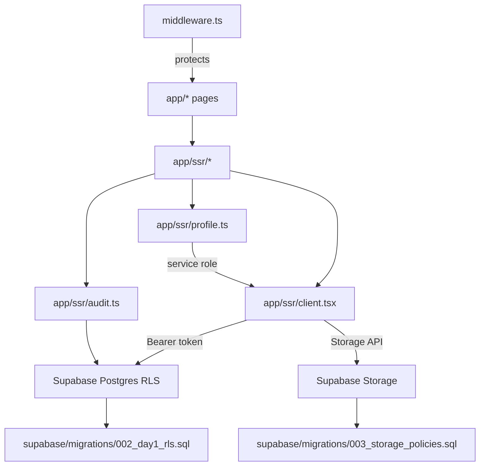

# MCE Command Center — Session Report (Day‑1 Deliverable)

This `README.md` is **not** a generic product overview. It is a **forensic, evidence‑based report** of what was discussed and implemented during OpenCode session:

- Session transcript: `C:\Users\chris\.claude\transcripts\ses_42e1dba2bffe3gqMxQWXi9J2hD.jsonl`
- Session ID: `ses_42e1dba2bffe3gqMxQWXi9J2hD`
- Time window (from transcript tool events): `2026-01-18T16:14:28Z` → `2026-01-19T01:14:00Z`

If you want the original Day‑1 PRD that drove this build, it was read from:
- `C:\Users\chris\Desktop\Amazon-FBA-Agent-System-v32 - latest good - Copy (8) - Copy - Copy - POSTLONGRUNPREKIRO2 beforecompletion-\MOEB\Detailed PRD for Day 1 Deliverable.md`

---

## 1) Success Criteria (as actually implemented)

These are the functional goals that the session converged on (based on PRD + checklist + the code written).

### Functional
- Projects: create + list + detail + CSV export.
- Tenders: create + list + detail, with due‑soon countdown and communications log.
- Documents: upload to private storage via signed upload URL; download via signed download URL.
- Notifications: list + acknowledge (ack) flow.

### Observable
- Auth wall: non‑public routes redirect to Clerk sign‑in.
- Dashboard shows computed “tenders due (14/7/3/1/today)” counts and next 10 milestones.
- Document upload creates a DB row first, then issues a signed upload URL.
- Audit trail writes to `audit_log` and DB prevents updates/deletes.

### Pass/Fail
- `npm run build` must succeed with real `.env.local` keys.
- RLS policies must restrict reads/writes by role + membership.

---

## 2) Architecture (what was built)

### Stack
- Next.js App Router
- Clerk (auth)
- Supabase (Postgres + Storage)
- Tailwind CSS

### Core design approach
**Clerk = identity; Supabase = authorization**.

The system uses:
- **RLS in Postgres** to enforce access control.
- **RLS on `storage.objects`** to enforce file access.
- **Signed URLs** for download (time‑limited) and signed upload URLs for client upload.
- **Server Actions / server code** to generate signed URLs and write audit events.

### Key modules
- `app/ssr/client.tsx`: creates Supabase clients
  - `createServerSupabaseClient()` uses Clerk token: `auth().getToken()`
  - `createServiceSupabaseClient()` uses service role key (no session persistence)
- `supabase/migrations/*.sql`: schema + RLS + storage policies

---

## 3) Evidence: The session event log

A complete tool‑event timeline was generated from the transcript:
- Timeline file: `C:\Users\chris\.local\share\opencode\tool-output\session_timeline_ses_42e1dba2.md`

### Tooling summary (counts from transcript)
- `bash`: 94
- `read`: 71
- `write`: 46
- `edit`: 63
- `task`: 19

### Major phases (from timestamps)

#### Phase A — Inputs ingestion (PRD + images + xlsx)
- Confirmed MOEB folder contents (`dir MOEB`, `dir <PRD>`, `dir <images>`, `dir <xlsx>`)
- Read PRD/workflows markdown via `read` tool
- Used `look_at` on multiple screenshots for UI guidance
- Parsed planning pack XLSX via Python/pandas (Requirements checklist and doc taxonomy)

Evidence snippet (xlsx parsing):
```text
== Requirements_Checklist ==
Project Tracker: CRUD + list view + filters + export
Tender Tracker: CRUD + list view + required fields validation
Tender Tracker: alerts at 14/7/3/1 days and day-of
Documents: folder templates + controlled sharing
Security/RBAC: Roles ... Non-negotiable
```

#### Phase B — Scaffold app
- Created `MOEB\mce-command-center` and cloned template:
```bash
npx --yes degit clerk/clerk-supabase-nextjs "MOEB\mce-command-center"
```
- Backed up scaffold to `backup\moeb_day1_20260118\mce-command-center`

#### Phase C — Database schema (SQL)
Created these migration files:
- `supabase/migrations/001_day1_schema.sql`
- `supabase/migrations/002_day1_rls.sql`
- `supabase/migrations/003_storage_policies.sql`

Key approach:
- Use enums for roles/status.
- Use helper functions (`current_clerk_user_id`, `current_profile_id`, `is_admin_role`, `can_view_project`, `can_view_tender`…) to centralize policy logic.
- Apply immutable / append‑only semantics via triggers.

#### Phase D — Implement server actions + routes + UI pages
Created server modules under `app/ssr/` plus pages under `app/*`.

#### Phase E — Build/run troubleshooting
- Fixed Clerk middleware to use async `auth()` properly.
- Resolved type mismatch around `createSignedUploadUrl()`.
- Ran builds and resolved errors until production build could succeed (requires real keys).

---

## 4) Database migrations (what they do)

### 4.1 `supabase/migrations/001_day1_schema.sql`
**Purpose:** Define enums + tables + indexes.

Key entities:
- `profiles` (maps Clerk user → internal profile & role)
- `projects`, `project_members`, `project_milestones`
- `tenders`, `tender_members`, `tender_comms_events`
- `documents`, `extraction_jobs`
- `notifications`
- `audit_log`

### 4.2 `supabase/migrations/002_day1_rls.sql`
**Purpose:** Enforce RBAC and membership checks at the DB layer.

Key approach:
- Extract Clerk identity via:
```sql
select nullif(auth.jwt() ->> 'sub', '');
```
- Map that to an internal profile via:
```sql
select p.id from public.profiles p
where p.clerk_user_id = public.current_clerk_user_id();
```

**Append‑only enforcement**
This migration creates a trigger function that raises on update/delete:
```sql
create or replace function public.prevent_updates()
returns trigger
language plpgsql
as $$
begin
  raise exception 'append-only';
end;
$$;
```
Then applies it to:
- `public.tender_comms_events`
- `public.audit_log`

### 4.3 `supabase/migrations/003_storage_policies.sql`
**Purpose:** Secure storage access on `storage.objects`.

Key approach:
- Only allow selecting objects in `mce-documents` bucket if there exists a matching `public.documents` row and the current user can view that project/tender.

---

## 5) The “Bridge”: Clerk → Supabase (token flow)

### 5.1 `app/ssr/client.tsx`
This file creates two Supabase clients:

1) Request/user‑scoped client (RLS enforced using Clerk token):
```ts
export function createServerSupabaseClient() {
  return createClient(
    process.env.NEXT_PUBLIC_SUPABASE_URL!,
    process.env.NEXT_PUBLIC_SUPABASE_KEY!,
    {
      async accessToken() {
        return (await auth()).getToken();
      },
    }
  );
}
```

2) Service‑role client (used only for safe server‑side “bootstrap” writes like `profiles` upsert):
```ts
export function createServiceSupabaseClient() {
  return createClient(
    process.env.NEXT_PUBLIC_SUPABASE_URL!,
    process.env.SUPABASE_SERVICE_ROLE_KEY!,
    { auth: { persistSession: false } }
  );
}
```

Why two clients?
- User‑scoped client ensures RLS actually applies.
- Service client prevents the “chicken‑and‑egg” where a brand‑new Clerk user cannot pass RLS until a `profiles` row exists.

---

## 6) Profile bootstrapping

### 6.1 `app/ssr/profile.ts`
**Approach:** on first access, ensure `profiles` row exists.

Snippet:
```ts
const user = await currentUser();
...
const supabase = createServiceSupabaseClient();
const { data, error } = await supabase.from("profiles").upsert(
  { clerk_user_id: user.id, email, display_name: displayName },
  { onConflict: "clerk_user_id" }
).select('id').single();
```

Outputs: `{ clerkUserId, profileId }`.

---

## 7) Audit logging

### 7.1 `app/ssr/audit.ts`
**Approach:** write an audit event for each mutation.

Snippet:
```ts
await supabase.from("audit_log").insert({
  actor_profile_id: profile.id,
  action,
  entity_type: entityType,
  entity_id: entityId,
  metadata,
});
```

DB also prevents audit tampering (append‑only trigger in `002_day1_rls.sql`).

---

## 8) Projects feature

### 8.1 Server action: `app/ssr/projects.ts`
**Approach:** RLS‑enforced insert using authenticated Supabase client.

Snippet:
```ts
const { data: project, error } = await supabase
  .from("projects")
  .insert({ code: input.code, name: input.name, status: input.status, pm_profile_id: profile.id })
  .select("id")
  .single();

await writeAudit("create", "project", project.id, { code: input.code });
revalidatePath("/projects");
```

### 8.2 UI list page: `app/projects/page.tsx`
**Approach:** server component fetches list and renders table.

Snippet:
```ts
const { data: projects } = await supabase
  .from("projects")
  .select("id, code, name, status, progress_pct, pm:profiles(display_name)")
  .order("created_at", { ascending: false });
```

### 8.3 CSV export route: `app/projects/export/route.ts`
**Approach:** Route handler returns `text/csv` with `Content-Disposition`.

Snippet:
```ts
return new NextResponse(rows.join("\n"), {
  headers: {
    "Content-Type": "text/csv",
    "Content-Disposition": "attachment; filename=projects.csv",
  },
});
```

---

## 9) Tenders feature

### 9.1 Server action: `app/ssr/tenders.ts`
**Approach:** create tender with ownership and audit.

Snippet:
```ts
const { data: tender, error } = await supabase
  .from("tenders")
  .insert({ reference: input.reference, deadline_at: input.deadline_at, status: input.status, owner_profile_id: profile.id })
  .select("id")
  .single();

await writeAudit("create", "tender", tender.id, { reference: input.reference });
revalidatePath("/tenders");
```

### 9.2 Communications log: `app/ssr/comms.ts`
**Approach:** append‑only comms events + audit.

Snippet:
```ts
const { data: event } = await supabase
  .from("tender_comms_events")
  .insert({ tender_id: input.tenderId, actor_profile_id: profile.id, channel: input.channel, notes: input.notes, outcome: input.outcome })
  .select("id")
  .single();
```

DB prevents updates/deletes on comms events.

### 9.3 Tender detail UI: `app/tenders/[id]/page.tsx`
**Approach:** server component loads tender, comms, documents.

Snippet:
```ts
const [{ data: comms }, { data: documents }] = await Promise.all([
  supabase.from("tender_comms_events")
    .select("id, occurred_at, channel, outcome, notes, actor:profiles(display_name)")
    .eq("tender_id", id)
    .order("occurred_at", { ascending: false }),
  supabase.from("documents")
    .select("id, title, doc_type, sensitivity, created_at")
    .eq("tender_id", id)
    .order("created_at", { ascending: false }),
]);
```

---

## 10) Documents feature (signed upload + signed download)

### 10.1 Server action: `app/ssr/documents.ts`
**Approach (two‑phase upload):**
1) Create a `documents` DB row first (this is the permission gate).
2) Generate a **signed upload URL** for the exact storage path.
3) Client uploads bytes to signed URL.
4) Create an extraction job row.
5) Write audit event.

Snippet:
```ts
const { data: document } = await supabase
  .from("documents")
  .insert({
    storage_bucket: "mce-documents",
    storage_path: storagePath,
    uploaded_by_profile_id: profile.id,
    project_id: input.projectId ?? null,
    tender_id: input.tenderId ?? null,
    ...
  })
  .select("id")
  .single();

const { data: uploadData } = await supabase.storage
  .from("mce-documents")
  .createSignedUploadUrl(storagePath);
```

Signed download:
```ts
const { data } = await supabase.storage
  .from("mce-documents")
  .createSignedUrl(document.storage_path, 60);
```

### 10.2 Client page: `app/documents/page.tsx`
**Approach:** client component calls server action, then `fetch(PUT)` to signed URL.

Snippet:
```ts
const { signedUrl } = await prepareDocumentUpload(...);
await fetch(signedUrl, { method: "PUT", headers: { "Content-Type": selectedFile.type }, body: selectedFile });
```

---

## 11) Notifications feature

### 11.1 Server action: `app/ssr/notifications.ts`
**Approach:** update `notifications` row with ack timestamp and audit.

Snippet:
```ts
await supabase
  .from("notifications")
  .update({ acked_at: new Date().toISOString(), acked_by_profile_id: profile.id })
  .eq("id", notificationId);

await writeAudit("ack", "notification", notificationId, {});
```

### 11.2 UI: `app/notifications/page.tsx`
**Approach:** server component renders table; uses inline server action in `<form action={...}>` for ack.

Snippet:
```ts
async function handleAck(formData: FormData) {
  "use server";
  const id = formData.get("id")?.toString();
  await acknowledgeNotification(id);
}
```

---

## 12) Routing & middleware protection

### 12.1 `middleware.ts`
**Approach:** protect all routes except `/`, `/sign-in*`, `/sign-up*`.

Snippet:
```ts
export default clerkMiddleware(async (auth, req) => {
  if (!isPublicRoute(req)) {
    const { userId, redirectToSignIn } = await auth();
    if (!userId) return redirectToSignIn({ returnBackUrl: req.url });
  }
});
```

---

## 13) Dependency / module linkage map

This is how the system composes at runtime:



---

## 14) How to run (reproducible steps)

### Prereqs
- Node.js + npm
- Clerk application
- Supabase project

### Environment
Create `.env.local` (values omitted):
- `NEXT_PUBLIC_CLERK_PUBLISHABLE_KEY`
- `CLERK_SECRET_KEY`
- `NEXT_PUBLIC_SUPABASE_URL`
- `NEXT_PUBLIC_SUPABASE_KEY`
- `SUPABASE_SERVICE_ROLE_KEY`

### Database
Run migrations in Supabase SQL editor (in order):
- `supabase/migrations/001_day1_schema.sql`
- `supabase/migrations/002_day1_rls.sql`
- `supabase/migrations/003_storage_policies.sql`

Create storage bucket:
- Bucket: `mce-documents` (private)

### Run
```bash
npm install
npm run dev
```

---

## 15) External references used to justify patterns

During follow‑up, authoritative docs were gathered for:
- Clerk ↔ Supabase integration: https://clerk.com/docs/guides/development/integrations/databases/supabase
- Supabase storage access control: https://supabase.com/docs/guides/storage/security/access-control
- Supabase RLS overview: https://supabase.com/docs/guides/database/postgres/row-level-security

---

## Appendix A — Files created/edited (from transcript)

This list is derived from `write` tool events in the transcript.

### SQL
- `supabase/migrations/001_day1_schema.sql`
- `supabase/migrations/002_day1_rls.sql`
- `supabase/migrations/003_storage_policies.sql`

### Server / SSR
- `app/ssr/client.tsx`
- `app/ssr/profile.ts`
- `app/ssr/projects.ts`
- `app/ssr/tenders.ts`
- `app/ssr/comms.ts`
- `app/ssr/audit.ts`
- `app/ssr/documents.ts`
- `app/ssr/notifications.ts`

### Pages / Routes
- `app/layout.tsx`
- `app/page.tsx`
- `app/dashboard/page.tsx`
- `app/projects/page.tsx`
- `app/projects/[id]/page.tsx`
- `app/projects/new/page.tsx`
- `app/projects/export/route.ts`
- `app/tenders/page.tsx`
- `app/tenders/[id]/page.tsx`
- `app/tenders/new/page.tsx`
- `app/documents/page.tsx`
- `app/notifications/page.tsx`

### Edge
- `middleware.ts`

---

## Appendix B — Full tool timeline

See: `C:\Users\chris\.local\share\opencode\tool-output\session_timeline_ses_42e1dba2.md`
