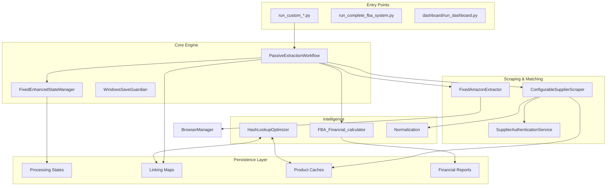

# PROJECT_INDEX: Amazon FBA Agent System v3.7+

**Authoritative Multi-Module Workflow & Logic Guide**
Generated: 2026-01-25T00:00:00Z | System Mode: Production-Ready Automation

---

## 1. System Mission & Core Philosophy
The Amazon FBA Agent System is a deterministic, stateful automation engine designed for **high-recall product sourcing**. Unlike simple scrapers, it is engineered for "marathon" sessions (18+ hours) with a **file-grounded resume capability**, O(1) duplicate prevention, and aggressive browser resilience.

### Design Principles:
- **Resumability**: Every step is recorded to disk; system crashes result in <3s recovery time.
- **Accuracy**: Dual EAN/Title matching with similarity scoring and uBlock-based ad filtering.
- **Efficiency**: Constant-time lookups replace linear searches, reducing overhead by 20-40%.
- **Resilience**: Integrated browser circuit breakers and memory sliding windows prevent cascading failures.

---

## 2. Master System Architecture



---

## 3. Core Workflows (Logic & Reasoning)

### 3.1. The "Marathon" Processing Loop
The system operates in a `Category -> Product -> Amazon -> Financials` sequence, governed by the **Freeze-Mark-Resume** protocol.

1.  **Phase 1: Initialization**
    - Load `system_config.json` and compute a configuration hash.
    - Load `processing_state.json`. If configuration hash differs, trigger **re-discovery**.
    - **Logic**: Prevents using outdated category indices when supplier structure changes.
2.  **Phase 2: Category Discovery & Denominator Freezing**
    - Resolve all category URLs from `*_categories.json`.
    - Set the `total_categories` in state and "freeze" it.
    - **Reasoning**: Ensures percentage-based progress remains accurate even if categories are added/removed mid-run.
3.  **Phase 3: Batched Supplier Extraction**
    - Scrape category pages in batches (`supplier_extraction_batch_size`).
    - Apply O(1) filtering using `HashLookupOptimizer` to skip already-cached URLs.
    - **Efficiency**: Prevents redundant page loads for products appearing in multiple categories.
4.  **Phase 4: Amazon Matching (Dual-Pronged)**
    - **Step A: EAN Search**. Search Amazon by EAN. Trust first organic result (authoritative).
    - **Step B: Title Fallback**. If EAN fails, search by title. Apply similarity scoring (Levenstein/Overlap).
    - **Ad-Filtering**: Use uBlock Origin CSS visibility detection to skip sponsored results.
5.  **Phase 5: Financial Analysis**
    - Integrate Keepa-derived fees (referral, fulfillment, storage).
    - Apply VAT adjustments based on `supplier_prices_include_vat`.
    - Filter by ROI (>15%) and Net Profit thresholds.

---

## 4. Component Deep Dive

### 4.1. PassiveExtractionWorkflow (`tools/passive_extraction_workflow_latest.py`)
- **Role**: Central Orchestrator.
- **Key Logic**:
    - `run()`: The main heartbeat loop. Coordinates state loads and category iterations.
    - `_get_amazon_data()`: Implements the matching hierarchy (EAN -> Title -> Skip).
    - `_save_state_periodically()`: Triggers atomic saves every N products to prevent data loss.

### 4.2. FixedEnhancedStateManager (`utils/fixed_enhanced_state_manager.py`)
- **Role**: State Registry & Integrity Guard.
- **Key Logic**:
    - **Monotonic Progression**: Resumption pointers only advance; they never regress unless manually reset.
    - **Startup Analysis**: Validates state file health before allowing a run to begin.
    - **Atomic Persistence**: Uses `WindowsSaveGuardian` to write to temp files then swap, preventing corruption during power loss.

### 4.3. ConfigurableSupplierScraper (`tools/configurable_supplier_scraper.py`)
- **Role**: Dynamic Website Scraper.
- **Key Logic**:
    - **Selector Fallbacks**: Iterates through an array of CSS selectors (found in `config/supplier_configs/*.json`) until data is found.
    - **Anti-Bot Navigation**: Implements randomized delays and uBlock/AdBlocker integration.
    - **Auth Triggers**: Triggers `SupplierAuthenticationService` every 25 products to verify session validity.

### 4.4. FixedAmazonExtractor (`tools/amazon_playwright_extractor.py`)
- **Role**: Amazon Integration Specialist.
- **Key Logic**:
    - **4-Fallback ASIN Extraction**: Tries `data-asin`, `/dp/` URL patterns, `data-uuid`, and regex search in HTML.
    - **Visibility Check**: Specifically checks if a product tile is "rendered but hidden" (common for Amazon ads).

---

## 5. Data Structures & Schema

### 5.1. Linking Map (`linking_map.json`)
Authoritative record of Supplier-to-Amazon associations.
```json
{
  "supplier_ean": "5055358000000",
  "amazon_asin": "B00XXXXXX",
  "supplier_title": "Product A",
  "amazon_title": "Product A (Pack of 12)",
  "match_method": "ean",
  "confidence": 0.95,
  "created_at": "2026-01-25T11:00:00Z"
}
```

### 5.2. Processing State (`processing_state.json`)
The system's "RAM on Disk".
- `system_progression`: Contains `persistent_category_index` and `resumption_ptr`.
- `metadata`: Contains `config_hash` and `schema_version`.

---

## 6. Supplier Onboarding Workflow
New suppliers are added via a structured 7-step skill:
1. **Normalization**: Domain converted to Dot/Hyphen/Underscore forms.
2. **Discovery**: `VisionDiscoveryEngine` analyzes HTML for selectors.
3. **Generation**: `SupplierScriptGenerator` creates the runner and auth helper.
4. **Validation**: Script import and sanity check tests.

---

## 7. Troubleshooting & Recovery
- **CDP Conflicts**: Check port 9222 using `netstat -ano`.
- **Memory Pressure**: System monitor triggers cleanup if usage > 85%.
- **State Corruption**: Restore from `diagnostics/session_*/backups/` or run `--repair-state`.

---

## 8. Dashboard
- **Launcher**: `dashboard/run_dashboard.py` (Streamlit-based).
- **Metrics Core**: Reads directly from `OUTPUTS/CACHE/processing_states` for real-time health telemetry.
- **Real-time Logs**: Streams `logs/debug/run_custom_*.log` for live execution tracking.

---
*For exhaustive documentation on specific sub-systems, refer to `.qoder\repowiki\en\content`.*
