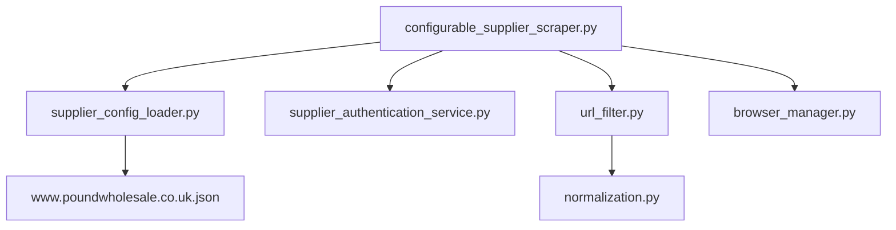
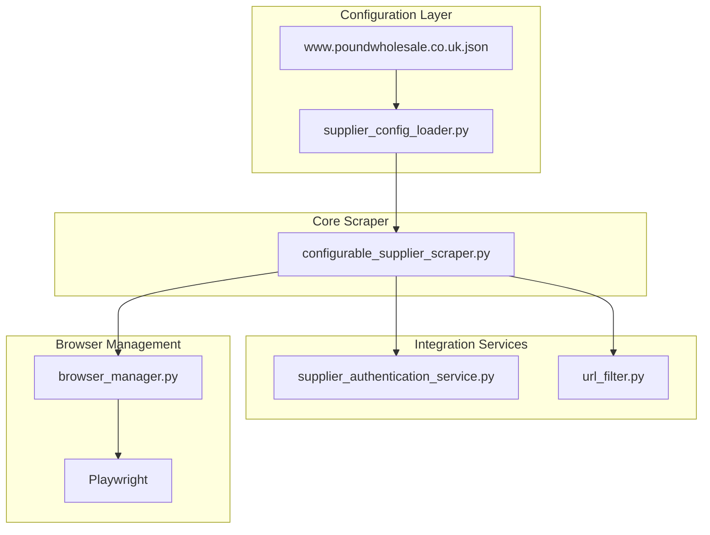
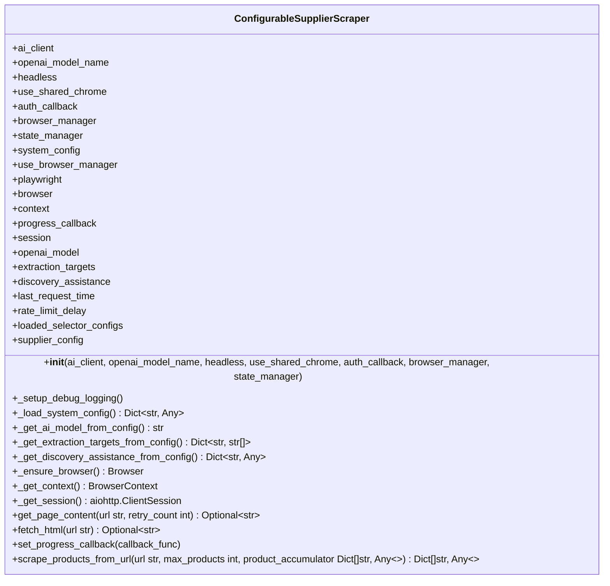
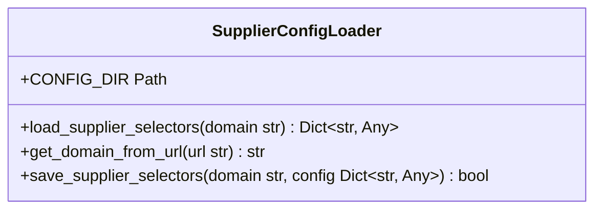
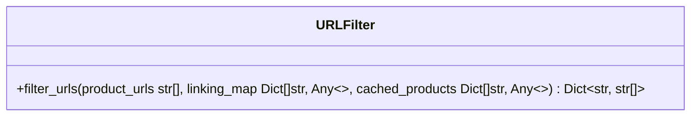
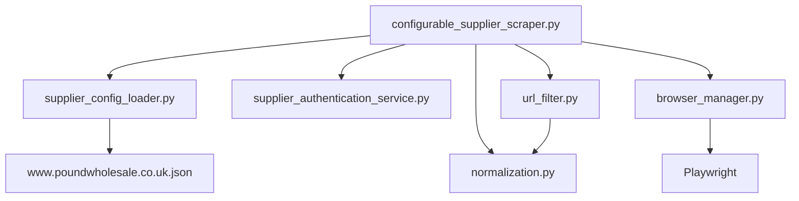

# Supplier Scraper API

## Table of Contents
1. [Introduction](#introduction)
2. [Project Structure](#project-structure)
3. [Core Components](#core-components)
4. [Architecture Overview](#architecture-overview)
5. [Detailed Component Analysis](#detailed-component-analysis)
6. [Dependency Analysis](#dependency-analysis)
7. [Performance Considerations](#performance-considerations)
8. [Troubleshooting Guide](#troubleshooting-guide)
9. [Conclusion](#conclusion)

## Introduction
The Supplier Scraper API provides a robust, configurable system for extracting product data from supplier websites such as poundwholesale.co.uk. Built on Playwright for JavaScript support and anti-bot evasion, this module enables automated URL discovery, page navigation, product data extraction, and error recovery. It supports supplier-specific configurations through external JSON files, integrates with authentication services, and implements intelligent URL filtering to optimize scraping efficiency. The system is designed for extensibility, allowing new supplier adapters and custom extraction rules to be added with minimal code changes.

## Project Structure
The project follows a modular architecture with clear separation of concerns. Core scraping functionality resides in the `tools/` directory, while configuration files are stored in `config/`. Supplier-specific settings are maintained in JSON files within `config/supplier_configs/`. Utility modules in the `utils/` directory handle cross-cutting concerns like URL normalization, caching, and state management. The scraper leverages a centralized browser manager for efficient Chrome CDP integration, ensuring consistent session handling across different components.

**Diagram sources**
- [configurable_supplier_scraper.py](file://tools/configurable_supplier_scraper.py#L1-L3938)
- [supplier_config_loader.py](file://config/supplier_config_loader.py#L1-L187)
- [supplier_authentication_service.py](file://tools/supplier_authentication_service.py#L1-L114)
- [url_filter.py](file://utils/url_filter.py#L1-L40)

**Section sources**
- [configurable_supplier_scraper.py](file://tools/configurable_supplier_scraper.py#L1-L3938)
- [project_structure](file://project_structure#L1-L200)

## Core Components
The core functionality of the Supplier Scraper API revolves around the `ConfigurableSupplierScraper` class, which orchestrates the entire scraping workflow. This includes URL discovery through sitemap parsing or category navigation, individual product page visits, data extraction using configurable CSS selectors, and intelligent error recovery. The system integrates with a supplier authentication service to maintain valid sessions and uses URL filtering to avoid redundant processing. Configuration is externalized through JSON files, enabling easy adaptation to different supplier websites without code changes.

**Section sources**
- [configurable_supplier_scraper.py](file://tools/configurable_supplier_scraper.py#L1-L3938)
- [supplier_config_loader.py](file://config/supplier_config_loader.py#L1-L187)

## Architecture Overview
The Supplier Scraper API follows a layered architecture with clear separation between configuration management, browser automation, data extraction, and error handling. The system uses a centralized BrowserManager singleton to manage Chrome CDP connections, ensuring efficient resource utilization. Configuration is loaded from external JSON files through the SupplierConfigLoader, allowing for supplier-specific selector definitions. The scraper integrates with authentication services to maintain valid sessions and uses URL filtering to optimize performance by avoiding already-processed products.

**Diagram sources**
- [configurable_supplier_scraper.py](file://tools/configurable_supplier_scraper.py#L1-L3938)
- [supplier_config_loader.py](file://config/supplier_config_loader.py#L1-L187)
- [supplier_authentication_service.py](file://tools/supplier_authentication_service.py#L1-L114)
- [url_filter.py](file://utils/url_filter.py#L1-L40)

## Detailed Component Analysis

### ConfigurableSupplierScraper Analysis
The `ConfigurableSupplierScraper` class is the central component responsible for extracting product data from supplier websites. It uses Playwright for browser automation with anti-bot evasion techniques and JavaScript support. The scraper maintains backward compatibility while using an improved Playwright-based approach. It supports configurable selector-based extraction with AI-powered fallbacks and includes features for full JavaScript rendering and dynamic content handling.

#### For Object-Oriented Components:

**Diagram sources**
- [configurable_supplier_scraper.py](file://tools/configurable_supplier_scraper.py#L1-L3938)

**Section sources**
- [configurable_supplier_scraper.py](file://tools/configurable_supplier_scraper.py#L1-L3938)

### Supplier Configuration System
The supplier configuration system enables externalized selector definitions for different supplier websites. The `SupplierConfigLoader` loads supplier-specific CSS selectors and configurations from JSON files in the `config/supplier_configs/` directory. This allows the scraper to adapt to different website structures without code changes. Default configurations are provided for new suppliers, and domain-specific configurations take precedence over defaults.

#### For Object-Oriented Components:

**Diagram sources**
- [supplier_config_loader.py](file://config/supplier_config_loader.py#L1-L187)

### URL Filtering and Caching
The URL filtering system prevents redundant processing by tracking already-processed products. The `url_filter.py` module classifies product URLs based on their presence in the linking map (fully processed) or product cache (supplier data available). This prioritization ensures that URLs already fully processed are skipped entirely, while URLs with only supplier data trigger Amazon-only extraction.

#### For Object-Oriented Components:

**Diagram sources**
- [url_filter.py](file://utils/url_filter.py#L1-L40)

## Dependency Analysis
The Supplier Scraper API has a well-defined dependency graph with clear relationships between components. The core scraper depends on configuration loading, authentication services, and URL filtering utilities. Configuration files are independent JSON resources that can be modified without affecting code. The system relies on Playwright for browser automation and aiohttp for lightweight HTTP requests. Browser management is centralized through a singleton pattern to ensure efficient resource utilization.

**Diagram sources**
- [configurable_supplier_scraper.py](file://tools/configurable_supplier_scraper.py#L1-L3938)
- [supplier_config_loader.py](file://config/supplier_config_loader.py#L1-L187)
- [supplier_authentication_service.py](file://tools/supplier_authentication_service.py#L1-L114)
- [url_filter.py](file://utils/url_filter.py#L1-L40)

**Section sources**
- [configurable_supplier_scraper.py](file://tools/configurable_supplier_scraper.py#L1-L3938)
- [supplier_config_loader.py](file://config/supplier_config_loader.py#L1-L187)
- [url_filter.py](file://utils/url_filter.py#L1-L40)

## Performance Considerations
The Supplier Scraper API implements several performance optimizations for large-scale scraping operations. Rate limiting is enforced with a configurable delay between requests to avoid overwhelming supplier servers. Memory management includes periodic cleanup and garbage collection to prevent leaks during long-running operations. URL filtering reduces unnecessary page visits by leveraging cached results and linking map data. The system uses a shared Chrome instance via CDP to minimize browser startup overhead. For suppliers like poundwholesale.co.uk, the scraper implements proactive authentication checks every 25 products to prevent session expiration and pricing failures.

## Troubleshooting Guide
Common issues with the Supplier Scraper API typically involve authentication failures, selector mismatches, or browser connectivity problems. When price extraction fails, the system triggers authentication checks to verify login status. Selector configuration issues can be diagnosed by examining the loaded selector configurations in the supplier-specific JSON files. Browser connectivity problems are often related to Chrome CDP port availability or improper browser launch parameters. The system logs detailed information about each scraping attempt, including URL navigation, selector matching, and error conditions, which can be used for debugging.

**Section sources**
- [configurable_supplier_scraper.py](file://tools/configurable_supplier_scraper.py#L1-L3938)
- [supplier_authentication_service.py](file://tools/supplier_authentication_service.py#L1-L114)

## Conclusion
The Supplier Scraper API provides a comprehensive solution for extracting product data from supplier websites with a focus on configurability, reliability, and performance. By externalizing selector configurations and integrating with authentication services, the system can adapt to different suppliers with minimal configuration changes. The architecture supports extensibility through well-defined interfaces for adding new supplier adapters and custom extraction rules. For large-scale operations, the system implements robust error recovery, intelligent URL filtering, and efficient resource management to ensure reliable data extraction.

**Referenced Files in This Document**   
- [configurable_supplier_scraper.py](file://tools/configurable_supplier_scraper.py)
- [supplier_authentication_service.py](file://tools/supplier_authentication_service.py)
- [supplier_config_loader.py](file://config/supplier_config_loader.py)
- [url_filter.py](file://utils/url_filter.py)
- [www.poundwholesale.co.uk.json](file://config/supplier_configs/www.poundwholesale.co.uk.json)