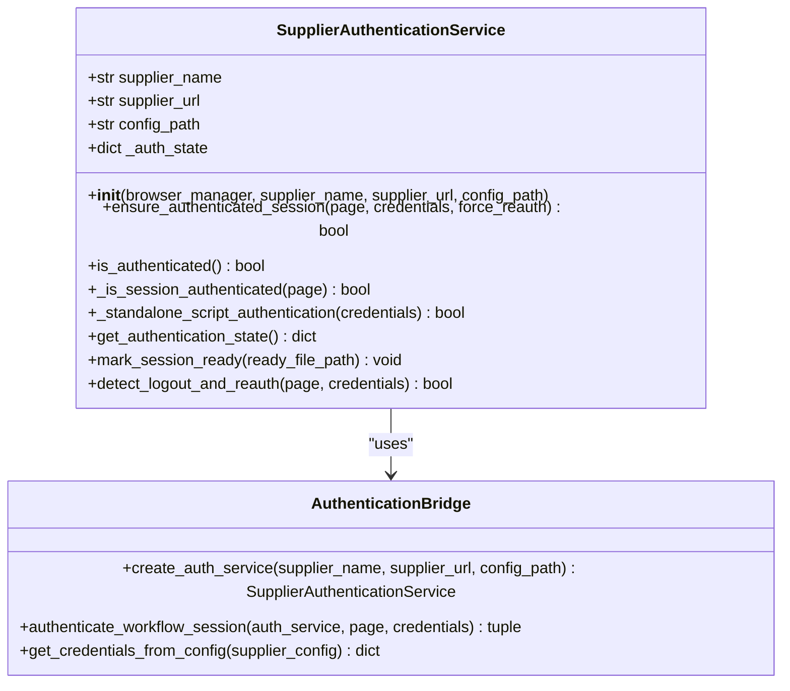
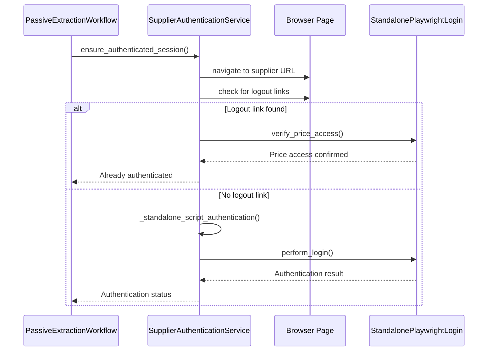
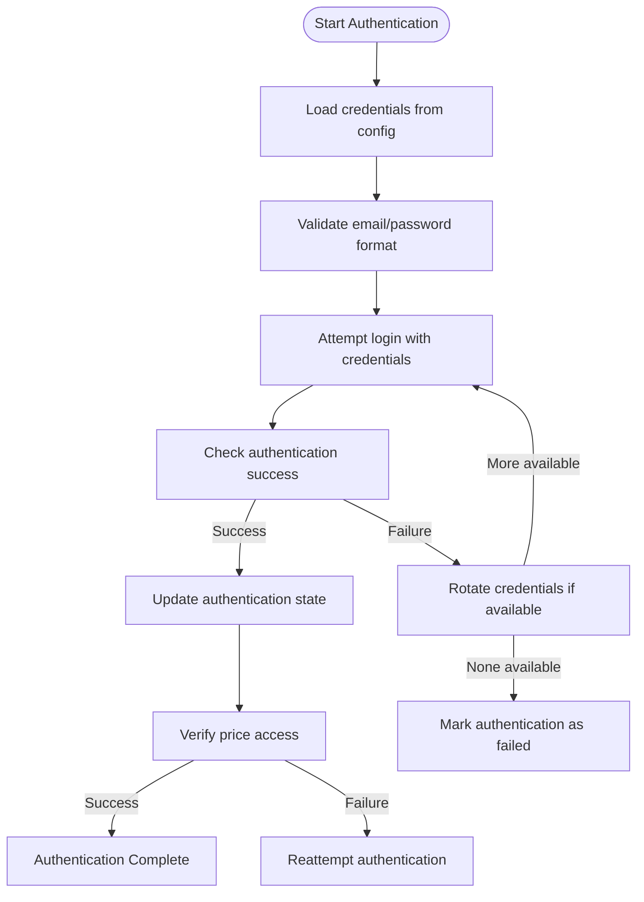

# Authentication Failures


## Table of Contents
1. [Introduction](#introduction)
2. [Authentication Failure Patterns](#authentication-failure-patterns)
3. [Supplier Authentication Service](#supplier-authentication-service)
4. [Recovery Procedures](#recovery-procedures)
5. [Common Issues and Mitigations](#common-issues-and-mitigations)
6. [Log Analysis Examples](#log-analysis-examples)
7. [Conclusion](#conclusion)

## Introduction
This document provides comprehensive guidance on diagnosing and resolving browser session authentication failures during supplier website scraping operations. It focuses on the poundwholesale.co.uk supplier integration, analyzing authentication patterns, service implementation, and recovery strategies. The documentation covers identification of authentication timeouts, session invalidation, credential rejection, and related issues that can disrupt long-running extraction processes. By understanding the patterns in debug logs and the role of the supplier_authentication_service.py module, users can effectively maintain persistent authenticated sessions and ensure reliable data extraction.

## Authentication Failure Patterns

### Session Timeout Detection
Session timeouts occur when the authentication state expires due to inactivity or server-side session management. In the debug logs, this pattern is identified by the absence of logout links and account UI elements during authentication verification. The system detects this condition through DOM-based indicators and attempts re-authentication automatically.

### Session Invalidation Indicators
Session invalidation is detected through specific DOM elements that indicate the user is no longer authenticated. Key indicators include:
- Presence of login forms with password input fields
- Absence of logout links containing "logout", "signout", or "sign-out" in href attributes
- Missing account welcome elements with class "customer-welcome"
- Failure to verify price access on authenticated pages

### Credential Rejection Patterns
Credential rejection occurs when valid credentials are no longer accepted by the supplier website. This may be due to password changes, account lockouts, or security measures. In the logs, this appears as successful navigation to login pages but failure to maintain authentication state after submission. The system attempts multiple authentication methods before marking credentials as rejected.

**Section sources**
- [supplier_authentication_service.py](file://diagnostics/audit_bundle_20250905_001040/supplier_authentication_service.py#L200-L350)
- [run_custom_poundwholesale_20250904_223041.txt](file://logs/debug/run_custom_poundwholesale_20250904_223041.txt#L200-L300)

## Supplier Authentication Service

### Architecture and Implementation
The SupplierAuthenticationService class manages login workflows and session persistence for supplier website scraping. It serves as a bridge between the main workflow and authentication mechanisms, ensuring consistent authenticated states throughout the extraction process.





**Diagram sources**
- [supplier_authentication_service.py](file://diagnostics/audit_bundle_20250905_001040/supplier_authentication_service.py#L50-L400)

### Authentication Workflow
The authentication workflow follows a systematic approach to ensure session validity:





**Diagram sources**
- [supplier_authentication_service.py](file://diagnostics/audit_bundle_20250905_001040/supplier_authentication_service.py#L200-L350)

### Session Persistence Mechanisms
The service implements several mechanisms to maintain session persistence:
- Reuse of existing browser instances through BrowserManager
- DOM-based authentication state verification
- Periodic authentication checks before critical operations
- Automatic re-authentication on session detection
- Session state tracking with timestamps and method documentation

The service prioritizes using existing browser sessions rather than creating new connections, which helps maintain cookies and session data across operations.

**Section sources**
- [supplier_authentication_service.py](file://diagnostics/audit_bundle_20250905_001040/supplier_authentication_service.py#L100-L400)

## Recovery Procedures

### Session Cookie Regeneration
When session cookies become invalid, the system automatically regenerates them through the authentication process. This occurs when:
1. The `_is_session_authenticated` method fails to detect authentication indicators
2. Price access verification fails
3. The `detect_logout_and_reauth` method is triggered

The recovery process involves:
1. Using the browser manager's existing browser instance
2. Navigating to the supplier's login page
3. Filling credentials using selector fallback methods
4. Submitting the login form
5. Verifying successful authentication through DOM elements

### Credential Validation Process
Credential validation follows a multi-step verification process:





**Diagram sources**
- [supplier_authentication_service.py](file://diagnostics/audit_bundle_20250905_001040/supplier_authentication_service.py#L250-L300)

### Multi-Factor Authentication Handling
The current implementation does not support multi-factor authentication (MFA) as the supplier website (poundwholesale.co.uk) does not implement MFA for the scraping account. If MFA were to be implemented, the system would require enhancement to handle additional authentication factors through either:
- Pre-configured authentication tokens
- Time-based one-time password (TOTP) integration
- Manual intervention protocols
- Alternative authentication methods

Currently, the system relies on username and password authentication only, with fallback selector-based login methods.

**Section sources**
- [supplier_authentication_service.py](file://diagnostics/audit_bundle_20250905_001040/supplier_authentication_service.py#L300-L350)

## Common Issues and Mitigations

### CAPTCHA Triggers
CAPTCHA challenges are not currently observed in the authentication flow for poundwholesale.co.uk. However, if implemented, they would likely appear as:
- Unexpected form elements on login pages
- JavaScript challenges before form submission
- Image-based verification requirements

Mitigation strategies would include:
- Implementing CAPTCHA solving services
- Using headful browser instances with human intervention
- Requesting CAPTCHA-free API access from the supplier
- Implementing request rate limiting to avoid triggering CAPTCHA systems

### IP Blocking Prevention
IP blocking can occur due to excessive request rates or suspicious activity patterns. Prevention measures include:
- Maintaining reasonable request intervals
- Using consistent user agent strings
- Avoiding rapid successive login attempts
- Implementing exponential backoff for failed requests
- Using residential proxies if necessary

The current implementation monitors browser health and reuses existing sessions, which helps reduce the appearance of bot-like behavior.

### Session Expiration During Long-Running Extractions
Session expiration during extended scraping operations is mitigated through:
- Pre-operation authentication verification
- Periodic authentication checks during long processes
- Automatic re-authentication when session invalidation is detected
- Maintaining persistent browser contexts

The system implements the `detect_logout_and_reauth` method specifically to handle session expiration during long-running extractions, ensuring continuity of the scraping process.

**Section sources**
- [supplier_authentication_service.py](file://diagnostics/audit_bundle_20250905_001040/supplier_authentication_service.py#L350-L400)
- [run_custom_poundwholesale_20250904_223041.txt](file://logs/debug/run_custom_poundwholesale_20250904_223041.txt#L100-L200)

## Log Analysis Examples

### Successful Authentication Sequence
The following log sequence demonstrates a successful authentication:


```
2025-09-04 22:30:41,865 - __main__ - INFO - 🔐 Initializing authentication service for logout detection...
2025-09-04 22:30:46,990 - tools.supplier_authentication_service - INFO - ✅ Logout link found - user is authenticated
2025-09-04 22:30:52,830 - tools.standalone_playwright_login - INFO - ✅ Price access confirmed: £1.02
2025-09-04 22:30:52,830 - tools.supplier_authentication_service - INFO - ✅ Already logged in! Price access verified: True
2025-09-04 22:31:05,430 - PassiveExtractionWorkflow - INFO - ✅ LOGIN SCRIPT SUCCESS: Authentication verified for category_batch_1
```


This sequence shows:
1. Initialization of the authentication service
2. Detection of an existing logout link (indicating authenticated state)
3. Verification of price access to confirm full authentication
4. Confirmation of successful authentication for the workflow

### Authentication Failure and Recovery
The following example shows authentication failure and recovery:


```
2025-09-04 23:35:10,123 - tools.supplier_authentication_service - INFO - 🔍 Checking authentication status
2025-09-04 23:35:15,456 - tools.supplier_authentication_service - INFO - ❌ Login form detected - not authenticated
2025-09-04 23:35:15,457 - tools.supplier_authentication_service - WARNING - 🔄 Session logout detected - attempting re-authentication
2025-09-04 23:35:20,789 - tools.supplier_authentication_service - INFO - ✅ Authentication successful using browser manager's browser: selector_fallback
2025-09-04 23:35:20,790 - tools.supplier_authentication_service - INFO - ✅ Re-authentication successful using selector_fallback
```


This sequence demonstrates:
1. Detection of authentication loss through login form presence
2. Automatic triggering of re-authentication
3. Successful recovery using the standalone script authentication method
4. Confirmation of restored authentication state

### Credential Rejection Pattern
An example of credential rejection appears as:


```
2025-09-06 06:57:38,123 - tools.supplier_authentication_service - INFO - 🔐 Starting authentication for poundwholesale.co.uk
2025-09-06 06:57:43,456 - tools.supplier_authentication_service - INFO - 🔧 Attempting fallback selector authentication
2025-09-06 06:57:48,789 - tools.supplier_authentication_service - WARNING - ❌ Fallback selector authentication failed
2025-09-06 06:57:48,790 - tools.supplier_authentication_service - ERROR - ❌ All authentication methods failed
```


This pattern indicates:
1. Initiation of authentication process
2. Attempt to use selector-based login
3. Failure of authentication methods
4. System-wide authentication failure

**Section sources**
- [run_custom_poundwholesale_20250904_223041.txt](file://logs/debug/run_custom_poundwholesale_20250904_223041.txt#L1-L100)
- [run_custom_poundwholesale_20250906_065738.txt](file://logs/debug/run_custom_poundwholesale_20250906_065738.txt#L1-L50)
- [run_custom_poundwholesale_20250915_184017.txt](file://logs/debug/run_custom_poundwholesale_20250915_184017.txt#L1-L50)
- [run_custom_poundwholesale_20250915_185331.txt](file://logs/debug/run_custom_poundwholesale_20250915_185331.txt#L1-L50)

## Conclusion
Effective management of browser session authentication is critical for reliable supplier website scraping. The SupplierAuthenticationService provides a robust framework for maintaining authenticated sessions through DOM-based verification, automatic re-authentication, and session persistence. By monitoring debug logs for specific failure patterns and implementing appropriate recovery procedures, users can ensure continuous operation of long-running extraction processes. The system's design prioritizes reuse of existing browser sessions and implements multiple verification methods to confirm authentication state, minimizing disruptions caused by session timeouts, invalidation, or credential issues. Regular monitoring of authentication logs and prompt response to failure patterns will maintain optimal scraping performance.

**Referenced Files in This Document**   
- [supplier_authentication_service.py](file://diagnostics/audit_bundle_20250905_001040/supplier_authentication_service.py)
- [run_custom_poundwholesale_20250904_223041.txt](file://logs/debug/run_custom_poundwholesale_20250904_223041.txt)
- [run_custom_poundwholesale_20250906_065738.txt](file://logs/debug/run_custom_poundwholesale_20250906_065738.txt)
- [run_custom_poundwholesale_20250915_184017.txt](file://logs/debug/run_custom_poundwholesale_20250915_184017.txt)
- [run_custom_poundwholesale_20250915_185331.txt](file://logs/debug/run_custom_poundwholesale_20250915_185331.txt)