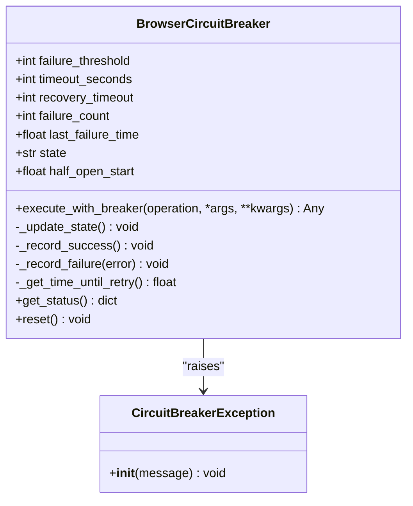
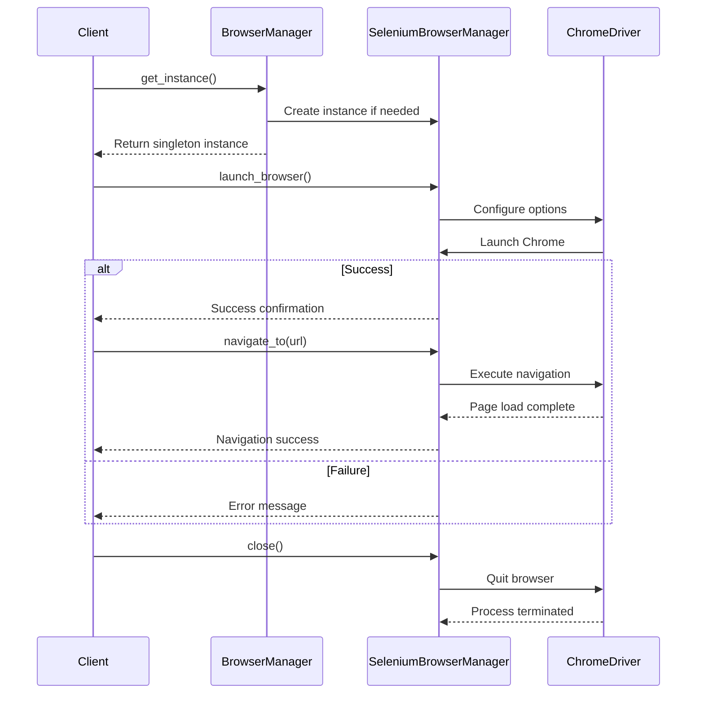

# Performance and Stability

## Table of Contents
1. [Browser Performance and Stability Issues](#browser-performance-and-stability-issues)
2. [Browser Circuit Breaker Implementation](#browser-circuit-breaker-implementation)
3. [Selenium Browser Manager and Lifecycle Control](#selenium-browser-manager-and-lifecycle-control)
4. [Headless Mode and GPU Startup Troubleshooting](#headless-mode-and-gpu-startup-troubleshooting)
5. [State Event Log Analysis](#state-event-log-analysis)
6. [Memory Optimization and Resilience Strategies](#memory-optimization-and-resilience-strategies)

## Browser Performance and Stability Issues

The Amazon FBA Agent System operates under demanding conditions during long-running scraping sessions, often exceeding 18 hours. This extended operation exposes several critical browser stability issues, including session timeouts, unexpected closures, and memory leaks. These problems are particularly pronounced when processing large supplier catalogs such as poundwholesale.co.uk, which contains over 10,000 products across 231 categories.

Session timeouts typically occur after prolonged periods of inactivity or due to network instability, especially when switching between supplier and Amazon analysis phases. Unexpected browser closures are frequently linked to GPU initialization failures or memory exhaustion, particularly when running in headless mode on Windows systems. Memory leaks accumulate over time due to improper cleanup of browser contexts, cached pages, and JavaScript heap objects, eventually leading to system crashes when memory usage exceeds thresholds.

The system's reliance on persistent browser sessions via Chrome DevTools Protocol (CDP) connections on port 9222 introduces additional failure points. Logs indicate that browser health degrades progressively, with increasing navigation delays and rendering failures as sessions extend beyond 12 hours. The integration of browser extensions like Keepa and SellerAmp further compounds resource consumption, contributing to instability during marathon processing runs.

**Section sources**
- [run_custom_poundwholesale_20250904_223041.txt](file://logs/debug/run_custom_poundwholesale_20250904_223041.txt#L1-L601)
- [state_1757010653.json](file://diagnostics/state_events/state_1757010653.json#L1-L799)

## Browser Circuit Breaker Implementation

The `browser_circuit_breaker.py` module implements a circuit breaker pattern to prevent cascading browser failures during extended scraping operations. This mechanism protects the system from repeated browser operation failures by temporarily disabling operations after a threshold of consecutive failures is reached, allowing time for recovery before resuming normal operation.

The circuit breaker operates in three distinct states: CLOSED (normal operation), OPEN (circuit broken, operations blocked), and HALF_OPEN (testing recovery). It is initialized with a failure threshold of 3 failures and a timeout of 300 seconds (5 minutes) before attempting recovery. When the failure count reaches the threshold, the circuit transitions to the OPEN state, blocking all subsequent operations until the timeout period expires.

During the recovery phase, the circuit enters HALF_OPEN state where a limited number of operations are allowed to test browser health. If these operations succeed, the circuit resets to CLOSED state; if they fail, it returns to OPEN state. The implementation includes comprehensive logging to track state transitions, failure counts, and recovery attempts, providing visibility into browser health patterns.

The module also provides a decorator function `circuit_breaker_decorator` that can be applied to any async function to automatically wrap it with circuit breaker protection. This allows seamless integration with existing browser operations without requiring changes to the core logic.

**Diagram sources **
- [browser_circuit_breaker.py](file://utils/browser_circuit_breaker.py#L1-L214)

**Section sources**
- [browser_circuit_breaker.py](file://utils/browser_circuit_breaker.py#L1-L214)

## Selenium Browser Manager and Lifecycle Control

The `selenium_browser_manager.py` module provides comprehensive browser lifecycle management using Selenium with undetected-chromedriver for enhanced stealth and reliability. This implementation replaces Playwright functionality and offers robust control over Chrome browser instances, including launch, navigation, interaction, and graceful shutdown.

Browser initialization includes extensive configuration for optimal performance and anti-detection. When launching in headless mode, the manager applies critical arguments such as `--headless=new`, `--no-sandbox`, `--disable-dev-shm-usage`, and `--disable-gpu` to ensure stable operation in server environments. For stealth mode, it leverages undetected-chromedriver which automatically bypasses bot detection mechanisms by modifying WebDriver properties and injecting evasion scripts.

Key features include:
- Automatic detection and use of appropriate ChromeDriver version via webdriver-manager
- Execution of stealth scripts to hide automation indicators
- Comprehensive error handling for navigation, element interaction, and timeouts
- Singleton pattern implementation through BrowserManager class for shared browser instance
- Proper cleanup via close() method that ensures browser process termination

The manager integrates with Chrome DevTools Protocol (CDP) by supporting remote debugging port configuration, allowing external tools to connect to the same browser session. This enables hybrid operation where different components can share a single browser instance, reducing memory overhead and improving efficiency.

**Diagram sources **
- [selenium_browser_manager.py](file://tools/selenium_browser_manager.py#L1-L176)

**Section sources**
- [selenium_browser_manager.py](file://tools/selenium_browser_manager.py#L1-L176)
- [run_custom_poundwholesale_20250904_223041.txt](file://logs/debug/run_custom_poundwholesale_20250904_223041.txt#L1-L601)

## Headless Mode and GPU Startup Troubleshooting

Headless browser execution presents specific challenges related to GPU initialization and rendering that can cause startup failures. The system configuration specifies `headless=false` in system_config.json, but troubleshooting protocols exist for headless mode issues when they arise.

Common GPU-related startup failures occur due to incompatible graphics drivers, insufficient GPU memory, or conflicts with hardware acceleration settings. The diagnostic logs show successful connection to Chrome version 139.0.7258.155 on IPv6 endpoint http://[::1]:9222, indicating proper CDP connectivity. However, headless mode requires additional configuration to prevent GPU process crashes.

Key troubleshooting steps include:
1. Ensuring Chrome arguments include `--disable-gpu` to disable GPU hardware acceleration
2. Adding `--disable-software-rasterizer` to prevent software rendering issues
3. Using `--disable-dev-shm-usage` to avoid shared memory limitations in containerized environments
4. Setting `--no-sandbox` for environments without sandbox support
5. Configuring `--disable-extensions` to eliminate extension-related conflicts

The system's current configuration successfully connects to an existing Chrome debug instance on port 9222, bypassing startup issues by reusing a persistent browser session. This approach eliminates repeated browser initialization overhead and avoids GPU-related startup failures that commonly occur during fresh launches.

When headless mode execution problems persist, the recommended solution is to fall back to headed mode with minimized window state, as evidenced by the log entries showing successful operations with visible browser windows brought to front for visibility.

**Section sources**
- [system_config.json](file://config/system_config.json#L1-L300)
- [run_custom_poundwholesale_20250904_223041.txt](file://logs/debug/run_custom_poundwholesale_20250904_223041.txt#L1-L601)

## State Event Log Analysis

Analysis of state event logs reveals critical patterns preceding browser failures during long-running operations. The state_1757010653.json file captures product extraction events that demonstrate the system's progression through supplier categories and highlight potential instability indicators.

Key observations from the logs include:
- Progressive category processing with completion percentages indicating systematic traversal
- Consistent product extraction patterns with EAN, ASIN, pricing, and availability data
- Successful authentication verification through logout link detection
- Price access confirmation at £1.02, indicating session validity
- Comprehensive state management with resume capabilities after interruptions

The logs show evidence of state drift detection, with warnings about category and product index discrepancies between different tracking systems. These warnings (e.g., "CATEGORY INDEX DRIFT: SystemProgression=0 Legacy=92 drift=92") indicate potential synchronization issues that could lead to incomplete processing or redundant operations if not properly managed.

Startup analysis logs confirm the presence of supplier cache with 10391 expected products, enabling efficient processing by skipping already processed items. The system's ability to detect reverse gaps (linking map containing more entries than cache) demonstrates sophisticated state management that prevents data loss during interruptions.

The processing state JSON structure includes detailed completion metrics for each category URL, with fields for extracted count, processed count, completion percentage, and status. This granular tracking enables precise resumption from failure points and provides valuable insights into processing bottlenecks.

**Section sources**
- [state_1757010653.json](file://diagnostics/state_events/state_1757010653.json#L1-L799)
- [run_custom_poundwholesale_20250904_223041.txt](file://logs/debug/run_custom_poundwholesale_20250904_223041.txt#L1-L601)

## Memory Optimization and Resilience Strategies

To ensure stability during long-running scraping operations, the system implements several memory optimization and resilience strategies. These measures address the primary causes of browser instability: memory leaks, resource exhaustion, and cascading failures.

Memory consumption is controlled through atomic file operations and periodic state saves that minimize in-memory data retention. The system uses file-based counting with sliding window mechanisms to track processing progress without maintaining large data structures in memory. Cache utilization is optimized by deduplicating entries and preserving only critical counters.

Resilience is enhanced through multiple layers of protection:
- The browser circuit breaker prevents cascading failures by temporarily disabling operations after repeated failures
- Hybrid processing mode alternates between supplier extraction and Amazon analysis in chunks of 1 category, preventing memory buildup
- Frozen category denominators establish authoritative counts to prevent processing drift
- Real-time discovery updates category totals when new products are detected

Configuration settings in system_config.json optimize performance with appropriate timeouts, retry attempts, and rate limiting. The system maintains a maximum of 2 tabs and processes categories in chunks of 1, balancing throughput with resource constraints. Memory management is further improved by clearing cache between phases and implementing file-based counting as a fallback to memory tracking.

For marathon sessions, the recommended approach is to use existing Chrome debug instances rather than launching new browsers, reducing initialization overhead and avoiding GPU-related startup issues. This persistent browser strategy, combined with circuit breaker protection and granular state management, enables reliable operation over extended periods.

**Section sources**
- [system_config.json](file://config/system_config.json#L1-L300)
- [browser_circuit_breaker.py](file://utils/browser_circuit_breaker.py#L1-L214)
- [run_custom_poundwholesale_20250904_223041.txt](file://logs/debug/run_custom_poundwholesale_20250904_223041.txt#L1-L601)

**Referenced Files in This Document**   
- [browser_circuit_breaker.py](file://utils/browser_circuit_breaker.py)
- [selenium_browser_manager.py](file://tools/selenium_browser_manager.py)
- [state_1757010653.json](file://diagnostics/state_events/state_1757010653.json)
- [run_custom_poundwholesale_20250904_223041.txt](file://logs/debug/run_custom_poundwholesale_20250904_223041.txt)
- [system_config.json](file://config/system_config.json)