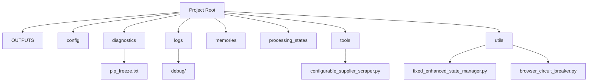
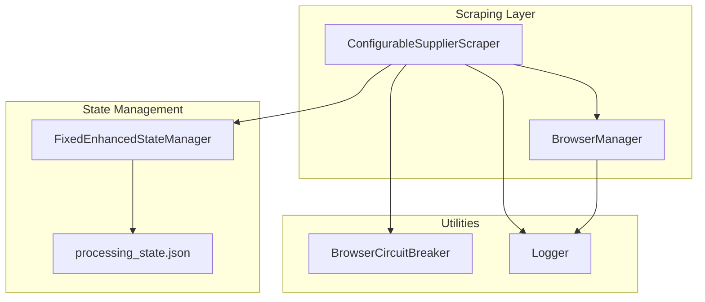
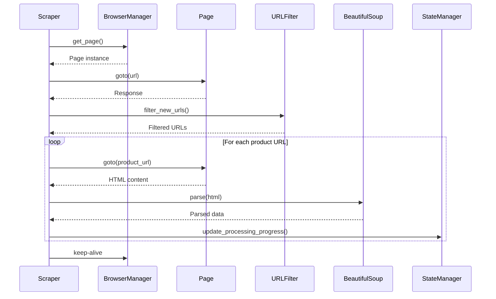
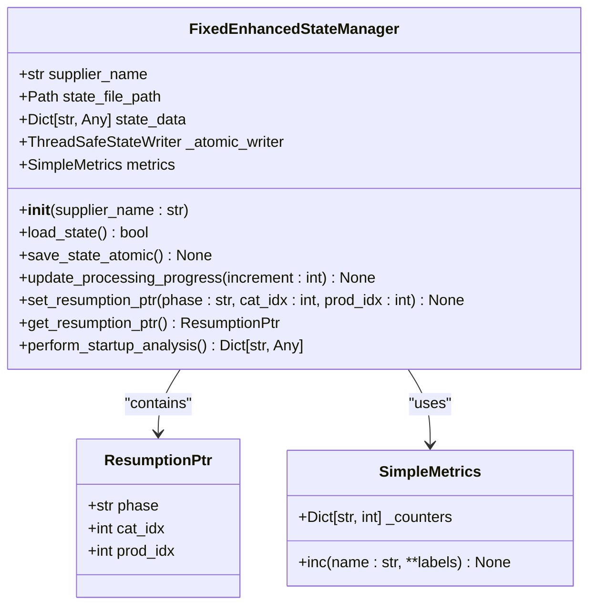
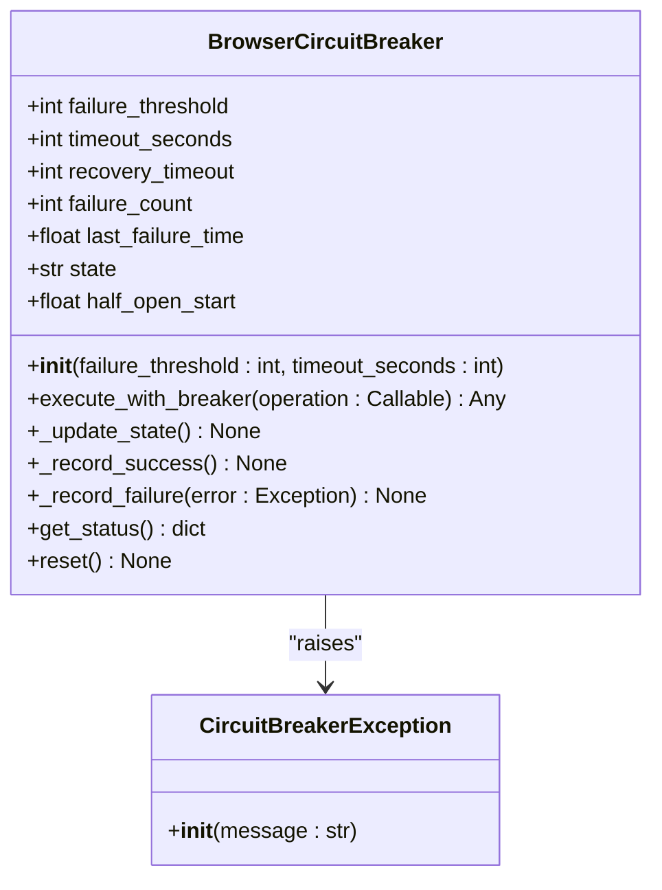
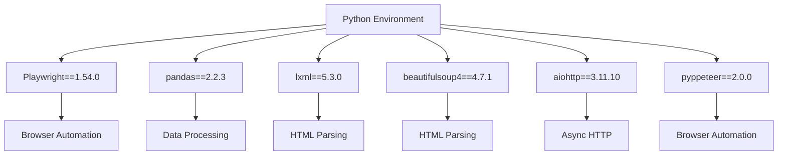
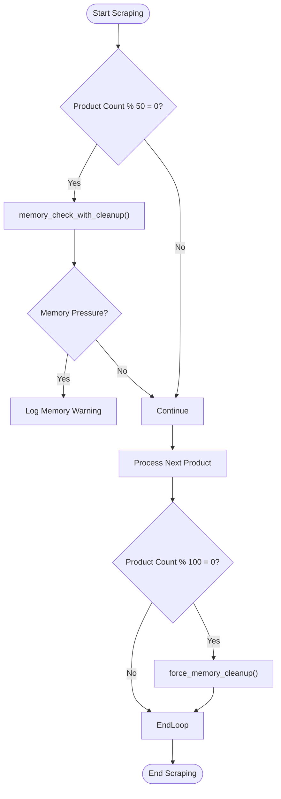

# Memory Leak Detection


## Table of Contents
1. [Introduction](#introduction)
2. [Project Structure](#project-structure)
3. [Core Components](#core-components)
4. [Architecture Overview](#architecture-overview)
5. [Detailed Component Analysis](#detailed-component-analysis)
6. [Dependency Analysis](#dependency-analysis)
7. [Performance Considerations](#performance-considerations)
8. [Troubleshooting Guide](#troubleshooting-guide)
9. [Conclusion](#conclusion)

## Introduction
This document provides a comprehensive guide to memory leak detection in long-running scraping processes within the Amazon FBA Agent System. It focuses on identifying and diagnosing memory leaks through debug log analysis, dependency evaluation, and runtime monitoring. The system employs browser automation with Playwright and manages state across extended sessions, making memory management critical for stability. This guide details how to detect unbounded memory growth, isolate leak sources, and implement preventive strategies.

## Project Structure
The project is organized into several key directories that support the scraping and analysis workflow. The core functionality resides in the `tools` directory, while configuration, diagnostics, and utilities are separated for modularity. Memory-intensive operations are primarily handled by browser automation components in `utils` and `tools`.





**Diagram sources**
- [configurable_supplier_scraper.py](file://tools/configurable_supplier_scraper.py)
- [fixed_enhanced_state_manager.py](file://utils/fixed_enhanced_state_manager.py)
- [browser_circuit_breaker.py](file://utils/browser_circuit_breaker.py)
- [pip_freeze.txt](file://diagnostics/session_20250904_222414/pip_freeze.txt)

**Section sources**
- [configurable_supplier_scraper.py](file://tools/configurable_supplier_scraper.py)
- [fixed_enhanced_state_manager.py](file://utils/fixed_enhanced_state_manager.py)
- [browser_circuit_breaker.py](file://utils/browser_circuit_breaker.py)
- [pip_freeze.txt](file://diagnostics/session_20250904_222414/pip_freeze.txt)

## Core Components
The core components involved in memory leak detection include the `ConfigurableSupplierScraper`, `FixedEnhancedStateManager`, and `BrowserCircuitBreaker`. These components manage browser sessions, state persistence, and failure resilience during long-running scraping tasks. Memory leaks often arise from improper cleanup of browser contexts, accumulation of cached data, or unbounded object retention in state managers.

**Section sources**
- [configurable_supplier_scraper.py](file://tools/configurable_supplier_scraper.py#L1-L3938)
- [fixed_enhanced_state_manager.py](file://utils/fixed_enhanced_state_manager.py#L1-L2412)
- [browser_circuit_breaker.py](file://utils/browser_circuit_breaker.py#L1-L214)

## Architecture Overview
The system architecture is designed for robust, long-running scraping operations with centralized browser management and state tracking. Playwright is used for browser automation, enabling JavaScript execution and anti-bot evasion. The state manager ensures progress is preserved across interruptions, while the circuit breaker pattern prevents cascading failures.





**Diagram sources**
- [configurable_supplier_scraper.py](file://tools/configurable_supplier_scraper.py#L1-L3938)
- [fixed_enhanced_state_manager.py](file://utils/fixed_enhanced_state_manager.py#L1-L2412)
- [browser_circuit_breaker.py](file://utils/browser_circuit_breaker.py#L1-L214)

## Detailed Component Analysis

### Configurable Supplier Scraper Analysis
The `ConfigurableSupplierScraper` class orchestrates the scraping process using Playwright for browser automation. It maintains a shared browser context through `BrowserManager`, which can lead to memory leaks if pages are not properly closed or if JavaScript objects accumulate.

#### For API/Service Components:




**Diagram sources**
- [configurable_supplier_scraper.py](file://tools/configurable_supplier_scraper.py#L1-L3938)

**Section sources**
- [configurable_supplier_scraper.py](file://tools/configurable_supplier_scraper.py#L1-L3938)

### Fixed Enhanced State Manager Analysis
The `FixedEnhancedStateManager` handles persistent state across scraping sessions. It tracks progress, metrics, and resumption points. Memory leaks can occur if large data structures are retained unnecessarily or if file operations are not atomic.

#### For Object-Oriented Components:




**Diagram sources**
- [fixed_enhanced_state_manager.py](file://utils/fixed_enhanced_state_manager.py#L1-L2412)

**Section sources**
- [fixed_enhanced_state_manager.py](file://utils/fixed_enhanced_state_manager.py#L1-L2412)

### Browser Circuit Breaker Analysis
The `BrowserCircuitBreaker` implements the circuit breaker pattern to prevent cascading failures during browser operations. It tracks failure counts and transitions between states (CLOSED, OPEN, HALF_OPEN) to allow recovery.

#### For Object-Oriented Components:




**Diagram sources**
- [browser_circuit_breaker.py](file://utils/browser_circuit_breaker.py#L1-L214)

**Section sources**
- [browser_circuit_breaker.py](file://utils/browser_circuit_breaker.py#L1-L214)

## Dependency Analysis
Memory-intensive dependencies are identified through the `pip_freeze.txt` file, which lists all Python packages used in the system. Key dependencies that may contribute to memory leaks include Playwright, pandas, and lxml.





**Diagram sources**
- [pip_freeze.txt](file://diagnostics/session_20250904_222414/pip_freeze.txt)

**Section sources**
- [pip_freeze.txt](file://diagnostics/session_20250904_222414/pip_freeze.txt)

## Performance Considerations
The system implements several memory management strategies to prevent leaks during long-running operations. These include periodic garbage collection, forced memory cleanup every 100 products, and real-time monitoring of memory usage. The `FixedEnhancedStateManager` clears local product lists periodically to prevent accumulation.





**Diagram sources**
- [configurable_supplier_scraper.py](file://tools/configurable_supplier_scraper.py#L1-L3938)
- [fixed_enhanced_state_manager.py](file://utils/fixed_enhanced_state_manager.py#L1-L2412)

## Troubleshooting Guide
To detect memory leaks, analyze debug logs for patterns of unbounded memory growth. Look for repeated object accumulation without cleanup, such as unclosed page contexts or retained DOM references. Use the following diagnostic commands:


```bash
# Monitor memory usage during execution
python -m memory_profiler run_custom_poundwholesale.py

# Analyze object counts in logs
grep -i "memory" logs/debug/*.log | grep -i "usage"

# Check for unclosed browser contexts
grep -i "page.close" logs/debug/*.log
```


Log parsing techniques include searching for memory-related keywords and tracking memory usage trends over time. For example:


```
2025-09-04 22:30:15 - configurable_supplier_scraper - INFO - 🧠 Pre-scraping Memory: Chrome=512MB, Python=256MB, System=45.2%
2025-09-04 22:35:22 - configurable_supplier_scraper - INFO - 🧹 Forced memory cleanup after product 100
2025-09-04 22:40:18 - configurable_supplier_scraper - WARNING - ⚠️ MEMORY PRESSURE: High memory usage at product 150
```


Common leak patterns in browser automation include:
- Unclosed page contexts after navigation
- Retained DOM references in JavaScript
- Accumulation of cached responses
- Failure to release resources after exceptions

Strategies for isolating leak sources:
1. Monitor object counts using garbage collection statistics
2. Track garbage collection behavior with `gc.get_stats()`
3. Use weak references for cached objects
4. Implement periodic cleanup intervals

**Section sources**
- [configurable_supplier_scraper.py](file://tools/configurable_supplier_scraper.py#L1-L3938)
- [fixed_enhanced_state_manager.py](file://utils/fixed_enhanced_state_manager.py#L1-L2412)
- [browser_circuit_breaker.py](file://utils/browser_circuit_breaker.py#L1-L214)
- [logger.py](file://utils/logger.py#L1-L43)

## Conclusion
Memory leak detection in long-running scraping processes requires a combination of log analysis, dependency evaluation, and runtime monitoring. The Amazon FBA Agent System employs several strategies to prevent and detect memory leaks, including periodic cleanup, circuit breakers, and state management. By analyzing debug logs for memory usage trends and identifying memory-intensive dependencies, developers can isolate and resolve leak sources. The use of Playwright, pandas, and lxml requires careful resource management to ensure system stability during extended operations.

**Referenced Files in This Document**   
- [configurable_supplier_scraper.py](file://tools/configurable_supplier_scraper.py)
- [browser_circuit_breaker.py](file://utils/browser_circuit_breaker.py)
- [fixed_enhanced_state_manager.py](file://utils/fixed_enhanced_state_manager.py)
- [pip_freeze.txt](file://diagnostics/session_20250904_222414/pip_freeze.txt)
- [logger.py](file://utils/logger.py)