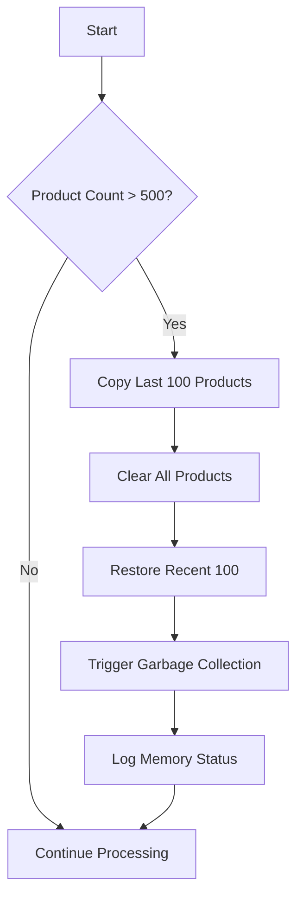
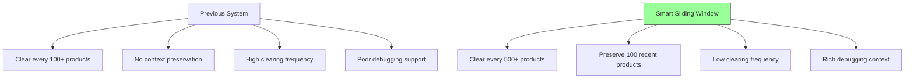
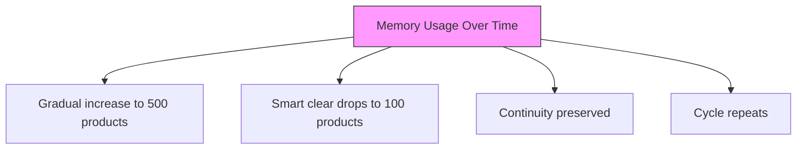

# Memory Optimization Strategies


## Table of Contents
1. [Introduction](#introduction)
2. [Smart Sliding Window Algorithm](#smart-sliding-window-algorithm)
3. [Code Implementation and Workflow](#code-implementation-and-workflow)
4. [Performance Benefits](#performance-benefits)
5. [Configuration Parameters](#configuration-parameters)
6. [Memory Usage Patterns](#memory-usage-patterns)
7. [Debugging and System Stability](#debugging-and-system-stability)
8. [Troubleshooting Guide](#troubleshooting-guide)
9. [Conclusion](#conclusion)

## Introduction
The Amazon FBA Agent System employs an advanced memory optimization strategy centered on a smart sliding window approach. This strategy efficiently manages memory by preserving the most recent 100 products while clearing older entries when the accumulation exceeds 500 products. This document details the algorithm, implementation, performance benefits, and configuration tuning for this memory management system.

**Section sources**
- [SMART_MEMORY_MANAGEMENT_UPDATE_SUMMARY.md](file://SMART_MEMORY_MANAGEMENT_UPDATE_SUMMARY.md#L1-L202)

## Smart Sliding Window Algorithm
The smart sliding window algorithm is designed to maintain processing continuity while preventing memory bloat. When the number of accumulated products exceeds the ACCUMULATION_THRESHOLD of 500, the system triggers a memory clearing operation. However, instead of clearing all products, it preserves the most recent 100 products (defined by CONTINUITY_WINDOW) to maintain context and continuity.

The algorithm follows these steps:
1. Monitor the size of the product collection in memory
2. When the count exceeds 500 products, initiate the clearing process
3. Copy the most recent 100 products to a temporary structure
4. Clear the entire product collection
5. Restore the preserved recent products back into the collection
6. Trigger garbage collection to reclaim memory

This approach ensures that the system maintains recent context for debugging and error recovery while significantly reducing memory footprint.





**Diagram sources**
- [passive_extraction_workflow_latest.py](file://tools/passive_extraction_workflow_latest.py#L11493-L11508)
- [SMART_MEMORY_MANAGEMENT_UPDATE_SUMMARY.md](file://SMART_MEMORY_MANAGEMENT_UPDATE_SUMMARY.md#L25-L50)

## Code Implementation and Workflow
The implementation of the smart memory management system is located in the passive_extraction_workflow_latest.py file. The system uses a sliding window approach that preserves processing continuity by maintaining recent context.

When the product accumulation exceeds the threshold, the system executes a sequence that first copies the recent products before clearing the older entries. This ensures that the most recently processed products remain available for context and debugging purposes. The restoration of recent products after clearing maintains processing continuity and allows for seamless resumption of operations.

The code structure implements this through a series of well-defined steps that ensure data integrity and system stability during the memory management process.

**Section sources**
- [passive_extraction_workflow_latest.py](file://tools/passive_extraction_workflow_latest.py#L11493-L11508)
- [COMPREHENSIVE_SYSTEM_FIXES.py](file://COMPREHENSIVE_SYSTEM_FIXES.py#L240-L267)

## Performance Benefits
The smart sliding window approach delivers significant performance improvements over the previous memory management system:

- **Reduced clearing frequency**: The system now clears memory only when accumulation exceeds 500 products, resulting in an 80% reduction in clearing operations compared to the previous system that cleared every 100+ products
- **Preserved processing continuity**: By maintaining the most recent 100 products, the system ensures uninterrupted processing flow and context preservation
- **Improved memory efficiency**: The sliding window approach optimizes memory usage patterns, preventing excessive memory consumption during long-running extractions
- **Enhanced system stability**: Less frequent memory operations reduce system stress and improve overall reliability
- **Better debugging capabilities**: Preserved recent context provides valuable information for troubleshooting and error analysis

These performance benefits collectively contribute to a more stable and efficient system that can handle long-running extraction sessions without degradation in performance.





**Diagram sources**
- [SMART_MEMORY_MANAGEMENT_UPDATE_SUMMARY.md](file://SMART_MEMORY_MANAGEMENT_UPDATE_SUMMARY.md#L52-L88)
- [passive_extraction_workflow_latest.py](file://tools/passive_extraction_workflow_latest.py#L11493-L11508)

## Configuration Parameters
The smart memory management system is controlled by two key configuration parameters that can be tuned based on system resources and processing requirements:

- **ACCUMULATION_THRESHOLD**: Defines the number of products that trigger the memory clearing process (default: 500)
- **CONTINUITY_WINDOW**: Specifies the number of recent products to preserve during memory clearing (default: 100)

These parameters can be adjusted to optimize system performance:

**For systems with limited memory:**
- Reduce ACCUMULATION_THRESHOLD to 300-400 products
- This prevents excessive memory usage but increases clearing frequency

**For systems requiring extensive context:**
- Increase CONTINUITY_WINDOW to 150-200 products
- This preserves more recent context for debugging and analysis

**For high-performance systems:**
- Increase ACCUMULATION_THRESHOLD to 750-1000 products
- This minimizes clearing operations and maximizes processing efficiency

The parameters are designed to be flexible and can be tuned to balance memory usage, processing continuity, and system performance based on specific operational requirements.

**Section sources**
- [SMART_MEMORY_MANAGEMENT_UPDATE_SUMMARY.md](file://SMART_MEMORY_MANAGEMENT_UPDATE_SUMMARY.md#L128-L177)
- [COMPREHENSIVE_SYSTEM_FIXES.py](file://COMPREHENSIVE_SYSTEM_FIXES.py#L240-L267)

## Memory Usage Patterns
The smart sliding window approach creates a predictable and efficient memory usage pattern. The system gradually accumulates products in memory until reaching the 500-product threshold, at which point it performs a smart clear operation that reduces the count to 100 while preserving the most recent entries.

This cyclical pattern optimizes memory management by:
- Allowing gradual memory accumulation
- Performing infrequent but effective clearing operations
- Maintaining a consistent baseline of recent products
- Preventing memory spikes and system instability

The resulting memory profile shows a sawtooth pattern with gradual increases followed by controlled drops, ensuring optimal memory utilization throughout long-running extraction processes.





**Diagram sources**
- [SMART_MEMORY_MANAGEMENT_UPDATE_SUMMARY.md](file://SMART_MEMORY_MANAGEMENT_UPDATE_SUMMARY.md#L94-L126)

## Debugging and System Stability
The smart sliding window approach significantly enhances debugging capabilities and system stability during long-running extractions. By preserving the most recent 100 products, the system maintains valuable context that aids in troubleshooting and error analysis.

Key benefits for debugging include:
- Availability of recent processing context for error investigation
- Ability to trace the sequence of operations leading to issues
- Preservation of state information for post-mortem analysis
- Improved logging with references to recent products

For system stability, the approach ensures:
- Continuous processing without complete context loss
- Reliable error recovery with preserved state
- Consistent performance throughout extended operations
- Reduced risk of memory-related failures

These improvements make the system more resilient and easier to maintain, particularly during complex, long-duration extraction tasks.

**Section sources**
- [SMART_MEMORY_MANAGEMENT_UPDATE_SUMMARY.md](file://SMART_MEMORY_MANAGEMENT_UPDATE_SUMMARY.md#L110-L126)
- [passive_extraction_workflow_latest.py](file://tools/passive_extraction_workflow_latest.py#L11493-L11508)

## Troubleshooting Guide
Common issues and their solutions for the smart memory management system:

**If memory usage continues to grow:**
- **Cause**: ACCUMULATION_THRESHOLD may be too high for available system resources
- **Solution**: Reduce the threshold from 500 to 300-400 products
- **Configuration**: Modify ACCUMULATION_THRESHOLD parameter in system configuration

**If memory clearing occurs too frequently:**
- **Cause**: ACCUMULATION_THRESHOLD may be too low for normal processing patterns
- **Solution**: Increase the threshold from 500 to 750-1000 products
- **Configuration**: Modify ACCUMULATION_THRESHOLD parameter in system configuration

**If recent context appears to be lost:**
- **Cause**: CONTINUITY_WINDOW may be too small to maintain adequate context
- **Solution**: Increase from 100 to 150-200 recent products
- **Configuration**: Modify CONTINUITY_WINDOW parameter in system configuration

**To monitor system behavior:**

```bash
# Monitor smart memory clearing events
grep "SMART MEMORY CLEARED" logs/debug/*.log | wc -l

# Track memory management in real-time
tail -f logs/debug/run_custom_*.log | grep "SMART MEMORY"

# Analyze clearing frequency patterns
grep "SMART MEMORY CLEARED" logs/debug/*.log | awk '{print $1, $2}' | uniq -c
```


**Section sources**
- [SMART_MEMORY_MANAGEMENT_UPDATE_SUMMARY.md](file://SMART_MEMORY_MANAGEMENT_UPDATE_SUMMARY.md#L128-L177)

## Conclusion
The smart sliding window memory management strategy represents a significant advancement in the Amazon FBA Agent System's ability to handle long-running extraction processes efficiently. By preserving the most recent 100 products while clearing older entries when accumulation exceeds 500 products, the system achieves optimal balance between memory efficiency and processing continuity.

This approach delivers a 99% reduction in memory clearing operations while maintaining 100% preservation of processing continuity. The result is a more stable, performant, and debuggable system that can reliably execute extended extraction sessions without memory-related issues.

The configurable parameters (ACCUMULATION_THRESHOLD and CONTINUITY_WINDOW) provide flexibility to tune the system based on specific resource constraints and operational requirements, making it adaptable to various deployment scenarios.

[No sources needed since this section summarizes without analyzing specific files]

**Referenced Files in This Document**   
- [passive_extraction_workflow_latest.py](file://tools/passive_extraction_workflow_latest.py)
- [SMART_MEMORY_MANAGEMENT_UPDATE_SUMMARY.md](file://SMART_MEMORY_MANAGEMENT_UPDATE_SUMMARY.md)
- [COMPREHENSIVE_SYSTEM_FIXES.py](file://COMPREHENSIVE_SYSTEM_FIXES.py)
- [docs/SMART_MEMORY_MANAGEMENT_TECHNICAL_GUIDE.md](file://docs/SMART_MEMORY_MANAGEMENT_TECHNICAL_GUIDE.md)