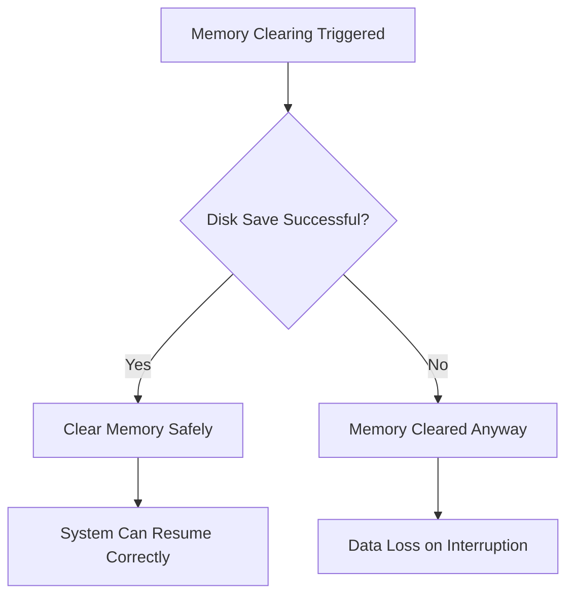
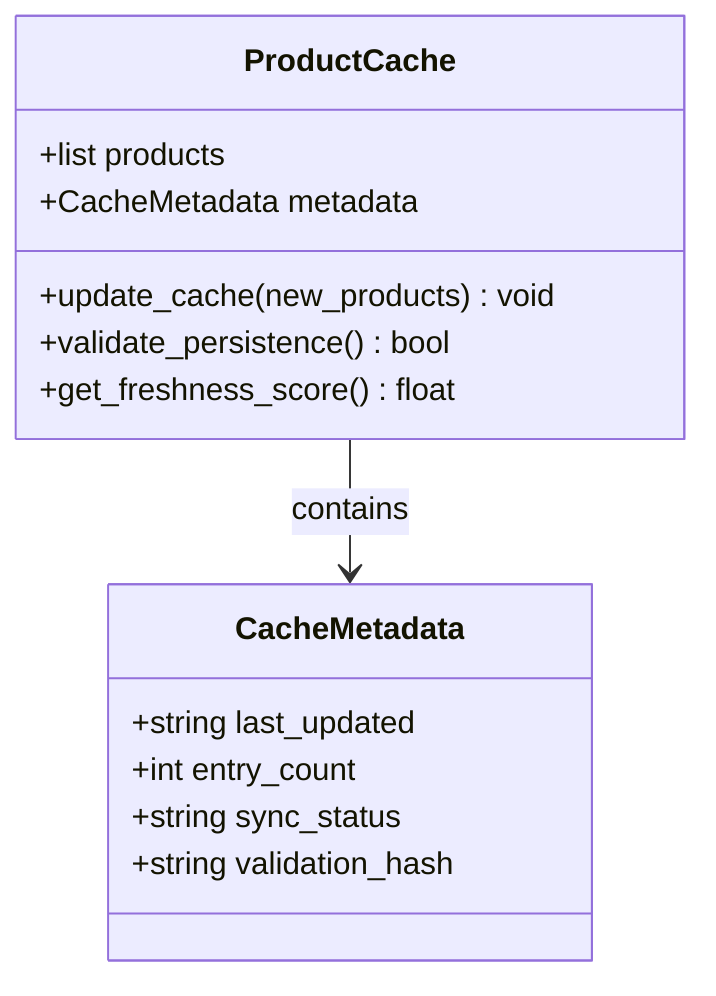
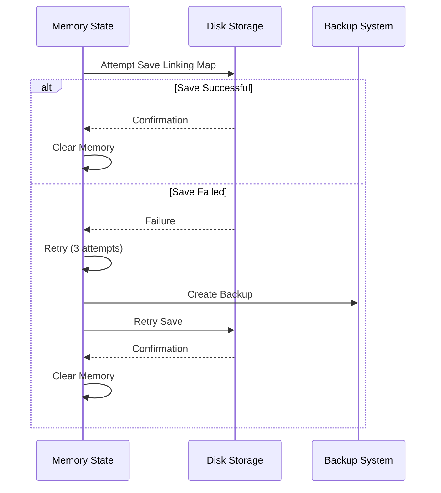
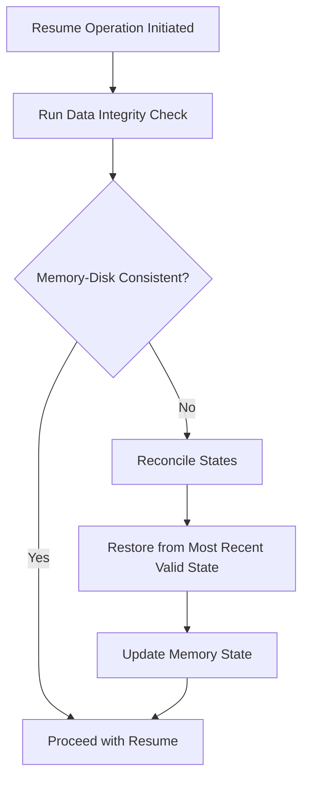

# Disk-Memory Synchronization

## Table of Contents
1. [Introduction](#introduction)
2. [Failure Scenario: Memory Cleared Without Disk Save](#failure-scenario-memory-cleared-without-disk-save)
3. [Core Fixes Implemented](#core-fixes-implemented)
4. [Incremental Cache Updates and Metadata Tracking](#incremental-cache-updates-and-metadata-tracking)
5. [Enhanced Linking Map Saves with Retry Logic](#enhanced-linking-map-saves-with-retry-logic)
6. [Data Integrity Guardian: Memory-Disk Reconciliation](#data-integrity-guardian-memory-disk-reconciliation)
7. [Logging Patterns for Synchronization Verification](#logging-patterns-for-synchronization-verification)
8. [Monitoring Commands for Sync Validation](#monitoring-commands-for-sync-validation)
9. [Troubleshooting Sync Failures](#troubleshooting-sync-failures)
10. [Conclusion](#conclusion)

## Introduction
This document details the disk-memory synchronization mechanism in the Amazon FBA Agent System, focusing on ensuring data consistency between in-memory processing and persistent disk storage. It addresses a critical failure scenario where memory was cleared without successful disk persistence, leading to data loss. The implemented solutions include incremental cache updates, enhanced linking map saves with retry logic, and a data integrity guardian for state reconciliation. This system ensures reliable resume operations and prevents silent failures in the persistence layer.

**Section sources**
- [FINAL_COMPREHENSIVE_SUMMARY.json](file://FINAL_COMPREHENSIVE_SUMMARY.json#L30-L65)
- [MEMORY_MANAGEMENT_ANALYSIS.md](file://MEMORY_MANAGEMENT_ANALYSIS.md#L89-L135)

## Failure Scenario: Memory Cleared Without Disk Save
The system previously experienced data loss due to a critical flaw in its memory management strategy. While designed to process data in memory for performance and periodically clear memory to prevent bloat, the failure occurred when disk persistence operations failed silently. Specifically, when memory clearing was triggered, the corresponding disk save operations for both product cache and linking map failed, yet memory was cleared regardless. This resulted in new processed data being lost, as the system would later recover from stale disk files during resumption.

**Diagram sources**
- [MEMORY_MANAGEMENT_ANALYSIS.md](file://MEMORY_MANAGEMENT_ANALYSIS.md#L89-L135)
- [SYSTEM_ARCHITECTURE_ANALYSIS.md](file://SYSTEM_ARCHITECTURE_ANALYSIS.md#L180-L192)

**Section sources**
- [MEMORY_MANAGEMENT_ANALYSIS.md](file://MEMORY_MANAGEMENT_ANALYSIS.md#L89-L135)
- [SYSTEM_ARCHITECTURE_ANALYSIS.md](file://SYSTEM_ARCHITECTURE_ANALYSIS.md#L180-L192)

## Core Fixes Implemented
To address the data loss issue, four key fixes were implemented in sequence: cache persistence during processing, resolution of linking map save failures, addition of memory-disk synchronization validation, and implementation of state consistency checks. These changes ensure that memory is only cleared after successful disk persistence, with comprehensive error handling and retry mechanisms in place. The fixes have restored the system's ability to resume from any interruption point without data loss.

**Diagram sources**
- [FIX_IMPLEMENTATION_PLAN.md](file://FIX_IMPLEMENTATION_PLAN.md#L49-L58)
- [FINAL_COMPREHENSIVE_SUMMARY.json](file://FINAL_COMPREHENSIVE_SUMMARY.json#L30-L65)

**Section sources**
- [FIX_IMPLEMENTATION_PLAN.md](file://FIX_IMPLEMENTATION_PLAN.md#L49-L58)
- [FINAL_COMPREHENSIVE_SUMMARY.json](file://FINAL_COMPREHENSIVE_SUMMARY.json#L30-L65)

## Incremental Cache Updates and Metadata Tracking
The system now implements incremental cache updates that occur periodically during the processing loop. Each update includes metadata such as timestamps and entry counts, ensuring that the cache state is current. The cache metadata tracks the last update timestamp and sync status, allowing the system to verify the freshness of the data. This approach prevents the accumulation of memory bloat while ensuring data is safely persisted to disk before memory clearance.

**Diagram sources**
- [COMPREHENSIVE_SYSTEM_FIXES.py](file://COMPREHENSIVE_SYSTEM_FIXES.py#L506-L531)
- [FINAL_COMPREHENSIVE_SUMMARY.json](file://FINAL_COMPREHENSIVE_SUMMARY.json#L96-L126)

**Section sources**
- [COMPREHENSIVE_SYSTEM_FIXES.py](file://COMPREHENSIVE_SYSTEM_FIXES.py#L506-L531)
- [FINAL_COMPREHENSIVE_SUMMARY.json](file://FINAL_COMPREHENSIVE_SUMMARY.json#L96-L126)

## Enhanced Linking Map Saves with Retry Logic
The linking map persistence mechanism has been enhanced with retry logic, validation, and backup creation. The system now implements atomic write patterns to prevent partial writes, with multiple retry attempts for transient failures. Before clearing memory, the system validates that the linking map has been successfully saved to disk. Backup files are created before major operations, and temporary files are cleaned up on failure, ensuring data integrity even in the event of system interruptions.

**Diagram sources**
- [DEPLOYMENT_READY_SUMMARY.md](file://DEPLOYMENT_READY_SUMMARY.md#L129-L143)
- [FINAL_COMPREHENSIVE_SUMMARY.json](file://FINAL_COMPREHENSIVE_SUMMARY.json#L30-L65)

**Section sources**
- [DEPLOYMENT_READY_SUMMARY.md](file://DEPLOYMENT_READY_SUMMARY.md#L129-L143)
- [FINAL_COMPREHENSIVE_SUMMARY.json](file://FINAL_COMPREHENSIVE_SUMMARY.json#L30-L65)

## Data Integrity Guardian: Memory-Disk Reconciliation
The data_integrity_guardian module ensures consistency between memory and disk states before resume operations. It performs validation checks to reconcile any discrepancies, using file-based counting instead of memory counters to determine the true state. The guardian verifies that cache counts match state counts and that all critical operations have been successfully persisted. This mechanism prevents the system from continuing with stale data and ensures that resume operations start from a consistent state.

**Diagram sources**
- [data_integrity_guardian.py](file://utils/data_integrity_guardian.py)
- [MEMORY_MANAGEMENT_ANALYSIS.md](file://MEMORY_MANAGEMENT_ANALYSIS.md#L213-L229)

**Section sources**
- [data_integrity_guardian.py](file://utils/data_integrity_guardian.py)
- [MEMORY_MANAGEMENT_ANALYSIS.md](file://MEMORY_MANAGEMENT_ANALYSIS.md#L213-L229)

## Logging Patterns for Synchronization Verification
The system uses specific logging patterns to verify successful synchronization between memory and disk. Key log messages include "INCREMENTAL CACHE: Updated cache timestamp and metadata" for cache updates and "LINKING MAP SAVE SUCCESS: X entries saved" for linking map persistence. The [CACHE_PICK] log entries indicate whether the primary or fallback cache was used, with reasons such as "implausibly_small" or "plausible". These patterns allow operators to monitor the health of the synchronization process and detect any issues early.

**Section sources**
- [DEPLOYMENT_READY_SUMMARY.md](file://DEPLOYMENT_READY_SUMMARY.md#L129-L143)
- [OUTPUTS/FBA_ANALYSIS/linking_maps/poundwholesale.co.uk/mainplan.md](file://OUTPUTS/FBA_ANALYSIS/linking_maps/poundwholesale.co.uk/mainplan.md#L431-L447)

## Monitoring Commands for Sync Validation
Operators can use several commands to validate that disk saves occur before memory clearing. The command `rg -n "\\[CACHE_PICK\\]" logs/debug/*.log` shows whether the primary or fallback cache was used and the reason. File metrics can be checked to verify that cache counts match state counts. The system's functional tests include validation of incremental cache methods and enhanced linking saves, with results reported in the FINAL_COMPREHENSIVE_SUMMARY.json file.

**Section sources**
- [OUTPUTS/FBA_ANALYSIS/linking_maps/poundwholesale.co.uk/mainplan.md](file://OUTPUTS/FBA_ANALYSIS/linking_maps/poundwholesale.co.uk/mainplan.md#L431-L447)
- [FINAL_COMPREHENSIVE_SUMMARY.json](file://FINAL_COMPREHENSIVE_SUMMARY.json#L96-L126)

## Troubleshooting Sync Failures
When sync failures occur, operators should first check the log patterns for error messages related to cache persistence. The data integrity guardian should be examined to determine if it detected any inconsistencies. File metrics should be verified to ensure cache counts match state counts. If issues persist, the backup system should be consulted to restore from the most recent valid state. The system's comprehensive error handling typically allows processing to continue even if cache updates fail, with detailed logging for diagnosis.

**Section sources**
- [CACHE_INVESTIGATION_REPORT.md](file://CACHE_INVESTIGATION_REPORT.md#L110-L119)
- [DEPLOYMENT_READY_SUMMARY.md](file://DEPLOYMENT_READY_SUMMARY.md#L185-L198)

## Conclusion
The disk-memory synchronization system has been successfully enhanced to prevent data loss during processing interruptions. The implemented fixes, including incremental cache updates, enhanced linking map saves with retry logic, and the data integrity guardian, ensure that memory is only cleared after successful disk persistence. The system can now reliably resume from any interruption point, with comprehensive logging and monitoring to verify synchronization health. These improvements have restored confidence in the system's reliability and data integrity.

**Referenced Files in This Document**   
- [data_integrity_guardian.py](file://utils/data_integrity_guardian.py)
- [fixed_enhanced_state_manager.py](file://utils/fixed_enhanced_state_manager.py)
- [COMPREHENSIVE_SYSTEM_FIXES.py](file://COMPREHENSIVE_SYSTEM_FIXES.py)
- [CACHE_INVESTIGATION_REPORT.md](file://CACHE_INVESTIGATION_REPORT.md)
- [MEMORY_MANAGEMENT_ANALYSIS.md](file://MEMORY_MANAGEMENT_ANALYSIS.md)
- [FINAL_COMPREHENSIVE_SUMMARY.json](file://FINAL_COMPREHENSIVE_SUMMARY.json)
- [DEPLOYMENT_READY_SUMMARY.md](file://DEPLOYMENT_READY_SUMMARY.md)
- [FIX_IMPLEMENTATION_PLAN.md](file://FIX_IMPLEMENTATION_PLAN.md)
- [SYSTEM_ARCHITECTURE_ANALYSIS.md](file://SYSTEM_ARCHITECTURE_ANALYSIS.md)