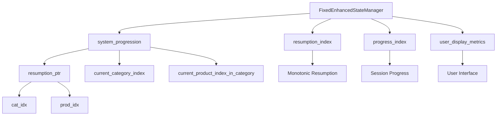
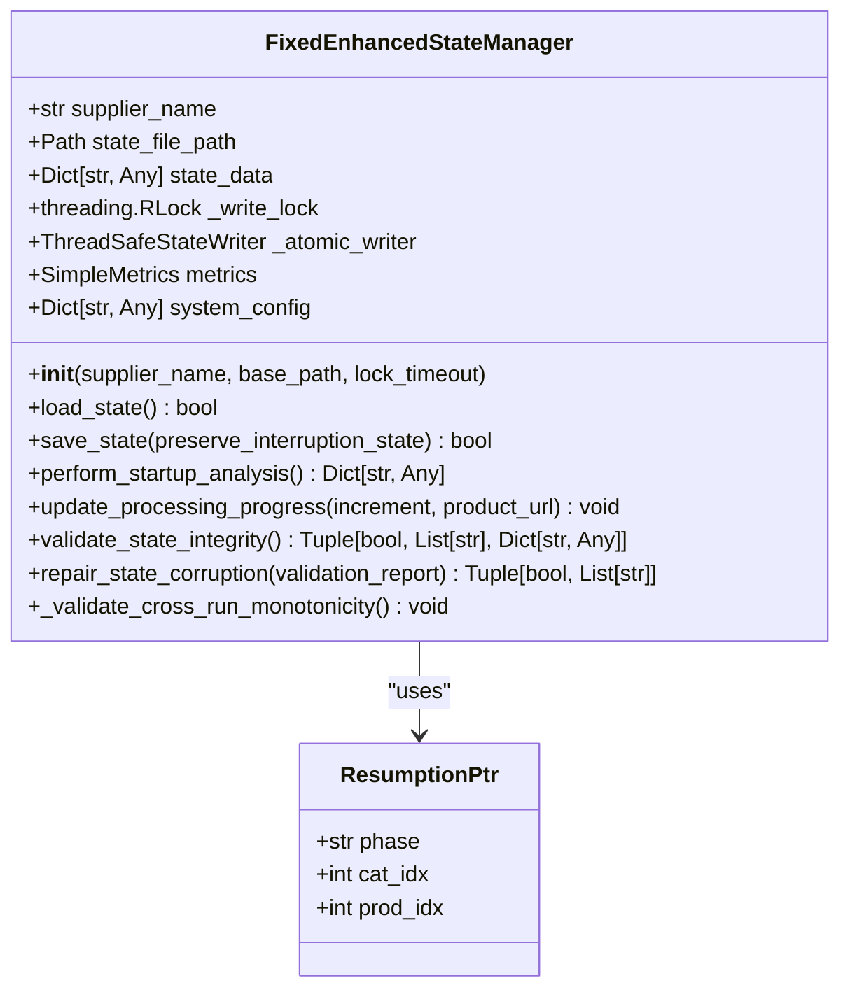
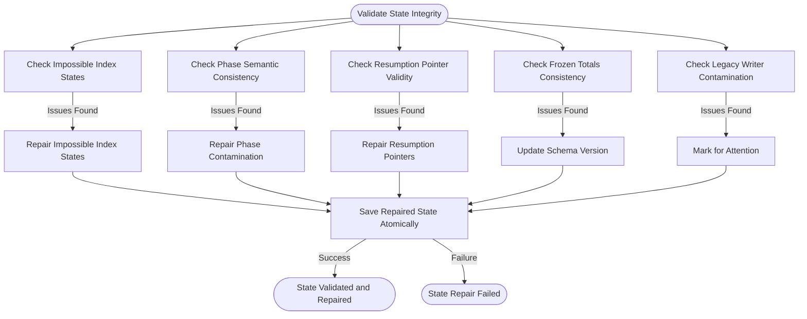
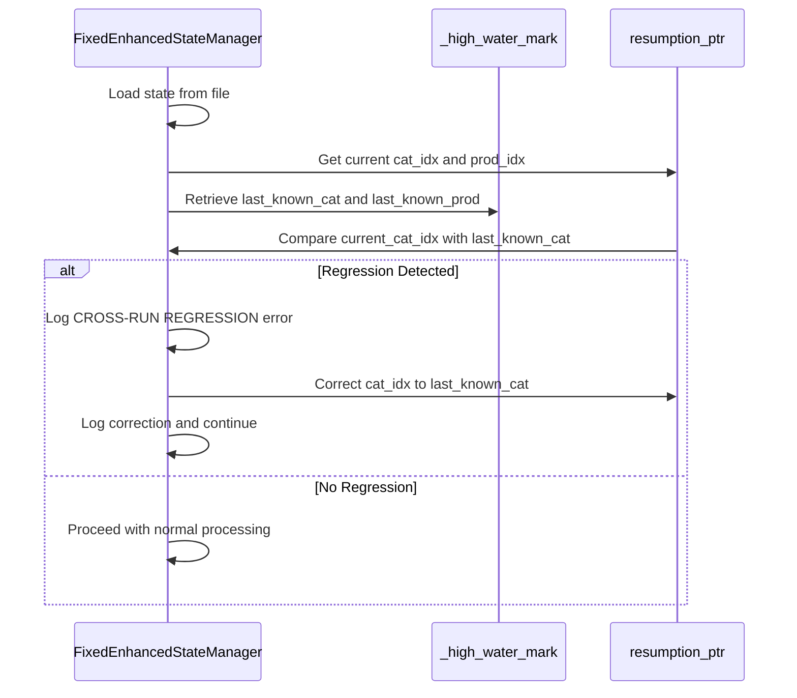

# State Corruption

## Table of Contents
1. [Introduction](#introduction)
2. [Core Components](#core-components)
3. [Architecture Overview](#architecture-overview)
4. [Detailed Component Analysis](#detailed-component-analysis)
5. [State Corruption Diagnosis](#state-corruption-diagnosis)
6. [Recovery Procedures](#recovery-procedures)
7. [Prevention Strategies](#prevention-strategies)
8. [Conclusion](#conclusion)

## Introduction

State corruption in the Amazon FBA Agent System primarily stems from improper handling of processing state indexes, particularly the misuse of dual-purpose index fields for both resumption and progress tracking. This document details the root causes, diagnostic methods, and architectural solutions for state file corruption, with a focus on the `last_processed_index` regression issue during reverse gap scenarios. The implementation of the `FixedEnhancedStateManager` provides a robust solution by separating `resumption_index` from `progress_index`, ensuring data integrity across processing sessions.

## Core Components

The core components involved in state management and corruption resolution are the `FixedEnhancedStateManager` class and its associated state validation and repair mechanisms. This class implements a thread-safe, atomic state management system that prevents index regression and ensures monotonic progression across runs. The separation of resumption and progress tracking indexes eliminates the primary cause of state corruption, while comprehensive validation methods detect and repair existing corruption patterns.

**Section sources**
- [fixed_enhanced_state_manager.py](file://utils/fixed_enhanced_state_manager.py#L1-L2412)

## Architecture Overview

The state management architecture has been redesigned to separate concerns between resumption tracking and progress monitoring. The new architecture implements a single source of truth in the `system_progression` structure, with dedicated fields for different processing phases. This design prevents the mixing of category-relative and global indices that led to corruption in the legacy system.

**Diagram sources **
- [fixed_enhanced_state_manager.py](file://utils/fixed_enhanced_state_manager.py#L1-L2412)

## Detailed Component Analysis

### FixedEnhancedStateManager Analysis

The `FixedEnhancedStateManager` class represents a comprehensive solution to state corruption issues. It implements several key architectural improvements over the legacy state management system, including thread safety, atomic operations, and separation of resumption and progress tracking.

#### Class Structure and Initialization

**Diagram sources **
- [fixed_enhanced_state_manager.py](file://utils/fixed_enhanced_state_manager.py#L1-L2412)

#### State Validation and Repair Flow

**Diagram sources **
- [fixed_enhanced_state_manager.py](file://utils/fixed_enhanced_state_manager.py#L1456-L1745)

## State Corruption Diagnosis

State corruption in the system manifests primarily through index regression, where the `last_processed_index` resets to 0 during reverse gap scenarios. This issue is clearly visible in the state timeline analysis, which shows multiple instances of the `last_processed_index` resetting to 0 while the `resumption_index` remains constant.

The state timeline analysis reveals a clear pattern of corruption:
- At timestamp 1757010653, `last_processed_index` resets from 3 to 0 while `resumption_index` remains at 10521
- At timestamp 1757010932, `last_processed_index` resets to 0 while `resumption_index` increases to 10524
- At timestamp 1757011070, `last_processed_index` resets to 0 while `resumption_index` increases to 10530

This pattern indicates that the `last_processed_index` is being incorrectly reset during processing, while the `resumption_index` correctly maintains the actual processing position. The root cause is the dual-purpose use of the index field for both resumption and progress tracking, leading to conflicts when reverse gap detection is performed.

The `_validate_cross_run_monotonicity` method in the `FixedEnhancedStateManager` class specifically addresses this issue by comparing the current resumption pointer against a persisted high-water mark from the previous run. If a regression is detected, the method corrects the pointer to maintain monotonic progression, preventing data corruption.

**Diagram sources **
- [fixed_enhanced_state_manager.py](file://utils/fixed_enhanced_state_manager.py#L351-L378)
- [state_timeline_analysis.txt](file://diagnostics/state_timeline_analysis.txt#L1-L330)

**Section sources**
- [fixed_enhanced_state_manager.py](file://utils/fixed_enhanced_state_manager.py#L351-L378)
- [state_timeline_analysis.txt](file://diagnostics/state_timeline_analysis.txt#L1-L330)

## Recovery Procedures

Recovery from state corruption involves several steps, beginning with validation of the current state integrity and followed by automated repair of detected issues. The `validate_state_integrity` method performs comprehensive checks for various corruption patterns, including impossible index states, phase semantic mixing, invalid resumption pointers, frozen totals drift, and legacy writer contamination.

When corruption is detected, the `repair_state_corruption` method attempts to automatically repair the issues. This method applies targeted repairs based on the specific corruption patterns identified:

1. **Impossible index states**: Clamps product and category indices to valid ranges
2. **Phase contamination**: Resets contaminated category fields to safe defaults
3. **Invalid resumption pointers**: Creates missing structures and fixes out-of-bounds values
4. **Schema version updates**: Updates the schema version to reflect repairs

The repair process concludes with an atomic save of the repaired state, ensuring that the corrections are persisted safely. The system also maintains a log of all repairs applied, including timestamps and specific changes made, for audit and troubleshooting purposes.

For severe corruption that cannot be automatically repaired, manual intervention may be required. This involves examining the state file, identifying the specific corruption patterns, and applying targeted corrections based on the system's processing history and expected state.

**Section sources**
- [fixed_enhanced_state_manager.py](file://utils/fixed_enhanced_state_manager.py#L1456-L1745)

## Prevention Strategies

Prevention of state corruption is achieved through several architectural and implementation strategies:

1. **Separation of concerns**: The `FixedEnhancedStateManager` separates `resumption_index` from `progress_index`, eliminating the dual-purpose index confusion that led to corruption.

2. **Atomic state updates**: All state modifications are performed atomically using file locking and thread-safe operations, preventing race conditions and partial writes.

3. **Monotonicity enforcement**: The `_validate_cross_run_monotonicity` method ensures that resumption pointers never decrease between runs, preventing index regression.

4. **Comprehensive validation**: Regular state integrity checks detect corruption patterns early, allowing for prompt correction.

5. **Single source of truth**: The `system_progression` structure serves as the authoritative source for all progression data, eliminating conflicting data sources.

6. **Phase-specific atomic commits**: Different processing phases use dedicated commit methods that ensure proper state transitions and prevent phase mixing.

These prevention strategies work together to create a robust state management system that maintains data integrity across processing sessions, even in the face of interruptions and system failures.

**Section sources**
- [fixed_enhanced_state_manager.py](file://utils/fixed_enhanced_state_manager.py#L1-L2412)

## Conclusion

State corruption in the Amazon FBA Agent System, particularly the issue of `last_processed_index` resetting to 0 during reverse gap scenarios, has been effectively addressed through the implementation of the `FixedEnhancedStateManager`. This solution separates resumption and progress tracking indexes, implements atomic state updates, and enforces monotonic progression across runs. The comprehensive validation and repair mechanisms ensure that any existing corruption is detected and corrected, while the architectural improvements prevent future corruption. By following the recovery procedures and prevention strategies outlined in this document, users can maintain data integrity and ensure reliable processing of supplier data.

**Referenced Files in This Document**   
- [fixed_enhanced_state_manager.py](file://utils/fixed_enhanced_state_manager.py)
- [state_timeline_analysis.txt](file://diagnostics/state_timeline_analysis.txt)
- [comprehensive_state_corruption_analysis.md](file://memories/comprehensive_state_corruption_analysis.md)