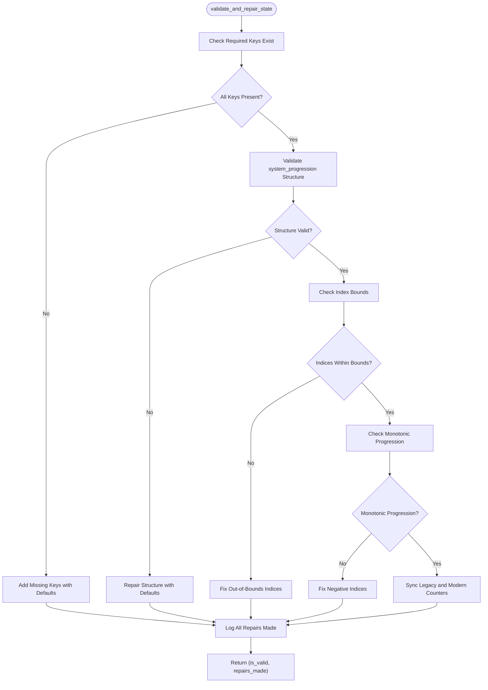
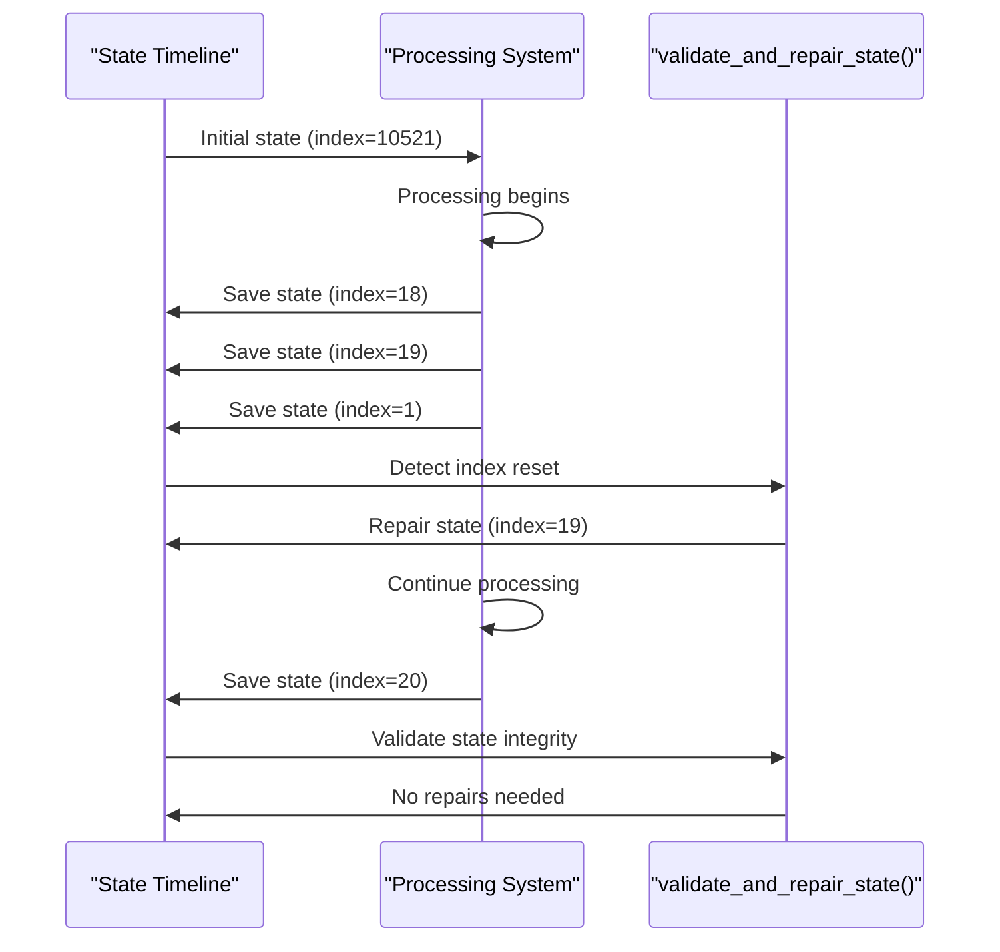
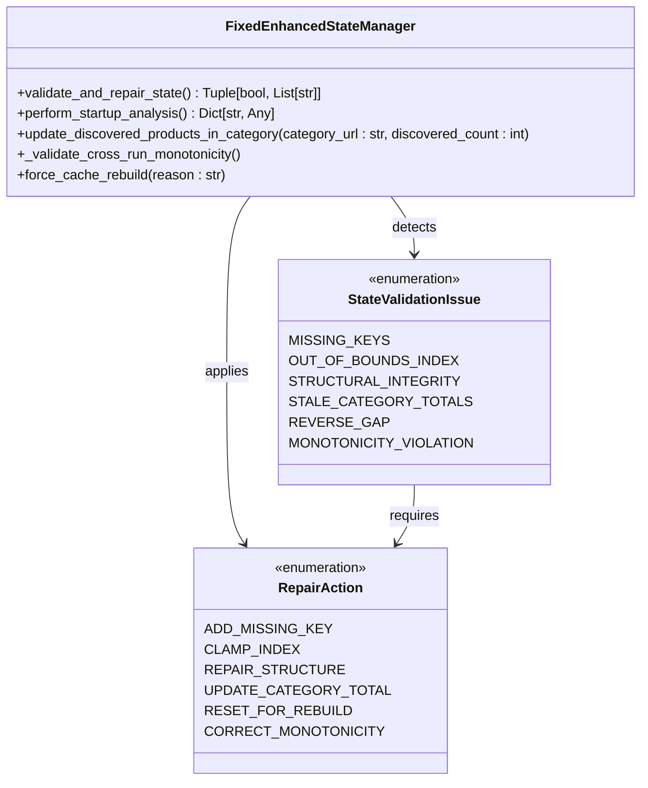

# State Validation


## Table of Contents
1. [Introduction](#introduction)
2. [State Validation and Repair](#state-validation-and-repair)
3. [State Timeline Analysis](#state-timeline-analysis)
4. [Common State Issues and Resolutions](#common-state-issues-and-resolutions)
5. [Validation Logging and Monitoring](#validation-logging-and-monitoring)
6. [Manual and Automated Validation Procedures](#manual-and-automated-validation-procedures)

## Introduction
This document provides comprehensive guidance on ensuring processing state integrity through validation and repair mechanisms in the Amazon FBA Agent System. It details the use of the `validate_and_repair_state()` method to detect and fix common state inconsistencies, analyzes state timeline patterns to identify problematic state progression, and explains implementation details from the `fixed_enhanced_state_manager.py` module. The document also addresses common issues like stale category totals and provides guidance on interpreting validation logs and implementing monitoring for state health.

## State Validation and Repair

The `validate_and_repair_state()` method in the `FixedEnhancedStateManager` class is the primary mechanism for ensuring state integrity. This method performs comprehensive validation of the processing state and automatically repairs detected issues.

The validation process checks for several critical conditions:
- Presence of required keys in the state data
- Structural integrity of the `system_progression` section
- Bounds validation for category and product indices
- Monotonic progression of resumption indices
- Consistency between legacy and modern state tracking fields

When inconsistencies are detected, the method automatically applies repairs such as:
- Adding missing required keys with appropriate default values
- Correcting out-of-bounds indices
- Fixing negative resumption indices
- Synchronizing legacy counters with modern progression tracking

The method returns a tuple containing a boolean indicating whether the state is valid and a list of repairs that were made. This allows calling code to determine if any corrective actions were necessary and what specific issues were addressed.





**Diagram sources**
- [fixed_enhanced_state_manager.py](file://utils/fixed_enhanced_state_manager.py#L1835-L1921)

**Section sources**
- [fixed_enhanced_state_manager.py](file://utils/fixed_enhanced_state_manager.py#L1835-L1921)

## State Timeline Analysis

The state timeline analysis reveals patterns of normal and problematic state progression. The `state_timeline_analysis.txt` file contains a series of state snapshots that demonstrate both proper progression and various state corruption issues.

Normal state progression shows a consistent increase in the `last_processed_index` field, with each subsequent state having a higher index value than the previous one. This indicates that the processing is advancing through the product catalog as expected.

However, the analysis reveals several problematic patterns:

1. **Index Resets**: Multiple instances show the `last_processed_index` resetting to 0 or low values despite a high `resumption_index`. For example:
   
```
   === 1757010653 ===
   resumption_index: 10521
   last_processed_index: 0
   successful_products: 10521
   ```


2. **Inconsistent Progress**: The timeline shows erratic progression where the index advances by small increments, then resets, then advances again. This pattern suggests intermittent state corruption or improper state saving.

3. **Reverse Gap Detection**: The system detects situations where the linking map count exceeds the total products in cache, indicating a potential reverse gap scenario that requires special handling.

4. **Resumption Index Changes**: The `resumption_index` itself changes at certain points (e.g., from 10521 to 10524 to 10530), suggesting that the total product count is being updated during processing, which can lead to confusion about the actual processing position.

These patterns indicate that the system has historically struggled with maintaining consistent state across processing sessions, particularly when interruptions occur or when the product catalog changes between runs.





**Diagram sources**
- [state_timeline_analysis.txt](file://diagnostics/state_timeline_analysis.txt)
- [fixed_enhanced_state_manager.py](file://utils/fixed_enhanced_state_manager.py#L1835-L1921)

**Section sources**
- [state_timeline_analysis.txt](file://diagnostics/state_timeline_analysis.txt#L1-L330)

## Common State Issues and Resolutions

Several common state issues have been identified and addressed in the system:

### Missing Required Keys
The state data may be missing required fields due to incomplete initialization or corruption. The `validate_and_repair_state()` method checks for essential keys like `resumption_index`, `progress_index`, `total_products`, and `processing_status`, adding them with appropriate default values if missing.

### Out-of-Bounds Resumption Indexes
The resumption index may become out of bounds if it exceeds the total number of products or becomes negative. The validation method ensures the index stays within valid bounds by clamping it to the appropriate range.

### Structural Issues
The `system_progression` structure may be missing or incomplete. The validation process ensures all required fields exist within this structure, including `current_phase`, `current_category_index`, `current_category_url`, and various resumption indices.

### Stale Category Totals
Category totals may become stale when new products are discovered during processing. The `update_discovered_products_in_category()` method addresses this by updating category totals with real-time scraping discoveries, ensuring that the system has accurate information about the number of products in each category.

### Reverse Gap Scenarios
When the linking map count exceeds the total products in cache, a reverse gap is detected. The system handles this through the `perform_startup_analysis()` method, which determines the appropriate resumption strategy based on whether a cache rebuild is explicitly requested or if the system is truly starting fresh.

### Cross-Run Monotonicity Violations
The system includes safeguards to prevent resumption pointers from decreasing between runs, which could cause the system to reprocess products unnecessarily. The `_validate_cross_run_monotonicity()` method compares the current state against a high-water mark from previous runs and corrects any regressions.





**Diagram sources**
- [fixed_enhanced_state_manager.py](file://utils/fixed_enhanced_state_manager.py#L1835-L1921)

**Section sources**
- [fixed_enhanced_state_manager.py](file://utils/fixed_enhanced_state_manager.py#L1835-L1921)

## Validation Logging and Monitoring

The system provides comprehensive logging for state validation and repair operations. When repairs are made, the system logs detailed information about the specific issues detected and the corrective actions taken.

Key log messages include:
- "State repaired: [list of repairs]" - Summarizes all repairs made during validation
- "Added missing key: [key_name]" - Indicates when a required key was added
- "Fixed [issue description]" - Describes specific fixes applied to the state
- "RESUME DECISION: START_AT_INDEX=[index] (reason: [reason])" - Documents the resumption strategy chosen

For monitoring state health, the system can be configured to emit metrics for validation events. These metrics can be used to track the frequency of state issues and the effectiveness of repair mechanisms over time.

The validation logs should be regularly reviewed to identify patterns of state corruption and to verify that the repair mechanisms are functioning correctly. Persistent issues may indicate deeper problems with the state management system that require further investigation.

**Section sources**
- [fixed_enhanced_state_manager.py](file://utils/fixed_enhanced_state_manager.py#L1835-L1921)

## Manual and Automated Validation Procedures

### Automated Validation
The system performs automated validation through several mechanisms:

1. **Startup Analysis**: The `perform_startup_analysis()` method is called at the beginning of each processing session to validate and repair the state before processing begins.

2. **Continuous Validation**: The `validate_and_repair_state()` method is called periodically during processing to ensure state integrity is maintained.

3. **Atomic State Updates**: The system uses atomic file operations to prevent partial or corrupted state saves.

4. **Cross-Run Validation**: The `_validate_cross_run_monotonicity()` method ensures that resumption pointers never decrease between processing runs.

### Manual Validation
Manual validation procedures include:

1. **State File Inspection**: Direct examination of the processing state JSON file to verify its structure and content.

2. **Timeline Analysis**: Reviewing the state timeline to identify patterns of index resets or inconsistent progression.

3. **Validation Method Invocation**: Calling the `validate_and_repair_state()` method directly and examining its return values to assess state health.

4. **Log Analysis**: Reviewing system logs for validation and repair messages to understand the state of the system over time.

5. **Consistency Checks**: Comparing the resumption index with the actual number of processed products in the linking map to verify consistency.

Regular manual validation should be performed during system maintenance windows or when issues are suspected. Automated validation should be enabled at all times to ensure continuous state integrity.

**Section sources**
- [fixed_enhanced_state_manager.py](file://utils/fixed_enhanced_state_manager.py#L1835-L1921)
- [state_timeline_analysis.txt](file://diagnostics/state_timeline_analysis.txt#L1-L330)

**Referenced Files in This Document**   
- [state_timeline_analysis.txt](file://diagnostics/state_timeline_analysis.txt)
- [fixed_enhanced_state_manager.py](file://utils/fixed_enhanced_state_manager.py)