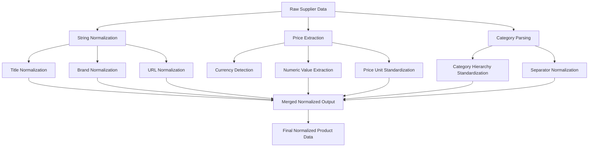
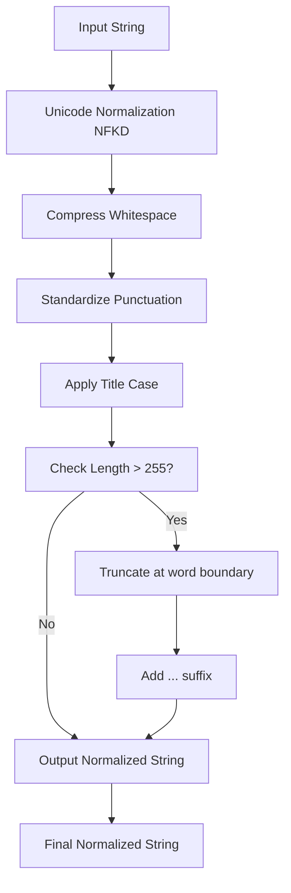
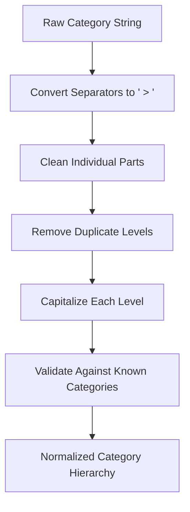

# Data Normalization Optimization


## Table of Contents
1. [Introduction](#introduction)
2. [Normalization Pipeline Overview](#normalization-pipeline-overview)
3. [Core Normalization Strategies](#core-normalization-strategies)
4. [String Normalization Techniques](#string-normalization-techniques)
5. [Currency Conversion and Price Standardization](#currency-conversion-and-price-standardization)
6. [Category Mapping and Hierarchy Standardization](#category-mapping-and-hierarchy-standardization)
7. [Pre-normalization and Caching Strategies](#pre-normalization-and-caching-strategies)
8. [Performance Trade-offs in High-Volume Processing](#performance-trade-offs-in-high-volume-processing)
9. [Conclusion](#conclusion)

## Introduction
The data normalization pipeline plays a critical role in standardizing supplier product data for accurate Amazon matching. This document details optimization strategies for reducing computational overhead during product data processing while maintaining data integrity. The system processes supplier data from poundwholesale.co.uk, normalizing pricing, titles, categories, and other attributes into a consistent format suitable for FBA analysis and marketplace integration.

## Normalization Pipeline Overview
The normalization pipeline transforms raw supplier data into standardized formats compatible with Amazon's product catalog requirements. The process involves multiple stages of data cleaning, standardization, and enrichment to ensure consistency across diverse data sources.





**Diagram sources**
- [tools/legacy_utils/data_normalizer.py](file://tools/legacy_utils/data_normalizer.py#L150-L200)
- [utils/normalization.py](file://utils/normalization.py#L10-L30)

**Section sources**
- [tools/legacy_utils/data_normalizer.py](file://tools/legacy_utils/data_normalizer.py#L85-L115)

## Core Normalization Strategies
The system employs a comprehensive normalization strategy that addresses multiple data types including text, pricing, identifiers, and categorical information. The `DataNormalizer` class provides a unified interface for processing product data from various suppliers.

The normalization process follows a systematic approach:
1. Text field standardization (titles, descriptions, brands)
2. Price and currency conversion
3. Identifier extraction and validation
4. Category hierarchy normalization
5. Dimensional and weight unit standardization

This multi-stage approach ensures that product data is consistently formatted regardless of the supplier's original data structure.

**Section sources**
- [tools/legacy_utils/data_normalizer.py](file://tools/legacy_utils/data_normalizer.py#L150-L200)

## String Normalization Techniques
String normalization is critical for accurate product matching and search optimization. The system implements several techniques to standardize text fields while preserving meaningful information.

### Title Normalization
Product titles are processed to remove redundant characters, standardize spacing, and apply consistent casing. The normalization process includes:
- Unicode normalization using NFKD form
- Whitespace compression (multiple spaces to single space)
- Punctuation standardization
- Title casing application
- Length truncation to 255 characters with ellipsis

### Brand Normalization
Brand names are standardized using a predefined mapping of common variations to official brand names. The system handles case variations and common abbreviations to ensure consistent brand representation.

### URL Normalization
URLs are normalized by:
- Standardizing protocol (https://)
- Converting hostnames to lowercase
- Removing tracking parameters (utm_, gclid, fbclid, etc.)
- Stripping fragments and trailing separators
- Sorting query parameters alphabetically





**Diagram sources**
- [tools/legacy_utils/data_normalizer.py](file://tools/legacy_utils/data_normalizer.py#L205-L225)
- [utils/normalization.py](file://utils/normalization.py#L10-L20)

**Section sources**
- [tools/legacy_utils/data_normalizer.py](file://tools/legacy_utils/data_normalizer.py#L205-L250)

## Currency Conversion and Price Standardization
Price normalization is essential for accurate financial analysis and cross-supplier comparison. The system extracts price information from various formats and standardizes it into a consistent structure.

### Price Extraction Process
The price normalization process handles multiple input formats including:
- Currency symbols (£, $, €)
- Currency codes (GBP, USD, EUR)
- Textual price descriptions
- HTML-encoded price elements

The system first identifies the currency through symbol or code detection, then extracts the numeric value using pattern matching that accommodates various decimal and thousand separator conventions.

### Standardized Price Format
Normalized prices are returned as structured dictionaries containing:
- **value**: Numeric price value (float)
- **currency**: Standardized currency code (e.g., GBP, USD)
- **original_input**: Reference to the original price string

This structured format enables consistent processing and comparison across different currency types.


```mermaid
flowchart TD
RawPrice[Raw Price String] --> CurrencyDetection[Currency Symbol/Code Detection]
CurrencyDetection --> ValueExtraction[Numeric Value Extraction]
ValueExtraction --> SeparatorHandling[Handle Decimal/Thousand Separators]
SeparatorHandling --> Validation[Value Validation]
Validation --> StructureOutput[Structure as Dictionary]
StructureOutput --> NormalizedPrice[{'value': float, 'currency': str}]
subgraph Currency Detection
SymbolCheck[Check for £, $, €, etc.]
CodeCheck[Check for GBP, USD, EUR, etc.]
end
subgraph Value Extraction
PatternMatch[Regex Pattern Matching]
NumericClean[Remove Non-Numeric Characters]
end
```


**Diagram sources**
- [tools/legacy_utils/data_normalizer.py](file://tools/legacy_utils/data_normalizer.py#L300-L380)

**Section sources**
- [tools/legacy_utils/data_normalizer.py](file://tools/legacy_utils/data_normalizer.py#L300-L400)

## Category Mapping and Hierarchy Standardization
Category normalization ensures consistent product classification across suppliers, enabling accurate matching with Amazon's category structure.

### Category Hierarchy Processing
The system standardizes category hierarchies by:
- Converting various separator formats (/, //, >, |, -) to a standard " > " separator
- Removing duplicate category levels
- Applying consistent capitalization
- Preserving the hierarchical structure

Category data is sourced from the supplier's website structure and product metadata, with the system using the category URLs defined in the configuration to map products to appropriate categories.

### Category Configuration
The poundwholesale.co.uk supplier has 150+ category URLs defined in its configuration file, covering diverse product types from toys and stationery to DIY tools and seasonal items. These categories form the foundation for product classification and subsequent Amazon matching.





**Diagram sources**
- [tools/legacy_utils/data_normalizer.py](file://tools/legacy_utils/data_normalizer.py#L700-L730)
- [config/poundwholesale_categories.json](file://config/poundwholesale_categories.json#L2-L235)

**Section sources**
- [tools/legacy_utils/data_normalizer.py](file://tools/legacy_utils/data_normalizer.py#L700-L730)
- [config/poundwholesale_categories.json](file://config/poundwholesale_categories.json#L2-L235)

## Pre-normalization and Caching Strategies
To minimize redundant calculations and improve processing speed, the system implements pre-normalization and caching strategies for frequently used data transformations.

### Pre-normalized Data Elements
The following data elements are candidates for pre-normalization:
- Common brand name variations
- Frequently occurring category hierarchies
- Standardized URL patterns
- Currency conversion factors

By pre-processing these elements, the system reduces the computational load during real-time product processing.

### Caching Mechanism
The system leverages a state management system that preserves normalization results between processing sessions. This prevents redundant processing of previously normalized data, significantly reducing overall computational overhead.

The processing state is maintained in JSON files within the processing_states directory, allowing the system to resume operations without reprocessing already normalized products.

**Section sources**
- [processing_states/poundwholesale_co_uk_processing_state.json](file://processing_states/poundwholesale_co_uk_processing_state.json)
- [tools/legacy_utils/data_normalizer.py](file://tools/legacy_utils/data_normalizer.py#L150-L200)

## Performance Trade-offs in High-Volume Processing
The normalization system balances comprehensive data processing with performance requirements, particularly in high-volume extraction scenarios.

### Optimization Techniques
To minimize processing time while maintaining data accuracy, the system employs several optimization techniques:
- Early termination of normalization for already processed fields
- Efficient regex patterns for text processing
- Pre-compiled regular expressions for repeated operations
- Batch processing of similar normalization tasks

### Processing Speed vs. Completeness
In high-volume scenarios, the system prioritizes essential normalization tasks (price, title, EAN) over less critical ones. This selective approach ensures that core product data is processed quickly while allowing for deeper normalization to occur in subsequent passes if needed.

The trade-off between comprehensive normalization and processing speed is managed through configurable settings that allow operators to adjust the depth of normalization based on current processing requirements and system load.

**Section sources**
- [tools/legacy_utils/data_normalizer.py](file://tools/legacy_utils/data_normalizer.py#L150-L800)
- [config/supplier_configs/www.poundwholesale.co.uk.json](file://config/supplier_configs/www.poundwholesale.co.uk.json#L1-L65)

## Conclusion
The data normalization pipeline effectively standardizes supplier product data for Amazon matching while implementing optimization strategies to reduce computational overhead. By employing efficient string normalization, currency conversion, and category mapping techniques, the system ensures data consistency across diverse suppliers. Pre-normalization of frequently used data elements and strategic caching further enhance processing efficiency, making the system capable of handling high-volume extraction scenarios. The balance between comprehensive normalization and processing speed is carefully managed to meet both accuracy and performance requirements in the Amazon FBA agent system.

**Referenced Files in This Document**   
- [utils/normalization.py](file://utils/normalization.py)
- [tools/legacy_utils/data_normalizer.py](file://tools/legacy_utils/data_normalizer.py)
- [config/poundwholesale_categories.json](file://config/poundwholesale_categories.json)
- [config/supplier_configs/www.poundwholesale.co.uk.json](file://config/supplier_configs/www.poundwholesale.co.uk.json)