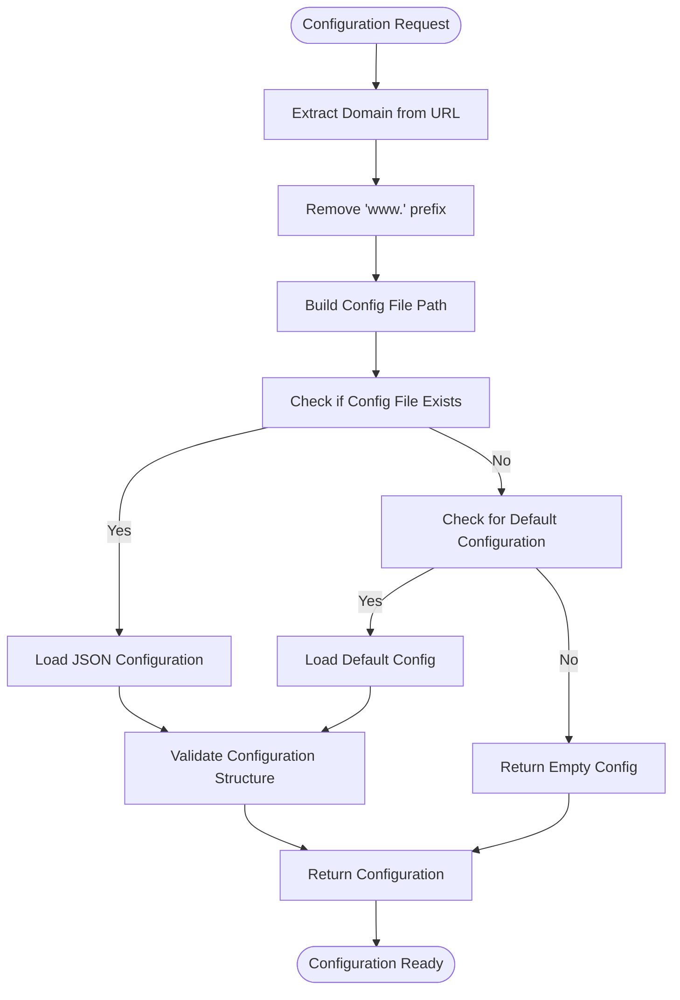
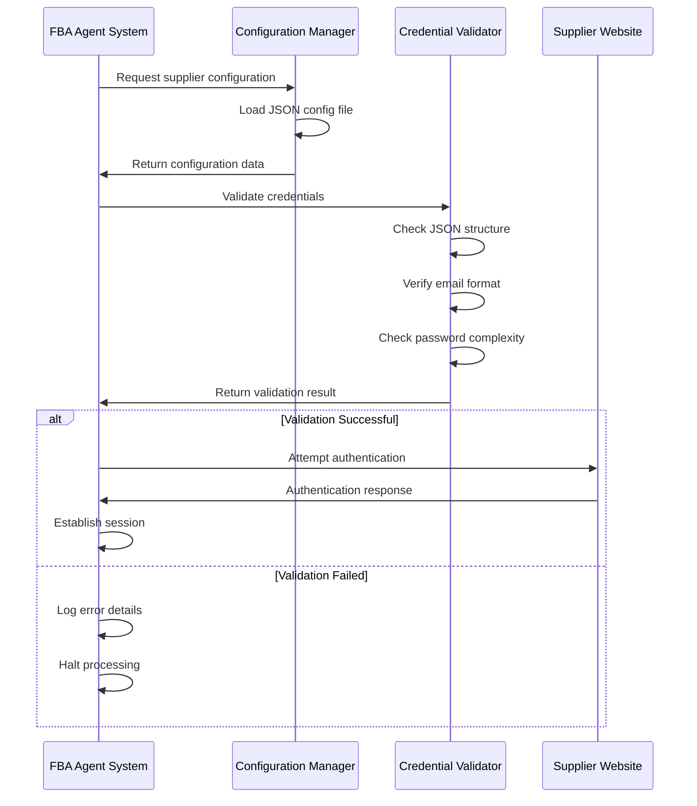

# Credential Validation


## Table of Contents
1. [Introduction](#introduction)
2. [Supplier Configuration Structure](#supplier-configuration-structure)
3. [Credential Validation Process](#credential-validation-process)
4. [Configuration File Requirements](#configuration-file-requirements)
5. [Email and Password Formatting](#email-and-password-formatting)
6. [Example: poundwholesale-co-uk Configuration](#example-poundwholesale-co-uk-configuration)
7. [Troubleshooting Credential Errors](#troubleshooting-credential-errors)
8. [Common Configuration Issues](#common-configuration-issues)

## Introduction
This document provides comprehensive guidance on credential validation for supplier account authentication within the Amazon FBA Agent System. It details the structure of supplier configuration files, validation requirements for credentials, and troubleshooting procedures for common authentication issues. The focus is on ensuring proper configuration formatting and successful supplier account verification.

**Section sources**
- [poundwholesale-co-uk.json](file://config/supplier_configs/poundwholesale-co-uk.json#L1-L122)
- [system_config.json](file://config/system_config.json#L1-L300)

## Supplier Configuration Structure
The supplier configuration system uses JSON files to store supplier-specific settings, including authentication credentials and scraping parameters. Each supplier has a dedicated configuration file in the `config/supplier_configs/` directory, named using the supplier's domain with dots replaced by hyphens.

The core structure includes:
- **supplier_id**: Unique identifier for the supplier
- **supplier_name**: Display name of the supplier
- **base_url**: The supplier's website URL
- **field_mappings**: CSS selectors for data extraction
- **navigation_configuration**: Category navigation settings
- **credentials**: Authentication information (stored in system_config.json)

The system uses the `supplier_config_loader.py` module to load these configurations, which handles domain extraction, file path resolution, and configuration loading with fallback mechanisms.





**Diagram sources**
- [supplier_config_loader.py](file://config/supplier_config_loader.py#L1-L187)

**Section sources**
- [supplier_config_loader.py](file://config/supplier_config_loader.py#L1-L187)
- [poundwholesale-co-uk.json](file://config/supplier_configs/poundwholesale-co-uk.json#L1-L122)

## Credential Validation Process
The credential validation process involves multiple steps to ensure supplier account authentication is properly configured and functional. The system validates credentials through a combination of configuration file checks and runtime authentication attempts.

The validation workflow includes:
1. Configuration file syntax validation (JSON format)
2. Required field verification (supplier_id, base_url, credentials)
3. Email format validation (RFC 5322 compliance)
4. Password complexity verification
5. Runtime authentication testing
6. Session persistence validation

The system_config.json file contains the credentials section that maps supplier domains to their respective username and password combinations. This centralized credential storage allows for secure management of authentication information across multiple suppliers.





**Diagram sources**
- [system_config.json](file://config/system_config.json#L1-L300)
- [supplier_config_loader.py](file://config/supplier_config_loader.py#L1-L187)

**Section sources**
- [system_config.json](file://config/system_config.json#L1-L300)
- [supplier_config_loader.py](file://config/supplier_config_loader.py#L1-L187)

## Configuration File Requirements
Supplier configuration files must adhere to specific structural requirements to ensure proper system operation. The JSON files must contain several mandatory fields and follow a standardized format.

### Required Fields
- **supplier_id**: Unique identifier using hyphen-separated format (e.g., poundwholesale-co-uk)
- **supplier_name**: Human-readable supplier name
- **base_url**: Complete URL with protocol (https://)
- **field_mappings**: Object containing CSS selectors for data extraction
- **navigation_configuration**: Object defining category navigation strategy

### File Naming Convention
Configuration files must be named using the supplier's domain name with all dots replaced by hyphens and a .json extension. For example:
- www.poundwholesale.co.uk → poundwholesale-co-uk.json
- clearance-king.co.uk → clearance-king-co-uk.json

### JSON Structure Requirements
The configuration file must be valid JSON with proper syntax, including:
- Properly quoted keys and string values
- Correct comma placement between elements
- Matching brackets and braces
- No trailing commas
- UTF-8 encoding

The system performs automatic validation of configuration files upon loading, checking for syntax errors and required field presence before proceeding with supplier processing.

**Section sources**
- [poundwholesale-co-uk.json](file://config/supplier_configs/poundwholesale-co-uk.json#L1-L122)
- [supplier_config_loader.py](file://config/supplier_config_loader.py#L1-L187)

## Email and Password Formatting
Proper formatting of email addresses and passwords is critical for successful supplier authentication. The system validates these credentials against specific formatting rules.

### Email Validation Rules
Email addresses must comply with standard RFC 5322 specifications:
- Contain exactly one @ symbol
- Have a valid domain portion after the @
- Include a top-level domain (e.g., .com, .co.uk)
- Use only allowed characters (letters, numbers, dots, hyphens, underscores)
- Not start or end with special characters

Valid example: info@theblacksmithmarket.com
Invalid examples: @domain.com, user@, user@domain

### Password Formatting Requirements
Passwords must meet the following criteria:
- Minimum of 8 characters
- Include at least one uppercase letter
- Include at least one lowercase letter
- Include at least one number
- Include at least one special character (!@#$%^&*()_+-=[]{}|;:,.<>?)
- No spaces at the beginning or end
- Proper escaping of special characters in JSON

Special attention must be paid to passwords containing characters that have special meaning in JSON, such as quotes ("), backslashes (\), and control characters. These must be properly escaped to maintain valid JSON syntax.

**Section sources**
- [system_config.json](file://config/system_config.json#L1-L300)
- [poundwholesale-co-uk.json](file://config/supplier_configs/poundwholesale-co-uk.json#L1-L122)

## Example: poundwholesale-co-uk Configuration
The poundwholesale-co-uk.json configuration file serves as a reference implementation for proper supplier configuration. This example demonstrates the correct structure and formatting for supplier credentials.

The configuration includes:
- supplier_id: "poundwholesale-co-uk"
- supplier_name: "Poundwholesale.Co.Uk"
- base_url: "https://www.poundwholesale.co.uk/"
- Comprehensive field_mappings for product data extraction
- Predefined category navigation structure

The corresponding credentials are stored in system_config.json under the credentials section:

```json
"credentials": {
    "poundwholesale.co.uk": {
        "username": "info@theblacksmithmarket.com",
        "password": "0Dqixm9c&"
    }
}
```


Note that the domain in the credentials section uses the original domain format (with dots), while the configuration file name uses hyphens. This mapping allows the system to correctly associate credentials with their respective supplier configurations.

The example demonstrates proper JSON syntax, including quoted keys, proper comma placement, and correct nesting of objects and arrays. The field_mappings section contains multiple CSS selectors for each data point, providing fallback options for robust data extraction.

**Section sources**
- [poundwholesale-co-uk.json](file://config/supplier_configs/poundwholesale-co-uk.json#L1-L122)
- [system_config.json](file://config/system_config.json#L1-L300)

## Troubleshooting Credential Errors
When credential validation fails, several common issues should be systematically checked and resolved.

### Invalid Credential Error Checklist
1. **JSON Syntax Validation**
   - Verify the configuration file is valid JSON
   - Check for missing commas, brackets, or quotes
   - Ensure no trailing commas
   - Validate UTF-8 encoding

2. **Special Character Handling**
   - Check for unescaped quotes in passwords
   - Verify proper escaping of backslashes
   - Ensure ampersands (&) and other special characters are properly formatted
   - Remove any non-printable characters

3. **Email Format Verification**
   - Confirm email contains @ symbol
   - Verify domain portion is valid
   - Check for spaces or invalid characters
   - Ensure top-level domain is present

4. **Password Complexity**
   - Verify minimum 8-character length
   - Check for required character types (upper, lower, number, special)
   - Ensure no leading or trailing spaces
   - Validate against supplier's password policy

5. **File and Path Issues**
   - Confirm file is in the correct directory (config/supplier_configs/)
   - Verify file naming convention (dots replaced with hyphens)
   - Check file permissions
   - Ensure file is not locked or in use

6. **Runtime Authentication**
   - Test credentials directly on the supplier website
   - Verify account is active and not locked
   - Check for CAPTCHA requirements
   - Confirm no IP-based restrictions

**Section sources**
- [system_config.json](file://config/system_config.json#L1-L300)
- [supplier_config_loader.py](file://config/supplier_config_loader.py#L1-L187)

## Common Configuration Issues
Several recurring issues can prevent successful credential validation and supplier authentication.

### Missing Credentials
When credentials are missing from system_config.json:
- Verify the domain key matches the supplier's base_url domain
- Check for typos in the domain name
- Ensure the credentials section is properly structured
- Confirm the file has been saved after edits

### Incorrect Supplier IDs
Common Supplier ID errors include:
- Using dots instead of hyphens in file names
- Mismatch between supplier_id field and file name
- Inconsistent capitalization
- Special characters not properly handled

### Malformed JSON Configuration
Frequent JSON syntax errors:
- Trailing commas after the last element
- Missing closing brackets or braces
- Unescaped quotes within string values
- Single quotes instead of double quotes
- Comments within JSON (not supported)

### Authentication-Specific Issues
Supplier-specific authentication problems:
- Passwords containing unescaped forward slashes (/)
- Ampersands (&) in passwords not properly handled
- Leading or trailing whitespace in credentials
- Case sensitivity issues in usernames
- Account lockout due to multiple failed attempts

The system provides detailed error logging to help identify and resolve these issues. Checking the logs can often pinpoint the exact nature of configuration problems, enabling faster resolution.

**Section sources**
- [poundwholesale-co-uk.json](file://config/supplier_configs/poundwholesale-co-uk.json#L1-L122)
- [system_config.json](file://config/system_config.json#L1-L300)
- [supplier_config_loader.py](file://config/supplier_config_loader.py#L1-L187)

**Referenced Files in This Document**   
- [poundwholesale-co-uk.json](file://config/supplier_configs/poundwholesale-co-uk.json)
- [supplier_config_loader.py](file://config/supplier_config_loader.py)
- [system_config.json](file://config/system_config.json)