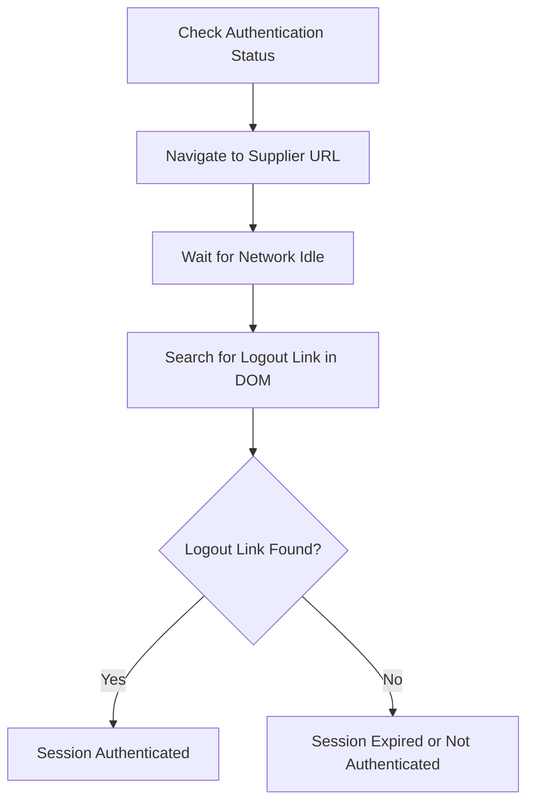
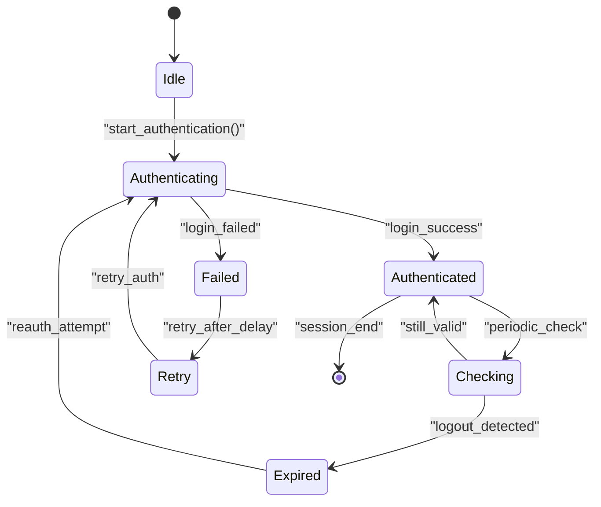
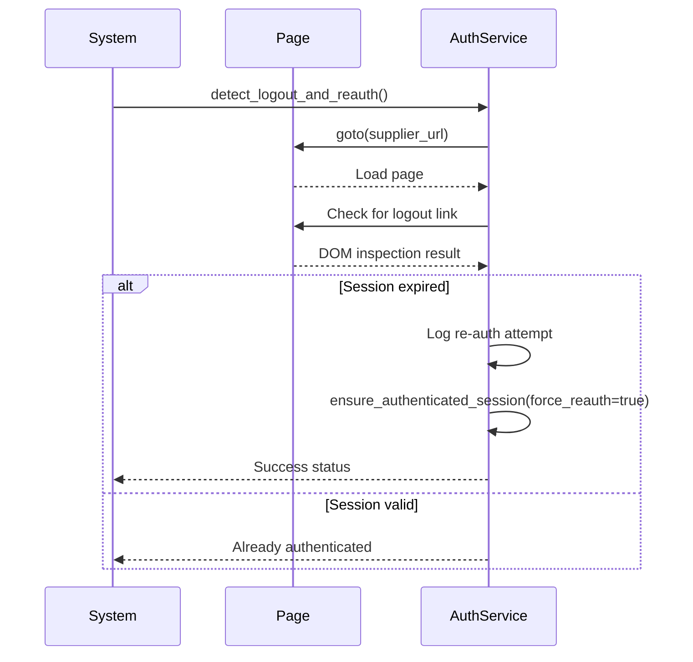
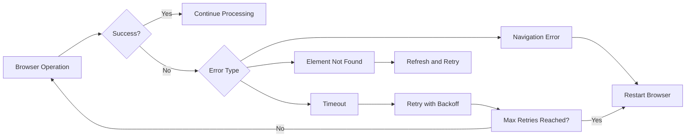

# Session Management

## Table of Contents
1. [Introduction](#introduction)
2. [Session Authentication Detection](#session-authentication-detection)
3. [Session Lifecycle Management](#session-lifecycle-management)
4. [Re-authentication Process](#re-authentication-process)
5. [Troubleshooting Session Issues](#troubleshooting-session-issues)
6. [Browser and Network Handling](#browser-and-network-handling)
7. [Authentication Logs Analysis](#authentication-logs-analysis)

## Introduction
This document provides a comprehensive overview of session management within the Amazon FBA Agent System, focusing on maintaining authenticated sessions during data extraction operations. The system ensures continuous access to supplier websites by detecting session status, handling expiration, and automatically re-authenticating when necessary. DOM-based indicators such as logout links are used to verify authentication state, and robust mechanisms are in place for session recovery and troubleshooting.

## Session Authentication Detection

The system uses DOM-based indicators to determine the current authentication status of a session. The primary method involves checking for the presence of logout links or other authenticated-state elements on supplier web pages. This approach provides a reliable signal of active sessions without relying solely on cookies or tokens.

The `_is_session_authenticated` method in the `SupplierAuthenticationService` class navigates to the supplier URL and waits for network idle state before inspecting the page content. It specifically looks for logout functionality in the DOM, which serves as a definitive indicator of an active session.

**Diagram sources**
- [supplier_authentication_service.py](file://tools/supplier_authentication_service.py#L104-L136)

**Section sources**
- [supplier_authentication_service.py](file://tools/supplier_authentication_service.py#L104-L136)

## Session Lifecycle Management

The session lifecycle is managed through a stateful authentication service that tracks the current status of each supplier session. The authentication state is stored internally and updated based on verification results and re-authentication attempts.

Key aspects of session lifecycle management include:
- Initial authentication upon system startup
- Periodic verification during data extraction
- Detection of session expiration via DOM inspection
- Automatic re-authentication when needed
- Marking sessions as ready for processing

The system also creates supplier-ready files that contain metadata about the authentication state, including timestamps and verification details, ensuring that downstream processes can trust the session's validity.

**Diagram sources**
- [supplier_authentication_service.py](file://tools/supplier_authentication_service.py#L334-L365)
- [system_config.json](file://config/system_config.json#L300-L350)

**Section sources**
- [supplier_authentication_service.py](file://tools/supplier_authentication_service.py#L334-L385)

## Re-authentication Process

When a session expiration is detected, the system automatically initiates a re-authentication process. This process is triggered by the `detect_logout_and_reauth` method, which first confirms the loss of authentication and then attempts to log back in using stored credentials.

The re-authentication flow includes:
1. Detection of logout via DOM inspection
2. Logging of re-authentication attempt
3. Execution of login sequence with stored credentials
4. Verification of successful login
5. Update of internal authentication state

The system supports multiple authentication methods and records which method was used for troubleshooting and auditing purposes. If re-authentication fails, the system logs the error and returns a failure status, allowing higher-level processes to handle the situation appropriately.

**Diagram sources**
- [supplier_authentication_service.py](file://tools/supplier_authentication_service.py#L364-L385)

**Section sources**
- [supplier_authentication_service.py](file://tools/supplier_authentication_service.py#L364-L385)

## Troubleshooting Session Issues

Common session-related issues and their solutions include:

### Session Timeout Issues
When sessions time out due to inactivity or server-side expiration:
- **Symptom**: Repeated authentication failures or inability to access protected pages
- **Solution**: The system automatically detects and re-authenticates; no manual intervention needed under normal conditions

### Browser Restart Procedures
For persistent session issues:
- Use the browser manager's `restart_browser` functionality to clear all session state
- This is particularly useful when Chrome CDP connectivity issues occur
- After restart, the system will perform fresh authentication

### Network Idle State Handling
To prevent premature detection of network idle:
- The system uses configurable timeout values (e.g., 10 seconds for DOM wait)
- Network activity is monitored until genuine idle state is confirmed
- Configurable in `system_config.json` under performance.timeouts

## Browser and Network Handling

The Selenium-based browser manager handles various browser-related challenges that can affect session persistence:

### Connection Timeouts
Handled through:
- Configurable timeout settings in `system_config.json`
- Retry mechanisms with exponential backoff
- Circuit breaker pattern to prevent repeated failed attempts

### Stale Browser Sessions
Addressed by:
- Regular health checks on browser instances
- Automatic browser restart via `restart_browser` when instability is detected
- Memory pressure monitoring and cleanup

The `SeleniumBrowserManager` class provides robust error handling for navigation, element interaction, and page loading, ensuring that transient network issues do not prematurely terminate sessions.

**Diagram sources**
- [selenium_browser_manager.py](file://tools/selenium_browser_manager.py#L0-L175)

**Section sources**
- [selenium_browser_manager.py](file://tools/selenium_browser_manager.py#L0-L175)

## Authentication Logs Analysis

Authentication service logs provide critical insights into session-related failure patterns. Key log entries to monitor include:

- "Session logout detected - attempting re-authentication"
- "Re-authentication successful using [method]"
- "Re-authentication failed"
- "No browser manager available for authentication check"
- "Error checking authentication"

Analyzing these logs helps identify:
- Frequency of session expirations
- Success rate of re-authentication attempts
- Patterns of authentication failures (e.g., credential issues, network problems)
- Effectiveness of different authentication methods

The system's logging configuration in `system_config.json` controls the verbosity and retention of these logs, enabling detailed forensic analysis when needed.

**Section sources**
- [system_config.json](file://config/system_config.json#L250-L300)
- [supplier_authentication_service.py](file://tools/supplier_authentication_service.py#L104-L136)

**Referenced Files in This Document**   
- [supplier_authentication_service.py](file://tools/supplier_authentication_service.py)
- [selenium_browser_manager.py](file://tools/selenium_browser_manager.py)
- [system_config.json](file://config/system_config.json)