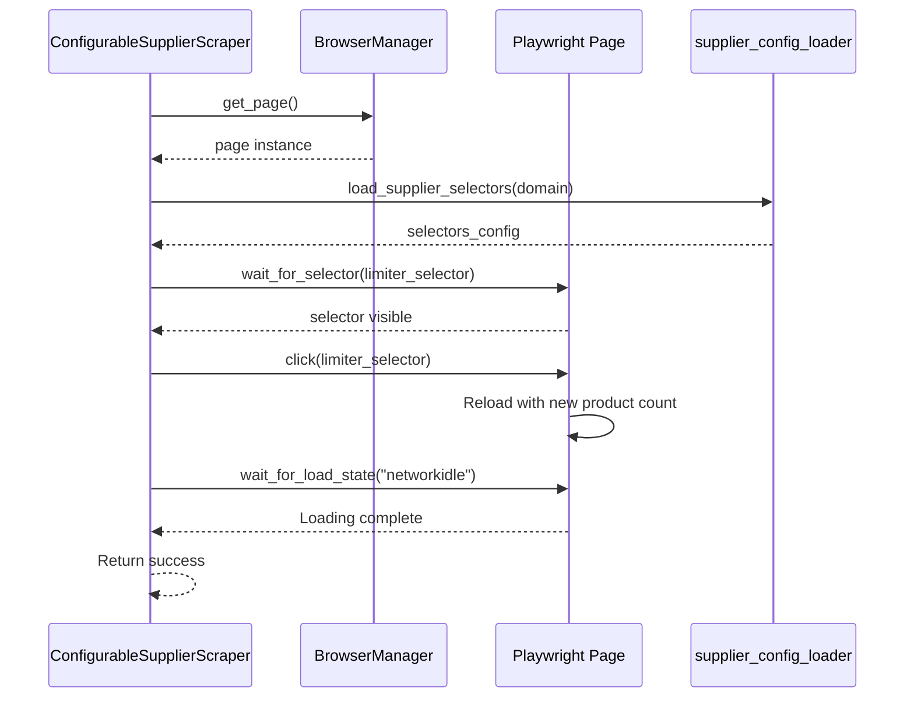

# Page Limiter Configuration

## Table of Contents
1. [Introduction](#introduction)
2. [Selector Field Configuration](#selector-field-configuration)
3. [Value Field Specification](#value-field-specification)
4. [Implementation of _set_page_limiter Method](#implementation-of-_set_page_limiter-method)
5. [Practical Configuration Example](#practical-configuration-example)
6. [Performance Benefits of Page Limiter Optimization](#performance-benefits-of-page-limiter-optimization)
7. [Guidance for Identifying Limiter Selectors](#guidance-for-identifying-limiter-selectors)
8. [Handling Absent or JavaScript-Heavy Limiters](#handling-absent-or-javascript-heavy-limiters)
9. [Conclusion](#conclusion)

## Introduction
The page limiter configuration is a critical optimization feature in the configurable supplier scraping system. It enables the scraper to maximize product density per page by interacting with UI elements that control pagination settings. This reduces the total number of pages that need to be scraped, significantly improving efficiency and reducing scraping time. The system leverages Playwright through the centralized BrowserManager to programmatically set the desired number of products per page, typically targeting values like 60 to minimize pagination overhead.

**Section sources**
- [configurable_supplier_scraper.py](file://tools/configurable_supplier_scraper.py#L1350-L1394)

## Selector Field Configuration
The selector field specifies the CSS selector that targets the UI element responsible for setting the number of products displayed per page. This is typically a dropdown menu or clickable button on supplier websites that allows users to choose display density (e.g., 12, 24, 60 products per page). The selector must precisely identify this element to enable automated interaction.

In the configuration, the selector is defined using standard CSS selector syntax, often leveraging data attributes for reliability. For example, `a[data-role="limiter"][data-value="60"]` targets an anchor element with both `data-role="limiter"` and `data-value="60"` attributes. This approach is robust because data attributes are less likely to change with UI redesigns compared to class names or hierarchical selectors.

The system retrieves this selector from the supplier-specific configuration file via the `supplier_config_loader.py` module, which loads domain-specific JSON configurations. If no limiter selector is configured for a domain, the `_set_page_limiter` method gracefully returns false without attempting interaction.

**Section sources**
- [poundwholesale-co-uk.json](file://config/supplier_configs/poundwholesale-co-uk.json#L114-L116)
- [configurable_supplier_scraper.py](file://tools/configurable_supplier_scraper.py#L1373-L1380)

## Value Field Specification
The value field specifies the desired number of products to display per page, such as 60. This value serves as both a configuration parameter and a fallback when the selector does not explicitly encode the target quantity. In the JSON configuration, it appears as a string value associated with the "value" key within the "page_limiter" object.

When the `_set_page_limiter` method executes, it retrieves this value from the supplier configuration. If not explicitly defined, it defaults to "60". This value is used primarily for logging purposes to confirm the intended product density, as the actual interaction relies on clicking the pre-configured selector rather than inputting a value programmatically.

The choice of 60 products per page represents a balance between maximizing data density and maintaining page load performance. Higher values reduce pagination but may increase page load times or trigger anti-bot mechanisms. The value field allows this optimization parameter to be adjusted per supplier based on their website's capabilities and limitations.

**Section sources**
- [poundwholesale-co-uk.json](file://config/supplier_configs/poundwholesale-co-uk.json#L117-L118)
- [configurable_supplier_scraper.py](file://tools/configurable_supplier_scraper.py#L1378-L1379)

## Implementation of _set_page_limiter Method
The `_set_page_limiter` method in `configurable_supplier_scraper.py` implements the logic for programmatically setting the product density per page. It operates within the Playwright browser automation framework, utilizing the centralized BrowserManager to access the current page context.

The method follows a structured sequence: first, it acquires the current page instance from BrowserManager; then, it loads the supplier-specific configuration using the domain extracted from the URL; next, it retrieves the limiter selector and value from the configuration; finally, it interacts with the page by waiting for the selector to be visible and clicking it.

After clicking the limiter element, the method waits for the page to reload by monitoring the network idle state, ensuring that all dynamic content has loaded before proceeding. This approach handles JavaScript-driven page updates common in modern e-commerce platforms. The entire operation is wrapped in exception handling to prevent failures from blocking the scraping process, with warnings logged for diagnostic purposes.

This implementation demonstrates tight integration between configuration-driven design and robust browser automation, enabling reliable interaction with pagination controls across diverse supplier websites.

**Diagram sources**
- [configurable_supplier_scraper.py](file://tools/configurable_supplier_scraper.py#L1350-L1394)

**Section sources**
- [configurable_supplier_scraper.py](file://tools/configurable_supplier_scraper.py#L1350-L1394)

## Practical Configuration Example
The configuration for Poundwholesale.co.uk demonstrates a practical implementation of the page limiter feature. In the `poundwholesale-co-uk.json` file, the "page_limiter" object contains both the selector and value fields tailored to this specific supplier.

The selector `a[data-role="limiter"][data-value="60"]` precisely targets an anchor element that sets the display to 60 products per page. This selector was identified by inspecting the website's HTML structure and selecting a stable, attribute-based identifier. The value field is explicitly set to "60", matching the selector's data-value attribute and providing clear documentation of the intended configuration.

This configuration is loaded automatically when scraping any category URL from poundwholesale.co.uk. The `_set_page_limiter` method uses this configuration to increase product density before collecting product URLs, reducing the number of paginated pages that need to be processed. For categories with hundreds of products, this optimization can reduce the number of page loads by a factor of 5 or more compared to the default 12 products per page.

**Section sources**
- [poundwholesale-co-uk.json](file://config/supplier_configs/poundwholesale-co-uk.json#L114-L119)

## Performance Benefits of Page Limiter Optimization
The page limiter optimization provides significant performance benefits by reducing the number of HTTP requests and page loads required to scrape a complete product catalog. By maximizing products per page, the scraper minimizes pagination overhead, which includes network latency, page load times, and JavaScript execution.

For a category with 300 products, using 12 products per page would require navigating 25 pages, while 60 products per page reduces this to just 5 pages—a 80% reduction in page loads. This directly translates to faster scraping times, reduced resource consumption, and lower exposure to rate limiting or bot detection mechanisms.

Additionally, fewer page transitions mean fewer opportunities for authentication sessions to expire or for state corruption to occur. The optimization also reduces the load on the browser instance, helping maintain memory stability during extended scraping sessions. These cumulative benefits make the page limiter configuration a crucial component of efficient, large-scale web scraping operations.

## Guidance for Identifying Limiter Selectors
To identify appropriate limiter selectors on supplier websites, begin by inspecting the pagination controls using browser developer tools. Look for elements that change the number of products displayed, such as dropdowns or grid density buttons. Prioritize selectors that use stable attributes like `data-role`, `data-value`, or `name` rather than volatile class names.

Test potential selectors using browser console commands like `document.querySelector()` to verify they uniquely identify the target element. Prefer attribute selectors (e.g., `[data-role="limiter"]`) over hierarchical selectors that depend on DOM structure. For dropdowns, target the option elements directly if possible, or the containing select element with the appropriate value attribute.

Validate the selector by automating the interaction manually through Playwright's API before adding it to the configuration. Ensure the page properly reloads with the new product count and that subsequent scraping operations can reliably extract products from the denser layout.

## Handling Absent or JavaScript-Heavy Limiters
When limiter controls are absent or heavily dependent on JavaScript, alternative approaches are necessary. For sites without configurable product density, the scraper must process pages at their default density, potentially implementing more aggressive caching and state management to maintain performance.

For JavaScript-heavy implementations, ensure Playwright waits for proper page state using `wait_for_load_state("networkidle")` after any interaction. Consider using request interception to analyze AJAX calls that load product data, potentially allowing direct API access instead of UI interaction.

In cases where no limiter exists, evaluate whether URL parameters can control page size (e.g., `?limit=60`). If available, modify the category URL directly rather than interacting with UI elements. As a last resort, implement parallel page processing to maintain throughput despite lower product density per page.

## Conclusion
The page limiter configuration is a powerful optimization that significantly enhances scraping efficiency by maximizing product density per page. Through the `_set_page_limiter` method, the system leverages Playwright automation to interact with supplier website controls, reducing pagination overhead and improving performance. The configuration-driven approach, exemplified by the poundwholesale-co-uk.json setup, allows this optimization to be tailored to individual suppliers while maintaining a consistent implementation pattern. For optimal results, selectors should target stable attributes, and fallback strategies should be considered for sites with limited or complex pagination controls.

**Referenced Files in This Document**   
- [configurable_supplier_scraper.py](file://tools/configurable_supplier_scraper.py)
- [poundwholesale-co-uk.json](file://config/supplier_configs/poundwholesale-co-uk.json)
- [supplier_config_loader.py](file://config/supplier_config_loader.py)