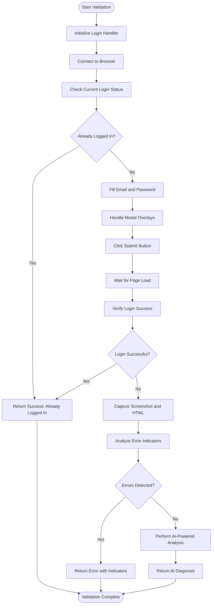
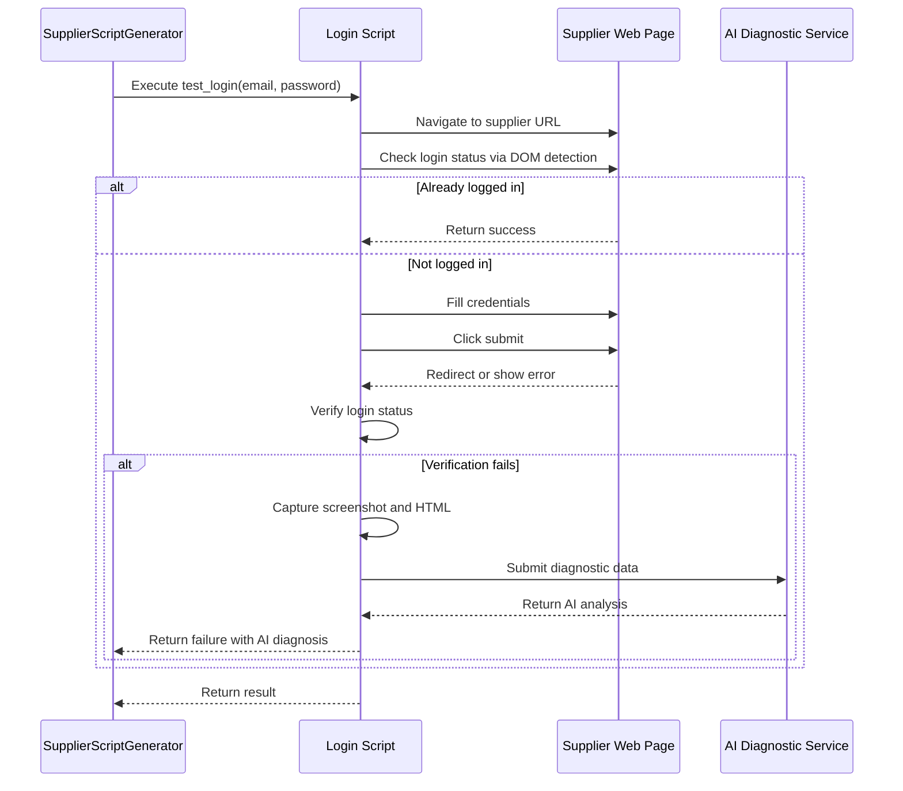
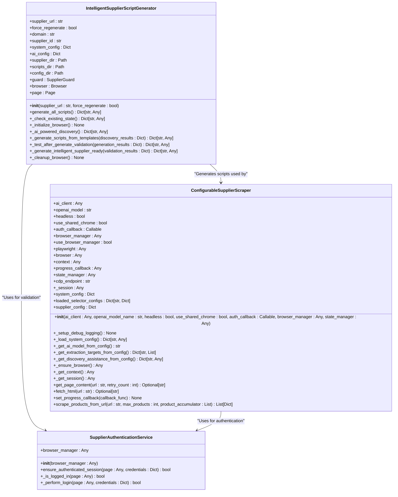

# Login Validation

## Table of Contents
1. [Introduction](#introduction)
2. [Login Validation Process](#login-validation-process)
3. [Test-After-Generate Validation Loop](#test-after-generate-validation-loop)
4. [Test Mode and Side Effect Prevention](#test-mode-and-side-effect-prevention)
5. [Login Status Verification via DOM Detection](#login-status-verification-via-dom-detection)
6. [AI-Powered Diagnostic Analysis](#ai-powered-diagnostic-analysis)
7. [Session State and Dummy Credential Validation](#session-state-and-dummy-credential-validation)
8. [Integration Between Script Generator and Scraper](#integration-between-script-generator-and-scraper)
9. [Common Validation Failures and Resolution Strategies](#common-validation-failures-and-resolution-strategies)
10. [Conclusion](#conclusion)

## Introduction
The login validation process is a critical component of the supplier integration workflow, ensuring that generated authentication scripts can reliably authenticate with supplier websites. This document details the `_test_login_script` method's execution within the test-after-generate validation loop, covering successful authentication verification, error handling analysis, and AI-powered diagnostics. The system ensures login scripts function correctly using dummy credentials while maintaining session state, and addresses common issues such as selector drift, CAPTCHA challenges, and session timeouts.

## Login Validation Process
The login validation process begins with the `_test_login_script` method in the `IntelligentSupplierScriptGenerator` class, which executes the generated login script in test mode to validate its functionality. This method orchestrates the entire validation workflow, from browser initialization to final result reporting. The process follows a structured sequence: initialization, connection to the browser, execution of the login sequence, and comprehensive result analysis.

The validation process is designed to be self-contained and repeatable, allowing for consistent testing across different supplier websites. It leverages Playwright for browser automation, ensuring compatibility with modern web technologies and JavaScript-heavy sites. The method captures detailed logs and diagnostic information throughout the process, enabling thorough analysis of both successful and failed login attempts.

**Diagram sources**
- [tools/supplier_script_generator.py](file://tools/supplier_script_generator.py#L1000-L1500)

**Section sources**
- [tools/supplier_script_generator.py](file://tools/supplier_script_generator.py#L1000-L1500)

## Test-After-Generate Validation Loop
The test-after-generate validation loop is a core component of the supplier script generation process, ensuring that generated scripts function correctly before being deployed. This loop executes immediately after script generation, validating both login and product extraction functionality. The loop follows a strict sequence: generate scripts from templates, execute test mode validation, and produce comprehensive results.

The validation loop is implemented in the `_test_after_generate_validation` method, which orchestrates the testing of both login and product extraction scripts. For login validation, it calls the `_test_login_script` method with dummy credentials to verify authentication functionality without affecting real accounts. The loop captures detailed results, including success status, error messages, and diagnostic information, which are used to determine whether the generated scripts meet quality standards.

This validation approach ensures that only fully functional scripts are deployed, reducing the risk of failures during actual supplier data extraction. The loop also provides valuable feedback for improving the script generation process, identifying patterns in failures that can be addressed in future iterations.

**Section sources**
- [tools/supplier_script_generator.py](file://tools/supplier_script_generator.py#L800-L900)

## Test Mode and Side Effect Prevention
The test mode flag is a critical safety mechanism that prevents side effects during validation. When enabled, the test mode flag modifies the behavior of the login process to ensure it does not impact real user accounts or trigger unwanted actions on the supplier website. This is achieved through several mechanisms: using dummy credentials, preventing actual data submission when possible, and limiting the scope of actions performed.

In the login script, the test mode flag is passed to the `perform_login` method, which uses it to modify error handling behavior. When test mode is active, the method returns detailed error information instead of raising exceptions, allowing for comprehensive analysis of failure points without interrupting the validation process. This enables the system to identify and report issues such as incorrect selectors or authentication challenges without affecting the overall workflow.

The test mode also prevents the script from proceeding beyond the login verification stage, ensuring that no actual data extraction occurs during validation. This isolation protects both the supplier website from excessive requests and the local system from processing incomplete or incorrect data.

**Section sources**
- [tools/supplier_script_generator.py](file://tools/supplier_script_generator.py#L1200-L1300)

## Login Status Verification via DOM Detection
Login status verification is performed through DOM element detection, analyzing the page structure to determine authentication state. The `check_login_status` method queries the DOM for specific indicators that signify a logged-in state, such as logout links, account menus, or user-specific content. This approach is more reliable than URL-based detection, as it works regardless of the current page location.

The method uses a comprehensive set of selectors targeting common logout indicators:
- Text-based selectors: "logout", "sign out", "my account"
- Class-based selectors: ".logout", ".signout", ".account"
- Attribute-based selectors: "[href*='/customer/account/logout']"

When any of these elements are found and visible, the method returns true, indicating successful authentication. If no indicators are found, it returns false, triggering the login sequence. This detection mechanism is robust against minor UI changes, as it uses multiple selectors to identify login status.

The verification process also handles edge cases, such as pages that load partially or have dynamic content. It waits for the DOM to be fully loaded before performing checks and handles exceptions gracefully, ensuring reliable status detection even on problematic pages.

**Section sources**
- [tools/supplier_script_generator.py](file://tools/supplier_script_generator.py#L1300-L1350)

## AI-Powered Diagnostic Analysis
AI-powered diagnostics provide advanced failure analysis when login attempts fail, leveraging machine learning to identify root causes and suggest solutions. When the login verification fails, the system captures a screenshot and HTML content of the current page, then sends this information to an AI model for analysis. The AI examines both visual and structural elements to determine why the login failed and what steps should be taken to resolve the issue.

The diagnostic process is implemented in the `_analyze_login_failure_with_ai` method, which prepares the diagnostic data and submits it to the OpenAI API. The prompt includes specific questions for the AI to address:
- What state is the page in after the login attempt?
- Are there any visible error messages?
- Did the login succeed but verification logic fail?
- Are additional steps needed (CAPTCHA, 2FA, etc.)?
- What should be the next action to resolve this?

The AI response provides actionable insights that can be used to improve the login script or adjust the validation process. This capability significantly reduces the time required to diagnose and fix authentication issues, especially for complex scenarios involving dynamic content or security challenges.

**Diagram sources**
- [tools/supplier_script_generator.py](file://tools/supplier_script_generator.py#L1800-L1900)

**Section sources**
- [tools/supplier_script_generator.py](file://tools/supplier_script_generator.py#L1800-L1900)

## Session State and Dummy Credential Validation
The system validates that login scripts can successfully authenticate with dummy credentials while maintaining session state across page navigations. This validation ensures that the authentication process works correctly without using real user accounts, protecting sensitive information and preventing unintended actions on the supplier website.

The validation process uses predefined dummy credentials that are specifically designed for testing purposes. These credentials are configured in the system configuration and passed to the login script during validation. The script attempts to authenticate using these credentials, verifying that the login process accepts them and establishes a valid session.

Session state maintenance is verified by navigating to different pages within the supplier website after successful login. The system checks that the authentication persists across these navigations, confirming that the session cookies or tokens are being handled correctly. This is particularly important for suppliers that use complex authentication mechanisms or have strict session management policies.

The validation also checks that the session remains valid for a sufficient duration to complete data extraction tasks, identifying potential issues with session timeouts that could interrupt the scraping process.

**Section sources**
- [tools/supplier_script_generator.py](file://tools/supplier_script_generator.py#L1000-L1500)

## Integration Between Script Generator and Scraper
The integration between `supplier_script_generator.py` and `configurable_supplier_scraper.py` enables seamless authentication testing and validation. The script generator creates supplier-specific login scripts based on AI-powered discovery, while the scraper uses these scripts to authenticate before extracting product data.

The integration occurs through a shared configuration system and common authentication service. When the script generator creates a login script, it stores configuration data in the supplier's config directory, including selectors for login elements and authentication parameters. The scraper then loads this configuration when initializing, using it to configure its authentication process.

The `SupplierAuthenticationService` class provides a common interface for authentication, allowing both components to use the same validation logic. This service handles credential management, session validation, and error recovery, ensuring consistent behavior across the system.

This integration enables end-to-end validation of the authentication process, from script generation to actual data extraction. The scraper can test the generated login scripts in real-world conditions, providing feedback that can be used to improve the script generation process.

**Diagram sources**
- [tools/supplier_script_generator.py](file://tools/supplier_script_generator.py#L100-L200)
- [tools/configurable_supplier_scraper.py](file://tools/configurable_supplier_scraper.py#L100-L200)
- [tools/supplier_authentication_service.py](file://tools/supplier_authentication_service.py#L10-L20)

**Section sources**
- [tools/supplier_script_generator.py](file://tools/supplier_script_generator.py#L100-L200)
- [tools/configurable_supplier_scraper.py](file://tools/configurable_supplier_scraper.py#L100-L200)
- [tools/supplier_authentication_service.py](file://tools/supplier_authentication_service.py#L10-L20)

## Common Validation Failures and Resolution Strategies
Several common validation failures occur during login script testing, each requiring specific resolution strategies. These failures include selector drift, CAPTCHA challenges, and session timeout issues, which can prevent successful authentication and data extraction.

Selector drift occurs when the HTML structure of the supplier website changes, causing the login selectors to become invalid. This is addressed through AI-powered discovery, which periodically re-analyzes the login page to update selectors. The system also uses multiple fallback selectors to increase resilience against minor changes.

CAPTCHA challenges are detected through AI-powered diagnostics, which analyze the page content and structure to identify CAPTCHA elements. When detected, the system can either pause for manual intervention or use specialized CAPTCHA-solving services, depending on the configuration.

Session timeout issues are mitigated through proactive authentication checks during data extraction. The scraper verifies login status at regular intervals and re-authenticates if necessary, ensuring that the session remains valid throughout the scraping process.

Other common issues include modal overlays blocking login elements, dynamic content loading delays, and anti-bot detection mechanisms. These are addressed through enhanced error handling, explicit waits for content loading, and realistic user behavior simulation.

**Section sources**
- [tools/supplier_script_generator.py](file://tools/supplier_script_generator.py#L1500-L1800)

## Conclusion
The login validation process is a sophisticated system that ensures reliable authentication with supplier websites through a comprehensive test-after-generate validation loop. By executing generated login scripts in test mode, verifying authentication through DOM element detection, and leveraging AI-powered diagnostics for failure analysis, the system provides robust protection against authentication failures. The integration between the script generator and scraper enables end-to-end validation, while strategies for addressing common issues like selector drift and CAPTCHA challenges ensure long-term reliability. This comprehensive approach to login validation is essential for maintaining the integrity and effectiveness of the supplier data extraction workflow.

**Referenced Files in This Document**   
- [tools/supplier_script_generator.py](file://tools/supplier_script_generator.py)
- [tools/configurable_supplier_scraper.py](file://tools/configurable_supplier_scraper.py)
- [tools/supplier_authentication_service.py](file://tools/supplier_authentication_service.py)
- [config/supplier_configs/www.poundwholesale.co.uk.json](file://config/supplier_configs/www.poundwholesale.co.uk.json)