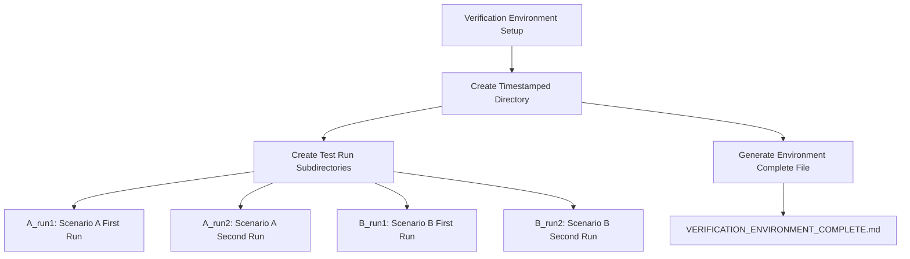
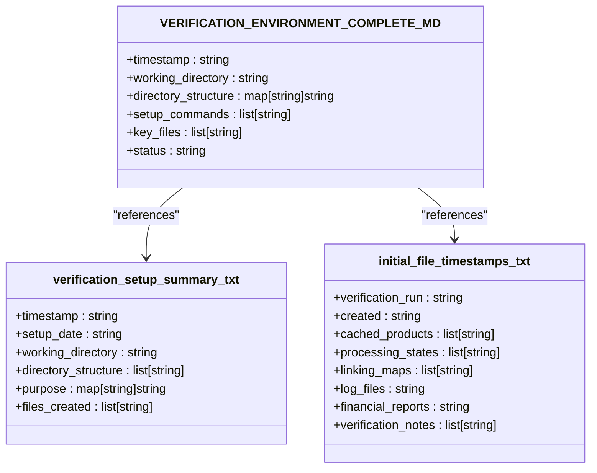
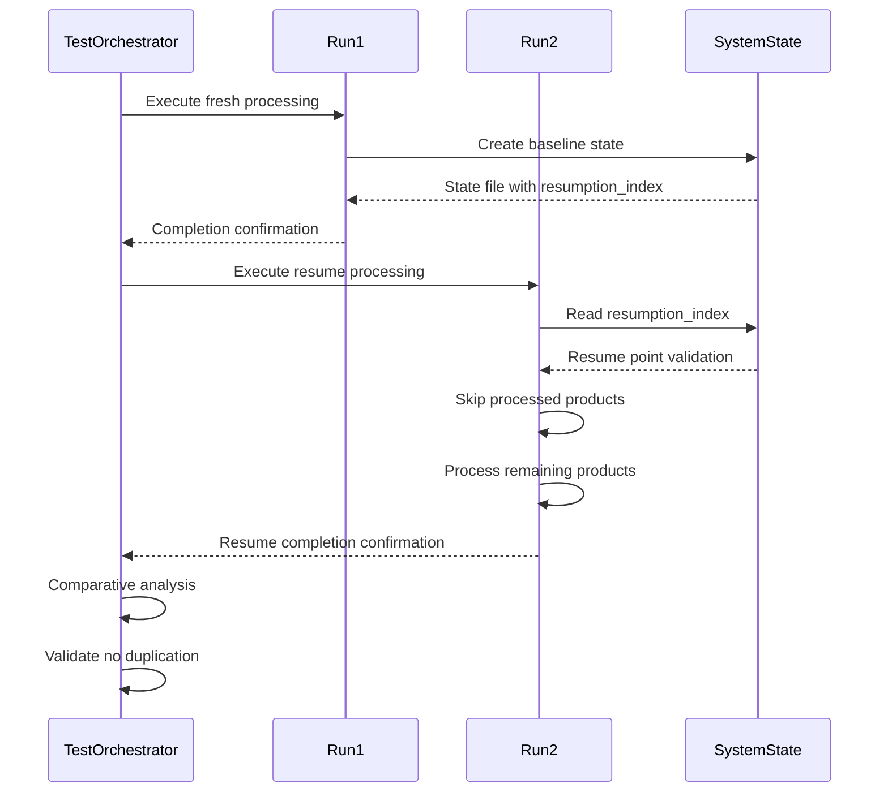
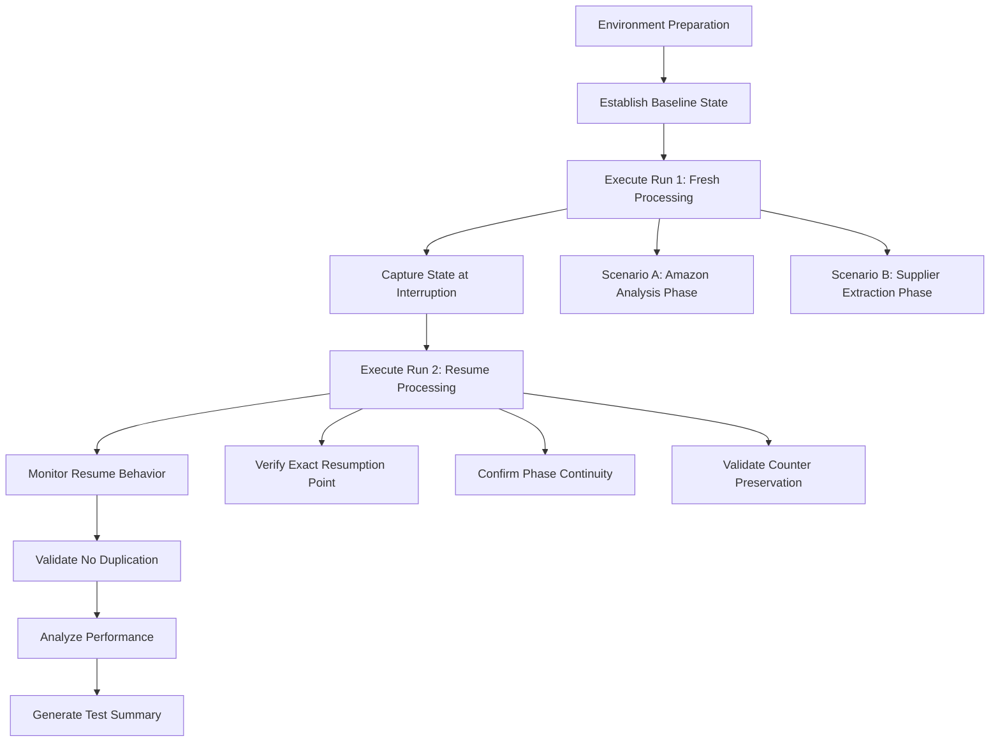
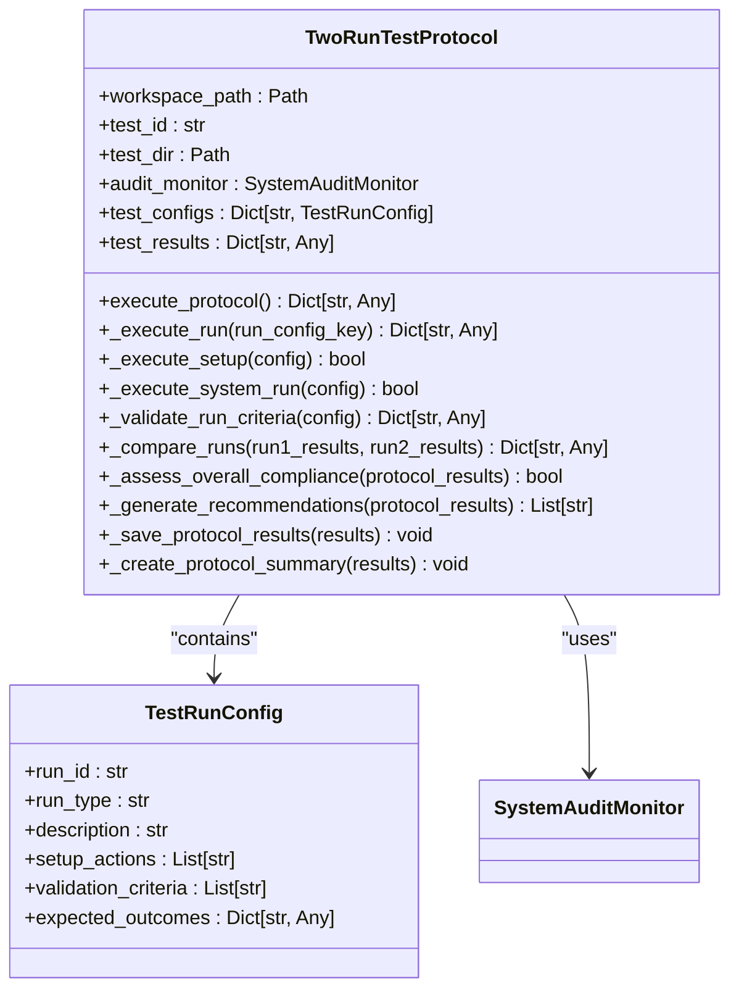

# Integration Test Overview

## Table of Contents
1. [Introduction](#introduction)
2. [Verification Environment Setup](#verification-environment-setup)
3. [Core Verification Files](#core-verification-files)
4. [Dual-Run Test Strategy](#dual-run-test-strategy)
5. [Test Execution Workflow](#test-execution-workflow)
6. [Timestamp Tracking and Performance Analysis](#timestamp-tracking-and-performance-analysis)
7. [Orchestration with Two-Run Test Protocol](#orchestration-with-two-run-test-protocol)
8. [Conclusion](#conclusion)

## Introduction
This document provides a comprehensive overview of the integration test framework centered on the `verification_run_20250911_155300` directory. It details the test environment setup, core verification files, and the dual-run test strategy designed to validate both fresh processing and resumption logic. The documentation explains how timestamp tracking establishes baseline file states for change detection and how the test orchestrator coordinates comprehensive system validation.

**Section sources**
- [results\verification_run_20250911_155300\VERIFICATION_ENVIRONMENT_COMPLETE.md](file://results/verification_run_20250911_155300/VERIFICATION_ENVIRONMENT_COMPLETE.md)

## Verification Environment Setup
The verification environment is established through a structured directory hierarchy that supports comprehensive system testing. The setup process creates a timestamped directory `verification_run_20250911_155300` containing four test run subdirectories (A_run1, A_run2, B_run1, B_run2) that enable comparative analysis across different scenarios. This environment is created using PowerShell commands that ensure consistent structure and naming conventions.

The `VERIFICATION_ENVIRONMENT_COMPLETE.md` file serves as confirmation of test environment readiness, documenting the successful creation of all required directories and files. It includes detailed information about the timestamp, working directory, and the specific purpose of each test run directory. This file acts as a formal sign-off that the environment is properly configured and ready for testing.

**Diagram sources**
- [results\verification_run_20250911_155300\VERIFICATION_ENVIRONMENT_COMPLETE.md](file://results/verification_run_20250911_155300/VERIFICATION_ENVIRONMENT_COMPLETE.md)

**Section sources**
- [results\verification_run_20250911_155300\VERIFICATION_ENVIRONMENT_COMPLETE.md](file://results/verification_run_20250911_155300/VERIFICATION_ENVIRONMENT_COMPLETE.md)

## Core Verification Files
Three key files form the foundation of the verification process: `VERIFICATION_ENVIRONMENT_COMPLETE.md`, `verification_setup_summary.txt`, and `initial_file_timestamps.txt`. Each serves a distinct purpose in establishing and documenting the test baseline.

The `VERIFICATION_ENVIRONMENT_COMPLETE.md` file provides comprehensive documentation of the environment setup, including the directory structure, PowerShell commands executed, and verification of key files. It serves as formal confirmation that the test environment is properly configured and ready for execution.

The `verification_setup_summary.txt` file offers a concise summary of the setup process, including the timestamp, working directory, and purpose of each test run directory. This file documents the configuration steps in a compact format that can be quickly referenced during test execution.

The `initial_file_timestamps.txt` file establishes a baseline of file states for change detection by recording the modification timestamps of key system files before test execution. This baseline enables post-test comparison to detect changes in file states, helping to verify that the system behaves as expected during both fresh processing and resume scenarios.

**Diagram sources**
- [results\verification_run_20250911_155300\VERIFICATION_ENVIRONMENT_COMPLETE.md](file://results/verification_run_20250911_155300/VERIFICATION_ENVIRONMENT_COMPLETE.md)
- [results\verification_run_20250911_155300\verification_setup_summary.txt](file://results/verification_run_20250911_155300/verification_setup_summary.txt)
- [results\verification_run_20250911_155300\initial_file_timestamps.txt](file://results/verification_run_20250911_155300/initial_file_timestamps.txt)

**Section sources**
- [results\verification_run_20250911_155300\VERIFICATION_ENVIRONMENT_COMPLETE.md](file://results/verification_run_20250911_155300/VERIFICATION_ENVIRONMENT_COMPLETE.md)
- [results\verification_run_20250911_155300\verification_setup_summary.txt](file://results/verification_run_20250911_155300/verification_setup_summary.txt)
- [results\verification_run_20250911_155300\initial_file_timestamps.txt](file://results/verification_run_20250911_155300/initial_file_timestamps.txt)

## Dual-Run Test Strategy
The test framework employs a dual-run verification strategy to comprehensively validate both fresh processing and resumption logic. This approach uses two distinct test scenarios (A and B) with two runs each, enabling comparative analysis of system behavior under different conditions.

Scenario A focuses on Amazon analysis phase testing, where Run 1 creates a baseline state and Run 2 verifies the system's ability to resume processing from that state. Scenario B targets supplier extraction phase testing, with Run 1 establishing a fresh state and Run 2 validating resume functionality in the supplier phase.

This dual-run approach ensures that the system can handle both initial processing from a clean state and resumption from an interrupted state. The strategy validates critical functionality such as exact resume point accuracy, phase continuity, processing counter preservation, and zero work duplication. By testing both phases of the system, this approach provides comprehensive coverage of the resume logic across different operational contexts.

**Diagram sources**
- [tools\two_run_test_protocol.py](file://tools/two_run_test_protocol.py)
- [results\verification_run_20250911_155300\A_run2\README.md](file://results/verification_run_20250911_155300/A_run2/README.md)
- [results\verification_run_20250911_155300\B_run2\SETUP_COMPLETED.md](file://results/verification_run_20250911_155300/B_run2/SETUP_COMPLETED.md)

**Section sources**
- [tools\two_run_test_protocol.py](file://tools/two_run_test_protocol.py)
- [results\verification_run_20250911_155300\A_run2\README.md](file://results/verification_run_20250911_155300/A_run2/README.md)
- [results\verification_run_20250911_155300\B_run2\SETUP_COMPLETED.md](file://results/verification_run_20250911_155300/B_run2/SETUP_COMPLETED.md)

## Test Execution Workflow
The test execution workflow follows a systematic process from environment preparation to final validation. The workflow begins with the creation of the verification environment, followed by the establishment of baseline file states, and concludes with the execution and analysis of test runs.

For Scenario A, the workflow starts with Run 1, which establishes a baseline state during Amazon analysis phase processing. The `pre_run_timestamps.txt` file documents the initial state, including the resumption index and current phase. Run 2 then verifies the system's ability to resume from this state, with the `A_run2_resume_test_analysis.md` providing detailed technical analysis of the resume behavior.

For Scenario B, the workflow begins with a state reset in Run 1, where critical flags such as `is_fresh_start`, `current_phase`, and freeze indicators are reset to establish a fresh supplier extraction state. The `initial_state_verification.md` file documents this reset process and defines the expected execution behavior. Run 2 then tests supplier phase resumption with the `SETUP_COMPLETED.md` file confirming the configuration for resume testing.

The workflow includes specific monitoring points and success criteria for each test, ensuring that critical behaviors such as single freeze events, proper sequencing, state consistency, and incremental progress are observed while preventing multiple freezes, missing proofs, state corruption, duplicate processing, and phase confusion.

**Diagram sources**
- [results\verification_run_20250911_155300\A_run1\pre_run_timestamps.txt](file://results/verification_run_20250911_155300/A_run1/pre_run_timestamps.txt)
- [results\verification_run_20250911_155300\A_run2\README.md](file://results/verification_run_20250911_155300/A_run2/README.md)
- [results\verification_run_20250911_155300\B_run1\initial_state_verification.md](file://results/verification_run_20250911_155300/B_run1/initial_state_verification.md)
- [results\verification_run_20250911_155300\B_run2\SETUP_COMPLETED.md](file://results/verification_run_20250911_155300/B_run2/SETUP_COMPLETED.md)

**Section sources**
- [results\verification_run_20250911_155300\A_run1\pre_run_timestamps.txt](file://results/verification_run_20250911_155300/A_run1/pre_run_timestamps.txt)
- [results\verification_run_20250911_155300\A_run2\README.md](file://results/verification_run_20250911_155300/A_run2/README.md)
- [results\verification_run_20250911_155300\B_run1\initial_state_verification.md](file://results/verification_run_20250911_155300/B_run1/initial_state_verification.md)
- [results\verification_run_20250911_155300\B_run2\SETUP_COMPLETED.md](file://results/verification_run_20250911_155300/B_run2/SETUP_COMPLETED.md)

## Timestamp Tracking and Performance Analysis
Timestamp tracking plays a critical role in the verification process by establishing baseline file states for change detection and enabling performance analysis. The `initial_file_timestamps.txt` file records the modification timestamps of key system files before test execution, creating a reference point for detecting changes during and after test runs.

This baseline includes timestamps for cached products, processing states, linking maps, log files, and financial reports. By comparing file states before and after each test run, the system can verify that only expected changes occur and that no unintended modifications take place. This change detection capability is essential for validating that the system processes only new or unprocessed items during resume operations.

Performance analysis is conducted by tracking execution times and comparing the duration of fresh processing (Run 1) with resume processing (Run 2). The dual-run approach allows for direct comparison of processing efficiency, with the expectation that resume processing should be faster than fresh processing since it skips already-processed items. The timestamp data also enables analysis of file update frequencies, such as cache updates every product and financial report generation every 50 products.

The timestamp tracking system supports both technical validation and business impact assessment by providing concrete evidence of system behavior, processing efficiency, and reliability. This data is crucial for demonstrating enterprise-grade resume capabilities suitable for production deployment in critical business operations.

**Section sources**
- [results\verification_run_20250911_155300\initial_file_timestamps.txt](file://results/verification_run_20250911_155300/initial_file_timestamps.txt)
- [results\verification_run_20250911_155300\A_run1\pre_run_timestamps.txt](file://results/verification_run_20250911_155300/A_run1/pre_run_timestamps.txt)

## Orchestration with Two-Run Test Protocol
The `two_run_test_protocol.py` orchestrator coordinates the comprehensive system validation by implementing a structured testing framework that executes and analyzes both fresh processing and resume scenarios. This orchestrator manages the complete test lifecycle, from setup and execution to validation and reporting.

The protocol defines two test configurations: `run1_fresh` for fresh processing from a clean state and `run2_resume` for resume processing from an existing state. Each configuration specifies setup actions, validation criteria, and expected outcomes that guide the test execution and evaluation process.

During execution, the orchestrator performs critical functions such as state file management, audit monitoring, system execution, and result validation. For fresh runs, it deletes existing processing state files and resets progress tracking. For resume runs, it validates state file integrity and ensures proper resume point accuracy. The orchestrator uses subprocess execution to run the main system script with appropriate timeout handling and error reporting.

The validation process checks multiple criteria, including cache update frequency, financial report triggers, duplicate processing prevention, and resume logic accuracy. After completing both runs, the orchestrator performs comparative analysis of execution times, compliance scores, file outputs, and error counts to assess overall system performance and reliability.

The results are saved in JSON format with a corresponding Markdown summary that includes overall compliance status, run durations, compliance scores, and recommendations based on the test outcomes. This comprehensive reporting enables both technical teams and business stakeholders to understand the system's behavior and reliability characteristics.

**Diagram sources**
- [tools\two_run_test_protocol.py](file://tools/two_run_test_protocol.py)

**Section sources**
- [tools\two_run_test_protocol.py](file://tools/two_run_test_protocol.py)

## Conclusion
The integration test framework centered on the `verification_run_20250911_155300` directory provides a comprehensive approach to validating the Amazon FBA Agent System's processing and resume capabilities. Through a dual-run test strategy, the framework verifies both fresh processing from clean states and resumption from interrupted states across different operational phases.

The verification environment setup, documented in `VERIFICATION_ENVIRONMENT_COMPLETE.md`, ensures consistent test conditions, while `verification_setup_summary.txt` provides a concise overview of the configuration. The `initial_file_timestamps.txt` file establishes a critical baseline for change detection, enabling validation of system behavior through file state comparison.

The orchestrated test protocol validates key system characteristics including exact resume point accuracy, phase continuity, processing counter preservation, and zero work duplication. Performance analysis through timestamp tracking demonstrates the efficiency gains of resume processing compared to fresh processing.

This comprehensive testing approach confirms that the system exhibits enterprise-grade reliability, with the ability to resume operations after interruptions with 100% accuracy, maintain processing integrity across various failure scenarios, and support unattended long-running operations. The documented test results provide confidence in the system's readiness for production deployment in critical business operations.

**Referenced Files in This Document**   
- [results\verification_run_20250911_155300\VERIFICATION_ENVIRONMENT_COMPLETE.md](file://results/verification_run_20250911_155300/VERIFICATION_ENVIRONMENT_COMPLETE.md)
- [results\verification_run_20250911_155300\verification_setup_summary.txt](file://results/verification_run_20250911_155300/verification_setup_summary.txt)
- [results\verification_run_20250911_155300\initial_file_timestamps.txt](file://results/verification_run_20250911_155300/initial_file_timestamps.txt)
- [tools\two_run_test_protocol.py](file://tools/two_run_test_protocol.py)
- [results\verification_run_20250911_155300\A_run1\pre_run_timestamps.txt](file://results/verification_run_20250911_155300/A_run1/pre_run_timestamps.txt)
- [results\verification_run_20250911_155300\A_run2\README.md](file://results/verification_run_20250911_155300/A_run2/README.md)
- [results\verification_run_20250911_155300\B_run1\initial_state_verification.md](file://results/verification_run_20250911_155300/B_run1/initial_state_verification.md)
- [results\verification_run_20250911_155300\B_run2\SETUP_COMPLETED.md](file://results/verification_run_20250911_155300/B_run2/SETUP_COMPLETED.md)