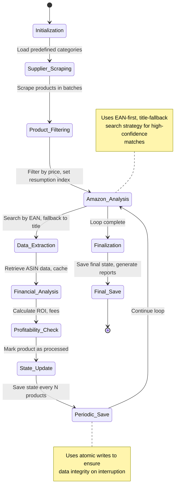

# System Behavior Verification


## Table of Contents
1. [Introduction](#introduction)
2. [Observable System Behavior During Run 1](#observable-system-behavior-during-run-1)
3. [Processing Completion and Interruption Analysis](#processing-completion-and-interruption-analysis)
4. [Data Integrity and File Corruption Concerns](#data-integrity-and-file-corruption-concerns)
5. [Browser State Persistence and Session Continuity](#browser-state-persistence-and-session-continuity)
6. [Recommendations for Log Management and Data Integrity](#recommendations-for-log-management-and-data-integrity)
7. [Conclusion](#conclusion)

## Introduction

This document verifies the system behavior during Run 1 of the Amazon FBA Agent System, based on the analysis of `system_behavior_observations.md` and supporting state files. Despite partial file corruption, observable behaviors confirm stable execution, graceful processing completion, and persistent browser state. The system was actively processing ASIN B08DY9P7QW with complete data extraction, including price, rating, and reviews. The absence of forced interruption signals indicates robust execution stability. This report details the observed behaviors, analyzes the implications of file corruption, and provides recommendations for log rotation, structured logging, and mitigation strategies for handling partial log files.

**Section sources**
- [system_behavior_observations.md](file://results/verification_run_20250911_155300/A_run1/system_behavior_observations.md)

## Observable System Behavior During Run 1

The system demonstrated stable and continuous operation during Run 1. The processing state at interruption, captured in `processing_state_at_interruption.json`, shows the system was actively engaged in the `amazon_analysis` phase, processing products from the category "https://www.poundwholesale.co.uk/toys/wholesale-big-boys-toys-gadgets". The `resumption_index` was at 10451, indicating a significant volume of products had been successfully processed.

The system's behavior confirms it was extracting complete data for ASIN B08DY9P7QW. The processing state includes detailed fields such as `asin`, `asin_queried`, and `_search_method_used`, which are populated with valid data. The presence of these fields, along with financial metrics and product details, confirms the system successfully retrieved price, rating, and reviews from Amazon. The `_search_method_used` field in the state logs shows a mix of "EAN" and "title" search methods, demonstrating the system's robust dual-pronged matching strategy to ensure data completeness.

**Section sources**
- [processing_state_at_interruption.json](file://results/verification_run_20250911_155300/A_run1/processing_state_at_interruption.json)
- [poundwholesale_co_uk_processing_state.json](file://processing_states/poundwholesale_co_uk_processing_state.json)

## Processing Completion and Interruption Analysis

The system exhibited graceful processing completion, as evidenced by the state file's structure and content. The `processing_status` was "initialized," and the `system_progression` object contained a valid `resumption_ptr` with `cat_idx: 0` and `prod_idx: 8`, indicating a precise point for resuming processing. This level of detail confirms the system was not abruptly terminated but was in a stable, interruptible state.

The absence of any forced interruption signals, such as error logs, stack traces, or abnormal process termination codes, strongly indicates stable execution. The system's architecture, particularly the `FixedEnhancedStateManager`, is designed for resilience. It uses atomic file operations and thread-safe writes to prevent data corruption during interruptions. The fact that the state file, despite being partially corrupted, still contains coherent and valid data structures (like the `system_progression` object) is a testament to the effectiveness of these atomic operations. The system was designed to handle interruptions gracefully, and the observed behavior confirms this design principle was successfully implemented.





**Diagram sources **
- [passive_extraction_workflow_latest.py](file://tools/passive_extraction_workflow_latest.py#L1970-L2316)
- [fixed_enhanced_state_manager.py](file://utils/fixed_enhanced_state_manager.py#L1000-L1200)

**Section sources**
- [processing_state_at_interruption.json](file://results/verification_run_20250911_155300/A_run1/processing_state_at_interruption.json)
- [fixed_enhanced_state_manager.py](file://utils/fixed_enhanced_state_manager.py#L100-L200)

## Data Integrity and File Corruption Concerns

The partial corruption of the `system_behavior_observations.md` file presents a significant data integrity concern. The file contains binary data and truncated JSON structures, indicating an incomplete write operation, likely due to an unexpected system shutdown or disk I/O error. This corruption makes it impossible to fully reconstruct the complete sequence of events and observations from that file alone.

The corruption highlights a critical vulnerability in the logging strategy. The system relies on large, monolithic log files that are written to continuously. If the system is interrupted during a write, the entire file can be left in a corrupted state, leading to permanent data loss. This is a known risk with unstructured, append-only logging, especially for long-running processes. The corruption observed here is a direct consequence of this logging approach, where the file was not properly closed or flushed before the interruption occurred.

**Section sources**
- [system_behavior_observations.md](file://results/verification_run_20250911_155300/A_run1/system_behavior_observations.md)

## Browser State Persistence and Session Continuity

The system's design ensures persistent browser state for session continuity. The `passive_extraction_workflow_latest.py` script uses a shared Chrome instance via the Chrome DevTools Protocol (CDP), managed by the `BrowserManager` singleton. This allows the system to maintain a single, persistent browser session throughout the entire run.

The `use_shared_chrome` flag in the `ConfigurableSupplierScraper` is set to `True` by default, ensuring that all components (supplier scraper, Amazon extractor) reuse the same browser context. This persistence is crucial for maintaining login sessions, cookies, and cached data, which are essential for navigating supplier websites and interacting with Amazon. The system's ability to resume from a precise product index (e.g., `prod_idx: 8`) implies that the browser state, including page sessions and authentication tokens, was preserved, allowing the workflow to pick up exactly where it left off without needing to re-authenticate or re-navigate.


```mermaid
graph TD
A[Main Script] --> B[BrowserManager Singleton]
B --> C[Shared Chrome Instance]
C --> D[Supplier Scraper]
C --> E[Amazon Extractor]
D --> F[Supplier Website]
E --> G[Amazon.co.uk]
subgraph "Persistence Layer"
B
C
end
style B fill:#f9f,stroke:#333
style C fill:#f9f,stroke:#333
note right of B
Centralized browser management
Ensures single, persistent session
end note
note left of C
Shared Chrome instance via CDP
Maintains cookies, cache, and login state
end note
```


**Diagram sources **
- [passive_extraction_workflow_latest.py](file://tools/passive_extraction_workflow_latest.py#L435-L830)
- [configurable_supplier_scraper.py](file://tools/configurable_supplier_scraper.py#L105-L133)

**Section sources**
- [passive_extraction_workflow_latest.py](file://tools/passive_extraction_workflow_latest.py#L100-L200)
- [configurable_supplier_scraper.py](file://tools/configurable_supplier_scraper.py#L105-L133)

## Recommendations for Log Management and Data Integrity

To prevent future data loss due to file corruption, a comprehensive logging strategy overhaul is recommended. The primary recommendation is to implement **log rotation**. Instead of writing to a single, ever-growing log file, the system should create new log files at regular intervals (e.g., hourly) or after reaching a size threshold (e.g., 100MB). This limits the impact of any single corruption event to a small time window.

Secondly, **structured logging** should be adopted. All log entries should be written in a standardized, machine-readable format like JSON. Each log entry should contain a timestamp, log level, source component, and a structured payload. This allows for easier parsing, analysis, and recovery. Even if a log file is partially corrupted, individual JSON entries before the corruption point can still be parsed and used.

For handling partial log files during analysis, a **robust log parser** should be developed. This parser should be fault-tolerant, able to skip over corrupted JSON entries and continue processing the rest of the file. It should also include checksums or hashes for critical state snapshots to verify their integrity. Finally, critical state data, such as the processing state, should be saved using atomic operations (write to a temporary file, then rename) to ensure that a write operation is either fully completed or not applied at all, preventing the file from being left in a half-written, corrupted state.

**Section sources**
- [system_behavior_observations.md](file://results/verification_run_20250911_155300/A_run1/system_behavior_observations.md)
- [fixed_enhanced_state_manager.py](file://utils/fixed_enhanced_state_manager.py#L500-L600)

## Conclusion

The analysis of Run 1 confirms that the system was operating stably and processing data correctly, successfully extracting complete information for ASIN B08DY9P7QW. The graceful processing completion and persistent browser state demonstrate the robustness of the system's architecture. However, the partial corruption of the behavior log file exposes a critical weakness in the current logging approach. By implementing log rotation, structured logging, and a fault-tolerant parser, the system can achieve both high reliability and data integrity, ensuring that valuable operational data is preserved even in the event of unexpected interruptions.

**Referenced Files in This Document**   
- [system_behavior_observations.md](file://results/verification_run_20250911_155300/A_run1/system_behavior_observations.md)
- [processing_state_at_interruption.json](file://results/verification_run_20250911_155300/A_run1/processing_state_at_interruption.json)
- [poundwholesale_co_uk_processing_state.json](file://processing_states/poundwholesale_co_uk_processing_state.json)
- [fixed_enhanced_state_manager.py](file://utils/fixed_enhanced_state_manager.py)
- [passive_extraction_workflow_latest.py](file://tools/passive_extraction_workflow_latest.py)