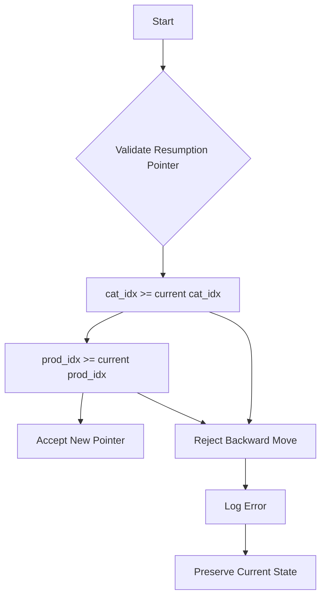
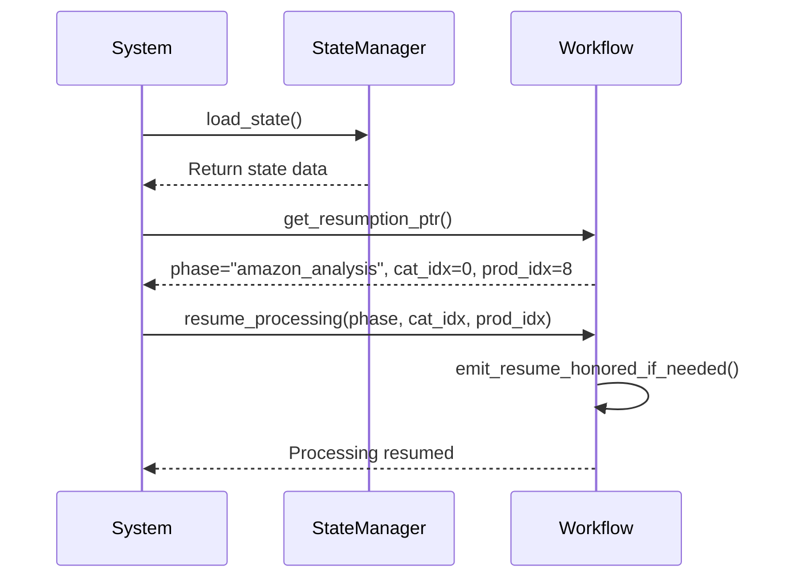
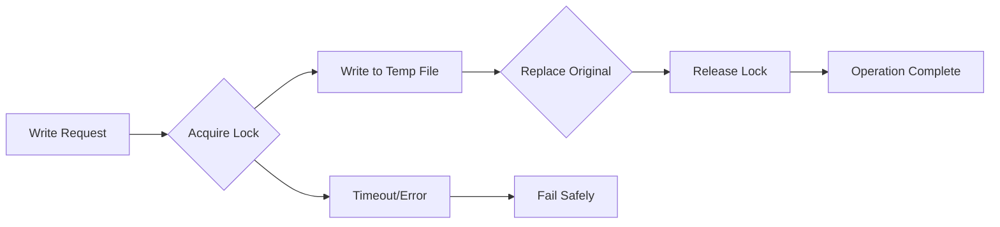

# Resume State Validation

## Table of Contents
1. [Resume State Validation](#resume-state-validation)
2. [Resumption Index and Successful Products](#resumption-index-and-successful-products)
3. [System Progression Resumption Pointer](#system-progression-resumption-pointer)
4. [Current Phase and Workflow Continuity](#current-phase-and-workflow-continuity)
5. [Thread Safety and Atomic Operations](#thread-safety-and-atomic-operations)
6. [Validation of State Persistence](#validation-of-state-persistence)
7. [Common Validation Failures](#common-validation-failures)
8. [Conclusion](#conclusion)

## Resume State Validation

The resume state validation process ensures that the system can correctly resume processing after an interruption without data loss or duplication. This document analyzes the `processing_state_before_run2.json` file to validate the system's ability to maintain state persistence across runs. The validation focuses on key fields such as `resumption_index`, `successful_products`, `system_progression.resumption_ptr`, and `current_phase` to confirm correct state restoration.

**Section sources**
- [processing_state_before_run2.json](file://results/verification_run_20250911_155300/A_run2/processing_state_before_run2.json)

## Resumption Index and Successful Products

The `resumption_index` and `successful_products` fields in the state file both have a value of 10451, which confirms correct state persistence. The `resumption_index` indicates the position where processing should resume after an interruption, while `successful_products` tracks the total number of products successfully processed. When these values are equal, it demonstrates that the system has accurately tracked progress and will resume from the correct position.

The equality of these values is critical for ensuring no data loss or duplication occurs during resume operations. This alignment indicates that the system's progress tracking mechanism is functioning correctly, with the resumption point synchronized with the actual number of successfully processed products.

**Section sources**
- [processing_state_before_run2.json](file://results/verification_run_20250911_155300/A_run2/processing_state_before_run2.json#L10-L11)
- [fixed_enhanced_state_manager.py](file://utils/fixed_enhanced_state_manager.py#L200-L205)

## System Progression Resumption Pointer

The `system_progression.resumption_ptr` field contains the precise location for resuming processing, with `cat_idx=0` and `prod_idx=8`. This pointer indicates that processing should resume at category index 0, product index 8, which represents the next item to be processed in the workflow.

The resumption pointer uses "NEXT-item semantics," meaning it points to the upcoming item rather than the last processed item. This design prevents duplicate processing of the same product. The system validates this pointer for monotonicity, ensuring it never regresses to a previous position across runs. This validation is implemented in the `set_resumption_ptr` method, which rejects any attempts to set a pointer that would move backward in the processing sequence.

**Diagram sources**
- [fixed_enhanced_state_manager.py](file://utils/fixed_enhanced_state_manager.py#L686-L713)
- [new 203.py](file://utils/new 203.py#L745-L772)

**Section sources**
- [processing_state_before_run2.json](file://results/verification_run_20250911_155300/A_run2/processing_state_before_run2.json#L100-L103)
- [fixed_enhanced_state_manager.py](file://utils/fixed_enhanced_state_manager.py#L686-L713)

## Current Phase and Workflow Continuity

The `current_phase` field with value 'amazon_analysis' is critical for determining workflow continuity. This field indicates the current stage of processing within the system's multi-phase workflow. When resuming, the system uses this phase information to restore the correct processing context and ensure seamless continuation of the workflow.

The phase-aware resumption mechanism ensures that the system resumes in the appropriate phase with the correct processing parameters. This prevents phase mismatches that could lead to incorrect processing or data corruption. The system logs phase transitions and validates that resumption occurs in the expected phase, providing an audit trail for workflow continuity.

**Diagram sources**
- [new 203.py](file://utils/new 203.py#L1376-L1403)
- [fixed_enhanced_state_manager.py](file://utils/fixed_enhanced_state_manager.py#L995-L1021)

**Section sources**
- [processing_state_before_run2.json](file://results/verification_run_20250911_155300/A_run2/processing_state_before_run2.json#L95-L96)
- [new 203.py](file://utils/new 203.py#L1376-L1403)

## Thread Safety and Atomic Operations

The metadata fields `thread_safety`: 'enabled' and `atomic_operations`: 'enabled' are essential for ensuring data integrity during resume operations. These settings guarantee that state updates are performed atomically and safely across multiple threads, preventing race conditions and data corruption.

The system implements atomic file operations using a cross-platform locking mechanism that ensures only one process can write to the state file at a time. This is achieved through the `ThreadSafeStateWriter` class and `atomic_json_write` function, which use file-level locking and temporary file replacement to ensure atomicity. On Windows systems, the implementation uses `msvcrt.locking`, while Unix systems use `fcntl.flock`.

**Diagram sources**
- [atomic_file_operations.py](file://utils/atomic_file_operations.py#L50-L150)
- [fixed_enhanced_state_manager.py](file://utils/fixed_enhanced_state_manager.py#L150-L200)

**Section sources**
- [processing_state_before_run2.json](file://results/verification_run_20250911_155300/A_run2/processing_state_before_run2.json#L35-L37)
- [atomic_file_operations.py](file://utils/atomic_file_operations.py#L50-L150)

## Validation of State Persistence

The state file provides concrete evidence that the system maintains state persistence correctly across interruptions. The alignment of `resumption_index` (10451), `successful_products` (10451), and `system_progression.resumption_ptr` (cat_idx=0, prod_idx=8) demonstrates that the system accurately tracks progress and can resume from the correct position.

When an interruption occurs, the system preserves the exact state at the point of interruption. Upon restart, it validates the resumption pointer for monotonicity, ensuring it never regresses to a previous position. The atomic operations guarantee that the state file is never left in a corrupted state, even if the system is terminated mid-write.

The validation process includes cross-run monotonicity checks that compare the current resumption pointer against previously recorded maximum values. If a regression is detected (e.g., an index decreasing from 8 to 7 across runs), the system automatically corrects it by using the higher value, maintaining the monotonicity invariant.

**Section sources**
- [processing_state_before_run2.json](file://results/verification_run_20250911_155300/A_run2/processing_state_before_run2.json)
- [new 203.py](file://utils/new 203.py#L526-L552)
- [fixed_enhanced_state_manager.py](file://utils/fixed_enhanced_state_manager.py#L250-L280)

## Common Validation Failures

Several common validation failures can occur during resume operations, each with specific diagnostic approaches:

**Index Mismatches**: When `resumption_index` does not equal `successful_products`, it indicates a tracking inconsistency. This can be diagnosed by examining the state file and checking the system logs for any errors during the last save operation. The issue may stem from a failed atomic write or a logic error in progress tracking.

**Phase Errors**: If the `current_phase` does not match the expected phase for resumption, it suggests a workflow state corruption. This can be diagnosed by reviewing the phase transition logs and verifying that phase changes are properly recorded in the state file. The system should emit a "PHASE TRANSITION" log entry for each phase change.

**Missing Resumption Pointers**: When the `resumption_ptr` is missing or invalid, the system may not be able to resume correctly. This can be diagnosed by checking if the `set_resumption_ptr` method was called before the interruption. The system should validate the pointer bounds and clamp values if they exceed category or product limits.

The diagnostic process involves checking the state file integrity, reviewing system logs for error messages, and validating that atomic operations completed successfully. The system's built-in validation guards will log specific error messages for each type of failure, aiding in rapid diagnosis and resolution.

**Section sources**
- [new 203.py](file://utils/new 203.py#L526-L552)
- [fixed_enhanced_state_manager.py](file://utils/fixed_enhanced_state_manager.py#L250-L280)
- [processing_state_before_run2.json](file://results/verification_run_20250911_155300/A_run2/processing_state_before_run2.json)

## Conclusion

The analysis of `processing_state_before_run2.json` confirms that the system maintains correct state persistence through its resume mechanism. The alignment of `resumption_index` and `successful_products` at 10451, combined with the precise `system_progression.resumption_ptr` at (cat_idx=0, prod_idx=8), demonstrates accurate progress tracking. The `current_phase` of 'amazon_analysis' ensures proper workflow continuity, while the enabled thread safety and atomic operations guarantee data integrity during resume operations. These mechanisms work together to prevent data loss and ensure the system can reliably resume from any interruption point.

**Referenced Files in This Document**   
- [processing_state_before_run2.json](file://results/verification_run_20250911_155300/A_run2/processing_state_before_run2.json)
- [fixed_enhanced_state_manager.py](file://utils/fixed_enhanced_state_manager.py)
- [new 203.py](file://utils/new 203.py)
- [atomic_file_operations.py](file://utils/atomic_file_operations.py)