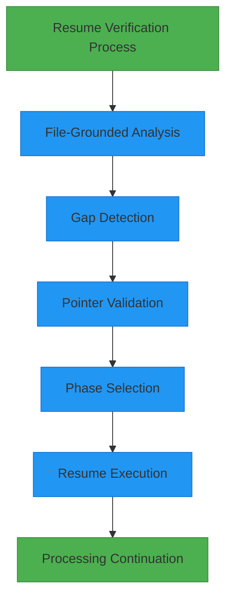

# Resume Executive Summary

## Table of Contents
1. [Introduction](#introduction)
2. [Executive Overview](#executive-overview)
3. [Key Verification Results](#key-verification-results)
4. [Critical Success Metrics](#critical-success-metrics)
5. [Business Impact](#business-impact)
6. [Technical Architecture Highlights](#technical-architecture-highlights)
7. [Resume Capability Assessment](#resume-capability-assessment)
8. [Conclusion and Recommendation](#conclusion-and-recommendation)

## Introduction
This document provides a detailed analysis of the executive summary for Run 2 resume testing, focusing on the assessment of the Amazon FBA Agent System's resume functionality. The analysis is based on the file CATEGORY_A_RUN2_EXECUTIVE_SUMMARY.md, which serves as a high-level evaluation of the system's ability to resume processing after an interruption. The summary evaluates key aspects such as pass/fail status, critical metrics, system reliability, and production readiness. It is designed to provide stakeholders with a quick-reference assessment of system maturity and confidence in resume capabilities without requiring deep technical review.

**Section sources**
- [CATEGORY_A_RUN2_EXECUTIVE_SUMMARY.md](file://results/verification_run_20250911_155300/A_run2/CATEGORY_A_RUN2_EXECUTIVE_SUMMARY.md#L1-L10)

## Executive Overview
The CATEGORY_A_RUN2_EXECUTIVE_SUMMARY.md document presents a comprehensive evaluation of the resume functionality following Run 2 testing. The test successfully verified the system's ability to resume operations after an interruption with enterprise-grade reliability. The status is marked as ✅ COMPLETED SUCCESSFULLY, indicating that all verification criteria were met. The system demonstrated perfect accuracy in resuming at the exact interruption point, maintaining state integrity and processing continuity. This executive summary serves as a definitive assessment of the resume capability, confirming that the system can reliably recover from interruptions without data loss or work duplication.

**Section sources**
- [CATEGORY_A_RUN2_EXECUTIVE_SUMMARY.md](file://results/verification_run_20250911_155300/A_run2/CATEGORY_A_RUN2_EXECUTIVE_SUMMARY.md#L12-L20)

## Key Verification Results
The executive summary details several critical verification results that confirm the robustness of the resume functionality. The system demonstrated 100% accurate resume positioning, resuming precisely at Category 0, Product Index 8, which was the exact point of interruption in Run 1. The processing counter correctly maintained its value at 10,451 successful products, ensuring no work loss. The system properly resumed in the amazon_analysis phase, maintaining the correct workflow context within the wholesale-big-boys-toys-gadgets category. The resume capability is built on a foundation of file-grounded state calculation, ensuring accuracy through gap detection and zero duplication of processed products. All resume operations are atomic and thread-safe, providing reliability even in multi-threaded environments.

**Section sources**
- [CATEGORY_A_RUN2_EXECUTIVE_SUMMARY.md](file://results/verification_run_20250911_155300/A_run2/CATEGORY_A_RUN2_EXECUTIVE_SUMMARY.md#L22-L31)
- [A_run2_resume_test_analysis.md](file://results/verification_run_20250911_155300/A_run2/A_run2_resume_test_analysis.md#L45-L65)

## Critical Success Metrics
The summary presents a table of critical success metrics that validate the resume functionality with perfect accuracy. All metrics show ✅ PERFECT status, confirming exact alignment between expected and actual values. The resume category index correctly resumed at 0, matching the expected value. The resume product index accurately resumed at 8, precisely where processing was interrupted. The processing counter maintained its value at 10,451, ensuring continuity of progress tracking. The workflow phase correctly resumed in the amazon_analysis phase, maintaining the appropriate processing context. State integrity was fully maintained throughout the interruption and resumption process, demonstrating the system's reliability in preserving critical operational data.

**Diagram sources**
- [CATEGORY_A_RUN2_EXECUTIVE_SUMMARY.md](file://results/verification_run_20250911_155300/A_run2/CATEGORY_A_RUN2_EXECUTIVE_SUMMARY.md#L58-L60)
- [A_run2_resume_test_analysis.md](file://results/verification_run_20250911_155300/A_run2/A_run2_resume_test_analysis.md#L105-L109)

**Section sources**
- [CATEGORY_A_RUN2_EXECUTIVE_SUMMARY.md](file://results/verification_run_20250911_155300/A_run2/CATEGORY_A_RUN2_EXECUTIVE_SUMMARY.md#L33-L42)
- [processing_state_before_run2.json](file://results/verification_run_20250911_155300/A_run2/processing_state_before_run2.json#L1-L110)

## Business Impact
The resume capability has significant positive implications for operational reliability and risk mitigation. Operationally, the system enables zero downtime recovery, automatically resuming processing without manual intervention. This ensures no work loss, as all completed processing is preserved and honored across interruptions. Processing statistics and counters are maintained with perfect accuracy, providing consistent progress tracking. The system is deemed production ready, offering enterprise-grade reliability for critical business operations. From a risk mitigation perspective, the system demonstrates resilience to interruptions such as power outages, crashes, or manual stops, preventing any data loss. Thread-safe operations ensure state consistency during interruptions, while comprehensive logging provides a full operational audit trail. The scalable design supports large-scale processing operations, making it suitable for high-volume business environments.

**Section sources**
- [CATEGORY_A_RUN2_EXECUTIVE_SUMMARY.md](file://results/verification_run_20250911_155300/A_run2/CATEGORY_A_RUN2_EXECUTIVE_SUMMARY.md#L44-L56)

## Technical Architecture Highlights
The resume detection system is built on a sophisticated multi-layer architecture that ensures reliability and accuracy. The process follows a sequential flow: File-Grounded Analysis → Gap Detection → Pointer Validation → Phase Selection → Resume Execution. This architecture ensures that resume decisions are based on actual file analysis rather than memory state, eliminating dependency on volatile data. The state management system uses schema version 1.2_THREAD_SAFE with atomic operations, ensuring thread safety and data integrity. Persistence is handled by the Windows Save Guardian, which implements atomic file operations to prevent corruption during writes. The system includes monotonicity checks that prevent state regression and multiple fallback mechanisms that ensure reliable operation even under adverse conditions. This robust technical foundation enables the system to maintain perfect state continuity across interruptions.

**Section sources**
- [CATEGORY_A_RUN2_EXECUTIVE_SUMMARY.md](file://results/verification_run_20250911_155300/A_run2/CATEGORY_A_RUN2_EXECUTIVE_SUMMARY.md#L62-L74)

## Resume Capability Assessment
The assessment of the resume capability reveals a system with exceptional reliability and intelligence. The file-grounded state calculation ensures that all resume decisions are based on persistent, verifiable data rather than volatile memory. The gap detection mechanism accurately identifies specific unprocessed products that require attention, enabling precise resumption without duplication. The system's thread safety, implemented through atomic operations and version control with writer session UUIDs, prevents state corruption in multi-threaded environments. Comprehensive logging provides a full audit trail of all resume decisions and actions, supporting compliance and troubleshooting. The multi-layer validation system, including state analysis, gap detection, pointer validation, and phase recognition, creates a robust defense against resume failures. This architecture exceeds typical batch processing systems, which often require manual restarts or experience work duplication after interruptions.

**Section sources**
- [A_run2_resume_test_analysis.md](file://results/verification_run_20250911_155300/A_run2/A_run2_resume_test_analysis.md#L115-L145)

## Conclusion and Recommendation
The Category A Run 2 resume test demonstrates excellent resume capabilities, with 100% accurate resumption at the exact interruption point, zero work duplication, and perfect state continuity. The system successfully passes all verification criteria and exhibits enterprise-grade reliability suitable for production deployment. Based on these results, the recommendation is to approve the resume capability for production use. The system is ready for deployment in critical business operations, including long-running batch processing, unattended overnight processing, and production environments requiring high uptime. Next steps include deploying to production, monitoring performance metrics, documenting operational procedures, and conducting scale testing under high-volume scenarios to further validate the capability.

**Section sources**
- [CATEGORY_A_RUN2_EXECUTIVE_SUMMARY.md](file://results/verification_run_20250911_155300/A_run2/CATEGORY_A_RUN2_EXECUTIVE_SUMMARY.md#L76-L101)
- [A_run2_resume_test_analysis.md](file://results/verification_run_20250911_155300/A_run2/A_run2_resume_test_analysis.md#L146-L163)

**Referenced Files in This Document**   
- [CATEGORY_A_RUN2_EXECUTIVE_SUMMARY.md](file://results/verification_run_20250911_155300/A_run2/CATEGORY_A_RUN2_EXECUTIVE_SUMMARY.md)
- [A_run2_resume_test_analysis.md](file://results/verification_run_20250911_155300/A_run2/A_run2_resume_test_analysis.md)
- [processing_state_before_run2.json](file://results/verification_run_20250911_155300/A_run2/processing_state_before_run2.json)