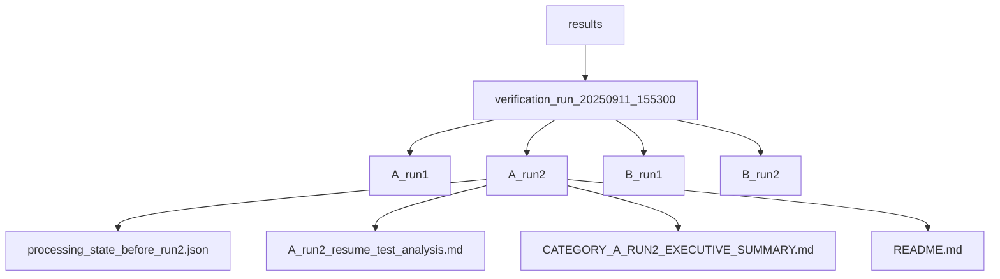
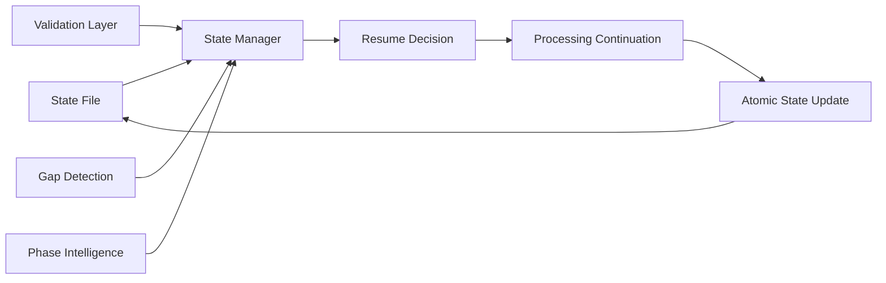
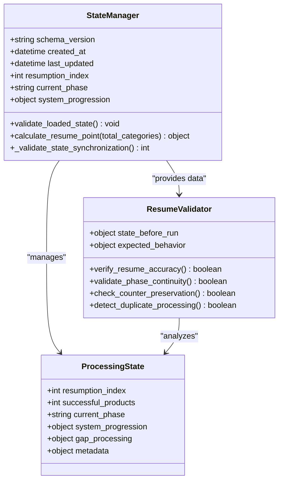
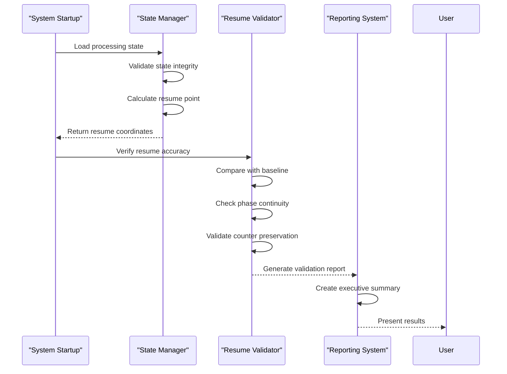
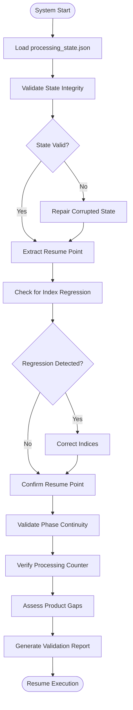
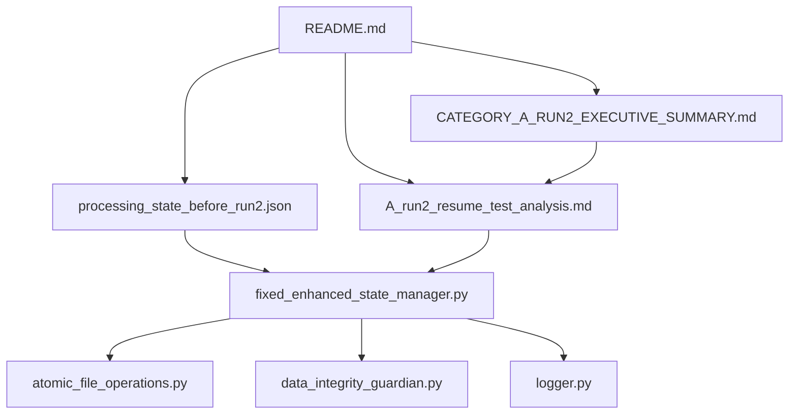

# Resume Test Guidance

## Table of Contents
1. [Introduction](#introduction)
2. [Project Structure](#project-structure)
3. [Core Components](#core-components)
4. [Architecture Overview](#architecture-overview)
5. [Detailed Component Analysis](#detailed-component-analysis)
6. [Dependency Analysis](#dependency-analysis)
7. [Performance Considerations](#performance-considerations)
8. [Troubleshooting Guide](#troubleshooting-guide)
9. [Conclusion](#conclusion)

## Introduction
This document provides comprehensive guidance on interpreting and validating the results of Run 2 of the resume validation test within the Amazon FBA Agent System. It explains how the README.md file serves as a central reference for understanding the test's purpose, execution context, and success criteria. The documentation details the relationship between key artifacts including processing_state_before_run2.json, A_run2_resume_test_analysis.md, and CATEGORY_A_RUN2_EXECUTIVE_SUMMARY.md, and outlines procedures for verifying system resumption accuracy, preventing duplicate processing, and ensuring reproducibility of test outcomes.

## Project Structure
The verification test artifacts are organized within a dedicated results directory that maintains separation between different test categories and runs. This structure enables clear tracking of test progression and facilitates comparison across multiple verification scenarios.

**Diagram sources**
- [README.md](file://results/verification_run_20250911_155300/A_run2/README.md)
- [processing_state_before_run2.json](file://results/verification_run_20250911_155300/A_run2/processing_state_before_run2.json)

**Section sources**
- [README.md](file://results/verification_run_20250911_155300/A_run2/README.md)

## Core Components
The resume validation framework consists of several core components that work together to ensure accurate system state restoration after interruptions. These include the processing state file, resume analysis documentation, executive summary reports, and the state management system responsible for tracking and validating resumption points.

**Section sources**
- [README.md](file://results/verification_run_20250911_155300/A_run2/README.md)
- [A_run2_resume_test_analysis.md](file://results/verification_run_20250911_155300/A_run2/A_run2_resume_test_analysis.md)
- [CATEGORY_A_RUN2_EXECUTIVE_SUMMARY.md](file://results/verification_run_20250911_155300/A_run2/CATEGORY_A_RUN2_EXECUTIVE_SUMMARY.md)

## Architecture Overview
The resume validation architecture is built around a file-grounded state management system that ensures all resumption decisions are based on persistent, verifiable data rather than volatile memory states. This design provides enterprise-grade reliability for long-running batch processing operations.

**Diagram sources**
- [fixed_enhanced_state_manager.py](file://utils/fixed_enhanced_state_manager.py)
- [processing_state_before_run2.json](file://results/verification_run_20250911_155300/A_run2/processing_state_before_run2.json)

## Detailed Component Analysis

### Resume Validation Framework Analysis
The resume validation framework provides multiple layers of verification to ensure the system can accurately resume from checkpoints without duplicating work or losing progress.

#### For Object-Oriented Components:

**Diagram sources**
- [fixed_enhanced_state_manager.py](file://utils/fixed_enhanced_state_manager.py)
- [processing_state_before_run2.json](file://results/verification_run_20250911_155300/A_run2/processing_state_before_run2.json)

#### For API/Service Components:

**Diagram sources**
- [fixed_enhanced_state_manager.py](file://utils/fixed_enhanced_state_manager.py)
- [A_run2_resume_test_analysis.md](file://results/verification_run_20250911_155300/A_run2/A_run2_resume_test_analysis.md)

#### For Complex Logic Components:

**Diagram sources**
- [fixed_enhanced_state_manager.py](file://utils/fixed_enhanced_state_manager.py)
- [A_run2_resume_test_analysis.md](file://results/verification_run_20250911_155300/A_run2/A_run2_resume_test_analysis.md)

**Section sources**
- [fixed_enhanced_state_manager.py](file://utils/fixed_enhanced_state_manager.py)
- [A_run2_resume_test_analysis.md](file://results/verification_run_20250911_155300/A_run2/A_run2_resume_test_analysis.md)

### README Documentation Analysis
The README.md file serves as the primary index and guide for understanding the resume test artifacts and their interrelationships.

```mermaid
flowchart TD
A[README.md] --> B[Directory Contents]
A --> C[Test Files]
A --> D[Pre-Test State]
A --> E[Test Objectives]
A --> F[Test Results]
A --> G[Resume Verification Points]
A --> H[Technical Highlights]
A --> I[Business Impact]
A --> J[Related Test Files]
A --> K[Test Methodology]
C --> C1[processing_state_before_run2.json]
C --> C2[A_run2_resume_test_analysis.md]
C --> C3[CATEGORY_A_RUN2_EXECUTIVE_SUMMARY.md]
C --> C4[README.md]
D --> D1[Resumption Index: 10,451]
D --> D2[Resume Point: Category 0, Product Index 8]
D --> D3[Phase: amazon_analysis]
D --> D4[Category: wholesale-big-boys-toys-gadgets]
E --> E1[Verify exact resume point accuracy]
E --> E2[Confirm phase continuity]
E --> E3[Validate processing counter preservation]
E --> E4[Monitor for resume proof banners]
E --> E5[Ensure zero work duplication]
F --> F1[Test Results: ✅ ALL OBJECTIVES MET]
```

**Diagram sources**
- [README.md](file://results/verification_run_20250911_155300/A_run2/README.md)

**Section sources**
- [README.md](file://results/verification_run_20250911_155300/A_run2/README.md)

## Dependency Analysis
The resume validation system depends on a robust state management infrastructure that ensures data consistency and integrity across system interruptions. The primary dependencies include the state manager implementation, processing state schema, and validation frameworks.

**Diagram sources**
- [README.md](file://results/verification_run_20250911_155300/A_run2/README.md)
- [fixed_enhanced_state_manager.py](file://utils/fixed_enhanced_state_manager.py)

**Section sources**
- [README.md](file://results/verification_run_20250911_155300/A_run2/README.md)
- [fixed_enhanced_state_manager.py](file://utils/fixed_enhanced_state_manager.py)

## Performance Considerations
The resume validation system is designed for enterprise-grade reliability rather than maximum performance. The architecture prioritizes data integrity, state consistency, and fault tolerance over raw processing speed. Key performance characteristics include atomic file operations, comprehensive state validation, and multi-layer verification processes that ensure accurate resumption even after system failures.

## Troubleshooting Guide
When issues arise with resume functionality, the following diagnostic steps should be taken:

**Section sources**
- [A_run2_resume_test_analysis.md](file://results/verification_run_20250911_155300/A_run2/A_run2_resume_test_analysis.md)
- [CATEGORY_A_RUN2_EXECUTIVE_SUMMARY.md](file://results/verification_run_20250911_155300/A_run2/CATEGORY_A_RUN2_EXECUTIVE_SUMMARY.md)
- [processing_state_before_run2.json](file://results/verification_run_20250911_155300/A_run2/processing_state_before_run2.json)

## Conclusion
The resume validation framework documented in this guide demonstrates enterprise-grade reliability for the Amazon FBA Agent System. The integration of file-grounded state management, multi-layer validation, and comprehensive documentation ensures that the system can accurately resume from checkpoints without duplicating work or losing progress. The README.md file serves as an essential guide for understanding the test artifacts and their relationships, providing clear context for interpreting test outcomes and validating system behavior. This standardized approach supports reproducibility and enables consistent evaluation of resume capabilities across different test scenarios.

**Referenced Files in This Document**   
- [README.md](file://results/verification_run_20250911_155300/A_run2/README.md)
- [processing_state_before_run2.json](file://results/verification_run_20250911_155300/A_run2/processing_state_before_run2.json)
- [A_run2_resume_test_analysis.md](file://results/verification_run_20250911_155300/A_run2/A_run2_resume_test_analysis.md)
- [CATEGORY_A_RUN2_EXECUTIVE_SUMMARY.md](file://results/verification_run_20250911_155300/A_run2/CATEGORY_A_RUN2_EXECUTIVE_SUMMARY.md)
- [fixed_enhanced_state_manager.py](file://utils/fixed_enhanced_state_manager.py)