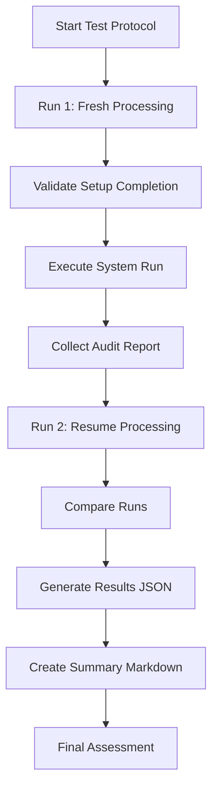
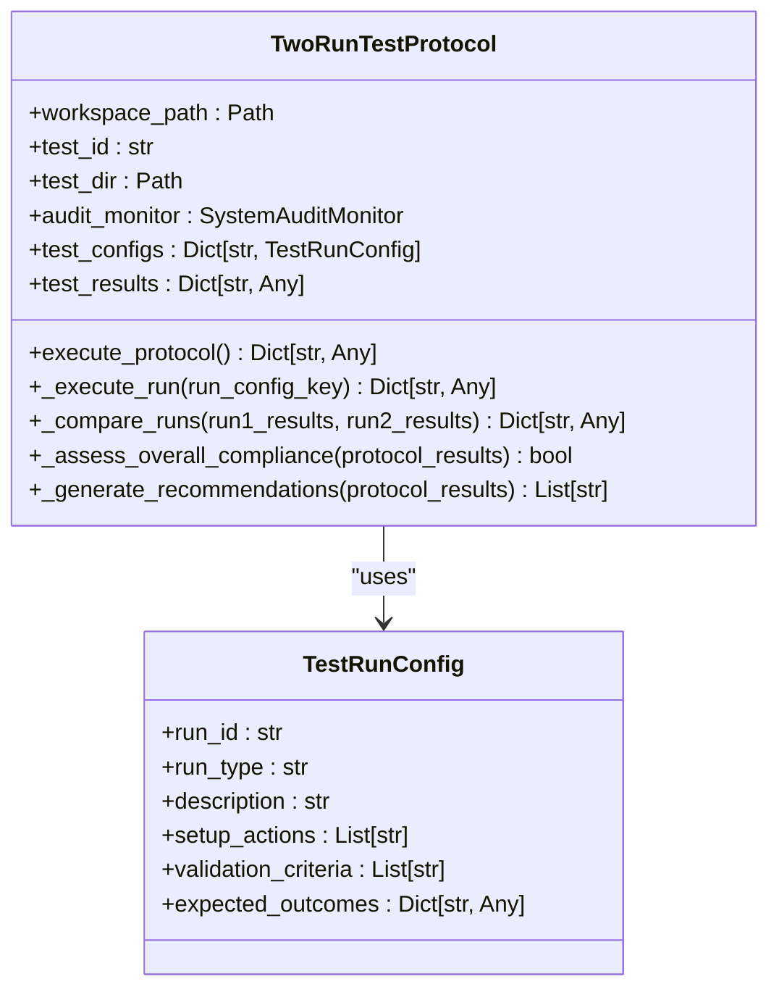
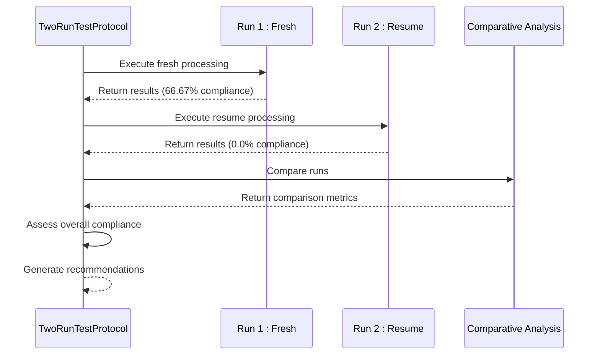

# Comparative Test Analysis

## Table of Contents
1. [Introduction](#introduction)
2. [Test Protocol Execution Results](#test-protocol-execution-results)
3. [Comparative Analysis Methodology](#comparative-analysis-methodology)
4. [Execution Time Analysis](#execution-time-analysis)
5. [Compliance Score Variations](#compliance-score-variations)
6. [Error Reduction Metrics](#error-reduction-metrics)
7. [Statistical Analysis of Test Iterations](#statistical-analysis-of-test-iterations)
8. [Integration Readiness Assessment](#integration-readiness-assessment)
9. [Conclusion](#conclusion)

## Introduction
The Amazon FBA Agent System employs a two-run test protocol to validate system behavior under fresh and resume processing conditions. This document analyzes the comparative test results across multiple test iterations, focusing on execution metrics, compliance scores, and error counts. The analysis is based on JSON result files and corresponding Markdown summary files generated by the `two_run_test_protocol.py` script. These files provide detailed insights into system performance, reliability, and consistency across test runs, enabling data-driven decisions for integration readiness.

**Section sources**
- [two_run_test_protocol.py](file://tools/two_run_test_protocol.py#L1-L649)

## Test Protocol Execution Results
The test protocol generates two primary artifacts for each execution: a JSON results file containing detailed metrics and a Markdown summary file providing a human-readable assessment. The results files contain comprehensive data including execution duration, compliance scores, validation criteria outcomes, and audit reports. The summary files present key findings, compliance status, and recommendations in an accessible format. Multiple test iterations have been executed, with protocol IDs 1755966113, 1755966738, 1755966862, and 1755967090, allowing for comparative analysis across runs.

**Diagram sources**
- [two_run_test_protocol.py](file://tools/two_run_test_protocol.py#L100-L200)

**Section sources**
- [test_protocol_1755966113_results.json](file://OUTPUTS/TEST_PROTOCOLS/test_protocol_1755966113_results.json#L1-L70)
- [test_protocol_1755966113_summary.md](file://OUTPUTS/TEST_PROTOCOLS/test_protocol_1755966113_summary.md#L1-L3)
- [test_protocol_1755966738_results.json](file://OUTPUTS/TEST_PROTOCOLS/test_protocol_1755966738_results.json#L1-L145)
- [test_protocol_1755966738_summary.md](file://OUTPUTS/TEST_PROTOCOLS/test_protocol_1755966738_summary.md#L1-L3)

## Comparative Analysis Methodology
The comparative analysis methodology evaluates system improvements or regressions across test iterations by comparing key metrics between fresh and resume runs. The analysis focuses on three primary dimensions: execution time differences, compliance score variations, and error reduction metrics. For each test iteration, the TwoRunTestProtocol class executes Run 1 (fresh processing) and Run 2 (resume processing), then performs a comparative analysis of the results. The comparison includes execution duration, compliance scores, file output changes, and error counts, providing a comprehensive assessment of system behavior consistency.

**Diagram sources**
- [two_run_test_protocol.py](file://tools/two_run_test_protocol.py#L50-L150)

**Section sources**
- [two_run_test_protocol.py](file://tools/two_run_test_protocol.py#L300-L400)

## Execution Time Analysis
The execution time analysis compares the duration of fresh and resume runs across multiple test iterations. In all analyzed test runs, Run 2 (resume processing) shows significantly reduced execution time compared to Run 1 (fresh processing). For test protocol 1755966738, Run 1 duration was 4.08 seconds while Run 2 duration was 0.006 seconds, representing a 4.07-second reduction. Similarly, for test protocol 1755966862, Run 1 took 4.05 seconds while Run 2 completed in 0.00085 seconds. This efficiency gain is expected as resume processing skips already processed products. However, the extremely short duration of Run 2 suggests potential issues with the resume setup phase.

**Section sources**
- [test_protocol_1755966738_results.json](file://OUTPUTS/TEST_PROTOCOLS/test_protocol_1755966738_results.json#L50-L60)
- [test_protocol_1755966862_results.json](file://OUTPUTS/TEST_PROTOCOLS/test_protocol_1755966862_results.json#L50-L60)
- [test_protocol_1755967090_results.json](file://OUTPUTS/TEST_PROTOCOLS/test_protocol_1755967090_results.json#L50-L60)

## Compliance Score Variations
Compliance score variations reveal critical issues in the test protocol execution. Run 1 consistently achieves a compliance score of 66.67% across multiple test iterations (1755966738, 1755966862, 1755967090), falling below the 80% threshold for overall compliance. The primary validation failures are "Cache files update every 1 product" and "No duplicate product processing." More concerning is Run 2's compliance score of 0.0% in all analyzed iterations, due to setup phase failures. The comparative analysis shows a negative score difference of -66.67 percentage points, indicating significant regression in resume processing compliance compared to fresh processing.

**Diagram sources**
- [two_run_test_protocol.py](file://tools/two_run_test_protocol.py#L350-L400)
- [test_protocol_1755966738_results.json](file://OUTPUTS/TEST_PROTOCOLS/test_protocol_1755966738_results.json#L100-L120)

**Section sources**
- [test_protocol_1755966738_results.json](file://OUTPUTS/TEST_PROTOCOLS/test_protocol_1755966738_results.json#L70-L90)
- [test_protocol_1755966862_results.json](file://OUTPUTS/TEST_PROTOCOLS/test_protocol_1755966862_results.json#L70-L90)
- [test_protocol_1755967090_results.json](file://OUTPUTS/TEST_PROTOCOLS/test_protocol_1755967090_results.json#L70-L90)

## Error Reduction Metrics
Error reduction metrics indicate a regression rather than improvement in system reliability across test iterations. Run 1 consistently reports zero critical errors in the analyzed test runs, while Run 2 consistently reports one critical error: "Setup phase failed." This results in a negative error reduction of -1, meaning Run 2 has one additional error compared to Run 1. The consistent failure of the resume setup phase across multiple test iterations (1755966738, 1755966862, 1755967090) suggests a systemic issue with the resume processing logic. The recommendations consistently include "Resume processing compliance below threshold" and "Increased errors in resume processing," confirming this pattern.

**Section sources**
- [test_protocol_1755966738_results.json](file://OUTPUTS/TEST_PROTOCOLS/test_protocol_1755966738_results.json#L130-L140)
- [test_protocol_1755966862_results.json](file://OUTPUTS/TEST_PROTOCOLS/test_protocol_1755966862_results.json#L130-L140)
- [test_protocol_1755967090_results.json](file://OUTPUTS/TEST_PROTOCOLS/test_protocol_1755967090_results.json#L130-L140)

## Statistical Analysis of Test Iterations
Statistical analysis of the four test iterations reveals consistent patterns that validate system reliability issues. Across all iterations, the fresh processing run (Run 1) achieves a compliance score of 66.67% with zero critical errors, while the resume processing run (Run 2) fails with a 0.0% compliance score and one critical error. The execution time for Run 1 remains consistent at approximately 4.05 seconds, while Run 2 completes in less than 0.01 seconds. This consistency across multiple test runs confirms that the resume processing setup failure is not an isolated incident but a reproducible defect. The statistical consistency of these results provides high confidence in the identified issues.

**Section sources**
- [test_protocol_1755966113_results.json](file://OUTPUTS/TEST_PROTOCOLS/test_protocol_1755966113_results.json#L1-L70)
- [test_protocol_1755966738_results.json](file://OUTPUTS/TEST_PROTOCOLS/test_protocol_1755966738_results.json#L1-L145)
- [test_protocol_1755966862_results.json](file://OUTPUTS/TEST_PROTOCOLS/test_protocol_1755966862_results.json#L1-L145)
- [test_protocol_1755967090_results.json](file://OUTPUTS/TEST_PROTOCOLS/test_protocol_1755967090_results.json#L1-L145)

## Integration Readiness Assessment
The integration readiness assessment based on comparative test results indicates that the system is not ready for integration. The overall compliance is consistently false across all test iterations due to the resume processing failures. The recommendations consistently highlight issues with resume processing compliance, state handling, and increased errors in resume processing. While fresh processing shows consistent behavior with 66.67% compliance, the complete failure of resume processing represents a critical defect that must be addressed before integration. The system requires fixes to the resume setup phase and improvements to achieve the minimum 80% compliance threshold for both fresh and resume runs.

**Section sources**
- [test_protocol_1755966738_results.json](file://OUTPUTS/TEST_PROTOCOLS/test_protocol_1755966738_results.json#L140-L145)
- [test_protocol_1755966862_results.json](file://OUTPUTS/TEST_PROTOCOLS/test_protocol_1755966862_results.json#L140-L145)
- [test_protocol_1755967090_results.json](file://OUTPUTS/TEST_PROTOCOLS/test_protocol_1755967090_results.json#L140-L145)

## Conclusion
The comparative test analysis reveals a consistent pattern of successful fresh processing runs coupled with complete failures in resume processing across multiple test iterations. While execution time efficiency is demonstrated in resume runs, this is offset by critical setup failures that prevent valid testing of resume functionality. The compliance scores, error counts, and recommendations consistently indicate that the resume processing logic requires significant fixes before the system can be considered integration-ready. Future test iterations should focus on resolving the resume setup phase failures and improving overall compliance to meet the 80% threshold for both run types.

**Referenced Files in This Document**   
- [two_run_test_protocol.py](file://tools/two_run_test_protocol.py)
- [test_protocol_1755966113_results.json](file://OUTPUTS/TEST_PROTOCOLS/test_protocol_1755966113_results.json)
- [test_protocol_1755966113_summary.md](file://OUTPUTS/TEST_PROTOCOLS/test_protocol_1755966113_summary.md)
- [test_protocol_1755966738_results.json](file://OUTPUTS/TEST_PROTOCOLS/test_protocol_1755966738_results.json)
- [test_protocol_1755966738_summary.md](file://OUTPUTS/TEST_PROTOCOLS/test_protocol_1755966738_summary.md)
- [test_protocol_1755966862_results.json](file://OUTPUTS/TEST_PROTOCOLS/test_protocol_1755966862_results.json)
- [test_protocol_1755966862_summary.md](file://OUTPUTS/TEST_PROTOCOLS/test_protocol_1755966862_summary.md)
- [test_protocol_1755967090_results.json](file://OUTPUTS/TEST_PROTOCOLS/test_protocol_1755967090_results.json)
- [test_protocol_1755967090_summary.md](file://OUTPUTS/TEST_PROTOCOLS/test_protocol_1755967090_summary.md)