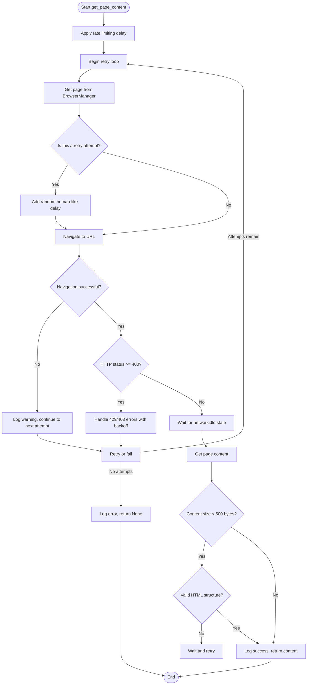
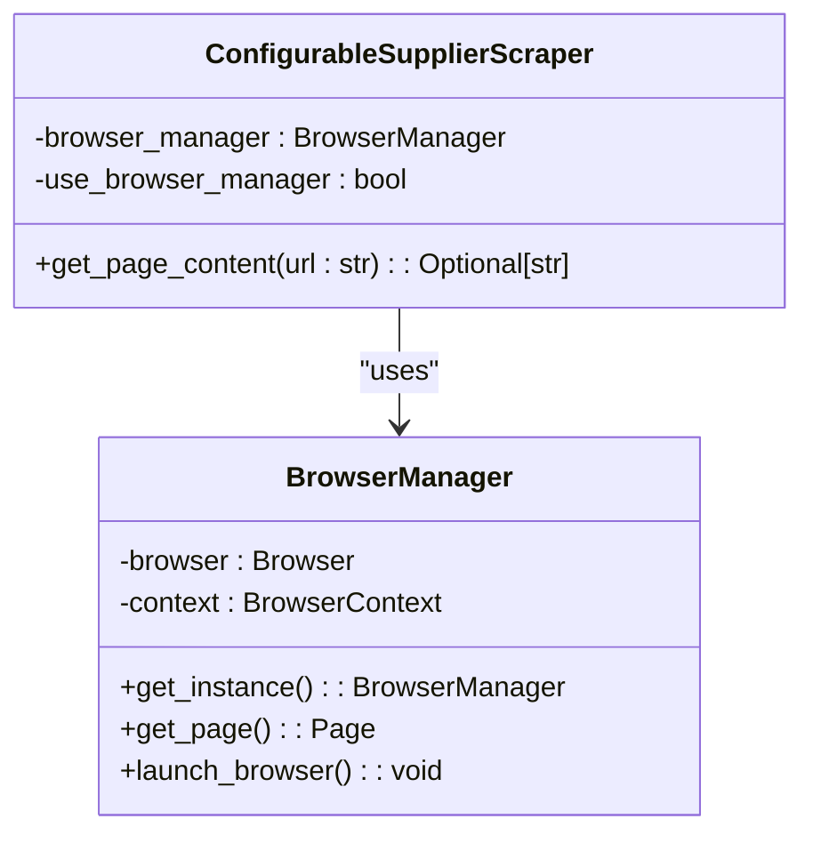
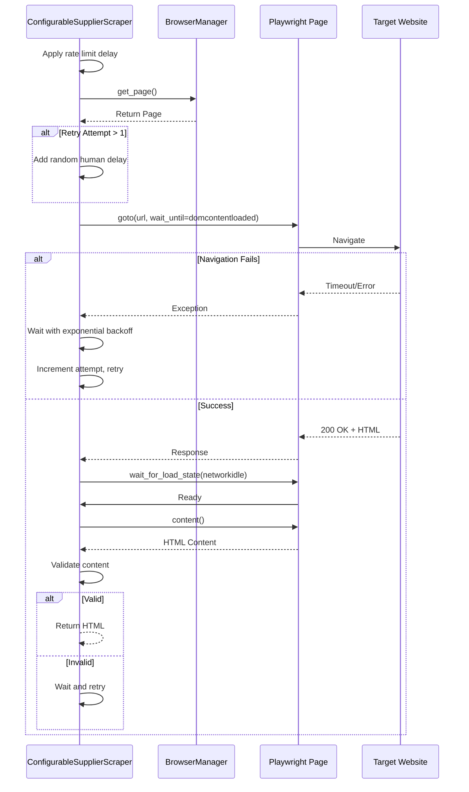

# Page Content Fetching

## Table of Contents
1. [Introduction](#introduction)
2. [Core Implementation](#core-implementation)
3. [Browser Integration](#browser-integration)
4. [Resilience Mechanisms](#resilience-mechanisms)
5. [Content Validation](#content-validation)
6. [Usage in Product Scraping](#usage-in-product-scraping)
7. [Common Issues and Troubleshooting](#common-issues-and-troubleshooting)
8. [Conclusion](#conclusion)

## Introduction

The `get_page_content()` method within the `ConfigurableSupplierScraper` class is a critical component of the Amazon FBA Agent System, responsible for reliably fetching HTML content from supplier websites. This method leverages Playwright for robust browser automation, enabling JavaScript rendering and implementing sophisticated anti-bot evasion techniques. It is designed to handle the challenges of modern e-commerce sites, including rate limiting, bot detection, and dynamic content loading. The method integrates with a centralized `BrowserManager` to ensure efficient resource utilization and consistent session state across the application. This document provides a comprehensive analysis of its implementation, resilience strategies, and operational context.

**Section sources**
- [configurable_supplier_scraper.py](file://tools/configurable_supplier_scraper.py#L81-L3405)

## Core Implementation

The `get_page_content()` method is the primary mechanism for retrieving web page content. It is an asynchronous function that takes a URL and a retry count as parameters, returning the HTML content as a string or `None` on failure. The method begins with rate limiting logic, ensuring a minimum delay between requests to prevent overwhelming the target server. This delay is configurable via the `rate_limit_delay` field, which defaults to 1.0 second. The method then enters a retry loop, attempting to fetch the page up to `retry_count` times (default is 3).

The core of the method involves using Playwright to control a browser instance. It first attempts to acquire a page object from the centralized `BrowserManager`. This ensures that browser instances are shared and managed efficiently across the entire system. Once a page is obtained, the method navigates to the specified URL using the `page.goto()` function. A key aspect of the navigation strategy is the use of `wait_until='domcontentloaded'`, which instructs Playwright to wait only until the initial HTML document has been loaded and parsed, without waiting for external resources like images and stylesheets. This significantly improves performance while still ensuring the core page structure is available for scraping.

**Diagram sources **
- [configurable_supplier_scraper.py](file://tools/configurable_supplier_scraper.py#L337-L365)
- [configurable_supplier_scraper.py](file://tools/configurable_supplier_scraper.py#L436-L467)

**Section sources**
- [configurable_supplier_scraper.py](file://tools/configurable_supplier_scraper.py#L81-L3405)

## Browser Integration

The `get_page_content()` method is tightly integrated with the `BrowserManager` singleton, which is responsible for managing shared browser instances. This integration is a key architectural decision that promotes resource efficiency and consistency. Instead of creating a new browser instance for each request, the `ConfigurableSupplierScraper` reuses a shared instance, reducing memory consumption and startup time. The `BrowserManager` is initialized with Chrome's remote debugging protocol (CDP) on port 9222, allowing multiple components to connect to the same browser session.

The method first checks if a `browser_manager` instance was passed during initialization. If not, it attempts to retrieve the singleton instance from `utils.browser_manager`. This design allows for dependency injection while providing a fallback to the global manager. The `get_page()` method of the `BrowserManager` returns a page object that can be used for navigation. A critical aspect of this integration is lifecycle management: the `get_page_content()` method only closes the page if it is *not* using the `BrowserManager`, as the manager is responsible for cleaning up its own resources. This prevents race conditions and ensures stable session state.

**Diagram sources **
- [configurable_supplier_scraper.py](file://tools/configurable_supplier_scraper.py#L337-L365)
- [selenium_browser_manager.py](file://tools/selenium_browser_manager.py#L79-L83)

**Section sources**
- [configurable_supplier_scraper.py](file://tools/configurable_supplier_scraper.py#L81-L3405)
- [selenium_browser_manager.py](file://tools/selenium_browser_manager.py#L168-L175)

## Resilience Mechanisms

The `get_page_content()` method implements a comprehensive set of resilience mechanisms to handle the unpredictable nature of web scraping. The primary strategy is a retry loop with exponential backoff and jitter. On each failed attempt, the method waits for an increasing amount of time before retrying. The wait time is calculated as `(2^attempt) + random.uniform(0.5, 1.5)` seconds, which introduces randomness (jitter) to avoid synchronized request patterns that could trigger bot detection.

The method specifically handles common HTTP error codes. A 429 (Too Many Requests) status code triggers a fixed 5-second wait before retrying. A 403 (Forbidden) or 503 (Service Unavailable) status code is treated as a potential bot detection event, prompting a longer wait with exponential backoff. This allows the system to recover from temporary blocks. For non-HTTP errors, such as navigation timeouts or CDP connection failures, the method logs the error and relies on the outer retry loop to attempt recovery.

Rate limiting is applied before each request to ensure the scraper adheres to a self-imposed request frequency. This is complemented by a random delay of 1.0 to 3.0 seconds on retry attempts, mimicking human browsing behavior and further reducing the risk of detection. These combined strategies create a robust system capable of recovering from transient network issues, temporary server overloads, and defensive measures employed by target websites.

**Diagram sources **
- [configurable_supplier_scraper.py](file://tools/configurable_supplier_scraper.py#L337-L365)
- [configurable_supplier_scraper.py](file://tools/configurable_supplier_scraper.py#L436-L467)

**Section sources**
- [configurable_supplier_scraper.py](file://tools/configurable_supplier_scraper.py#L81-L3405)

## Content Validation

To ensure the integrity of the fetched content, the `get_page_content()` method includes a fallback content validation process. After successfully navigating to a page and waiting for the `networkidle` state, the method retrieves the full HTML content using `page.content()`. It then performs two key checks to detect blocked or malformed responses.

First, it checks the size of the response. If the HTML content is less than 500 bytes, it is flagged as "suspiciously small," which could indicate a blocking page, a redirect to a login screen, or a server error. Second, it performs a basic structural validation by checking if the content contains the strings `<html` and `<body` (case-insensitive). The absence of these fundamental HTML tags strongly suggests that the response is not valid HTML, possibly a JSON error message, a CAPTCHA challenge, or a bot detection page.

If either validation check fails, the method logs a warning and continues to the next retry attempt, provided attempts remain. This allows the system to potentially recover from a temporary block or a bad response. The validation logic is crucial for maintaining data quality, as it prevents the system from processing incomplete or non-HTML content, which could lead to parsing errors and incorrect data extraction downstream.

**Section sources**
- [configurable_supplier_scraper.py](file://tools/configurable_supplier_scraper.py#L436-L467)

## Usage in Product Scraping

The `get_page_content()` method is a foundational building block used extensively within the product scraping workflow. Its primary use is in the `scrape_products_from_url()` method, where it is called to fetch the HTML of individual product pages after their URLs have been discovered. This two-phase approach—first collecting URLs, then visiting each page—optimizes performance by minimizing the number of full page loads.

The method is also used during the initial discovery phase to fetch category pages and extract product URLs. In this context, its robustness is essential, as a failure to load a category page would prevent the discovery of any products within that category. The method's integration with the `BrowserManager` ensures that session state, such as authentication cookies, is preserved between requests. This is critical for suppliers like PoundWholesale that require login to view prices. The scraper can authenticate once at the beginning of a session, and subsequent calls to `get_page_content()` will inherit the authenticated state, allowing it to access price information on product pages.

Furthermore, the method's retry logic and error handling contribute directly to the overall resilience of the scraping workflow. By gracefully handling transient errors, it prevents a single failed request from derailing the entire scraping process for a category or supplier.

**Section sources**
- [configurable_supplier_scraper.py](file://tools/configurable_supplier_scraper.py#L81-L3405)

## Common Issues and Troubleshooting

Despite its robust design, the `get_page_content()` method can encounter several common issues. The most frequent are CDP connection failures, timeout errors, and navigation exceptions.

**CDP Connection Failures:** These occur when the `BrowserManager` cannot connect to the Chrome instance on port 9222. This can happen if Chrome is not running, the debugging port is occupied, or there is a network issue. The troubleshooting steps include verifying that Chrome is launched with the `--remote-debugging-port=9222` flag, checking for port conflicts, and ensuring the `BrowserManager` has been properly initialized before the scraper is used.

**Timeout Errors:** These are typically caused by slow network connections, overloaded target servers, or complex pages that take a long time to load. The method uses a 30-second timeout for navigation. To resolve this, ensure a stable internet connection, consider increasing the `REQUEST_TIMEOUT` constant, or verify that the target URL is accessible. The logs will show a "Navigation failed" warning, which is a clear indicator of this issue.

**Navigation Exceptions:** These can be caused by malformed URLs, DNS resolution failures, or the target server actively blocking the request. The method's retry logic with exponential backoff is designed to handle temporary network glitches. For persistent blocks, the logs will show repeated 403 or 429 status codes. In such cases, the system's anti-bot evasion (random delays, realistic user agent) should help, but the root cause might require adjusting the scraping frequency or investigating the target site's robots.txt and terms of service.

A key recovery pattern is the method's ability to continue after a failure. Instead of crashing, it logs the error, waits, and retries. This allows the system to recover from temporary issues and continue processing other URLs. The extensive logging provided by the method is invaluable for diagnosing these issues, as it clearly documents each step of the process, the outcome, and any errors encountered.

**Section sources**
- [configurable_supplier_scraper.py](file://tools/configurable_supplier_scraper.py#L81-L3405)

## Conclusion

The `get_page_content()` method is a sophisticated and resilient component that forms the backbone of the supplier data extraction process. By leveraging Playwright and a centralized `BrowserManager`, it provides reliable access to JavaScript-rendered content while efficiently managing browser resources. Its comprehensive error handling, featuring retry logic with exponential backoff, rate limiting, and content validation, ensures high success rates even in challenging environments. The method's design prioritizes system resilience, making it a critical element in the overall architecture of the Amazon FBA Agent System. Its successful operation is essential for the accurate and efficient collection of product data from supplier websites.

**Referenced Files in This Document**   
- [configurable_supplier_scraper.py](file://tools/configurable_supplier_scraper.py#L81-L3405)
- [browser_manager.py](file://utils/browser_manager.py)